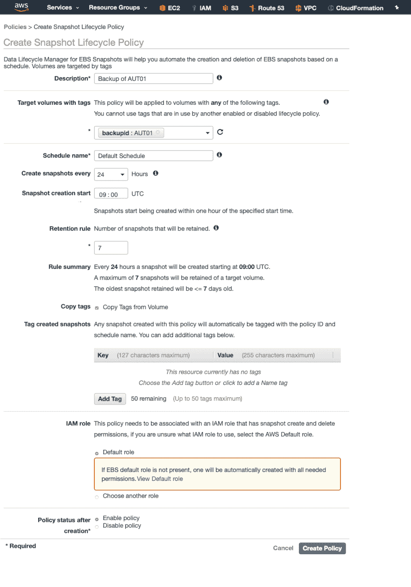

# CloudFormation 模板:为 Lifecycle Manager 备份标记 AWS 卷

> 原文：<https://dev.to/kbild/cloudformation-template-tag-aws-volumes-for-lifecycle-manager-backups-3nl3>

如果您不需要简单的 AWS 备份解决方案，可以使用 AWS 生命周期管理器从 AWS EC2 卷创建快照。

Lifecycle Manager 易于使用，甚至为您提供了一些保留规则，完全不需要为您的备份编写脚本。

您可以通过卷上的标记轻松定义 Lifecycle Manager 应该拍摄哪些目标卷的快照。

## 生命周期管理器-快照生命周期策略

在下面的示例中，我们将在 09 和 10 UTC 之间对标记为`backupid: AUT01`的所有卷进行 24 小时快照，并将保留 7 个快照。

* * *

[](https://res.cloudinary.com/practicaldev/image/fetch/s--rM58c__D--/c_limit%2Cf_auto%2Cfl_progressive%2Cq_auto%2Cw_880/https://kbild.ch/201902/Lifecycle.png)

* * *

通常我们使用 CloudFormation 来创建我们的 AWS 环境和 EC2 实例。遗憾的是，您用于 EC2 实例的标记不会自动添加到实例的相应卷中。真扫兴。

这意味着我们必须找到一种方法，在创建后立即标记实例卷，当然，最简单的方法是在用户数据脚本中使用一些魔法。

## 需要的用户数据脚本

以下脚本可用作用户数据脚本:

```
aws ec2 create-tags --resources $(aws ec2 describe-volumes --filters Name=attachment.instance-id,Values=$(curl -s http://169.254.169.254/latest/meta-data/instance-id) --query 'Volumes[*].[VolumeId]' --region=eu-central-1 --out text | cut -f 1) --tags Key=$Key,Value=$Value --region eu-central-1 
```

该脚本包含两个部分:

在本地服务器元数据的帮助下获取卷的卷 id

```
aws ec2 describe-volumes --filters Name=attachment.instance-id,Values=$(curl -s http://169.254.169.254/latest/meta-data/instance-id) --query 'Volumes[*].[VolumeId]' --region=eu-central-1 --out text 
```

```
Name=attachment.device,Values=/dev/xvdb 
```

用提供的密钥和值
标记这些卷

```
aws ec2 create-tags --resources VOLUMEIDS --tags Key=$Key,Value=$Value --region eu-central-1 
```

如您所见，我们在 eu-central-1 地区使用 EC2 实例，您必须将其更改为您正在使用的地区。

EC2 实例需要一个 IAM 角色，该角色具有获取卷 id 和标记卷的足够权限。我们将向该角色添加以下策略:

```
{
    "Version": "2012-10-17",
    "Statement": [
        {
            "Action": "ec2:Describe*",
            "Resource": "*",
            "Effect": "Allow"
        },
        {
            "Action": "ec2:CreateTags",
            "Resource": "*",
            "Effect": "Allow"
        }
    ]
} 
```

## 生命周期策略

最后一步是添加带有所需参数的快照生命周期策略(TargetTags… )

```
 BasicLifecyclePolicy:
    Type: "AWS::DLM::LifecyclePolicy"
    Properties:
      Description: "Lifecycle Policy using CloudFormation"
      State: "ENABLED"
      ExecutionRoleArn: !GetAtt
        - lifecycleRole
        - Arn
      PolicyDetails:
        ResourceTypes:
          - "VOLUME"
        TargetTags:
          -
            Key: "backupid"
            Value: "AUT01"
        Schedules:
          -
            Name: "Daily Snapshots"
            TagsToAdd:
              -
                Key: "type"
                Value: "DailySnapshot"
            CreateRule:
              Interval: 24
              IntervalUnit: "HOURS"
              Times:
                - "09:00"
            RetainRule:
              Count: 7
            CopyTags: true 
```

如您所见，还需要一个执行角色(附带适当的策略)。你可以在 Github 上的完整 CloudFormation 模板中找到这个角色和所有其他需要的资源。

随时欢迎反馈！