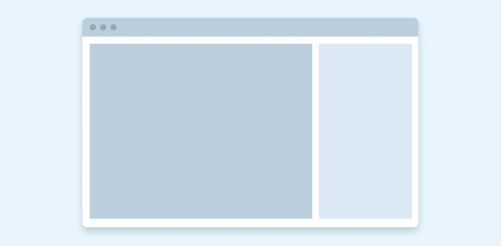
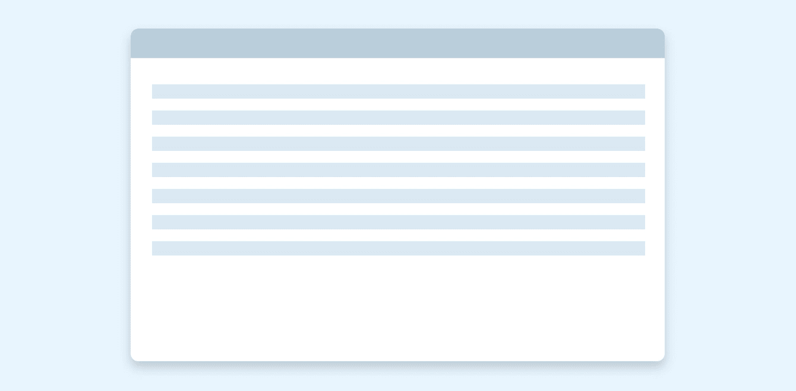
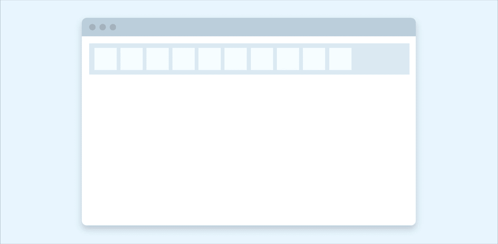
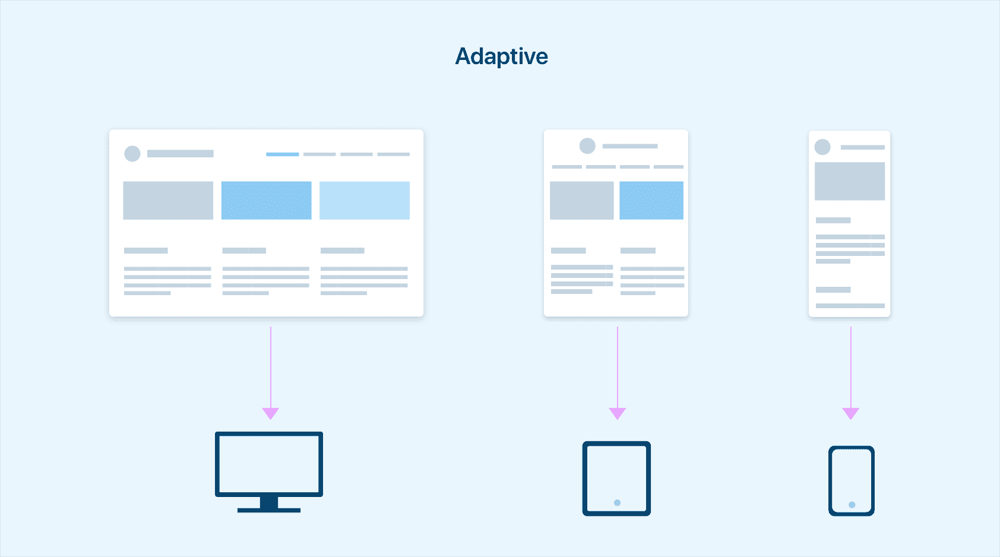
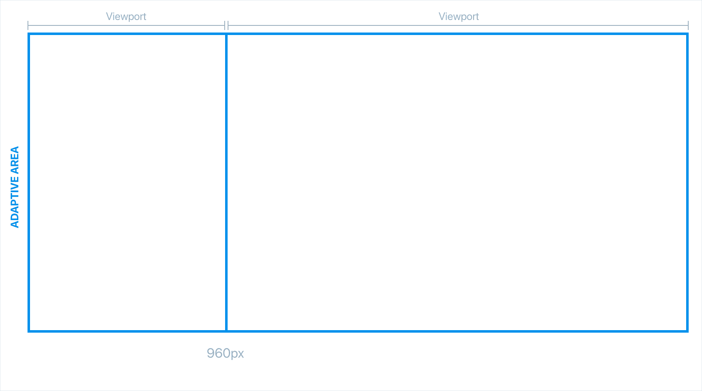
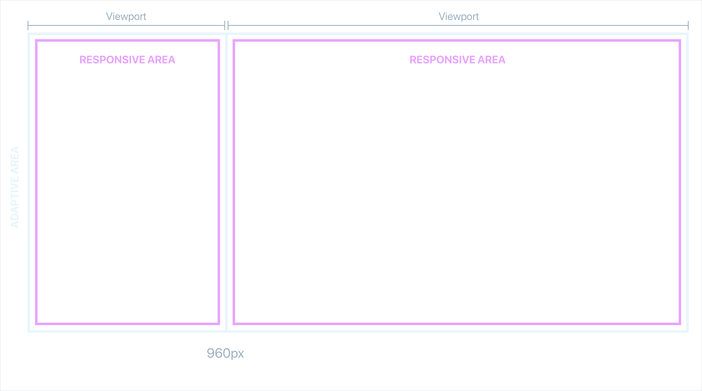
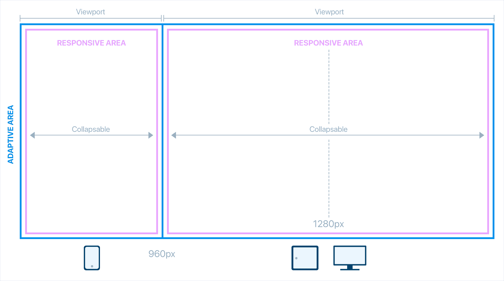

# 适应性+反应性模型

> 原文：<https://dev.to/equinusocio/the-adaptive--responsive-model-45mn>

你可以称之为**超前**或**感性**..

响应式设计和自适应设计是两种设计方法，目标是使产品在任何设备或屏幕尺寸上都是可访问的，为所有用户提供最佳体验。两者都试图充分利用可用的屏幕空间和用户交互模式。在讨论 **A+R** 模型之前，我们需要分解这两种方法

虽然**响应式**设计利用 CSS 和/或 JS 根据预定义的断点来调整布局和内容，但**自适应**方法提供了将根据用户代理和设备类型提供的预结构化模板。它们之间的主要区别是 DOM 结构，当以响应的心态处理时，我们在所有情况下都有相同的 HTML 代码(除非您使用 JS 来删除一些 DOM 节点)，而在 adaptive 中，我们有不同的代码结构和潜在的不同体验。

这两种设计思想都是有效的，只要问问你自己在你的项目中有多少组件和复杂性，以及一种体验是否适合所有用户。开发 web 应用程序响应式设计经常被使用，比如通过适应性开发来构建特定的体验，就像 Twitter 和脸书移动所做的那样。

## 响应式设计技术

在构建响应式体验时，我们有三种方法来处理我们的布局和内容:

* * *

**Reflow** :我们可以改变布局结构，以更好地适应视区。大多数情况下，这会导致内容堆积(这并不总是好的)。

* * *

一些 UI 组件像大多数 html 元素一样是流动的。它们会填充可用空间，并在必要时回流。

* * *

**显示/隐藏:**一些 UI 部件在视口中是隐藏的(但是它们仍然存在)或者显示出来以填充空间。

**重组:**通过这种方法，我们可以开发和交付不同的布局，为特定环境提供最佳体验，如纯触摸移动设备或混合触摸设备。

## 介绍 A+R 模式

这两种方法都有优点和缺点，但是如果我们想同时使用它们，我们会得到什么呢？ **A+R** 模型结合了基于单个主要断点的响应性和适应性方法。

### A 代表自适应

如上所述，自适应方法允许我们根据用户设备来区分用户体验、内容甚至功能。考虑将一个 **960px** 作为主要的自适应断点([基于全局统计](http://gs.statcounter.com/screen-resolution-stats/tablet/worldwide)定义)，我们有类似的东西:

*   左侧的视窗区域代表 960px 下具有特定布局/内容的所有屏幕

*   右侧的视窗区域代表所有 960px 或更高分辨率的屏幕，采用另一种布局。

### R 代表响应式

我们定义的主要断点创建了两个可能互不相同的体验上下文，我们可以在其中应用响应技术。在每个体验中，我们可以定义小的断点来根据可用空间调整布局。例如，使用平板电脑的用户可能会看到触摸优化的体验(自适应)，但我们仍然可以根据设备方向调整布局(响应)。

## 适应性+反应性

结合适应性和响应性方法，我们得到了 **A + R 模型**。通过适应性技术，我们将致力于体验和功能，创造两种不同的环境。在 responsive 中，我们处理上下文中的 UI 组件和布局。

## 何时选择 A + R 模式

这种设计方法要求设计者真正理解他们想要提供的体验，以便定义遵循什么样的模型。这种模型非常适合必须从功能较少或结构完全不同小型移动设备上访问的大型应用程序。正如你所看到的，你将获得很大的灵活性，但也很复杂，因为你可能不得不处理不同的代码库和环境(不是强制性的)。

有了 A+R 模型的思维模式，设计师和开发人员(还有产品所有者)可以专注于改进产品所能提供的所有体验，而不是只在一个环境中提供“好”的体验。

* * *

最初发布于 [equinsuocha.io](https://equinsuocha.io/blog/the-adaptive-responsive-model) 。所有的图片都是由我和 UX 联络实验室团队制作的。