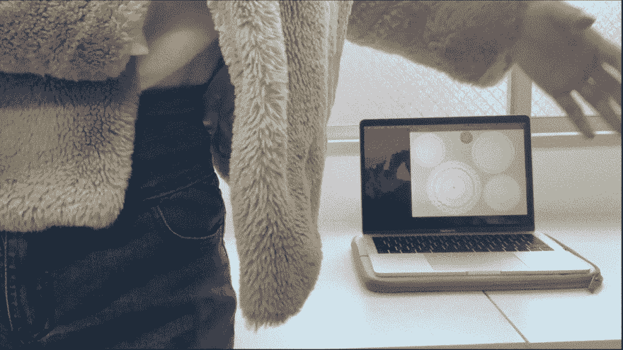
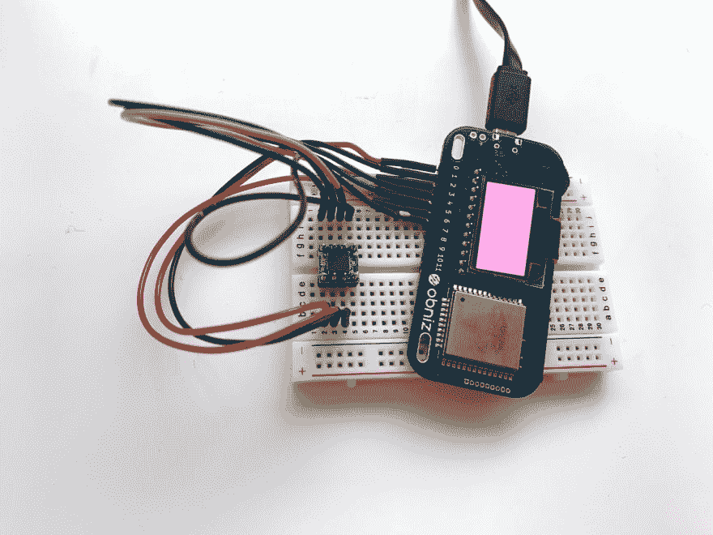
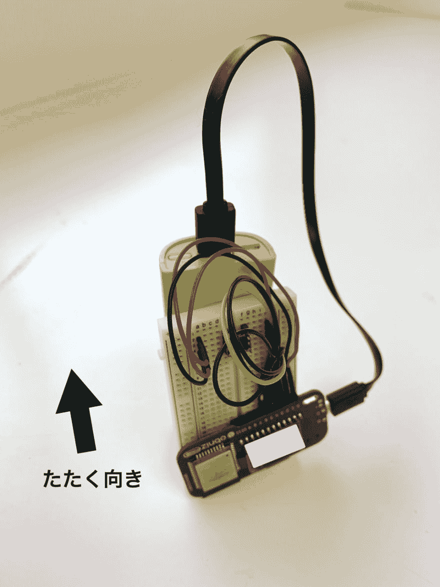
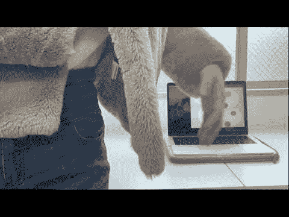

# “奇怪的饼干”饼干和轻敲饼干

> 原文：<https://dev.to/obniz_io/strange-biscuits-biscuits-and-biscuits-by-tapping-chj>

### 这是什么

这是出自童谣《怪饼干》(日本有名)。网站上的饼干数量通过点击一个口袋来增加。

### 材料

-obniz
-obniz 电源- USB 适配器或电池
-加速度传感器- KXR94-2050

### 指令

将电源和加速度传感器连接到 obniz。

(obniz):(加速度传感器)
-0:1(Vdd)
-1:3(GND)
-2:6(X)
-3:7(Y)
-4:8(Z)
-5:2(使能)
-6 : 5(自检)

从这个方向把这个电路插到你的口袋里。

访问这个网站，点击你的口袋。饼干的数量在增加。

保持口袋和你之间的距离会提高灵敏度。

### 电影

