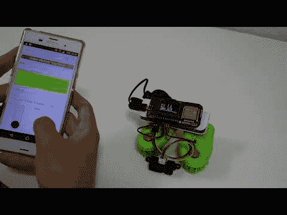
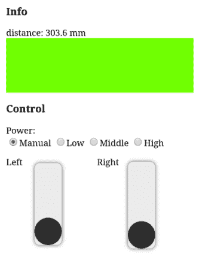

# 用 obniz 制造的振动机器人

> 原文：<https://dev.to/obniz_io/vibrobot-made-with-obniz-2pkg>

### 电影

振动机器人是一种附着刷子而不是轮胎的机器人，当振动刷子时，由于皮毛的不对称性，它会沿着特定的方向前进。通过 PWM 控制两个振动电机并分别操作左、右刷子，这个机器人可以直行、右转、左转。
此外，前方安装了一个距离传感器，您可以在智能手机的屏幕上实时确认前方是否有障碍物。

### 控制

### 操作方法

根据与前方障碍物的距离，屏幕上该区域的颜色会发生变化。障碍物远了就变绿，障碍物近了就变红。
在手动模式下，可以用屏幕上控制区的滑块调节左右震动的强度，自由控制机器人直行、右转和左转。从你看不到它的地方控制机器人可能很有趣，但只能看到屏幕的颜色。
如果您将功率设置为低、中或高，它将处于自动模式，通常继续直行，并在接近障碍物时自动右转，这允许它保持半永久移动。

当你这样做的时候，有必要养成一个习惯，让画笔的笔尖斜着向后转。你还可以从一部智能手机上同时操纵许多机器人，所以如果你制造许多这样的机器人并同时移动它们，它们可能会彼此有趣地工作。

### 程序

[https://obniz.io/explore/28](https://obniz.io/explore/28)