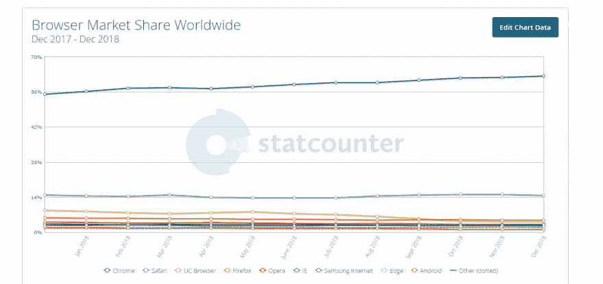

# 使用 Selenium 进行自动化测试的 11 个理由

> 原文：<https://dev.to/jaswantkaur/11-reasons-to-use-selenium-for-automation-testing-p1e>

Selenium 工具套件的流行是否足以成为使用它而不是其他工具的理由？

当我们谈论自动化测试时， [Selenium](https://www.seleniumhq.org/) 总能找到它的对话方式。作为自动化测试的最佳工具之一，Selenium 深受全球开发人员和测试人员的喜爱。但是仍然存在的问题是，市场上有许多自动化测试工具可以提供几乎相同的结果。那么，为什么只有硒呢？

这是我们将在文章中详细讨论的内容。到本文结束时，您将能够列出使用 Selenium 执行自动化测试的所有好处，以及为什么它优于其他自动化测试工具。

## 硒是什么？

在我们深入研究的好处之前，让我们先了解硒是什么，为什么使用它。

Selenium 是一个开源的自动化测试工具，用于在不同的网络浏览器上进行自动化测试。

它有一套工具来满足组织的不同需求。它基本上有四种不同的工具:

1.  Selenium RC(现已废弃)

2.  Selenium IDE (Selenium 集成开发环境)

3.  硒栅

4.  Selenium WebDriver

目前，Selenium WebDriver 和 Grid 合并成了一个，这就是我们将在本文中讨论的内容。

为什么要用硒？Selenium 基本上用于跨各种 web 浏览器的自动化测试。它支持各种浏览器，如 Chrome、Mozilla、Firefox、Safari 和 IE，您可以使用 Selenium WebDriver 非常容易地在这些浏览器之间自动进行浏览器测试。

你可以在电脑屏幕上看到正在进行的实时自动化测试。但是我们将在本文中回答的问题仍然存在，因为有许多工具可用于自动化测试。

让我们看看 Selenium 为我们赢得这场比赛提供了什么。

## 使用 Selenium 进行自动化测试的优势

### 1。语言和框架支持

当有人选择工具时，首先想到的是:“我的工具支持我所知道的语言吗？”

但是，Selenium 却不是这样，因为它支持所有主流语言，如 Java、Python、JavaScript、C#、Ruby 和 Perl 编程语言，用于软件测试自动化。

您可以用这些编程语言中的任何一种编写脚本，Selenium 会立即将其转换成 Selenium 兼容的代码。因此，没有必要了解 Selenium only 语言。此外，每种受 Selenium 支持的语言都有专门的框架，帮助编写 Selenium 测试自动化的测试脚本。因此，当您选择 Selenium 作为执行自动化测试的工具时，您不必担心语言和框架支持，因为 Selenium 会为您做到这一点！

### 2。开源可用性

增强 Selenium 优势的众多因素之一是它的开源可用性。因此，作为一个开源工具，Selenium 是一个可公开访问的自动化框架，并且是免费的，没有前期成本。所以，你可以在这里省下钱，用在其他好的事情上。

Selenium 社区不断帮助开发人员和软件工程师实现 web 浏览器特性和功能的自动化。Selenium 是开源的，这也有助于您定制代码以实现更好的代码管理，并增强预定义函数和类的功能。Selenium 已经成为最可靠的 web 自动化工具，因为它易于生成测试脚本来验证功能。

### 3。多浏览器支持

“一个适用于所有浏览器的 Selenium 脚本”是 Selenium 社区每天都在努力和即兴创作的。根据 StatCounter 的数据，Chrome、Firefox、Safari、Internet Explorer、Opera 和 Edge 浏览器是全球最常用的浏览器，Selenium script 与所有提到的浏览器兼容。您不需要为每个浏览器重写脚本，只需为所有浏览器编写一个脚本。
[T3】](https://res.cloudinary.com/practicaldev/image/fetch/s--RwNoSkB5--/c_limit%2Cf_auto%2Cfl_progressive%2Cq_auto%2Cw_880/https://lh3.googleusercontent.com/_lAWQ-3Z7mkSIk7XMNeQ2B2pC8oCqGbthfKF40Ax3lmTy9qjmjJ8syFvY3bgCl5tkn6mmxTslkoRgs4iuNP_tipy_Vt8rPnpjOn295flazbOX37V8oW-GyacwPCHsrKHJRQ91DiX)

### 4。跨各种操作系统的支持

不同的人使用不同的操作系统，你的自动化工具必须支持所有的操作系统。Selenium 还是一个高度可移植的工具，它支持不同的操作系统，如 Windows、Linux、Mac OS、UNIX 等。

您可以在任何平台(如 Windows)上创建 Selenium 测试套件，并且可以在另一个平台(如 Mac 或 Linux)上执行相同的测试套件。这使得开发人员和软件测试人员能够轻松地编写测试自动化脚本，而不需要过多地强调它将在哪个平台上运行。

### 5。易于实施

Selenium 自动化框架是非常易用的工具。Selenium 提供了一个用户友好的界面，有助于轻松有效地创建和执行测试脚本。您也可以在测试运行时观看。您可以分析硒测试的详细报告，并采取后续行动。

最后，你永远不会感到孤独。一个巨大的 Selenium 社区随时可以在你需要的时候提供帮助。您可以提出您的疑问，并在社区中进行头脑风暴。

### 6。可重用性和集成

如前所述，Selenium 自动化测试套件是可重用的，可以跨多种浏览器和操作系统进行测试。然而，问题是 Selenium 不是一个包罗万象的 web 自动化测试工具。因此，它需要第三方框架和附件来扩大测试范围。

例如，您需要将 Selenium 与 [TestNG](https://testng.org/) 和 [JUnit](https://junit.org/junit5/) 集成，以管理测试用例并生成报告。为了实现连续测试，你需要将它与一些 CI/CD 工具集成，如[詹金斯](https://jenkins.io/)、Maven 和 Docker。此外，为了执行基于图像的测试，您需要将 Selenium 与 Sikuli 之类的工具集成，并使用云网格执行跨浏览器测试，如 [LambdaTest](https://goo.gl/TtWFVE) 。您可以将 Selenium 与几乎所有管理工具集成在一起。

### 7。灵活性

测试管理是测试生命周期中非常重要的部分。有了 Selenium 的特性，比如测试用例的重组和重构，这变得更加容易和高效。这有助于开发人员和测试人员快速更改代码，减少重复，最小化复杂性并提高可维护性。与其他自动化测试工具相比，这些特性使 Selenium 更加灵活和可用，因此有助于 Selenium 保持优势。

### 8。并行测试执行和更快上市

自动化测试的主要目的是节省时间和精力。在 Selenium Grid 的帮助下，我们可以并行执行多个测试，从而减少测试执行时间。借助用于跨浏览器测试的[云网格](https://goo.gl/TtWFVE),您可以使用 Selenium 并行测试数百个浏览器，从而节省数百倍的时间。

### 9。更少的硬件使用

如果您将 Selenium 与其他供应商的自动化工具(如 QTP、UFT、SilkTest)进行比较，您会发现 Selenium 与其他测试工具相比需要的硬件更少。

### 10。易于学习和使用

Selenium 脚本不像编写上百页的复杂算法。编写 Selenium 脚本只不过是编写一些代码来实现网站功能的自动化。另外， [Selenium 网站](http://www.seleniumhq.org/)上的文档对于开发人员和测试人员开始 Selenium 自动化测试非常有帮助。随着社区的迅速发展，Selenium 教程、测试和开发支持只需在 Google 上搜索一下。

此外，通过 Firefox 浏览器上的 Selenium IDE 扩展，您可以使用录制和播放功能来生成 Selenium 脚本以供将来参考。

### 11。持续更新

因为 Selenium 是由社区支持的，我们都知道一个活跃的社区不喜欢停滞不前，所以 Selenium 社区也在不断地发布更新和升级。拥有一个社区最大的好处是这些升级很容易获得并且很容易理解，因此你不需要任何特殊的培训。这使得 Selenium 与其他工具相比资源丰富，并且成本低廉。

## 结尾注

我们都知道，在从众多选项中选择时，我们是非常挑剔的。在选择工具时，我们变得更加挑剔，因此你可以在这里碰碰运气。当您执行自动化测试时，您会发现各种各样的工具可以帮助您。但是为什么要选择硒呢？嗯，我必须说，你自己决定吧？

原文出处:[Dzone.com](https://dzone.com/articles/11-reasons-why-go-for-automation-testing-using-sel)