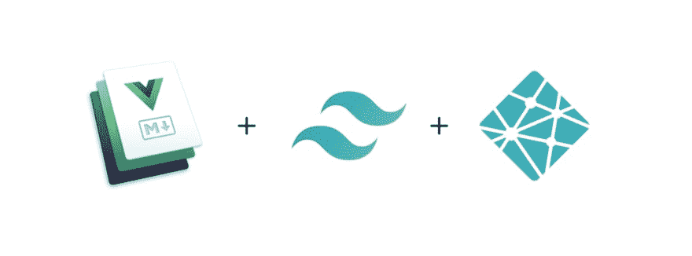
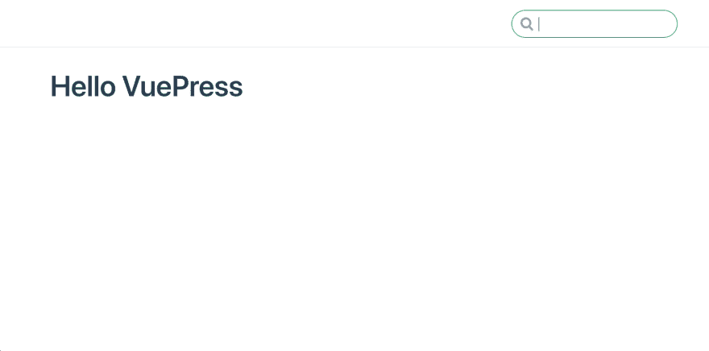

# [第 1 部分]用 Tailwind.css 建立一个有效的 Vuepress 博客

> 原文：<https://dev.to/hyper_yolo/part-1-setup-a-working-vuepress-blog-with-tailwindcss-1594>

[](https://res.cloudinary.com/practicaldev/image/fetch/s--vhcj941o--/c_limit%2Cf_auto%2Cfl_progressive%2Cq_auto%2Cw_880/https://thepracticaldev.s3.amazonaws.com/i/d63hpoll0toxrq5kqfke.png)

在这一部分中，我们将使用 Tailwind.css 建立一个可用的 Vuepress 博客。

## 1。入门指南

让我们创建一个名为 **vuepress-blog** 的文件夹，然后运行这些命令。

```
# cd into the folder
cd vuepress-blog

# install the latest vuepress alpha globally on your computer
npm install -g vuepress@next

# create the first markdown file
echo '# Hello VuePress' > README.md

# start the site locally
vuepress dev 
```

Enter fullscreen mode Exit fullscreen mode

当你运行`vuepress build`时，根级的 **README.md** 会生成为【index.html】的**。现在转到`localhost:8080`，你应该会看到这样一个默认的站点。霍雷。！
[](https://res.cloudinary.com/practicaldev/image/fetch/s--HZqYJ-JG--/c_limit%2Cf_auto%2Cfl_progressive%2Cq_auto%2Cw_880/https://thepracticaldev.s3.amazonaws.com/i/a7netunfmoc9gib7ecmc.png)**

请注意，一些 css 已经应用到页面上，没有任何工作(这是什么魔术？！😱).它直接来自 Vuepress 中的默认主题。要改变它，运行`vuepress eject`和一个生成的**。vuepress** 文件夹会出现在你的目录树中。它包含了默认主题的所有代码。当我们开始制作一个自定义主题时，我们将回顾这一点。

## 2。正确的目录结构

在文档方面，Vuepress 建议把所有东西都放在一个 **docs** 文件夹下。你可以用任何东西来命名它，但重要的是当运行 Vuepress 命令时，你需要运行`vuepress dev [folder name, i.e. docs]`，否则你会看到一个 404 页面。

另一方面，你可以简单地把所有东西都放在根层的 **vuepress-blog** 下。在这种情况下，你只需要像以前一样运行`vuepress dev`即可。

## 3。添加 tailwind.css

因为我们还没有 package.json，所以我们先来看看这个项目。

```
npm init 
```

Enter fullscreen mode Exit fullscreen mode

然后安装顺风

```
npm install tailwindcss 
```

Enter fullscreen mode Exit fullscreen mode

现在我们准备生成顺风配置

```
npx tailwind init tailwind.config.js 
```

Enter fullscreen mode Exit fullscreen mode

到目前为止，您的目录结构应该是这样的

```
vuepress-blog
├── node_modules
├── README.md
├── package-lock.json
├── package.json
└── tailwind.config.js 
```

Enter fullscreen mode Exit fullscreen mode

接下来，我们将创建一个利用顺风的自定义主题。

## 4。创建自定义 Vuepress 主题

在项目的根级别，创建一个**。vuepress** 文件夹，里面有一个**主题**文件夹。然后在**主题**里面，创建一个**风格**文件夹。**。vuepress** 容纳了一切，包括你当前的主题和 vuepress 配置；**主题**和**样式**文件夹将覆盖默认主题。

```
mkdir -p .vuepress/theme/styles 
```

Enter fullscreen mode Exit fullscreen mode

现在在**样式**文件夹中添加一个**主题.风格**作为所有 css 的入口点。你的目录树应该是这样的:

```
vuepress-blog
├── .vuepress
│   └── theme
│       └── styles
│           └── theme.styl
├── node_modules
├── README.md
├── package-lock.json
├── package.json
└── tailwind.config.js 
```

Enter fullscreen mode Exit fullscreen mode

将这几行添加到 **theme.styl** 来加载我们所有的顺风风格。

```
@tailwind preflight;
@tailwind components;
@tailwind utilities; 
```

Enter fullscreen mode Exit fullscreen mode

很好-我们快完成了！现在我们要告诉 Vuepress 连接到我们的顺风。在**中创建一个名为 **config.js** 的文件。按下**并输入这些设置

```
module.exports = {
  title: "Vuepress Blog Example",
  description: "just another blog",
  postcss: {
    plugins: [
      require("tailwindcss")("./tailwind.config.js"),
      require("autoprefixer"),
    ],
  },
} 
```

Enter fullscreen mode Exit fullscreen mode

最后，我们将添加主题索引文件。在**主题**中创建另一个名为 **layouts** 的文件夹，里面有一个 **Layout.vue** 。

在 **Layout.vue** 中，现在让我们添加非常基本的模板

```
<template>
  <div>
    <h1 class="font-sans text-teal">hello world</h1>
  </div> </template> <style lang="stylus">
@import '../styles/theme.styl';
</style> 
```

Enter fullscreen mode Exit fullscreen mode

这个 **Layout.vue** 将作为你所有页面的基本布局。如果页面首页没有指定`layout`，Vuepress 将默认为这个 **layouts/Layout.vue** 。这是任何 vuepress 主题的必备文件。

注意:如果你的主题超级简单，没有 **layouts** 文件夹，你可以把 **Layout.vue** 文件直接放在**主题**下。

您最终的目录结构应该是这样的

```
vuepress-blog
├── .vuepress
│   ├── theme
│   │   └── layouts
│   │       └── Layout.vue
│   │   └── styles
│   │       └── theme.styl
│   └── config.js
├── node_modules
├── README.md
├── package-lock.json
├── package.json
└── tailwind.config.js 
```

Enter fullscreen mode Exit fullscreen mode

现在重启你的服务器并运行`vuepress dev`，你应该会看到这样一个页面:
[](https://res.cloudinary.com/practicaldev/image/fetch/s--Z1mb6p8J--/c_limit%2Cf_auto%2Cfl_progressive%2Cq_auto%2Cw_880/https://thepracticaldev.s3.amazonaws.com/i/uru5h55v3fx1k9xqgbuk.png)

确保 tailwind 类正在工作(即，您应该看到文本是绿色的，而不是黑色的。)

干得好！到目前为止，我们已经利用 tailwind.css 创建了一个自定义的 Vuepress 主题。在下一部分，我们将学习如何编写自己的主题，让您的博客看起来棒极了！[第二部在这里](https://dev.to/hyper_yolo/part-2-write-and-apply-a-custom-vuepress-theme-4n3a)。

* * *

这是一个来自我的网站的交叉帖子。查看原文和更多内容！