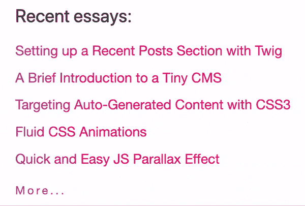
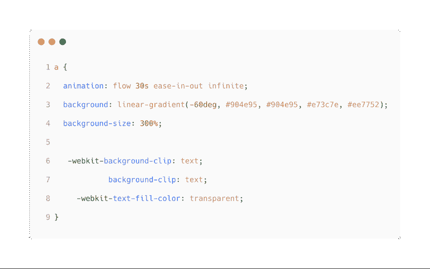
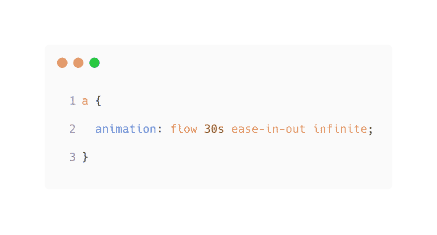
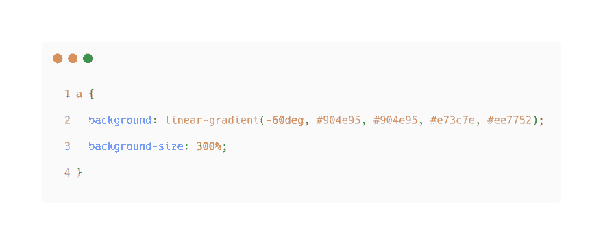
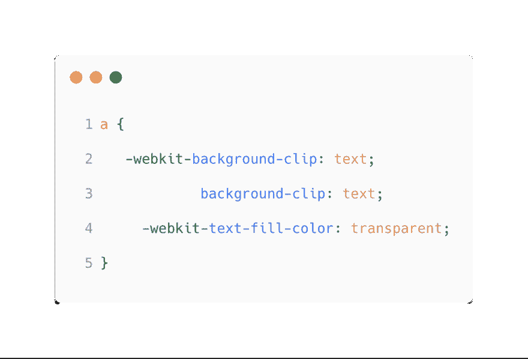
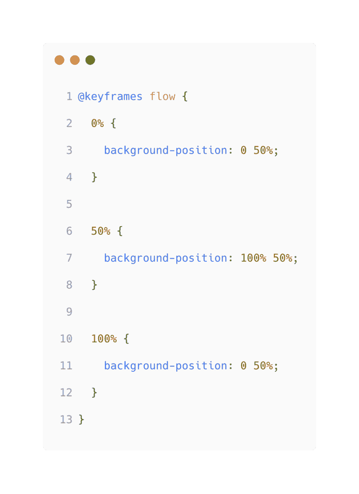
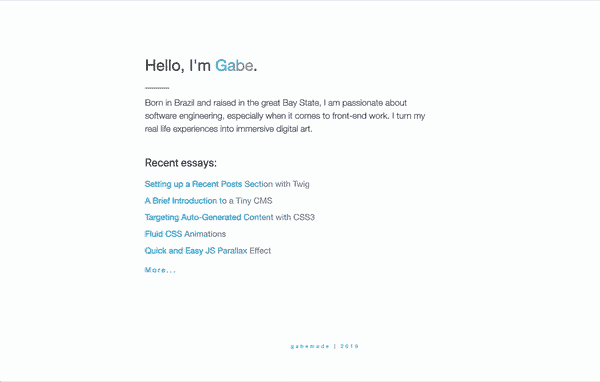

# 流体动画 CSS 渐变文本效果

> 原文：<https://dev.to/gabe/fluid-css-gradient-animation-3b2>

CSS 动画很牛逼。它们不仅能制作出优秀的数字艺术作品，还能让我们在网页中加入流畅的设计元素。最近，我在我的许多博客链接中集成了 CSS 渐变动画，给它们一种生动、流畅的感觉。见下面我的“近期文章”模块

 
*注意:gif 是为了演示而加速的*

整洁，对不对？并且实现起来相当简单。我们真正需要的是 CSS！
[T3】](https://res.cloudinary.com/practicaldev/image/fetch/s--tmra4tFh--/c_limit%2Cf_auto%2Cfl_progressive%2Cq_auto%2Cw_880/https://thepracticaldev.s3.amazonaws.com/i/vkte2wsl6qssuzx1igw0.png)

### 我们来解构一下

所以我的 CSS 中的第一件事是动画规则。
 
这里我是说——播放名为**流**的动画，时长 **30 秒**。将动画设置为**渐入渐出**以获得更平滑的效果，并让动画无限循环**次**。

然后是背景规则。
 
我设置我的背景为**线性渐变**并给它我想要的颜色。为了漂亮的渐变，当我想不出什么好的东西时，我经常使用 UI 渐变。然后我使用**背景大小**属性将背景拉伸到 300%的大小，给动画留出移动的空间。

然后我将背景剪辑设置为 T2 文本，并将 T4 文本填充颜色设置为透明，这样我的默认字体颜色就不会影响我的渐变。

现在开始实际的动画制作。我创建了一个名为 flow 的关键帧动画，并在 0、50 和 100%标记处设置了关键帧。
 
最终结果:
 
这样你就有了——一个漂亮的、流畅的文本渐变动画。CSS 提供的另一个有趣的设计元素。