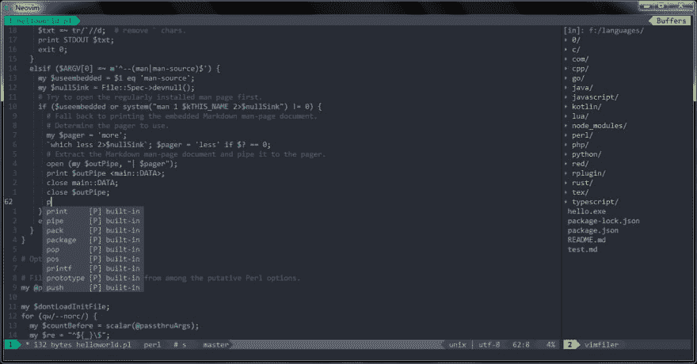
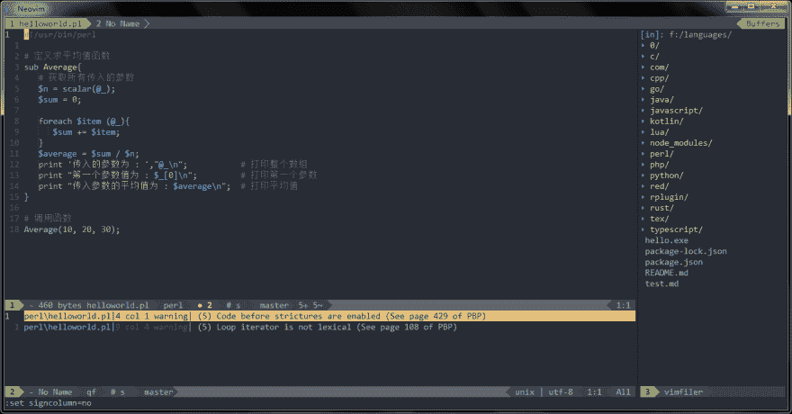
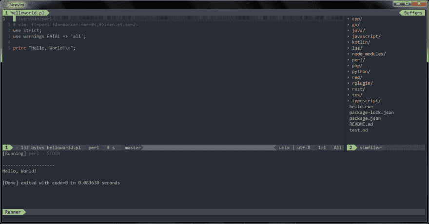
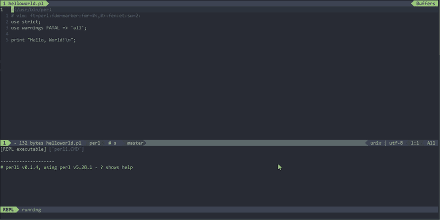

# 使用 Vim 作为 Perl IDE

> 原文：<https://dev.to/spacevim/use-vim-as-a-perl-ide-23ph>

# 使用 Vim 作为一个 Perl IDE

这是将 SpaceVim 用作 perl IDE 的通用指南，包括层配置和使用。将涵盖以下每个部分:

*   启用语言层
*   代码完成
*   语法林挺
*   跳转到测试文件
*   运行代码
*   代码格式
*   REPL 支持 ###启用语言层

要在 SpaceVim 中添加 perl 语言支持，需要启用`lang#perl`层。按`SPC f v d`打开 SpaceVim 配置文件，添加如下配置:

```
[[layers]]
  name = "lang#perl" 
```

要了解更多信息，您可以阅读 [lang#perl](https://spacevim.org/layers/lang/perl/) 层文档。

### 代码补全

层将自动加载 perl 插件，除非在你的`init.toml`中被覆盖。完成菜单将在您键入时打开。

[](https://res.cloudinary.com/practicaldev/image/fetch/s--MYNo4Xpe--/c_limit%2Cf_auto%2Cfl_progressive%2Cq_auto%2Cw_880/https://user-images.githubusercontent.com/13142418/52611209-54550500-2ebf-11e9-9b9f-f697a0db52a3.png)

### 语法林挺

默认情况下，棋盘格图层处于启用状态。该层通过 [neomake](https://github.com/neomake/neomake) 提供异步语法林挺。它将异步运行 perl 和 perlcritic。

通过 cpan 安装 perlcritic:

```
cpanm Perl::Critic 
```

[](https://res.cloudinary.com/practicaldev/image/fetch/s--oWhhzesA--/c_limit%2Cf_auto%2Cfl_progressive%2Cq_auto%2Cw_880/https://user-images.githubusercontent.com/13142418/52614908-2cb96900-2ece-11e9-8c73-2881f8030c6e.png)

### 跳转到测试文件

SpaceVim 使用内置插件来管理项目中的文件，您可以在项目的根目录下添加一个`.project_alt.json`，内容如下:

```
{
  "src/*.pl": {"alternate": "test/{}.pl"},
  "test/*.pl": {"alternate": "src/{}.pl"}
} 
```

通过这种配置，您可以通过命令`:A`在源代码和测试文件之间跳转

### 运行代码

要运行当前脚本，您可以按`SPC l r`，一个分割窗口将被打开，脚本的输出将显示在该窗口中。它异步运行，不会阻塞您的 vim。

[](https://res.cloudinary.com/practicaldev/image/fetch/s--tFqPDa73--/c_limit%2Cf_auto%2Cfl_progressive%2Cq_auto%2Cw_880/https://user-images.githubusercontent.com/13142418/52611211-54550500-2ebf-11e9-9baf-a6437da8fcf4.png)

### 代码格式化

默认情况下，格式层也是启用的，通过该层，您可以使用键绑定`SPC b f`来格式化当前缓冲区。在使用此功能之前，请安装 perltidy:

```
cpanm Perl::Tidy 
```

### REPL 支持

用`SPC l s i`开始一个`perli`或`perl -del`次 REPL 过程。在 REPL 进程开始后。你可以发送代码给下级进程，所有的键绑定都以`SPC l s`前缀开始，包括发送行，发送选择，甚至发送整个缓冲区。

[](https://res.cloudinary.com/practicaldev/image/fetch/s--Xc18n3Ln--/c_limit%2Cf_auto%2Cfl_progressive%2Cq_66%2Cw_880/https://user-images.githubusercontent.com/13142418/52611210-54550500-2ebf-11e9-8ba2-b5cd3cc70885.gif)