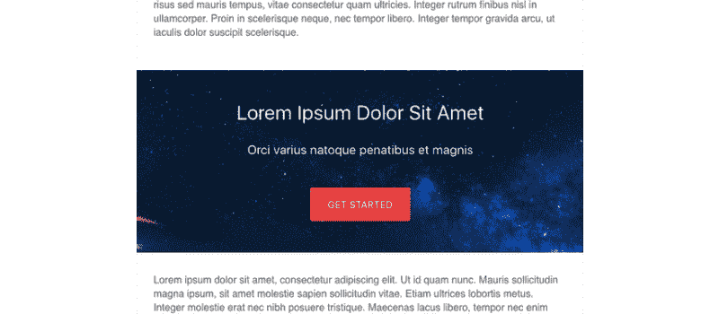
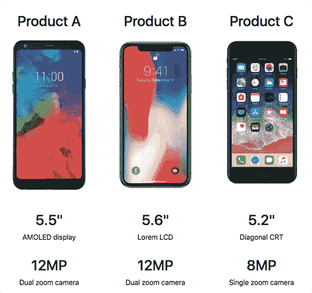
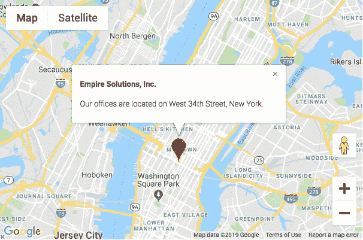

# 2D 视差，产品比较，图像剪辑和更多|模块星期一 28

> 原文：<https://dev.to/tyrw/mousemove-background-product-comparison-image-clipping--more--module-monday-28-4p3c>

## 为您的下一个项目提供开源 mods

以下所有内容都是开源的，可以在任何网站、web 应用程序或其他任何地方免费使用。Anymod 还有数百个这样的。

单击一个 mod 来查看它及其源代码。

## 鼠标移动背景

鼠标移动时细微的 2d 视差。
[查看模式](https://anymod.com/mod/alldla?v=20)

 [
T4】](https://anymod.com/mod/alldla?v=20)

## 图像字母

剪辑背景图像以显示在文本后面。
[查看 mod](https://anymod.com/mod/mllrlr)
  

## 产品对比栏目

并排展示多个产品功能。
[查看模式](https://anymod.com/mod/kddrda?v=20)

 [
T4】](https://anymod.com/mod/kddrda?v=20)

## 带标记的谷歌地图

为你的总部定制位置和标记。
[查看模式](https://anymod.com/mod/moamb?v=20)

 [
T4】](https://anymod.com/mod/moamb?v=20)

## 响应式马赛克图库

任何宽度都好看。
[查看模式](https://anymod.com/mod/lramn?v=20)

 [
T4】](https://anymod.com/mod/lramn?v=20)

* * *

我每周一都会在这里贴上新的 MODS-我希望你会觉得它们有用！

快乐编码✌️