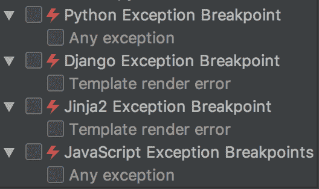

# Python 异常被认为是反模式

> 原文：<https://dev.to/wemake-services/python-exceptions-considered-an-anti-pattern-17o9>

**原载于我的博客**:[https://sobolevn . me/2019/01/simple-dependent-types-in-python](https://sobolevn.me/2019/01/simple-dependent-types-in-python)

什么是例外？从它们的名字来看，它是一个实体，代表了程序内部发生的一些异常情况。

您可能想知道异常是如何成为反模式的，这与类型化有什么关系？好吧，让我们来看看！

## 出现异常的问题

首先，我们必须证明异常有缺点。嗯，通常很难在你每天使用的东西中找到“问题”,因为在某些时候它们开始看起来像是你的“特性”。

让我们重新审视一下。

### 异常情况很难被注意到

有两种类型的异常:“显式”是用`raise`关键字在你正在阅读的代码中创建的，而“包装”是在你正在使用的其他函数/类/方法中包装的。

问题是:很难注意到所有这些“包装”的异常。
我将用这个纯函数来说明我的观点:

```
def divide(first: float, second: float) -> float:
     return first / second 
```

它所做的只是将两个数相除。总是返回`float`。它是类型安全的，可以这样使用:

```
result = divide(1, 0)
print('x / y = ', result) 
```

等等，你拿到了吗？永远不会被真正执行。因为`1 / 0`是不可能的操作，`ZeroDivisionError`会被抬高。因此，尽管您的代码是类型安全的，但使用起来并不安全。

您仍然需要丰富的经验，才能在可读性和类型良好的代码中发现这些潜在的问题。`python`中的几乎所有东西都可能因为不同类型的异常而失败:除法、函数调用、`int`、`str`、`for`循环中的生成器、可迭代对象、属性访问、键访问，甚至`raise something()`本身都可能失败。我甚至没有在这里讨论 IO 操作。并且[已检查的异常在不久的将来将不会被支持](https://github.com/python/typing/issues/71)。

### 原地恢复正常行为是不可能的

嘿，但是我们总是有专门针对这种情况的案例。我们只要处理好`ZeroDivisionError`就安全了！

```
def divide(first: float, second: float) -> float:
     try:
         return first / second
     except ZeroDivisionError:
         return 0.0 
```

现在我们安全了！但是我们为什么要返回`0`？为什么不是`1`？为什么不是`None`？虽然`None`在大多数情况下与异常一样糟糕(甚至更糟)，但事实证明我们应该严重依赖业务逻辑和该功能的用例。

我们到底分什么？任意数字？一些具体单位？钱？并不是所有情况都可以覆盖并轻松恢复。有时，当我们在不同的用例中重用此功能时，我们会发现它需要不同的恢复逻辑。

因此，可悲的结论是:**所有的问题都必须根据特定的使用环境单独解决**。没有一劳永逸解决所有问题的灵丹妙药。同样，我甚至没有讨论带有重试策略和潜在超时的复杂 IO 流。

也许我们根本就不应该就地处理异常？也许我们应该在执行流程中把它扔得更远，然后有人会以某种方式处理它。

### 执行流程不明

好了，现在我们希望其他人能捕捉到这个异常并可能处理它。例如，系统可能会通知用户更改输入，因为我们不能除以`0`。这显然不是`divide`功能的职责。

现在我们只需要检查这个异常实际上是在哪里被捕获的。顺便问一下，我们如何知道它将在哪里被处理？我们能在代码中导航到这一点吗？事实证明，我们做不到。

没有办法知道在抛出异常后将执行哪一行代码。不同的异常类型可能由不同的`except`案例处理，有些异常可能是 [`suppress` ed](https://docs.python.org/3/library/contextlib.html#contextlib.suppress) 。你也可能会在不同的模块中引入新的`except`案例，从而意外地在随机的地方中断你的程序。请记住，几乎任何线都可以提高。

我们的应用程序中有两个独立的流:从上到下的常规流和以任意方式流动的特殊流。怎样才能有意识地这样读代码？

仅在打开调试器的情况下。启用“捕获所有异常”策略。

[](https://res.cloudinary.com/practicaldev/image/fetch/s--G7DKH59C--/c_limit%2Cf_auto%2Cfl_progressive%2Cq_auto%2Cw_880/https://thepracticaldev.s3.amazonaws.com/i/838vfxwo8cdbankvb8x5.png)

异常就像臭名昭著的`goto`语句，撕裂了我们程序的结构。

### 例外不例外

让我们看另一个例子，一个访问远程 HTTP API 的典型代码:

```
import requests

def fetch_user_profile(user_id: int) -> 'UserProfile':
    """Fetches UserProfile dict from foreign API."""
    response = requests.get('/api/users/{0}'.format(user_id))
    response.raise_for_status()
    return response.json() 
```

从字面上看，这个例子中的一切都可能出错。以下是所有可能发生的错误的不完整列表:

1.  您的网络可能已关闭，因此请求根本不会发生
2.  服务器可能关闭了
3.  服务器可能太忙，您将面临超时
4.  服务器可能需要身份验证
5.  API 端点可能不存在
6.  该用户可能不存在
7.  您可能没有足够的权限查看它
8.  在处理您的请求时，服务器可能会因内部错误而失败
9.  服务器可能返回无效或损坏的响应
10.  服务器可能返回无效的`json`，因此解析将失败

这样的例子不胜枚举！这三行代码可能存在潜在的问题，因此更容易说它只是偶然地工作。通常它会因异常而失败。

## 如何做到安全？

现在我们知道异常对你的代码是有害的。让我们来学习如何从他们身上得到启示。有不同的模式来编写无异常代码:

1.  到处都写着 [`except Exception: pass`](https://wemake-python-styleguide.readthedocs.io/en/latest/pages/violations/best_practices.html#wemake_python_styleguide.violations.best_practices.WrongKeywordViolation) 。那是你能想象的最糟糕的。不要这样做。
2.  返回`None`。那也是邪恶的！你要么在几乎每一行都使用`if something is not None:`,并被类型检查条件语句污染你的逻辑，要么每天都遭受`TypeError`。不是一个令人愉快的选择。
3.  编写特例类。例如，你将拥有带有多个错误子类的`User`基类，比如`UserNotFound(User)`和`MissingUser(User)`。它可能用于一些特定的情况，像`django`中的 [`AnonymousUser`](https://docs.djangoproject.com/en/2.1/ref/contrib/auth/#anonymoususer-object) ，但是不可能将所有可能的错误都包含在特例类中。这将需要开发者做太多的工作。并使您的领域模型过于复杂。
4.  您可以使用容器值，将实际的成功或错误值包装到一个带有实用方法的瘦包装器中，以处理该值。这正是我们创建 [`@dry-python/returns`](https://github.com/dry-python/returns) 项目的原因。所以你可以让你的函数返回一些有意义的，有类型的，安全的东西。

先说同一个除数例子，出错时返回`0`。也许我们可以在没有任何显式数值的情况下表明结果不成功？

```
from returns.result import Result, Success, Failure

def divide(first: float, second: float) -> Result[float, ZeroDivisionError]:
    try:
        return Success(first / second)
    except ZeroDivisionError as exc:
        return Failure(exc) 
```

现在，我们用两个包装器中的一个来包装我们的值:`Success`或`Failure`。这两个类继承自`Result`基类。我们可以在函数返回注释中指定包装值的类型，例如`Result[float, ZeroDivisionError]`返回`Success[float]`或`Failure[ZeroDivisionError]`。

这对我们意味着什么？这意味着**异常并不是异常，它们代表了可预料的问题**。但是，我们也将它们包装在`Failure`中以解决第二个问题:**发现潜在的异常是困难的**。

```
1 + divide(1, 0)
# => mypy error: Unsupported operand types for + ("int" and "Result[float, ZeroDivisionError]") 
```

现在你可以很容易地发现他们！规则是:如果你看到一个`Result`，这意味着这个函数可以抛出一个异常。而且你甚至提前知道它的类型。

而且，`returns`库是全类型的，并且与 [PEP561 兼容](https://www.python.org/dev/peps/pep-0561/)。这意味着如果你试图返回违反声明类型契约的东西，`mypy`会警告你。

```
from returns.result import Result, Success, Failure

def divide(first: float, second: float) -> Result[float, ZeroDivisionError]:
    try:
        return Success('Done')
        # => error: incompatible type "str"; expected "float"
    except ZeroDivisionError as exc:
        return Failure(0)
        # => error: incompatible type "int"; expected "ZeroDivisionError" 
```

### 如何使用包装值？

有两种方法[处理这些包装的值](https://returns.readthedocs.io/en/latest/pages/container.html#working-with-containers):

*   `map`使用返回常规值的函数
*   使用返回其他容器的函数

```
Success(4).bind(lambda number: Success(number / 2))
# => Success(2) 
Success(4).map(lambda number: number + 1)
# => Success(5) 
```

事情是这样的:你将不会遭遇失败的情况。由于`.bind`和`.map`不会对`Failure`集装箱执行:

```
Failure(4).bind(lambda number: Success(number / 2))
# => Failure(4) 
Failure(4).map(lambda number: number / 2)
# => Failure(4) 
```

现在，您可以只关注正确的执行流，并确保失败状态不会在随机位置中断您的程序。

如果你愿意，你可以随时[处理失败的状态，甚至修复它](https://returns.readthedocs.io/en/latest/pages/container.html#returning-execution-to-the-right-track)并回到正确的轨道。

```
Failure(4).rescue(lambda number: Success(number + 1))
# => Success(5) 
Failure(4).fix(lambda number: number / 2)
# => Success(2) 
```

这意味着“**所有问题都必须单独解决**”实践是唯一的出路“**执行流程现已清晰**”。享受你的铁路节目！

### 但是如何从容器中解开值呢？

是的，的确，在处理实际接受这些原始值的函数时，您确实需要原始值。可以用 [`.unwrap()`或者`.value_or()`](https://returns.readthedocs.io/en/latest/pages/container.html#unwrapping-values) 的方法:

```
Success(1).unwrap()
# => 1 
Success(0).value_or(None)
# => 0 
Failure(0).value_or(None)
# => None 
Failure(1).unwrap()
# => Raises UnwrapFailedError() 
```

*等等，什么？*你已经承诺将我从异常中拯救出来，而现在你却告诉我，我所有的`.unwrap()`调用都会导致另一个异常！

### 如何不去在意这些 UnwrapFailedErrors？

好了，让我们看看如何面对这些新的例外。考虑这个例子:我们需要验证用户的输入，然后在数据库中创建两个模型。并且每一步都可能因异常而失败，所以我们将所有方法包装到了`Result`包装器:

```
from returns.result import Result, Success, Failure

class CreateAccountAndUser(object):
    """Creates new Account-User pair."""

    # TODO: we need to create a pipeline of these methods somehow... 
    def _validate_user(
        self, username: str, email: str,
    ) -> Result['UserSchema', str]:
        """Returns an UserSchema for valid input, otherwise a Failure."""

    def _create_account(
        self, user_schema: 'UserSchema',
    ) -> Result['Account', str]:
        """Creates an Account for valid UserSchema's. Or returns a Failure."""

    def _create_user(
        self, account: 'Account',
    ) -> Result['User', str]:
        """Create an User instance. If user already exists returns Failure.""" 
```

首先，在编写自己的业务逻辑时，不能解开任何值:

```
class CreateAccountAndUser(object):
    """Creates new Account-User pair."""

    def __call__(self, username: str, email: str) -> Result['User', str]:
        """Can return a Success(user) or Failure(str_reason)."""
        return self._validate_user(
            username, email,
        ).bind(
            self._create_account,
        ).bind(
            self._create_user,
        )

   # ... 
```

这不会有任何问题。它不会引发任何异常，因为没有使用`.unwrap()`。但是，这样读代码容易吗？**没有**，不是。我们能提供什么选择？`@pipeline`！

```
from result.functions import pipeline

class CreateAccountAndUser(object):
    """Creates new Account-User pair."""

    @pipeline
    def __call__(self, username: str, email: str) -> Result['User', str]:
        """Can return a Success(user) or Failure(str_reason)."""
        user_schema = self._validate_user(username, email).unwrap()
        account = self._create_account(user_schema).unwrap()
        return self._create_user(account)

   # ... 
```

现在它是完全可读的。这就是`.unwrap()`和`@pipeline` synergy 的工作方式:每当任何`.unwrap()`方法在`Failure[str]`实例`@pipeline`上失败时，decorator 将捕获它并返回`Failure[str]`作为结果值。这就是我们如何从代码中消除所有异常并使其真正类型安全的方法。

## 将所有的包裹在一起

现在，让我们用我们所有的新工具来解决这个`requests`例子。记住，每一行都可能引发一个异常。而且没有办法让他们返回`Result`容器。但是你可以使用 [`@safe`装饰器](https://returns.readthedocs.io/en/latest/pages/functions.html#safe)来包装不安全的函数，让它们变得安全。这两个例子是一样的:

```
from returns.functions import safe

@safe
def divide(first: float, second: float) -> float:
     return first / second

# is the same as: 
def divide(first: float, second: float) -> Result[float, ZeroDivisionError]:
    try:
        return Success(first / second)
    except ZeroDivisionError as exc:
        return Failure(exc) 
```

我们可以看到第一个带有`@safe`的代码可读性更好，也更简单。

那是我们解决问题所需要的最后一件事。这就是我们的结果代码最终的样子:

```
import requests
from returns.functions import pipeline, safe
from returns.result import Result

class FetchUserProfile(object):
    """Single responsibility callable object that fetches user profile."""

    #: You can later use dependency injection to replace `requests`
    #: with any other http library (or even a custom service).
    _http = requests

    @pipeline
    def __call__(self, user_id: int) -> Result['UserProfile', Exception]:
        """Fetches UserProfile dict from foreign API."""
        response = self._make_request(user_id).unwrap()
        return self._parse_json(response)

    @safe
    def _make_request(self, user_id: int) -> requests.Response:
        response = self._http.get('/api/users/{0}'.format(user_id))
        response.raise_for_status()
        return response

    @safe
    def _parse_json(self, response: requests.Response) -> 'UserProfile':
        return response.json() 
```

需要总结的内容:

1.  我们对所有可能引发异常的方法使用`@safe`，它会将函数的返回类型改为`Result[OldReturnType, Exception]`
2.  我们使用`Result`作为一个容器，在一个简单的抽象中包装值和错误
3.  我们使用`.unwrap()`从容器中打开原始值
4.  我们使用`@pipeline`使`.unwrap`调用的序列可读

这是一个完全可读且安全的方法，就像我们之前对不安全函数所做的一样。它消除了我们遇到的所有异常问题:

1.  “例外很难被注意到”。现在，它们用一个类型化的`Result`容器包装，这使它们变得非常清晰。
2.  “原地恢复正常行为是不可能的”。我们现在可以安全地将恢复过程委托给调用者。我们为这个特定的用例提供了`.fix()`和`.rescue()`方法。
3.  “执行流程不清楚”。现在和常规业务流程一样。从上到下。
4.  “例外不例外”。我们知道！我们预料事情会出错，并为此做好了准备。

## 用例与限制

显然，你不能这样写所有的代码。对于大多数情况来说，它太安全了，而且与其他库/框架不兼容。但是，你应该明确地写出你的业务逻辑中最重要的部分，就像我上面展示的那样。它将增加系统的可维护性和正确性。

##  [干蟒](https://github.com/dry-python) / [返回](https://github.com/dry-python/returns)

### 让你的函数返回一些有意义的、有类型的、安全的东西！

<article class="markdown-body entry-content container-lg" itemprop="text">

[](https://github.com/dry-python/returns)

* * *

[](https://github.com/dry-python/returns/actions?query=workflow%3Atest)[](https://codecov.io/gh/dry-python/returns)[](https://returns.readthedocs.io/en/latest/?badge=latest)[](https://pypi.org/project/returns/)[](https://github.com/wemake-services/wemake-python-styleguide)[](http://mypy-lang.org/)

* * *

让你的函数返回一些有意义的、有类型的、安全的东西！

## 特征

*   将函数式编程引入 Python 领域
*   提供一组原语来编写声明性业务逻辑
*   实施更好的架构
*   带注释全打，用`mypy`、 [PEP561 兼容](https://www.python.org/dev/peps/pep-0561/)检查
*   添加模拟的更高级类型支持
*   有一群更好的构图助手
*   写起来和读起来都令人愉快🐍
*   支持函数和协程，与框架无关
*   易于开始:有许多文档、测试和教程

## 装置

```
pip install returns
```

您还需要[正确配置](https://returns.readthedocs.io/en/latest/pages/container.html#type-safety) `mypy`并安装我们的插件来修复[这个存在的问题](https://github.com/python/mypy/issues/3157):

```
# In setup.cfg or mypy.ini:
[mypy]
plugins =
  returns.contrib.mypy.returns_plugin
```

我们还建议使用与我们使用的相同的`mypy`设置[。](https://github.com/wemake-services/wemake-python-styleguide/blob/master/styles/mypy.toml)

确保您知道如何开始，[查看我们的文档](https://returns.readthedocs.io/en/latest/)！

## 内容

*   [也许容器](https://raw.githubusercontent.com/dry-python/returns/master/#maybe-container)允许你写`None`自由代码
*   [需要一个上下文容器](https://raw.githubusercontent.com/dry-python/returns/master/#requirescontext-container),它允许…

</article>

[View on GitHub](https://github.com/dry-python/returns)