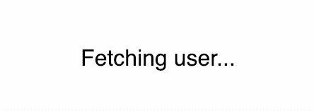
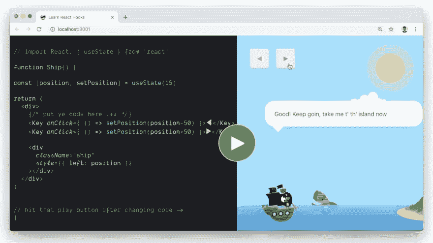

# 用钩子重新思考组件模型

> 原文：<https://dev.to/siddharthkp/28-rethinking-the-component-model-with-hooks-55l5>

> 这个帖子是上周发给[我的简讯](https://sid.studio/newsletter)的。
> 
> 感谢[丹·阿布拉莫夫](https://twitter.com/dan_abramov)审阅并提出改进建议。

如果你是 React 的粉丝，你可能已经听说过带钩子的版本(v16.8)已经发布了。

我已经玩了几个星期的阿尔法版本，我真的很喜欢它。虽然领养并不都是彩虹和独角兽。

学习`useState`和`useReducer`非常简单，并且改进了我处理状态的方式。

我在早先的帖子中写过关于`useState` [的内容。下面是简短的版本:](https://sid.studio/post/react-hooks) 

```
function Counter() {
  /*
    create a new state pair with useState,
    you can specify the initial value
    as an argument
  */
  const [count, setCount] = useState(0)

  /*
    create a function to increase this count
    you have access to the current count as it
    is a local variable.

    Calling setCount will trigger a re-render
    just like setState would.
  */
  function increase() {
    setCount(count + 1)
  }

  return (
    <div>
      {count}
      <button onClick={increase}>Increase</button>
    </div>
  )
} 
```

但是，我真的很纠结于`useEffect`钩。

> 效果挂钩允许您在功能组件中执行副作用。

副作用可能意味着从更新文档标题到发出 API 请求的任何事情。在 React 渲染树之外发生的任何事情都是组件的副作用。

对于类，您通常会在`componentDidMount`中这样做。有了钩子，看起来是这样的:

```
import React, { useState, useEffect } from 'react'

// username is passed in props
render(<UserProfile username="siddharthkp" />)

function UserProfile(props) {
  // create a new state pair with empty object as default
  const [user, setUser] = useState({})

  // create a pair for loading state
  const [loading, setLoading] = useState(false)

  // Similar to componentDidMount
  useEffect(function() {
    // set loading to true at start
    setLoading(true)

    // fetch the user's details
    // username is passed in props
    fetch('/get-user?username=' + props.username)
      .then(response => response.json())
      .then(user => {
        setUser(user) // set user in state
        setLoading(false) // set loading to false
      })
  })

  if (loading) return <div>Fetching user... </div>
  else return <div>Hi {user.name}</div> } 
```

这感觉很熟悉。它看起来像是穿了一套不同的衣服。

嗯，它没有同样的方式。上面的代码有 bug！

看看这个预览，它在获取用户并重新呈现它的无限循环中(不仅仅因为它是 gif！)

[](https://res.cloudinary.com/practicaldev/image/fetch/s--wjIRk4JI--/c_limit%2Cf_auto%2Cfl_progressive%2Cq_66%2Cw_880/https://sid.studio/blog/28/fetch-1.gif%3Fv%3D2)

组件挂载后调用`componentDidMount`。它只发射一次。

另一方面，默认情况下，`useEffect`内部的效果应用于每次渲染。

这是思维模式的一个微妙转变，我们需要改变我们对组件生命周期的思考方式——我们需要从*渲染和效果*的角度来考虑，而不是挂载和更新

`useEffect`让我们传递一个可选参数——一个由`dependencies`组成的数组，通知 React 何时应该重新应用效果。如果所有依赖项都没有改变，则不会重新应用该效果。

```
useEffect(function effect() {}, [dependencies]) 
```

有些人觉得这很烦人——感觉简单的东西现在变得复杂了，却没有任何好处。

`useEffect`的好处是它取代了三种不同的 API 方法(`componentDidMount`、`componentDidUpdate`和`componentWillUnmount`)，因此让你从一开始就考虑所有这些场景——第一次渲染、更新或重新渲染以及卸载。

在上面的组件中，当我们想要显示不同用户的个人资料时，即当`props.username`发生变化时，该组件应该再次获取用户详细信息。

对于一个类组件，你可以用`componentDidUpdate`或`getDerivedStateFromProps`来处理它。这通常是事后的想法，在此之前，组件显示陈旧的数据。

使用`useEffect`，您被迫在早期考虑这些用例。我们可以将`props.username`作为附加参数传递给`useEffect`。

```
useEffect(
  function() {
    setLoading(true) // set loading to true

    // fetch the user's details
    fetch('/get-user?username=' + props.username)
      .then(response => response.json())
      .then(user => {
        setUser(user) // set user in state
        setLoading(false) // set loading to false
      })
  },
  [props.username]
) 
```

React 现在会跟踪`props.username`并在它改变时重新应用效果。

让我们谈谈另一种副作用:事件侦听器。

我试图建立一个工具来显示你按下了哪个键盘按钮。在`window`上添加一个监听器来监听键盘事件是一个副作用。

[](https://res.cloudinary.com/practicaldev/image/fetch/s--FyDP1Orp--/c_limit%2Cf_auto%2Cfl_progressive%2Cq_66%2Cw_880/https://sid.studio/blog/28/key-debugger-1.gif%3Fv%3D2)

### 第一步:添加事件监听器生效

```
function KeyDebugger(props) {
  const [key, setKey] = useState(null)

  function handleKeyDown(event) {
    setKey(event.key) // set key in state
  }

  useEffect(function() {
    // attach event listener
    window.addEventListener('keydown', handleKeyDown)
  })

  return <div>Last key hit was: {key}</div> } 
```

这看起来类似于前面的例子。

这种效果将应用于每一次渲染，我们将得到多个事件侦听器，它们在同一个事件上触发。这可能导致意外的行为，并最终导致内存泄漏！

### 第二步:清理阶段

给了我们一种清理听众的方法。

如果我们从效果返回一个函数，React 将在重新应用效果之前运行它。

```
function KeyDebugger(props) {
  const [key, setKey] = useState(null)

  function handleKeyDown(event) {
    setKey(event.key)
  }

  useEffect(function() {
    window.addEventListener('keydown', handleKeyDown)

    return function cleanup() {
      // remove the event listener we had attached
      window.removeEventListener('keydown', handleKeyDown)
    }
  })

  return <div>Last key hit was: {key}</div> } 
```

##### 注意:除了在重新应用一个效果之前运行，组件卸载时也会调用清理函数。

好多了。我们可以再做一次优化。

### 第三步:添加依赖关系，实现重复应用效果

记住:如果我们不传递依赖，它将在每次渲染时运行。

在这种情况下，我们只需要应用一次效果，即在窗口上附加一次事件侦听器。

当然，除非听者本身改变了！我们应该添加监听器`handleKeyDown`作为这里唯一的依赖项。

```
function KeyDebugger(props) {
  const [key, setKey] = useState(null)

  function handleKeyDown(event) {
    setKey(event.key)
  }

  useEffect(
    function() {
      window.addEventListener('keydown', handleKeyDown)

      return function cleanup() {
        window.removeEventListener('keydown', handleKeyDown)
      }
    },
    [handleKeyDown]
  )

  return <div>Last key hit was: {key}</div> } 
```

`dependencies`是一个强有力的暗示。

*   无依赖性:在每次渲染时应用效果
*   `[]`:仅在第一次渲染时应用
*   `[props.username]`:变量变化时应用

我们甚至可以将这种效果抽象到一个内置了清理功能的*自定义钩子*中。这让我们的组件少担心一件事。

```
function KeyDebugger(props) {
  const [key, setKey] = useState(null)

  function handleKeyDown(event) {
    setKey(event.key)
  }

  useEventListener('keydown', handleKeyDown)

  return <div>Last key hit was: {key}</div> }

// re-usable event listener hook with cleanup
function useEventListener(eventName, callback) {
  useEffect(function() {
    window.addEventListener(eventName, callback)

    return function cleanup() {
      window.removeEventListener(eventName, callback)
    }
  }, [])
} 
```

##### 注:`useEventListener`如上定义对我们的例子起作用，但不是完整的实现。如果你想知道一个稳健的版本会是什么样子，[看看这个回购](https://github.com/siddharthkp/use-event-listener)。

让我们给我们的`KeyDebugger`再增加一个特性。一秒钟后，该键应该消失，直到按下另一个键。

[](https://res.cloudinary.com/practicaldev/image/fetch/s--pLXN1vYF--/c_limit%2Cf_auto%2Cfl_progressive%2Cq_66%2Cw_880/https://sid.studio/blog/28/key-debugger-2.gif%3Fv%3D2)

那只是一个`setTimeout`，应该不难吧？

在`handleKeyDown`中，我们可以在一秒钟的延迟后取消按键。而作为负责任的开发者，我们也会在清理功能中清除超时。

```
function KeyDebugger(props) {
  const [key, setKey] = useState(null)
  let timeout

  function handleKeyDown(event) {
    setKey(event.key)

    timeout = setTimeout(function() {
      setKey(null) // reset key
    }, 1000)
  }

  useEffect(function() {
    window.addEventListener('keydown', handleKeyDown)

    return function cleanup() {
      window.removeEventListener('keydown', handleKeyDown)
      clearTimeout(timeout) // additional cleanup task
    }
  }, [])

  return <div>Last key hit was: {key}</div> } 
```

这段代码变得比以前稍微复杂了一点，这要感谢在同一个效果中发生的两个副作用——嵌套在一个`keydown`侦听器中的`setTimeout`。这使得更改更难跟踪。

因为这两个效果是嵌套的，所以我们也不能获得自定义钩子的好处。简化代码的一种方法是将它们分离到各自的钩子中。

##### 旁注:上面的代码中有一个非常微妙的 bug 很难浮出水面——因为当`key`改变时超时没有被清除，旧的回调将继续被调用，这可能导致 bug。

```
function KeyDebugger(props) {
  const [key, setKey] = useState(null)

  function handleKeyDown(event) {
    setKey(event.key)
  }

  // keyboard event effect
  useEventListener('keydown', handleKeyDown)

  // timeout effect
  useEffect(
    function() {
      let timeout = setTimeout(function() {
        setKey(null)
      }, 1000)

      return function cleanup() {
        clearTimeout(timeout)
      }
    },
    [key]
  )

  return <div>Last key hit was: {key}</div> } 
```

通过创建两个不同的效果，我们能够保持逻辑分离(更容易跟踪)，并为每个效果定义不同的依赖关系。如果我们愿意，我们也可以将超时效果提取到一个自定义钩子中- [useTimeout](https://github.com/siddharthkp/use-timeout) 。

##### 旁注:因为这个组件在每次`key`变更时都运行清理，所以它没有以前的旁注错误。

我知道一开始听起来很难，但我保证稍加练习就会变得容易。

希望这对你的旅程有用。

（同 suddenionosphericdisturbance）电离层的突然骚扰

附注:我正在学习 React Hooks 课程- [通过构建一个游戏](https://react.games?s=d)来学习 React Hooks。我真的相信这将是惊人的。

[](https://react.games?s=d)

访问 [react.games](https://react.games?s=d) 观看课程预览，并在课程启动时(3 月 15 日)发送电子邮件以获得折扣。

* * *

[](https://sid.studio/newsletter)