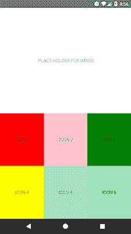

# React Native 中 Flexbox 的布局设计

> 原文：<https://dev.to/skptricks/layout-design-with-flexbox-in-react-native-2b8l>

* * *

## 来源:-[React Native 中 Flexbox 的布局设计](https://www.skptricks.com/2019/02/layout-design-with-flexbox-in-react-native-app.html)

在本教程中，解释了如何在 react 本地应用程序中使用 flexbox 设计布局。React Native 中的布局使用 Flexbox 的子集。(我说“子集”是因为并不是 Flexbox 规范中的所有功能都包括在内。)因此，如果您已经了解 Flexbox，那么您可以在 React Native 中轻松应用这些技能。同样值得注意的是，React Native 中没有浮点或基于百分比的单位。这意味着我们只能使用 Flexbox 和 CSS 定位来进行布局。

React 原生 Flexbox 布局示例:
让我们看看 react 原生应用中最常用的使用 css flexbox 的布局设计示例。在这种布局设计中，我们在屏幕顶部显示文本或图像，在它的正下方，我们在网格布局中显示图标或文本。

