# 学习 Docker -从头开始，第二部分卷

> 原文：<https://dev.to/azure/docker-from-the-beginning---part-ii-5g8n>

在 [Twitter](https://twitter.com/chris_noring) 上关注我，很乐意接受您对主题或改进的建议/Chris

本文是系列文章的一部分:

*   [Docker——从第一部分](https://dev.to/softchris/docker---from-the-beginning-part-i-28c6)开始，我们将介绍为什么使用 Docker 以及容器、图像和 Dockerfile 等基本概念，当然还有管理它们所需的命令。
*   Docker —从头开始，第二部分，**我们在这里**
*   从第三部分开始，这是关于如何处理数据库，将它们放入容器，以及如何让容器通过网络使用传统链接和新标准与其他容器对话
*   [Docker —从第四部分](https://dev.to/softchris/docker-from-the-beginning-partiv-mi6)开始，这就是我们如何使用 Docker Compose 管理多个服务(这是 Docker Compose 的 1/2 部分)
*   [Docker -从第五部分](https://dev.to/softchris/dockerfrom-the-beginning-part-v-n2c)开始，这部分是 Docker Compose 的第二部分，也是最后一部分，我们将讨论卷、环境变量以及如何使用数据库和网络

欢迎来到关于 Docker 的这个系列的第二部分。希望您已经阅读了第一部分，对 Dockers 的核心概念和基本命令有了一些基本的了解，或者您已经从别处获得了这些知识。

在本文中，我们将尝试涵盖以下主题

*   **回顾和问题介绍**，让我们回顾一下从第一部分学到的经验，并尝试描述一下不使用卷是多么痛苦
*   **持久化数据**，我们可以使用卷来持久化我们创建的文件或我们更改的数据库(例如 Sqllite)。
*   **把我们的工作目录变成一个卷**，卷也给了我们一个很好的方式来处理我们的应用程序，而不需要*设置*和*拆除*每次改变的容器。

## 资源

使用 Docker 和容器化就是将一个整体分割成多个微服务。在整个系列中，我们将学习掌握 Docker 及其所有命令。迟早您会想要将您的容器带到生产环境中。这个环境通常是云。当你觉得你已经有了足够的 Docker 经验时，看看这些链接，看看 Docker 是如何在云中使用的:

*   [云中的容器](https://docs.microsoft.com/en-gb/azure/containers/?wt.mc_id=academic-0000-chnoring)这是一个很棒的概述页面，展示了关于云中容器的其他信息
*   [在云中部署您的容器](https://docs.microsoft.com/en-gb/azure/container-instances/container-instances-tutorial-prepare-app?wt.mc_id=academic-0000-chnoring)教程展示了利用您现有的 Docker 技能并让您的服务在云中运行是多么容易
*   [创建容器注册表](https://docs.microsoft.com/en-gb/azure/container-instances/container-instances-tutorial-prepare-acr?wt.mc_id=academic-0000-chnoring)您的 Docker 映像可以在 Docker Hub 中，也可以在云中的容器注册表中。将您的图像存储在某个地方，并能够在几分钟内从该注册表创建一个服务，这不是很棒吗？

## 重述和不使用一卷的问题

好了，我们将继续使用我们在本系列第一部分中创建的应用程序，这是一个安装了 library express 的 Node.js 应用程序。

在本节中，我们将执行以下操作:

*   **运行一个容器**，我们将启动一个容器，从而重复我们在本系列第一部分中学到的一些基本 Docker 命令
*   **更新我们的应用**，更新我们的源代码，启动和停止一个容器，并意识到为什么这种工作方式*相当痛苦*

### 运行容器

随着我们的应用程序的增长，我们可能想要添加路线，或者改变在特定路线上呈现的内容。让我们展示一下我们目前掌握的源代码:

```
// app.js

const express = require('express')

const app = express()

const port = process.env.PORT

app.get('/', (req, res) => res.send('Hello World!'))

app.listen(port, () => console.log(`Example app listening on port ${port}!`)) 
```

Enter fullscreen mode Exit fullscreen mode

现在让我们看看我们是否记得我们的基本命令。让我们输入:

> docker ps

[](https://res.cloudinary.com/practicaldev/image/fetch/s--A5dlf9KJ--/c_limit%2Cf_auto%2Cfl_progressive%2Cq_auto%2Cw_880/https://cdn-images-1.medium.com/max/1024/1%2ADJkCfLKMeApcIwxlHWnmgA.png)

好吧，那看起来是空的。所以我们上次用 docker stop 或 docker kill 清理了一下，不管我们用了什么，我们没有一个可以启动的容器，所以我们需要构建一个。让我们看看我们有哪些图像:

> docker 图像

[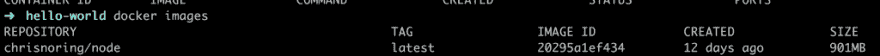](https://res.cloudinary.com/practicaldev/image/fetch/s--j8-T4f8j--/c_limit%2Cf_auto%2Cfl_progressive%2Cq_auto%2Cw_880/https://cdn-images-1.medium.com/max/1024/1%2AI3vpLrl_I_v5y-63oFlOPg.png)

好了，现在我们有了图像，让我们创建并运行一个容器:

> docker run-d-p 8000:3000 Chris noring/node

由于我们指定了-d 标志，这应该导致容器在端口 8000 启动并运行，并且应该以分离模式运行。

[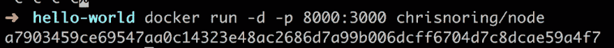](https://res.cloudinary.com/practicaldev/image/fetch/s--46TTdr_y--/c_limit%2Cf_auto%2Cfl_progressive%2Cq_auto%2Cw_880/https://cdn-images-1.medium.com/max/1024/1%2AJXYLtwX_J0vFqgXvqaNyzg.png)

我们在上面找到一个集装箱，很好。让我们看看能否在 [http://localhost:8000:](http://localhost:8000:) 找到我们的应用程序

[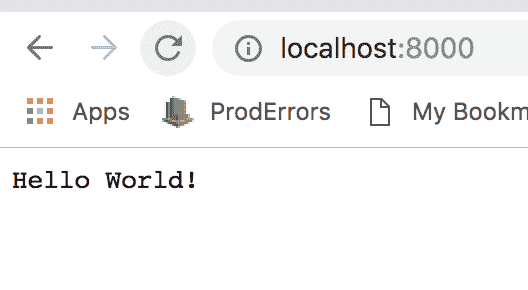](https://res.cloudinary.com/practicaldev/image/fetch/s--mCnxUjnW--/c_limit%2Cf_auto%2Cfl_progressive%2Cq_auto%2Cw_880/https://cdn-images-1.medium.com/max/528/1%2Ae3m0bmN42AEsQcYIurlPGQ.png)

好的，很好。现在我们已经为下一步做好了准备，那就是更新我们的源代码。

### 更新我们的 app

让我们首先改变默认的路线来渲染出 hello Chris，也就是添加下面一行:

```
app.get('/', (req, res) => res.send('Hello Chris!')) 
```

Enter fullscreen mode Exit fullscreen mode

好了，我们保存我们的更改，返回浏览器，我们注意到它仍然在说 Hello World。容器似乎没有反映我们的变化。为此，我们需要关闭容器，删除它，重建映像，然后再次运行容器。因为我们需要执行一大堆命令，所以我们需要改变构建和运行容器的方式，即主动给容器命名，而不是像这样运行容器:

> docker run-d-p 8000:3000 Chris noring/node

我们现在键入:

> docker run-d-p 8000:3000**-name my-container**Chris noring/node

这意味着我们的容器将被命名为 my-container，这也意味着当我们引用我们的容器时，我们现在可以使用它的名称而不是它的容器 ID，这对于我们的场景来说更好，因为容器 ID 在每次安装和拆卸时都会改变。

```
docker stop my-container // this will stop the container, it can still be started if we want to

docker rm my-container // this will remove the container completely

docker build -t chrisnoring/node . // creates an image

docker run -d -p 8000:3000 --name my-container chrisnoring/node 
```

Enter fullscreen mode Exit fullscreen mode

您可以将这些命令链接起来，如下所示:

```
docker stop my-container && docker rm my-container && docker build -t chrisnoring/node . && docker run -d -p 8000:3000 --name my-container chrisnoring/node 
```

Enter fullscreen mode Exit fullscreen mode

我看到它的第一个想法是，哇，这么多命令。一定有更好的方法，对吗，特别是当我处于开发阶段的时候？

[](https://res.cloudinary.com/practicaldev/image/fetch/s--iekdIdJq--/c_limit%2Cf_auto%2Cfl_progressive%2Cq_66%2Cw_880/https://cdn-images-1.medium.com/max/572/1%2ALQxLEO4X3SkeqF1y4dMUZA.gif)

是的，有一个更好的方法，使用体积。接下来让我们看看体积。

## 使用一个卷

卷或数据卷是我们在主机中创建一个位置的一种方式，我们可以在该位置写入文件，以便将它们持久化。我们为什么要那样做？嗯，当我们正在开发时，我们可能需要将应用程序置于某个特定的状态，这样我们就不必从头开始。通常，我们希望在一个卷上存储日志文件、JSON 文件甚至数据库(SQLite)之类的东西。

创建卷非常容易，我们可以用许多不同的方法来完成，但主要有两种方法:

*   在创建容器之前
*   惰性，例如在创建容器时

### 创建和管理卷

要创建卷，请键入以下内容:

> docker 卷创建[卷名]

我们可以通过键入以下命令来验证我们的卷是如何创建的:

> ls 卷坞站

[](https://res.cloudinary.com/practicaldev/image/fetch/s--FvrUqicP--/c_limit%2Cf_auto%2Cfl_progressive%2Cq_auto%2Cw_880/https://cdn-images-1.medium.com/max/1024/1%2ApedNxjX7vxC9_U7fFFzhww.png)

这将列出我们拥有的所有不同的卷。现在，这将在一段时间后导致您创建大量的卷，所以知道如何减少卷的数量是很好的。为此，您可以键入:

> docker 卷清理

这将删除您当前未使用的所有卷。如果您想继续，将会出现一个问题。

[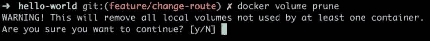](https://res.cloudinary.com/practicaldev/image/fetch/s--jB-LFjYO--/c_limit%2Cf_auto%2Cfl_progressive%2Cq_auto%2Cw_880/https://cdn-images-1.medium.com/max/1024/1%2Al6Jnu2zeWHeWoM5AZNxEhw.png)

如果要删除单个卷，可以键入以下命令:

> docker 卷 RM[卷名]

您最想知道的另一个命令是 inspect 命令，它允许我们查看我们创建的卷的更多细节，并且可能是最重要的，它将把持久化文件放在哪里。

> 码头工人检查[卷名]

对此的一个评论是，大多数时候你可能并不关心 Docker 把这些文件放在哪里，但是有时候出于调试的目的，你会想知道。正如我们将在本节后面看到的，在开发应用程序时，控制文件的保存位置对我们有利。

[](https://res.cloudinary.com/practicaldev/image/fetch/s--nW6UHOuC--/c_limit%2Cf_auto%2Cfl_progressive%2Cq_auto%2Cw_880/https://cdn-images-1.medium.com/max/1024/1%2AxXyRmDbym7BCrbVNHkPR2g.png)

正如您所看到的，Mountpoint 字段告诉我们 Docker 计划在哪里保存您的文件。

### 在应用程序中挂载卷

好了，我们已经到了想要在应用程序中使用我们的卷的地步。我们希望能够在我们的容器中更改或创建文件，这样当我们关闭它并再次启动它时，我们的更改仍然会在那里。

为此，我们可以使用两个不同的命令，以不同的语法实现相对相同的功能，它们是:

*   `-v`，—-volume，语法看起来如下-v[卷名]:[容器中的目录]，例如-v my-volume:/app
*   `--mount`，语法看起来如下——mount source =[卷名]，target =[容器中的目录]，例如——mount source = my-volume，target=/app

与运行容器结合使用，例如:

> docker run-d-p 8000:3000-name my-container-volume my-volume:/logs Chris noring/node

让我们试试这个。首先，让我们运行我们的容器:

[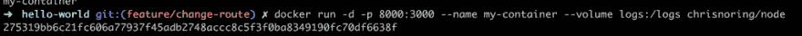](https://res.cloudinary.com/practicaldev/image/fetch/s--9X6ti92U--/c_limit%2Cf_auto%2Cfl_progressive%2Cq_auto%2Cw_880/https://cdn-images-1.medium.com/max/1024/1%2APVaYu78H7_KXw0DoCwGbWQ.png)

然后，让我们运行 inspect 命令，以确保我们的卷已经正确地安装在容器中。当我们运行上述命令时，我们得到一个巨大的 JSON 输出，但我们寻找的是 Mounts 属性:

[](https://res.cloudinary.com/practicaldev/image/fetch/s--jYis8gzu--/c_limit%2Cf_auto%2Cfl_progressive%2Cq_auto%2Cw_880/https://cdn-images-1.medium.com/max/1024/1%2A4Nm9GuJEgal4cgXVBoHtqg.png)

好了，我们的音量到了，很好。下一步是找到我们容器内部的体积。让我们进入我们的容器:

> docker exec -it my-container 狂欢

然后导航到我们的`/logs`目录:

[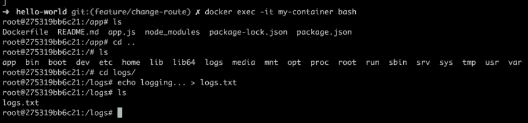](https://res.cloudinary.com/practicaldev/image/fetch/s--gK4-iZ3B--/c_limit%2Cf_auto%2Cfl_progressive%2Cq_auto%2Cw_880/https://cdn-images-1.medium.com/max/1024/1%2AXT8H3-K8FmutSAriJtiKlA.png)

好了，现在如果我们关闭容器，我们在卷中创建的所有内容都应该被持久化，没有放在卷中的所有内容都应该消失，对吗？对，就是这个意思。很好，我们理解体积的原理。

### 挂载子目录作为卷

到目前为止，我们已经创建了一个卷，并让 Docker 决定文件保存在哪里。如果我们决定将这些文件保存在哪里，会发生什么？

如果我们指向硬盘上的一个目录，它不仅会查看该目录并将文件放在那里，还会挑选那里预先存在的文件，并将它们放入容器中的挂载点。让我们做以下事情来证明我的意思:

*   **创建目录**，让我们创建一个目录/日志
*   **创建一个文件**，让我们创建一个文件 logs.txt 并在其中写入一些文本
*   **运行我们的容器**，让我们创建一个本地目录+ /logs 的挂载点

前两个命令导致我们有这样的文件结构:

```
app.js
Dockerfile
/logs
 logs.txt // contains 'logging host...'
package.json
package-lock.json 
```

Enter fullscreen mode Exit fullscreen mode

现在让 run 命令启动并运行我们的容器:

[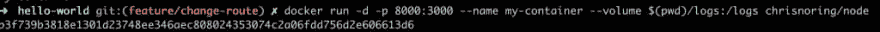](https://res.cloudinary.com/practicaldev/image/fetch/s--r-dHeiFp--/c_limit%2Cf_auto%2Cfl_progressive%2Cq_auto%2Cw_880/https://cdn-images-1.medium.com/max/1024/1%2AiDGnN0fJ7O_Yq1-dJRhGJw.png)

上面我们观察到我们的- volume 命令看起来有点不同。第一个参数是`$(pwd)/logs`，这意味着我们当前的工作目录和子目录`logs`。第二个参数是`/logs`,这意味着我们将主机日志目录挂载到容器中一个同名的目录中。

让我们深入到容器中，确定容器确实从我们的主机日志目录中提取了文件:

[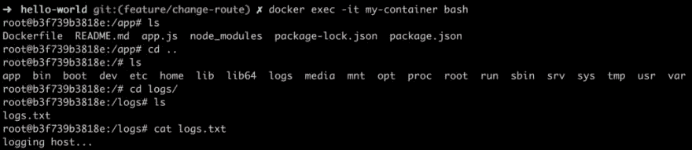](https://res.cloudinary.com/practicaldev/image/fetch/s--eZTbybVM--/c_limit%2Cf_auto%2Cfl_progressive%2Cq_auto%2Cw_880/https://cdn-images-1.medium.com/max/1024/1%2ACAlhLracjsV5TvhjIjX8hw.png)

正如您从上面的命令集中看到的，我们使用`docker exec -it my-container bash`进入容器，然后继续导航到 logs 目录，最后使用命令`cat logs.txt`读取 logs.txt 的内容。结果是记录主机...例如，我们在主机上的确切文件和内容。

但是，这是一个卷，这意味着主机中的卷和容器之间存在连接。接下来，让我们在主机上编辑该文件，看看容器会发生什么变化:

[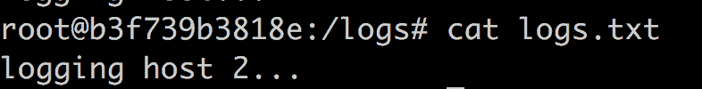](https://res.cloudinary.com/practicaldev/image/fetch/s--oH-bsPeq--/c_limit%2Cf_auto%2Cfl_progressive%2Cq_auto%2Cw_880/https://cdn-images-1.medium.com/max/786/1%2AJn2xuW_RJFq5n4LKDPY9sg.png)

哇，它在容器中也发生了变化，而无需我们拆除或重启它。

### 将我们的应用程序视为一个卷

为了将我们的整个应用程序视为一个卷，我们需要像这样分解容器:

> docker kill my-container & docker RM my-container

为什么我们需要做这些？好吧，我们将要改变 docker 文件和源代码，我们的容器不会得到这些改变，除非我们使用一个卷，就像我下面将要展示给你的。

此后，我们需要重新运行我们的容器，这次使用不同的体积参数，即`--volume $(PWD):/app`。

> 请注意，如果您的 PWD 包含一个带空格的目录，您可能需要将参数指定为`"$(PWD)":/app`，也就是说，我们需要用双引号将`$(PWD)`括起来。感谢 Vitaly 指出这一点:)

完整的命令如下所示:

[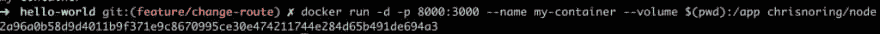](https://res.cloudinary.com/practicaldev/image/fetch/s--aeGjxFM6--/c_limit%2Cf_auto%2Cfl_progressive%2Cq_auto%2Cw_880/https://cdn-images-1.medium.com/max/1024/1%2A37Ee0rxOCvKNr7I2N3zJKA.png)

这将有效地使我们的整个应用程序目录成为一个卷，并且每当我们在那里改变一些东西时，我们的容器应该反映这些改变。

因此，让我们尝试在 Node.js Express 应用程序中添加一条路线，如下所示:

```
app.get("/docker", (req, res) => {

  res.send("hello from docker");

}); 
```

Enter fullscreen mode Exit fullscreen mode

好的，从我们处理 express 库的经验来看，我们应该能够在浏览器中访问到[http://localhost:8000/docker](http://localhost:8000/docker)或者？

[](https://res.cloudinary.com/practicaldev/image/fetch/s--bxJ-smLp--/c_limit%2Cf_auto%2Cfl_progressive%2Cq_auto%2Cw_880/https://cdn-images-1.medium.com/max/674/1%2AXXzp0H1eTDXIuo2QJ1EYjQ.png)

哭丧着脸:(。没用，我们做错了什么？事情是这样的。如果您更改 Node.js Express 应用程序中的源代码，您需要重新启动它。这意味着我们需要后退一步，思考如何在文件发生更改时立即重启 Node.js Express web 服务器。有几种方法可以实现这一点，例如:

*   安装一个像 nodemon 或 forever 这样的库来重启 web 服务器
*   **运行**一个 PKILL 命令，杀死正在运行的 node.js 进程和 run node app.js

仅仅安装一个像 nodemon 这样的库感觉不那么麻烦，所以让我们这样做:

[](https://res.cloudinary.com/practicaldev/image/fetch/s--3jWOFx5w--/c_limit%2Cf_auto%2Cfl_progressive%2Cq_auto%2Cw_880/https://cdn-images-1.medium.com/max/1024/1%2A-BUicUx8zVeSijJnOI3Z-Q.png)

这意味着我们现在在 package.json 中有了另一个库依赖，但这意味着我们需要改变我们启动应用程序的方式。我们需要使用命令`nodemon app.js`来启动我们的应用程序。这意味着一旦有变化，`nodemon`将负责整个重启。现在，让我们向 package.json 添加一个启动脚本，毕竟，这是更像 Node.js 的做法:

[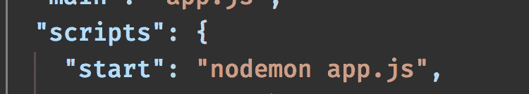](https://res.cloudinary.com/practicaldev/image/fetch/s--W9m3-XiB--/c_limit%2Cf_auto%2Cfl_progressive%2Cq_auto%2Cw_880/https://cdn-images-1.medium.com/max/750/1%2Ao9LH57gAsnkcA2N6osgAEw.png)

如果您是 Node.js 的新手，让我们描述一下我们在上面做了什么。向 package.json 文件添加一个启动脚本意味着我们进入一个名为“scripts”的部分，我们添加一个条目 start，就像这样:

```
// excerpt package.json
"scripts": {
  "start": "nodemon app.js"
} 
```

Enter fullscreen mode Exit fullscreen mode

默认情况下，`"scripts"`中定义的命令是通过输入`npm run [name of command]`来运行的。然而，有已知的*命令，如`start`和`test`，对于已知的命令，我们可以省略关键字`run`，因此我们可以键入`npm start`而不是键入`npm run start`。让我们像这样添加另一个命令`"log"`:* 

```
// excerpt package.json

"scripts": {
  "start": "nodemon app.js",
  "log": "echo \"Logging something to screen\""
} 
```

Enter fullscreen mode Exit fullscreen mode

要运行这个新命令`"log"`，我们需要输入`npm run log`。

好了，还有一件事，那就是改变 docker 文件来改变它启动我们的应用程序的方式。我们只需要将最后一行从:

```
ENTRYPOINT ["node", "app.js"] 
```

Enter fullscreen mode Exit fullscreen mode

至

```
ENTRYPOINT ["npm", "start"] 
```

Enter fullscreen mode Exit fullscreen mode

因为我们更改了 Dockerfile 文件，这导致我们必须重建映像。让我们开始吧:

> docker 构建-t chrisnoring/node。

好了，下一步是打开我们的容器:

> docker run-d-p 8000:3000-name my-container-volume $(PWD):/app Chris noring/node

值得注意的是，我们如何公开我们当前所在的整个目录，并将其映射到容器内的`/app`。

因为我们已经添加了/docker 路由，所以我们需要添加一个新路由，如下所示:

```
app.get('/nodemon', (req, res) => res.send('hello from nodemon')) 
```

Enter fullscreen mode Exit fullscreen mode

现在我们希望当我们在 app.js 中保存我们的更改时,`nodemon`已经完成了它的一部分:

[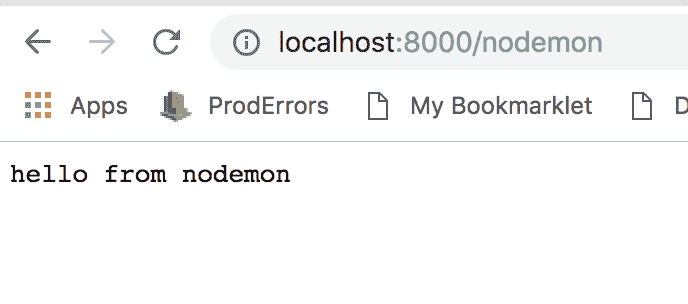](https://res.cloudinary.com/practicaldev/image/fetch/s--oPFy4at5--/c_limit%2Cf_auto%2Cfl_progressive%2Cq_auto%2Cw_880/https://cdn-images-1.medium.com/max/688/1%2A65hjrpy7SNfF5_ENUZTXbA.png)

我们有了赢家。它可以路由到/nodemon。我不知道你是怎么想的，但我第一次用它的时候，这就是我:

[](https://res.cloudinary.com/practicaldev/image/fetch/s--BzxL4aXH--/c_limit%2Cf_auto%2Cfl_progressive%2Cq_66%2Cw_880/https://cdn-images-1.medium.com/max/220/1%2APyeUlERT6b8VmSF1V0iv5Q.gif)

## 总结

这就把我们带到了文章的结尾。我们已经了解了卷，这是一个非常酷和有用的特性，更重要的是，我已经展示了如何将您的整个开发环境转换为一个卷，并在无需重启容器的情况下继续处理您的源代码。

在本系列的第三部分，我们将讨论如何使用链接容器和数据库。敬请关注。

在 [Twitter](https://twitter.com/chris_noring) 上关注我，很乐意接受您对主题或改进的建议/Chris

* * *