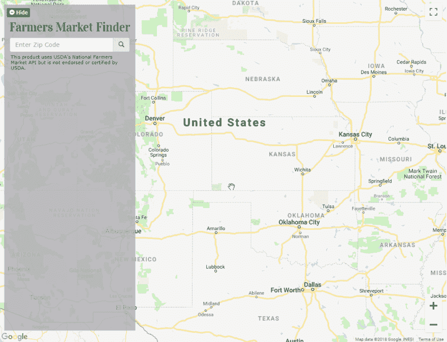

# 在 GitHub 自述文件中用动画 GIF 演示您的应用程序

> 原文：<https://dev.to/kelli/demo-your-app-in-your-github-readme-with-an-animated-gif-2o3c>

我的简历上有我的 GitHub 链接，如果幸运的话，潜在雇主可能会在 GitHub 上查看我的应用程序。然而，我知道他们很忙，没有太多时间，所以我想让他们和其他人访问我的 repo 更容易，并在你去存储库时显示的`README.md`文件中显示应用程序的运行情况。

在 GitHub 自述文件中嵌入视频是梦想成真，但我发现这是不可能的——你必须链接到视频。不过，你可以在自述文件中放一个动画 GIF，这就是我在很多项目中所做的。

这是我的[农贸市场搜索应用](https://github.com/kellim/farmers-market-finder)的一个例子:

不幸的是，动画 gif 通常不能像视频一样长，但你可以使用它们来快速展示你的应用程序的一些核心功能。

## 如何制作动画 GIF？

这里有几个应用程序可以用来制作动画 GIF 屏幕录像。

### 窗口

我喜欢用 [ScreenToGif](https://www.screentogif.com/) 这是一款免费的开源应用，适用于 Windows 7 或更高版本。该软件使用起来很直观，只需在你的屏幕上选择一个区域创建一个动画 GIF，并且他们还有一个[用户指南](https://github.com/NickeManarin/ScreenToGif/wiki/help)。

### Mac

当我在 Mac 上创建我的屏幕的动画 gif 时，我使用 Gifox。它位于我的菜单栏中，易于使用。我使用付费版本，因为用免费版本创建的 gif 限于 10 秒，并且有水印。

### 其他

我知道我遗漏了其他操作系统和设备的选项，但我只想推荐我自己试过的那些。如果您能推荐其他用于拍摄动画 GIF 屏幕录制的应用程序，请在下面发表评论。

## 将动画 GIF 添加到您的自述文件

一旦你创建了动画 GIF，你就可以把它像普通图片一样嵌入到你的`README.md`文件中。

我通常会在我的自述文件中，在应用程序的描述下创建一个“演示”标题，并在演示标题下放置动画 GIF 以及该网站在线演示的链接。

如果你没有存放图片的好地方，你可以像我一样，在你的 GitHub 存储库中创建一个`demo`(或者更好的名字)文件夹，上传 GIF 文件，然后在 README 中链接到它。

**举例:**

``

注意:方括号中是 alt 文本，括号中是 GIF 的 URL。如果图像在您的 GitHub 存储库中，您可以像我在示例中那样使用相对链接。

感谢阅读我的第一篇帖子！