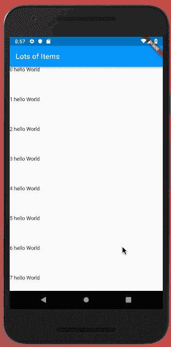

# 使用 Flutter 按需构建小部件

> 原文：<https://dev.to/fallenstedt/building-widgets-on-demand-with-flutter-48dd>

[](https://res.cloudinary.com/practicaldev/image/fetch/s--uy921x5J--/c_limit%2Cf_auto%2Cfl_progressive%2Cq_auto%2Cw_880/https://thepracticaldev.s3.amazonaws.com/i/1v01weepczjqzeh0cdrf.jpg)

构建应用程序时，有多种方法可以显示大量项目。假设您必须显示用户可以滚动浏览的无限数量的列表项。天真地说，你可以获取数千个列表项并全部构建。这是可行的，但是，你很可能会让用户对疯狂的加载时间感到沮丧。

那么，我们如何按需构建列表项或小部件呢？使用`ListView`和`FutureBuilder`我们可以做到这一点。我将开始创建一个新的 Flutter 应用程序，删除`main.dart`中的所有内容，并替换为下面的内容:

```
// main.dart
import 'package:flutter/material.dart';
import 'src/app.dart';

void main() {
  runApp(App());
} 
```

Enter fullscreen mode Exit fullscreen mode

我们的应用程序是一个基本的 MaterialApp，它包含一个`OnDemandList`小部件。这将是我们“无限”物品清单的家。

```
// app.dart
import 'package:flutter/material.dart';
import './screens/big_list.dart';

class App extends StatelessWidget {
  @override
  Widget build(BuildContext context) {
    return child: MaterialApp(
        title: 'OnDemandList',
        home: BigList(),
      );
  }
} 
```

Enter fullscreen mode Exit fullscreen mode

在我们考虑延迟加载项目之前...让我们首先关注在我们的应用程序中放置大量的项目。在这里，我们使用 [ListView.builder()](https://docs.flutter.io/flutter/widgets/ListView/ListView.builder.html) 来创建一个可滚动的线性小部件阵列，这些小部件是按需创建的。有趣的是，即使我们已经指定了`1000`项，它也只会构建屏幕上可见的项的数量。

它是如何做到这一点的，是通过获取列表中的第一项并测量其高度。在这个例子中，项目的高度是`80`。Flutter 可以测量屏幕的高度，并建立所需的项目数量。

```
// big_list.dart';
import 'package:flutter/material.dart';
import 'dart:async';

class BigList extends StatelessWidget {
  @override
  Widget build(BuildContext context) {
    return Scaffold(
        appBar: AppBar(
          title: Text('Lots of Items'),
        ),
        body: buildList(),
    );
  }

  Widget buildList() {
    return ListView.builder(
      itemCount: 1000,
      itemBuilder: (BuildContext context, int index) {
        return Container(
          height: 80,
          child: Text("$index hello World"),
        );
      },
    );
  }
} 
```

Enter fullscreen mode Exit fullscreen mode

[](https://res.cloudinary.com/practicaldev/image/fetch/s--kn14vyDI--/c_limit%2Cf_auto%2Cfl_progressive%2Cq_66%2Cw_880/https://thepracticaldev.s3.amazonaws.com/i/65bjygtl3kho2nzrkeox.gif)

每次我们滚动时，Flutter 都在构建出现在我们视图中的列表项。这就是我们的目标，但是，假设每个列表项需要发出一个异步请求来获取数据。我们可以使用 [FutureBuilder](https://docs.flutter.io/flutter/widgets/FutureBuilder-class.html) 。Flutter 本质上是异步的，Futures 允许我们处理数据，而不用担心线程或阻塞我们的应用程序。FutureBuilders 允许您在加载数据时轻松显示不同的状态，并在完成时显示指定的小部件。这里有一个非常简单的例子，没有检查错误或连接状态:

```
// big_list.dart';

import 'package:flutter/material.dart';
import 'dart:async';

class BigList extends StatelessWidget {
  @override
  Widget build(BuildContext context) {
    return Scaffold(
        appBar: AppBar(
          title: Text('Lots of Items'),
        ),
        body: buildList(),
    );
  }

  Widget buildList() {
    return ListView.builder(
      itemCount: 1000,
      itemBuilder: (BuildContext context, int index) {
        return FutureBuilder(
          future: getFuture(), // <--- get a future
          builder: (BuildContext context, snapshot) { // <--- build the things.
            return Container(
              height: 80.0,
              child: snapshot.hasData ? snapshot.data : Text('loading..'),
            );
          },
        );
      },
    );
  }

 Future<Widget> getFuture() {
    return Future.delayed(Duration(seconds: 2), () => Text('Hello World!'));
  }
} 
```

Enter fullscreen mode Exit fullscreen mode

[](https://res.cloudinary.com/practicaldev/image/fetch/s--zFRKSrYn--/c_limit%2Cf_auto%2Cfl_progressive%2Cq_66%2Cw_880/https://thepracticaldev.s3.amazonaws.com/i/ujxp4sci5iulopm3cub8.gif)

注意我们如何看到`loading...`2 秒钟，然后是一个新的文本小部件“Hello World！”出现了。这正是我们所需要的，一个部件的惰性加载列表。有了这个基础，您现在就拥有了构建按需构建小部件的高性能应用程序的知识。

玩得开心！