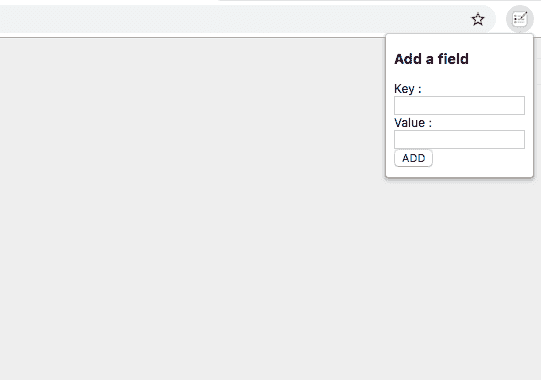
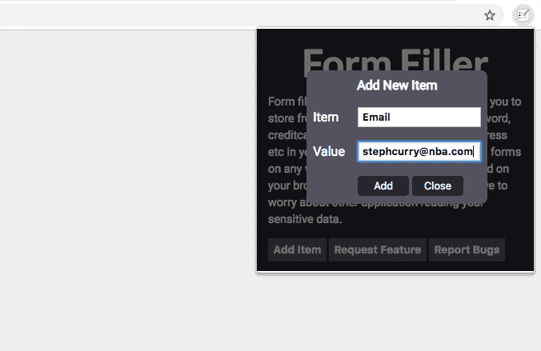
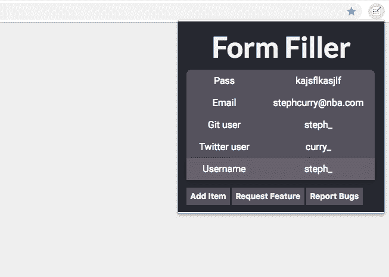
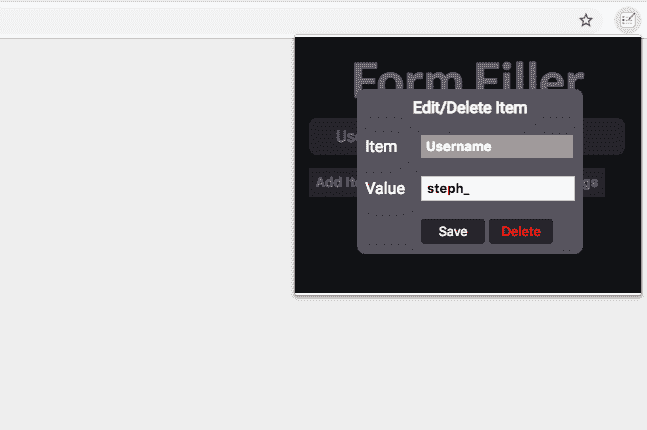
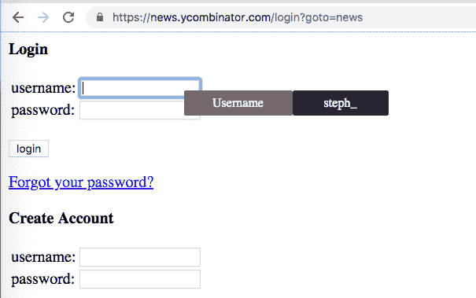

# 表单填充——一个 chrome 扩展，可以在互联网上轻松填充表单

> 原文：<https://dev.to/sunilc_/form-fillera-chrome-extension-to-fill-forms-easily-on-the-internet-1bl2>

今天我将发布下一个版本的[表单填充器](https://chrome.google.com/webstore/detail/form-filler/odibmmnbfaokihmgfmacnjffkjliidai?hl=en-US&authuser=1)。一个 chrome 扩展，可以帮助你在浏览器中存储经常使用的数据，如电子邮件、密码、信用卡号、CVV、Github 用户名、Twitter 用户名等，并在任何网页上访问这些数据，只需右键单击并从可用项目列表中选择即可填写输入字段。

早在 2015 年，当我注册不同的网站或在线填写表格时，我不得不再次输入相同的数据，这让我感到沮丧。所以我想到了将信息存储一次并在任何网页上访问它的想法。我在 2015 年开发了扩展的第一个版本，如下所示:

虽然扩展做了它应该做的事情，但是用户界面有点糟糕。我猜因为这个原因，在过去的 4 年里，这个扩展的每周活跃用户数从未超过 30。

几个星期前，因为我没有任何兼职项目要做，我决定改进扩展并添加更多功能，如编辑项目、加密数据、修复 bug 等。今天我发布了下一个版本的扩展，每月收费 2.99 美元。

#### 特性:

1.  添加新的键值项目，稍后可以通过右键单击任何网页上的任何输入字段来访问这些项目。数据将被加密并存储在你的 chrome 本地存储器中。因此，您不必担心其他应用程序会访问您的数据。
     
    

2.  您可以单击一个现有的键值项目，然后编辑该值或删除该项目。
    [T3】](https://res.cloudinary.com/practicaldev/image/fetch/s--rEsNK-D8--/c_limit%2Cf_auto%2Cfl_progressive%2Cq_auto%2Cw_880/https://thepracticaldev.s3.amazonaws.com/i/na8u9hry4ai77jf50z29.png)

3.  您可以右键单击任何网页上的任何输入字段来访问可用项目列表。然后你可以选择一个你想填充的输入字段。
    [T3】](https://res.cloudinary.com/practicaldev/image/fetch/s--Ky9-0dSw--/c_limit%2Cf_auto%2Cfl_progressive%2Cq_auto%2Cw_880/https://thepracticaldev.s3.amazonaws.com/i/34jqui2lla33mj56bvoc.png)

#### 和 Dashlane 有什么不同？

Dashlane 主要用于将您的所有密码安全地存储在一个地方，并自动填写登录信息。而 Form Filler 帮助您存储任何键值对，并访问它来填写互联网上的任何表单。

#### 它对互联网上的所有网页都有效吗？

嗯，它在大多数网站上都有效。它目前在一些 iframes 中有输入字段的网站上不工作。由于安全原因，不允许从不同的源读取内容。我还没找到解决这个问题的方法。一旦我这样做了，我会更新扩展，你应该可以在其他网站上使用这个扩展！

有请求新特性和报告错误的选项。目前，我正在通过谷歌表单收集这些信息，这些信息将在未来转移到更有组织的工具中。由于客户满意度是我们业务的核心，我将积极满足这些要求。

由于谷歌许可 API 中的一个问题，我不能为这个扩展提供免费的测试。购买分机前，如有任何问题或疑虑，您可以联系我(【sunilkumarc682@gmail.com】T2)。

如有任何反馈或建议，请在下方留言:)