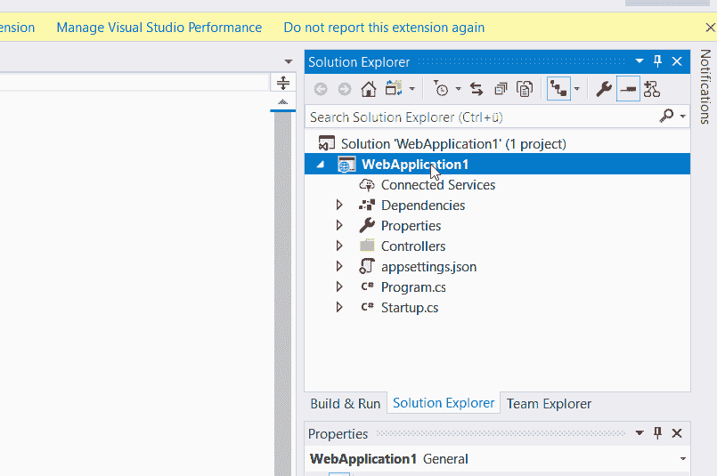

# 正确部署！使用工具自动化集成和交付

> 原文：<https://dev.to/christophweigert/deploy-it-right-use-tools-to-automate-integration-and-delivery-1o17>

您在解决方案中右键单击并点击部署的频率是多少？您的同事多久问您一次他们在部署时必须做什么？自动化吧！就这么简单。有许多错误的“出版”方式:

*   复制并粘贴您的发布文件夹
*   通过邮件/FTP 提供文件
*   每个人都遵循自己的释放过程
*   右键单击>发布

以上所有步骤在新项目的初始阶段都是正确的。类似于第一和第二部署。但是当看到它在生产中或者你有许多开发人员在同一个项目上工作时，你应该立即停止这种行为！你可能会想，我到底为什么要这么做？以下是一些很好的理由:

*   你确定，你用的是最新的源代码吗？
*   所有测试都成功了吗？那些在您的机器上通过但在生产中没有通过的特定测试呢？
*   您的上一次合并是否成功，所有提交是否都已解决？
*   您是否遵循了规定的发布流程？

## 目标是可预测性

拥有相同的、标准化的发布和部署方式不是很好吗？不再需要像应用程序设置或连接字符串这样容易出错的环境配置。手动数据库设置、缺少库等等。如果您发现了一个关键缺陷，您甚至可以回滚到以前的版本。

## 节省时间和金钱

但是投资回报率是多少呢？让我们做一个快速的数学运算。如果每个版本花费您 15 分钟，每个租户的每个部署又花费 10 分钟。另一方面，你需要 8 个小时来建立你的持续集成和持续交付管道。在你恢复之前释放了多少次？

至少，如果你有一个测试目标，你会很快恢复时间。想想完成所有需要的步骤(合并、编译、运行测试、部署到问答>测试>生产)需要多长时间。

可以用右键发布去生产吗？当然，你可以，但你不应该。

## 今天开始

我将在接下来的几周内讨论 CI/CD。但是这里有一些基本的联系:

*   团队精神:建立一个基本的、自动化的构建和发布过程是很棒的
*   Azure Pipelines:team city 的替代方案
*   [AppCenter](https://AppCenter.ms) :轻松构建和部署移动应用！
*   Jenkins :用于构建和部署的开源自动化服务器
*   [Octopus Deploy](https://octopus.com/) :发送你的发布到 Q & A，staging，和 production。计划和自动化！