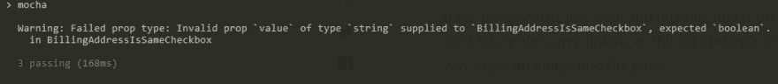
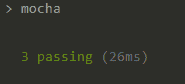
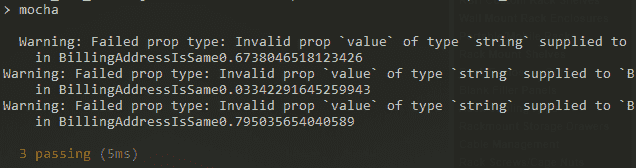

# 使用显示名称调试属性类型警告

> 原文：<https://dev.to/aaw5017/using-display-name-to-debug-prop-type-warnings-58mh>

对于我的 React 测试环境，我使用摩卡、酵素和 Sinon。当我运行我的 npm `test`脚本时，Mocha 运行并进入“观察”模式。

最近，我注意到一个奇怪且有点烦人的问题，我的*初始*测试运行会显示 prop 类型警告，但通过监视文件更改*的后续运行不会显示*。

**注意:**我在我的 mocha.opts 文件中使用了`min` reporter。此外，下面显示的组件名称与我的代码库相关，但是我们可以采用任何通用名称，例如`MyComponent`。

下面是测试输出的一个示例:

##### 初始试运行

[](https://res.cloudinary.com/practicaldev/image/fetch/s--cd-fSv3o--/c_limit%2Cf_auto%2Cfl_progressive%2Cq_auto%2Cw_880/https://thepracticaldev.s3.amazonaws.com/i/xngt4yo9iir05pkljaym.PNG)

##### 后续测试运行(通过被监视的文件)

[](https://res.cloudinary.com/practicaldev/image/fetch/s--EETJ6i-Z--/c_limit%2Cf_auto%2Cfl_progressive%2Cq_auto%2Cw_880/https://thepracticaldev.s3.amazonaws.com/i/oy460u5d0wi0g84ztgnh.PNG)

在上面的第二个截图中(通过监视文件更改进行的测试)，我没有修复有问题的组件中的 prop 类型代码，但是我的 prop 类型警告消失了。为什么会这样？事实证明，这是 React 代码库中的设计。它们只在渲染“新”组件时警告道具。同一组件的后续渲染*将*而不是*显示警告，以避免垃圾控制台或标准输出。*

那么我们如何解决这个问题呢？事实上，答案相当简单。我们可以利用组件上的`displayName`属性，并在任何给定套件的`beforeEach`钩子中更新它。

```
describe('My suite', () => {
    beforeEach(() => {
        MyComponent.displayName = `MyComponent${Math.random().toString()}`;
    });

    // Test code down here...
}); 
```

现在，当我们的测试运行时，React 将组件解释为“新的”，因为它的`displayName`正在改变。每次试运行，你都会在*上看到警告，而不仅仅是第一次。以下是输出示例(从右侧截取):*

[](https://res.cloudinary.com/practicaldev/image/fetch/s--Fi9qJ4oh--/c_limit%2Cf_auto%2Cfl_progressive%2Cq_auto%2Cw_880/https://thepracticaldev.s3.amazonaws.com/i/uxm60caurrv0pl3ik6l8.PNG)

一旦修复了警告，一定要从测试中删除`displayName`代码！

希望这有助于您快速、轻松地修复 Mocha 测试中的任何随机 PropTypes 警告！

## 参考文献

[Github 问题](https://github.com/facebook/react/issues/7047 "Github Issue Link")