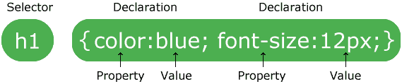
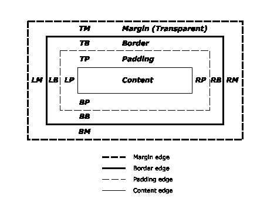

# 我建立了自己的 CSS 课程来掌握它

> 原文：<https://dev.to/islamuad/i-built-my-own-css-curriculum-to-master-it-2ec2>

# CSS 大师班课程

或者如何利用可用的免费内容掌握 CSS。

葆拉·梅在 [Unsplash](https://unsplash.com/) 上的照片

CSS 是一个非常庞大的主题，初看起来似乎很容易，但当你想掌握它时，它会成为一个头痛的问题，不是因为缺乏教程，而是因为缺乏掌握它的途径或完整的课程，在这里我将向你展示如何通过遵循包含非常全面的互联网资源的课程来掌握 CSS，而且肯定是免费的。

* * *

## 什么是 CSS？

级联样式表(CSS)是一种样式表语言，用于描述以 HTML 等标记语言编写的文档的表示。CSS 是万维网的基石技术，与 HTML 和 JavaScript 齐名。CSS 旨在实现表示和内容的分离，包括布局、颜色和字体。这种分离可以提高内容的可访问性，在表示特征的规范方面提供更多的灵活性和控制，通过在单独的。并减少结构内容中的复杂性和重复。(来源:维基百科)

* * *

## 这种课程是如何运作的？

在每个部分中，您都可以找到📖内容和📚资源，在目录中，我会向您展示本节包含哪些主题，然后在资源部分，我会列出一些涵盖该主题的最大、最全面的(文章、视频或课程)资源。但是在开始之前，你需要学习 HTML 的基础知识，然后按照课程掌握 CSS。

* * *

## HTML & CSS 基础知识

*   html & css 很难 -一个适合完全初学者的友好的 web 开发教程。
*   [HTML | Scrimba 简介](https://scrimba.com/g/ghtml)
*   [CSS | Scrimba 简介](https://scrimba.com/g/gintrotocss)
*   绝对初学者的 HTML 速成班。
*   绝对初学者 CSS 速成班 -由 Youtube 上的 Traversy Media 提供。

* * *

## 📆课程

CSS 可以分为四个主要类别:

1.  **语法:**包括选择器、属性、值和特异性。
2.  **视觉:**包括样式内容、响应性网页设计和动画。
3.  **布局:**包括盒子模型，布局。
4.  **管理:**包括 CSS 预处理程序、方法和框架。

*   [CSS 选择器](#css-selectors)
*   [CSS 属性](#css-properties)
*   [CSS 值](#css-values)
*   [CSS 特异性](#css-specificity)
*   [CSS 盒子模型](#css-box-model)
*   [造型内容](#styling-content)
*   [CSS 布局](#css-layout)
*   [响应式网页设计](#responsive-web-design)
*   [CSS 动画和绘图](#css-animations-and-drawing)
*   [CSS 预处理程序](#css-preprocessors)
*   [CSS 方法学](#css-methodologies)
*   [CSS 框架](#css-frameworks)

### **语法**

照片来自 w3schools

CSS 规则集由选择器和声明块组成:

选择器指向您想要设置样式的 HTML 元素。
声明块包含一个或多个用分号分隔的声明。
每个声明包括一个 CSS 属性名和值，用冒号分隔。
CSS 声明总是以分号结束，声明块用花括号括起来。(来源:w3schools)

### **CSS 选择器**

在 CSS 中，选择器用于定位网页上我们想要样式化的 HTML 元素。

#### 📖内容

*   **简单选择器:**

    *   元素
    *   班级
    *   身份
    *   通用选择器(*，ns|* ， *|* ，|*)
*   **组合子&多重选择器:**

    *   选择器组[A，B]。
    *   后代选择器。
    *   子选择器[A > B]。
    *   相邻兄弟选择器[A + B]。
    *   通用兄弟选择器[A ~ B]。
*   **属性选择器**

*   **伪类选择器**

*   **伪元素选择器**

#### 📚资源

*   📜 [CSS 选择器| MDN web 文档](https://developer.mozilla.org/en-US/docs/Learn/CSS/Introduction_to_CSS/Selectors)
*   📜[简单选择器| MDN 网络文档](https://developer.mozilla.org/en-US/docs/Learn/CSS/Introduction_to_CSS/Simple_selectors)
*   📜[组合子&多重选择器| MDN 网络文档](https://developer.mozilla.org/en-US/docs/Learn/CSS/Introduction_to_CSS/Combinators_and_multiple_selectors)
*   📜[属性选择器| MDN web 文档](https://developer.mozilla.org/en-US/docs/Learn/CSS/Introduction_to_CSS/Attribute_selectors)
*   📜[伪类和伪元素选择器| MDN web 文档](https://developer.mozilla.org/en-US/docs/Learn/CSS/Introduction_to_CSS/Pseudo-classes_and_pseudo-elements)

### **CSS 属性**

注意:当你进入适当的部分时，你会学到更多关于属性的知识，但是你可以学到一些通用的概念，比如 CSS 变量。

#### 📖内容

*   **CSS 变量**

#### 📚资源

*   📀[学习 CSS 变量课程| Scrimba](https://scrimba.com/g/gcssvariables)
*   📜 [CSS 自定义属性指南| CSS 技巧](https://css-tricks.com/guides/css-custom-properties/)
*   📜[关于 CSS 变量你需要知道的一切| Freecodecamp](https://medium.freecodecamp.org/everything-you-need-to-know-about-css-variables-c74d922ea855)

### **CSS 值**

CSS 值是根据 CSS 属性设置的，并驻留在 CSS 声明块中，它是 CSS 规则/语句的一部分。
**注意:**当你进入适当的部分时，你会学到更多关于每种值类型的知识，但是你可以学到一些普通的值，比如 rem、colors、calc...等等。

#### 📖内容

*   CSS 中有 4 种类型的值

    *   颜色。
    *   长度、尺寸和数量。
    *   预定义的选项。
    *   功能。
*   CSS 值的处理方式。

    *   [初始值| MDN web 文档](https://developer.mozilla.org/en-US/docs/Web/CSS/initial_value)
    *   [解析值| MDN web 文档](https://developer.mozilla.org/en-US/docs/Web/CSS/resolved_value)
    *   [指定值| MDN web 文档](https://developer.mozilla.org/en-US/docs/Web/CSS/specified_value)
    *   [计算值| MDN web 文档](https://developer.mozilla.org/en-US/docs/Web/CSS/computed_value)
    *   [已用值| MDN web 文档](https://developer.mozilla.org/en-US/docs/Web/CSS/used_value)
    *   [实际值| MDN web 文档](https://developer.mozilla.org/en-US/docs/Web/CSS/actual_value)

#### 📚资源

*   📜 [Color | MDN web docs](https://developer.mozilla.org/en-US/docs/Web/CSS/color_value)
*   📜[书呆子的网络色彩指南| CSS 技巧](https://css-tricks.com/nerds-guide-color-web/)
*   📜 [CSS 渐变指南| CSS 技巧](https://css-tricks.com/guides/css-gradients/)
*   📜[Calc()| CSS 技巧的几个用例](https://css-tricks.com/a-couple-of-use-cases-for-calc/)

### **CSS 特异性**

在工作中的某个时候，您会发现自己处于这样一种情况:多个 CSS 规则都有匹配相同元素的选择器。在这种情况下，哪一个 CSS 规则“胜出”,并最终应用于元素？这是由一种称为级联的机制控制的，当你开始钻研更高级的概念时，要掌握的最重要的概念之一是特异性，特异性基本上是衡量选择器具体程度的指标。(资料来源:MDN)

#### 📖内容

*   **特异性层次:**
    *   内嵌样式。
    *   身份证。
    *   类、属性和伪类。
    *   元素和伪元素。

#### 📚资源

*   📜[CSS 中的“C”:层叠| CSS 技巧](https://css-tricks.com/the-c-in-css-the-cascade/)
*   📜[层叠和继承](https://developer.mozilla.org/en-US/docs/Learn/CSS/Introduction_to_CSS/Cascade_and_inheritance)
*   📹CSS 基础(第二部分)——层叠——由 Youtube 上的 DevTips 提供。
*   📹CSS 基础(第六部分)——特异性——由 Youtube 上的 DevTips 提供。
*   📜[继承](https://developer.mozilla.org/en-US/docs/Web/CSS/inheritance)

### **CSS 盒子模型**

照片摄于 w3.org

CSS box 模型是 Web 上布局的基础，每个元素都表示为一个矩形框，框的内容、填充、边框和边距都是围绕着另一个构建的，就像洋葱的层一样。当浏览器呈现网页布局时，它会计算出每个框的内容应用了什么样式，周围的洋葱状层有多大，以及框之间的位置关系。在了解如何创建 CSS 布局之前，您需要了解盒子模型。(资料来源:MDN)

#### 📖内容

*   **内容**(图片、文字等)。
*   **填充**(框内内容周围的透明区域)。
*   **边框**(环绕填充和内容)。
*   **填充区域**(包含边框、填充、内容以及背景和背景图像填充的区域)。
*   **边距**(元素周围的空间，在任何定义的边界之外)。
*   **盒子尺寸:**
    *   内容框:宽度和高度仅适用于元素的内容。
    *   border-box:在元素的总宽度和高度中包含填充和边框。
*   **背景:**
    *   背景色。
    *   背景图片。
    *   背景尺寸。
    *   背景-职位。
    *   背景-重复。
    *   背景-附件。
    *   背景-起源。
    *   背景剪辑。
    *   背景混合模式。
    *   多张背景图片。
    *   线性渐变。
    *   径向渐变。
*   **剪辑路径**

#### 📚资源

*   📜[盒子模型| MDN 网络文档](https://developer.mozilla.org/en-US/docs/Learn/CSS/Introduction_to_CSS/Box_model)

### **造型内容**

在你学会了盒子模型之后，学习造型内容*(盒子模型的一部分)*是要掌握的大核心概念。在这一节中，您将学习如何设计图像、文本、列表、链接等内容的样式...等等。

#### 📖内容

*   排版。
*   列表。
*   链接。
*   媒体(图像、视频和音频)。
*   桌子。
*   表格。
*   纽扣。

#### 📚资源

*   📜[表格元素的完整指南| CSS 技巧](https://css-tricks.com/complete-guide-table-element/)
*   📜[样式链接| MDN 网络文档](https://developer.mozilla.org/en-US/docs/Learn/CSS/Styling_text/Styling_links)

### **CSS 布局**

一旦您有能力将 HTML 元素作为样式目标，布局就是下一个需要掌握的核心概念。布局包括操作元素如何在页面上布局，它们占用多少空间？它们是并排的还是叠在一起的？...等等。

#### 📖内容

*   **正常流量**
*   **显示属性:**
    *   阻止。
    *   内嵌。
    *   内嵌块。
    *   Flexbox，你好。
    *   网格。
    *   桌子。
*   **浮动**
*   **定位**
    *   默认值(未指定属性或静态属性)。
    *   相对的。
    *   绝对的。
    *   修好了。
    *   黏糊糊的。
    *   堆叠内容(Z 索引属性)。
*   **多栏布局**

#### 📚资源

*   📜[学习 CSS 布局](http://learnlayout.com/)
*   📹[使用 flexbox 和 CSS 网格的建筑布局](https://www.youtube.com/watch?v=2GxAElWKaAo)
*   📜[CSS 居中:完整指南| CSS 技巧](https://css-tricks.com/centering-css-complete-guide/)

*   flex box(flex box)的缩写形式

    *   📀 [CSS flexbox 课程](https://flexbox.io/) -由韦斯伯公司提供
    *   📜 [Flexbox 完整指南| CSS 技巧](https://css-tricks.com/snippets/css/a-guide-to-flexbox/)
    *   📜【Flexbox 完整图解教程| Freecodecamp
    *   📜[Flexbox | Freecodecamp 的终极指南](https://medium.freecodecamp.org/the-ultimate-guide-to-flexbox-learning-through-examples-8c90248d4676)
    *   📜[了解 Flexbox:你需要知道的一切| Freecodecamp](https://medium.freecodecamp.org/understanding-flexbox-everything-you-need-to-know-b4013d4dc9af)
*   格子

    *   📀 [CSS 网格课程](https://cssgrid.io/) -由韦斯伯公司提供
    *   📜 [CSS 网格完整指南| CSS 窍门](https://css-tricks.com/snippets/css/complete-guide-grid/)
    *   📜 [CSS Grid —初学者指南| Freecodecamp](https://medium.freecodecamp.org/css-grid-the-beginners-guide-45998e6f6b8)
    *   📜[如何用 CSS Grid | Freecodecamp 创建图片库](https://medium.freecodecamp.org/how-to-create-an-image-gallery-with-css-grid-e0f0fd666a5c)
*   漂浮物

    *   📜[关于浮动的一切| CSS 技巧](https://css-tricks.com/all-about-floats/)
    *   📹由 Youtube 上的 DevTips 解释的 CSS 浮动。
    *   📹CSS 浮动和清除由 Youtube 上的 DevTips 解释。
*   配置

    *   📹CSS 定位-第一部分 -由 Youtube 上的 DevTips 提供。
    *   📹CSS 定位-第二部分 -由 Youtube 上的 DevTips 提供。
*   多列布局

    *   📜[何时如何使用 CSS 多栏布局|粉碎杂志](https://www.smashingmagazine.com/2019/01/css-multiple-column-layout-multicol/)

### **响应式网页设计**

响应式网页设计是关于使用 HTML 和 CSS 来自动调整大小，隐藏，缩小或放大网站，使其在所有设备上看起来都很好，包括台式机，平板电脑和手机。(来源:w3schools)

#### 📖内容

*   **媒体查询**
*   **响应图像**
*   **常见响应模式**
    *   大部分是液体。
    *   列下降。
    *   布局转换器。
    *   离开画布。
*   **响应式布局方法:**
    *   移动优先。
    *   桌面优先。

#### 📚资源

*   📀[响应式网页设计基础](https://udacity.com/course/responsive-web-design-fundamentals--ud893)
*   📀[响应图像](https://udacity.com/course/responsive-images--ud882)

### **CSS 动画和绘图**

CSS 动画通过允许您指定元素如何从一种样式变化到另一种样式，来操纵元素在一段时间后的外观。

#### 📖内容

*   **CSS 动画-转换:**

    *   转换 translate()。
    *   变换旋转()和变换原点。
    *   变换比例()。
    *   转换倾斜()。
    *   转换速记。
*   **CSS 动画-转场:**

    *   过渡持续时间。
    *   过渡属性。
    *   转换定时功能。
    *   过渡延迟。
    *   过渡速记。
*   **CSS 动画-关键帧:**

    *   CSS 动画关键帧。
    *   CSS 动画持续时间。
    *   CSS 动画填充模式。
    *   CSS 动画迭代计数。
    *   CSS 动画延迟。
    *   CSS 动画方向。
    *   CSS 动画计时功能。
    *   CSS 动画属性。
    *   CSS 动画速记。
*   **CSS 形状:**

    *   CSS 形状:inset()函数。
    *   CSS 形状:circle()函数。
    *   CSS 形状:ellipse()函数。
    *   CSS 形状:polygon()函数。
    *   CSS 形状:来自 Alpha 通道的形状。
    *   CSS 形状:参考框中的形状。

#### 📚资源

*   📜[网页动画介绍|免费代码营](https://medium.freecodecamp.org/an-introduction-to-web-animations-86f45de2a871)
*   📜[一个简单的 CSS 动画教程| Freecodecamp](https://medium.freecodecamp.org/a-simple-css-animation-tutorial-8a35aa8e87ff)
*   📜 [CSS 动画性能](https://www.html5rocks.com/en/tutorials/speed/high-performance-animations/)

### **CSS 前置处理器**

CSS 预处理程序的使用变得非常重要，尤其是当你开始处理一个大项目的时候。了解最著名和最常用的预处理器(SASS ),我为什么要使用它？，怎么用？以及如何编写可维护和可伸缩的 Sass。

#### 📖内容

*   **常用预处理:**
    *   萨斯。
    *   更少。
    *   手写笔。
    *   PostCSS.

#### 📚资源

*   📜15 分钟学会 Sass | tutorial zine
*   📀[萨斯教程](https://www.youtube.com/playlist?list=PL4cUxeGkcC9iEwigam3gTjU_7IA3W2WZA)——由 Youtube 上的网络忍者提供。
*   📹 [Sass 工作流程&使用 Gulp](https://www.youtube.com/watch?v=rmXVmfx3rNo) 从头开发服务器——由 Youtube 上的 Traversy Media 提供。
*   📜 [Sass 指南](https://sass-guidelin.es/)
*   📜[如何构建 Sass 项目](http://thesassway.com/beginner/how-to-structure-a-sass-project)
*   📜[PostCSS-全面介绍|粉碎杂志](https://www.smashingmagazine.com/2015/12/introduction-to-postcss/)

### **CSS 方法论**

如果你不小心，很容易写出复杂、混乱和不可维护的 CSS。所以有很多方法来管理它。

#### 📖内容

*   **常见命名约定:**
    *   嗯。
    *   [OOCSS](http://oocss.org/) 。
    *   smacss。
    *   [SUITCSS](https://suitcss.github.io/) 。
    *   [原子](https://acss.io/)。

#### 📚资源

*   📜[初学者的 BEM:为什么你需要 BEM | Smashing Magazine](https://www.smashingmagazine.com/2018/06/bem-for-beginners/)

### **CSS 框架**

在这个区域中，你可以选择任何你想要的框架，但是我将在这里列出最著名的一个。

#### 📖内容

*   **自举**
*   **布尔玛**
*   **顺风 CSS**

#### 📚资源

*   [自举](https://getbootstrap.com/)

    *   📀[学习 Bootstrap 4 课程| Scrimba](https://scrimba.com/g/gbootstrap4)
    *   📜 [Bootstrap 4:你需要知道的一切| Freecodecamp](https://medium.freecodecamp.org/bootstrap-4-everything-you-need-to-know-c750991f6784)
    *   📜[引导框架—最佳实践](https://hackernoon.com/bootstrap-framework-best-practises-b1d81c02d6cf)
*   [布尔玛](https://bulma.io/)

    *   📀[学习布尔玛课程| Scrimba](https://scrimba.com/g/gbulma)
    *   📀布尔玛速成班 -由 Youtube 上的 Traversy Media 提供。
*   [顺风 CSS](https://tailwindcss.com/docs/what-is-tailwind/)

    *   📹香草 CSS vs Bootstrap vs Tailwind CSS——你该选哪个？
    *   📹[顺风 CSS 简介](https://www.youtube.com/playlist?list=PLylMDDjFIp1Dt5hWKHPIHtdF2GFAS8Ak9)
    *   📀[顺风 CSS](https://www.youtube.com/playlist?list=PLEhEHUEU3x5p8cxOJ27w20LffCknp935L)

* * *

## 接下来去哪里？

总的来说，我发现这些博客、时事通讯或课程是学习 CSS 和 web 开发的最佳资源，对于那些喜欢付费课程的人，我为你列出了网上最赚钱的课程。

*   博客

    *   [网络|谷歌开发者](https://developers.google.com/web/)
    *   [MDN 网络文档](https://developer.mozilla.org/en-US/)
    *   [教程](https://tutorialzine.com/)
    *   [SABE](https://sabe.io/)
    *   [黑掉 Mozilla](https://hacks.mozilla.org/)
    *   [CSS 招数](https://css-tricks.com/)
    *   [砸弹匣](https://www.smashingmagazine.com/)
    *   [scotch.io](https://scotch.io/)
    *   [400 个 Slack 社区的完整列表](https://medium.com/startupsco/the-full-list-of-400-slack-communities-5545e82cf65d)
*   付费 CSS 课程

    *   [CSS -完整指南(包括 Flexbox，Grid & Sass)](https://www.udemy.com/css-the-complete-guide-incl-flexbox-grid-sass/)
    *   先进的 CSS 和 Sass: Flexbox、网格、动画等等！

## 闭合

在我看来，我在这里列出的链接是我发现的最全面的，或者我在学习过程中使用它，当然还有更好的资源，所以我在每个部分的资源之前列出了内容，以便您可以添加自己的链接。请让我知道你对评论的看法，如果你喜欢，请喜欢并与你的朋友分享。我计划用同样的方法写另一篇关于 javascript 的文章，请在评论中告诉我你的想法。

## 最终字

我为这个话题做了一个知识库，我会经常更新，所以请一定要来看看。

如果你有建议，提交一个[问题](https://github.com/IMM9O/css-masterclass-curriculum/issues)或[拉动请求](https://github.com/IMM9O/css-masterclass-curriculum/pulls)。

## [IMM9O](https://github.com/IMM9O)/[CSS-大师班-课程](https://github.com/IMM9O/css-masterclass-curriculum)

<article class="markdown-body entry-content container-lg" itemprop="text">

# CSS 大师班课程

或者如何利用可用的免费内容掌握 CSS。

葆拉·梅在 [Unsplash](https://unsplash.com/) 上的照片

CSS 是一个非常庞大的主题，初看起来似乎很容易，但当你想掌握它时，它会成为一个头痛的问题，不是因为缺乏教程，而是因为缺乏掌握它的途径或完整的课程，在这里我将向你展示如何通过遵循包含非常全面的互联网资源的课程来掌握 CSS，而且肯定是免费的。

* * *

## 什么是 CSS？

级联样式表(CSS)是一种样式表语言，用于描述以 HTML 等标记语言编写的文档的表示。CSS 是万维网的基石技术，与 HTML 和 JavaScript 齐名。CSS 旨在实现表示和内容的分离，包括布局、颜色和字体。这种分离可以提高内容…

</article>

[View on GitHub](https://github.com/IMM9O/css-masterclass-curriculum)