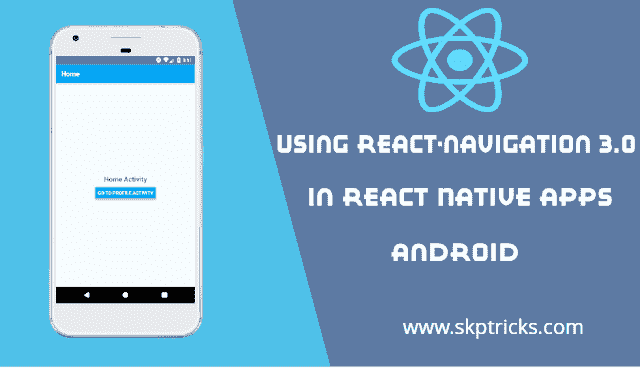

# 在 react 原生应用中使用 react-navigation 3.0

> 原文：<https://dev.to/skptricks/using-react-navigation-30-in-react-native-apps-mjn>

* * *

## 来源:[在 react 原生应用中使用 React-navigation 3.0](https://www.skptricks.com/2019/02/using-react-navigation-3-in-react-native-app.html)

本教程解释了如何使用 React Navigation 3 从一个屏幕移动或导航到另一个屏幕。react 本机应用程序中的 x 库。在 web 浏览器中，您可以使用锚点(

react-导航版:3。X

同样，React Navigation 的堆栈导航器为您的应用程序提供了一种在屏幕之间切换和管理导航历史的方式。React Navigation 是 React Navigation 的堆栈导航器提供了您在 Android 和 iOS 上导航堆栈中的路线时所期望的手势和动画。

如果您想了解 react 导航版本 2。x 在 react 原生应用，然后按照下面的链接:
react-导航版本:2。X

在开始本教程之前，我们需要了解一些重要的功能，这些功能是我们在从一个屏幕到另一个屏幕的页面导航过程中所需要的。那么让我们开始:
createstacknaviator:createstacknaviator 是一个函数，它接受一个路由配置对象和一个选项对象，并返回一个 React 组件。基本上，我们在这里维护不同屏幕或活动的路线信息。
导航道具:导航道具可用于所有屏幕组件，有助于屏幕导航。
this . props . navigation . navigate(' route name '):如果一条新的路径不在堆栈中，则将其推送到堆栈导航器，否则它将跳转到该屏幕并弹出已经打开的屏幕。
this . props . navigation . push(' route name '):将新路由推送到堆栈导航器，即使它已经存在于堆栈中。
this . props . navigation . go back():当你使用 stack navigator 切换到新窗口时，它会自动启用标题栏的后退按钮。(在 Android 上，硬件返回按钮只是按预期工作。)您也可以通过调用 goBack()函数以编程方式完成同样的工作。
This . props . navigation . poptotop():该函数有助于切换回 react 本机应用程序的主页或第一个屏幕。

