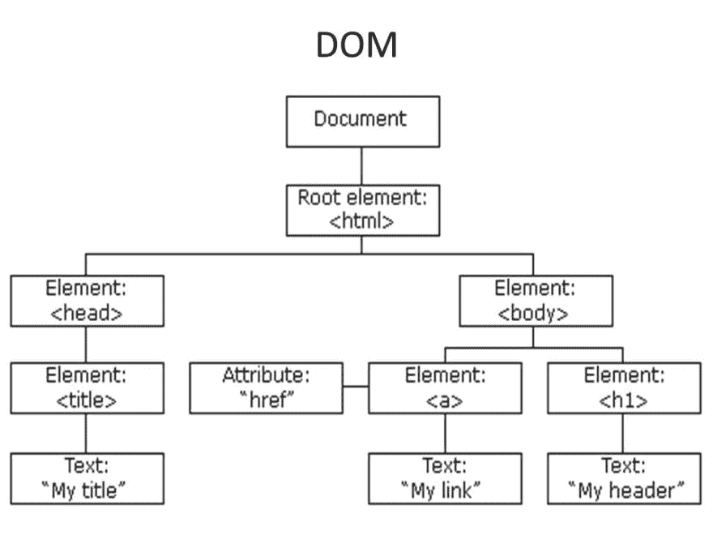

# 解释什么是 DOM，就像我是🖐

> 原文 https://dev.to/imronlearning/explain-what-is-dom-like-im-450 I

[](https://res.cloudinary.com/practicaldev/image/fetch/s--tQhNfTzO--/c_limit%2Cf_auto%2Cfl_progressive%2Cq_auto%2Cw_880/https://images.slideplayer.com/31/9631242/slides/slide_3.jpg)

希望我能简单准确地解释这一点😅

我一直不明白 DOM 是什么意思。我已经看到 **DOM** 被特别用在聚合物和反应堆文档中。

DOM 的意思是，**“文档对象模型”**

基本上，网页就是一个 html 文档。这个*文件*实际上是一个**对象**。在这个对象下，我们有自己的元素标签，如**主体**、 **h1** 、 **div** 等。页面中的所有元素都有某种对象结构。

大概是这样:

```
"document" : {
        "head" : { "name": "head" },
        "body" : { "name": "body" },
        "h1" : { "name": "h1", 
                 "style": { "backgroundColor": "black" } 
               }
    } 
```

Enter fullscreen mode Exit fullscreen mode

在我的 html 文件中，它看起来像这样:

```
<html>
    <head>
    </head>
    <body>
        <h1>Hello World</h1>
    </body>
</html 
```

Enter fullscreen mode Exit fullscreen mode

DOM 的所有元素都是一个对象模型(或结构)。这意味着像 **h1** 这样的元素会有一个像上面例子中的对象结构。耶！疯狂吧。您可以像使用 Javascript 访问对象一样访问这些属性！

我们来举个例子。我这里有一个 html 元素:

```
<h1> Hello World </h1> 
```

Enter fullscreen mode Exit fullscreen mode

使用 javascript，我实际上可以通过访问 h1 的对象模型来改变它的属性，就像这样:

```
let h1 = document.querySelector('h1');

// say we want to change it's background color to blue
h1.style.backgroundColor = 'blue' 
```

Enter fullscreen mode Exit fullscreen mode

而且这个管用！为什么？ **h1** 实际上有一个名为 **style** 的对象或属性，在 **style** 下有一个名为 **backgroundColor** (或者 css 中的 background-color)的属性，允许我们修改 **h1** 的那个 **backgroundColor** ！酷！

注意，我做了**文档。**对吧？这意味着 HTML 文档被解析成一个对象模型，这个对象模型就是**‘文档’**对象，DOM 中的所有元素都可以在这个文档对象下找到。

访问 DOM 有不同的方式:

```
 let h1 = document.querySelector('h1'); //gets all elements that are h1
let h1 = document.getElementsByTagName('h1'); //similar to query selector except that it takes the tags of the element
let navHeader = document.getElementById('nav-header'); //gets elements by its id 
let btn = document.getElementsByClassName('btn'); //gets elements by its class 
```

Enter fullscreen mode Exit fullscreen mode

这就对了。我希望我能够简单明了地解释 DOM 是什么。如果我错过了什么，请务必告诉我。

恭喜你成功了！🎉休息一下，吃点小点心🍫
干杯！在 Twitter 和 Instagram 上关注我。