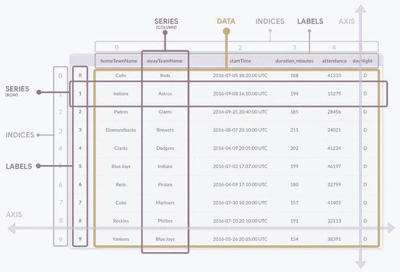

# 另一个不请自来的“使用熊猫介绍 Python 中的数据分析”帖子

> 原文：<https://dev.to/hackersandslackers/yet-another-unsolicited-intro-to-data-analysis-in-python-using-pandas-post-2f69>

[](https://res.cloudinary.com/practicaldev/image/fetch/s--Vh8RqNO9--/c_limit%2Cf_auto%2Cfl_progressive%2Cq_auto%2Cw_880/https://hackers.nyc3.cdn.digitaloceanspaces.com/posts/2019/02/intropandas.jpg)

让我们面对现实吧:这个世界最不需要的就是另一个“**介绍熊猫**”的帖子。任何足够陌生的人读到这篇博客时，肯定都和我一样对发现熊猫有着同样的反应:一种只能被描述为一见钟情的狂热兴奋。我们想告诉世界，我们做到了。很多。然而，我在这里，又一次无助地唱着陈词滥调的赞美。

我是环境的囚徒。事实证明，绝大多数(我的意思是绝大多数)我们的粉丝都有一种强烈的熊猫瘾。他们来到我们位于**的简陋的夫妻店，黑客和懒鬼**口吐白沫，对所有与熊猫相关的内容陷入绝对的疯狂。如果我还有半个大脑，我会把这个网站重新命名为**熊猫和熊猫**，并删除所有与熊猫无关的内容。说到现金。

作为一个中间派，我决定做一点家务。我之前的“熊猫介绍”帖子是很久以前在一场周五晚上的赛前集训中草草写成的。这种混乱偷偷溜进了这个博客，一年来几乎没人注意到。我已经决定，这可能不是打开一个关于有史以来最有影响力的 Python 库的系列的最佳方式。我们要再试一次。为了熊猫。

## 熊猫简介上映:IMAX 8k 4D

Pandas 用于分析和修改 Python 中的表格数据。当我们说“表格数据”时，我们指的是生活中数据以表格格式表示的任何实例。Excel，SQL 数据库，低劣的 HTML 表格....它们一直都是相同的东西，只是语法不同。熊猫可以做任何其他桌子能做的事情。

如果你对数据分析还比较生疏，并且正在经历*“哦，我的上帝，所有的数据职业都有点像 Excel”*在我们说话的时候，请随意花一点时间。太好了，那已经过去了。

## 数据帧的解剖

Pandas 中的表格数据被称为“数据框架”我们不能把所有东西都叫做“表格”，否则，当我们引用不同系统中的数据时，我们选择的模糊术语会变得非常混乱。不过在你我之间，数据帧基本上就是表格。

那么，我们如何通过命令行来表示二维数据:这是一个固有的一维解释和显示信息的概念？

[](https://res.cloudinary.com/practicaldev/image/fetch/s---ji4G7sS--/c_limit%2Cf_auto%2Cfl_progressive%2Cq_auto%2Cw_880/https://hackers.nyc3.cdn.digitaloceanspaces.com/posts/2019/02/xvb.jpg) 

<figcaption>“哦没什么，我们觉得很可爱。”</figcaption>

数据帧由单个部分组成，从表面上看很容易理解。这些事物的复杂性结合在一起，创造出的总和大于其各个部分的总和，这激发了数据框架似乎无穷无尽的力量。如果我们希望*对数据科学领域有所贡献，我们不仅需要理解术语，还需要*至少*了解数据框架的核心概念。这种理解是工程师与 Excel 猴子的区别。*

# 工程师

## 1

胜利

# Excel

## 0

失去

### 数据帧的组成部分

你希望这篇文章只是一堆熊猫的俏皮话吗？很好，我希望你失望了。系好安全带，我们今天可能真的会学到一些东西。宝贝，现在上课了。让我们一点一点地分析数据帧的构成:

[](https://res.cloudinary.com/practicaldev/image/fetch/s--ejkWdP0v--/c_limit%2Cf_auto%2Cfl_progressive%2Cq_auto%2Cw_880/https://hackers.nyc3.cdn.digitaloceanspaces.com/posts/2019/02/dataframe1-5.jpg)

任何表格最基本的描述都是由**列**和**行组成的集合。**抽象地思考，我们可以使用与行相同的列定义:*由单元格分隔的值序列。*两者唯一的区别就是方向(水平或垂直)。考虑到我们可以翻转任何一张桌子并保持相同的含义，我们几乎可以说*行和列实际上是同一个东西*。在熊猫中，这正是正在发生的事情:行和列都被认为是一个**系列**。

*   **系列**是 Pandas(和 Numpy)固有的对象，指的是一维数据序列。一维数据序列的另一个例子可以是一个 ***数组*** *，*但是 series 不仅仅是数组:它们是一个独立的类，有很多重要的原因，我们一会儿就会看到。
*   **轴**指的是一个系列的“方向”，或者换句话说，一个系列是列还是行。轴为`0`的系列是一行，而轴为`1`的系列是一列。这应该有助于打破列是与行分离的实体的概念:相反，它们是具有不同属性的相同对象。
*   一个系列包含**标签**，它们被赋予一个行/列的可视名称。指定标签允许我们调用任何带标签的系列，就像我们访问 Python 字典中的值一样。例如，访问`dataframe['awayTeamName']`将返回与标题*“away team name”*匹配的整个列。
*   每一行和每一列都有一个数字**索引。**大多数时候，一行的**标签**将等同于该行的**索引。**虽然为列定义标题是常见的做法，但是列也有索引，只是没有显示出来。在这方面，序列与列表/数组共享一个属性，因为它们是索引值的集合

考虑最后两点:我们刚刚描述了一个系列，它的工作方式与 Python 字典相同，但也与 Python 列表相同。没错:series 的对象就像列表和字典的混血儿。我们可以通过名称或索引来访问任何列，行也是如此。即使我们从数据帧中取出一列，该系列中的每个单元格仍将保留每个单元格的行标签。这意味着我们可以说类似于 **get me column #3 这样的话，然后为我找到标有“Y”的行中的值。**当然，反过来也一样。当我们增加整个维度时，事情变得指数级的强大和复杂是很疯狂的，不是吗？

## 加载您的数据

如果你已经做到了这一步，你就赢得了动手的权利。幸运的是，Pandas 有很多方法可以将表格数据加载到数据帧中，无论您是使用静态文件、SQL 还是更奇怪的方法，Pandas 都能满足您的需求。以下是我最喜欢的一些例子:

```
import pandas as pd

# Reads a local CSV file.
csv_df = pd.read_csv('data.csv')

# Similar to above
excel_df = pd.read_excel('data.xlsx')

# Creating tabular data from non-tabular JSON
json_df = pd.read_json('data.json')

# Direct db access utilizing SQLAlchemy
read_sql = read_sql('SELECT * FROM blah', conn=sqlalchemy_engine)

# My personal ridiculous favorite: HTML table to DataFrame.
read_html = read_html('examplePageWithTable.html)

# The strength of Google BigQuery: already officially supported by Pandas
read_gbq = read_gbq('SELECT * FROM test_dataset.test_table', projectid) 
```

所有这些都实现了创建数据帧的相同结果。无论您可能被迫继承了什么样的可怕数据源，Pandas 都会提供帮助。熊猫知道我们的痛苦。熊猫是爱。熊猫是生命。

加载数据后，让我们看看如何应用我们对**系列**的新知识与数据进行交互。

## 在我们的数据框架中查找数据

Pandas 有一种通过标签查找系列的方法，以及一种通过索引查找系列的单独方法。这些方法分别是`.iloc`和`.loc`。假设上面例子中的数据帧存储为一个名为`baseball_df`的变量。要按名称获取列的值，我们需要执行以下操作:

```
baseball_df = baseball_df.iloc['homeTeamName']
print(baseball_df) 
```

这将返回以下内容:

```
0 Cubs
1 Indians
2 Padres
3 Diamondbacks
4 Giants
5 Blue Jays
6 Reds
7 Cubs
8 Rockies
9 Yankees
Name: homeTeamName, dtype: object 
```

那是我们的专栏！我们可以看到行标签列在每一行的值旁边。告诉过你。获取一个列也将返回该列的**数据类型**，或*数据类型*。可以在列上显式设置数据类型。如果不是，Pandas 通常会默认检测到列中的数据是一个**浮点数**(返回给任何只保存数值的列，尽管有小数点的数目)或一个'**对象'**，这是一个奇特的总括，意思是“他妈的，如果我知道，有字母和狗屎在那里，它可能是任何可能的东西。”Pandas 并不努力自己辨别每个领域的数据类型。

如果你提前考虑，你可能会看到与`iloc`的潜在利益冲突。既然我们已经确定了列和行是相同的，并且我们正在访问基于*列和行都满足的标准的序列(每个表都有第一行和第一列)，熊猫怎么知道我们想要用`.loc()`做什么呢？简答:没有，所以只是两者都返回！*

```
baseball_df = baseball_df.loc[3]
print(baseball_df)

    homeTeamName awayTeamName startTime duration_minutes
0 Cubs Reds 188
1 Indians Astros 194
2 Padres Giants 185
3 Diamondbacks Brewers 211 
```

啊，一个 4x4 的格子！事实上，这确实以一种巧妙的、有意的方式满足了我们的要求——Albi et。“**聪明又有心”**其实是形容熊猫是图书馆的一个很棒的方式。这种轻松和力量的结合使得熊猫对好奇的新来者如此有吸引力。

想再举个例子吗？利用**系列的**的独特属性来拼接数据帧，就像它们是数组一样，怎么样？

```
sliced_df = df.loc['homeTeamName':'awayTeamName']
print(sliced_df)

    homeTeamName awayTeamName
0 Cubs Reds        
1 Indians Astros      
2 Padres Giants      
3 Diamondbacks Brewers 
```

...我们刚刚做到了吗？我们完全做到了。由于 series 对象的强大功能，我们能够使用与分割数组相同的语法来分割二维数据集。

## 欢迎加入俱乐部

向人们介绍熊猫还有很多更有趣、更令人兴奋的方式。如果我们的目标纯粹是娱乐，我们就会利用熊猫教程的千篇一律的路线:用熊猫的“把戏”让读者超载，用最小的努力展示巨大的力量。不幸的是，我们采用了适用的方法来实际保留信息。这种“信息和耗时”的模式肯定会击败“无用但即时令人满意”的模式，对吗？*对吗？*

去他妈的，我们下周就改名为**熊猫和熊猫**吧。从现在开始，当人们想要快速解决问题时，你可以叫我巴勃罗·埃斯科巴。下次加入我们，当我们使用熊猫数据分析来决定哪一个私人加勒比岛提供最好的投资回报时，我们将赚到所有肮脏的钱。

如果你想知道:这肯定不是 Fyre 节。