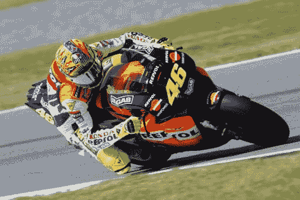

# PHP 中的循环。

> 原文：<https://dev.to/anastasionico/loops-in-php-4g0c>

无论你住在欧洲、美国或世界上任何其他地方，我相信你一生中至少有机会看一次比赛。

作为一个意大利人，

我在周末花了很多时间看一辆年轻的瓦伦蒂诺·罗西先是开着他的雅马哈打滑，然后是杜卡迪，迈克尔·舒马赫开着他的红色法拉利超过了所有其他一级方程式车手一圈。

现在，

有了程序员的头脑，那些记忆就被翻译成了所有编程语言的基本特性之一。

今天你将学习所有关于循环的知识。

我的计算机科学老师经常对我说的一句话是:

*“程序员是懒惰的人，他们不喜欢做同样的事情，尤其不喜欢浪费时间一遍又一遍地重写同样的命令”*。

我要你闭上眼睛一秒钟，想象一下，在这篇文章中，你是一名飞行员。

[](https://res.cloudinary.com/practicaldev/image/fetch/s--JMv16eM9--/c_limit%2Cf_auto%2Cfl_progressive%2Cq_auto%2Cw_880/http://anastasionico.uk/img/1/Lawn_mower_racing_finland.jpg)

一级方程式赛车、世界摩托车锦标赛、全国汽车比赛协会，甚至割草机比赛都不重要。

(是的，它存在，看看这个！[Https://en.wikipedia.org/wiki/Lawn\_mower\_racing](Https://en.wikipedia.org/wiki/Lawn%5C_mower%5C_racing)

如上所述，

今天你将学习编程语言中的循环。

循环的目的是多次执行相同的命令。

有点像一个在比赛中加速、刹车和转向的司机，一遍又一遍地发出同样的命令。

有不同类型的环路，即使它们都有或多或少相同的功能，但每种环路的特征和使用模式都不同。

程序员的技能是弄清楚在什么情况下使用哪一个。

在 PHP 中有 4 种类型的循环，

**while，do...一转眼，**为和**为异** **。**

幸运的是，考虑到它们的名字，对于一个以英语为母语的人来说，它们很容易理解。

while 和 do 命令...同时重复该循环，直到条件为真。

你很快就会看到，鉴于它们之间的高度相似性，在本文中我将解释 while 和 do...在一起的时候。

for 命令具有将代码重复预定次数的特性。

到目前为止，一切顺利。

foreach 循环会重复循环，直到重复元素没有结束。

我知道此刻一切看起来都很混乱，请忍耐一下，顿悟的时刻很快就会到来。

##关于该系列

这篇博客文章属于“ **PHP 开发专家基础知识**”系列。

如果你还没有读过其他的文章

看看它们

[PHP web 开发专家基础知识(1 '部分)](http://anastasionico.uk/blog/php-basics-for-web-developer)

[PHP 7 的构造和注释](http://anastasionico.uk/blog/php-construct-comments)

[如何使用变量(PHP 7)](http://anastasionico.uk/blog/php-variables)

[PHP 中的复合变量(数组、对象和更多)](http://anastasionico.uk/blog/composite-variable-in-php)

[PHP 运算符(1)](http://anastasionico.uk/blog/php-operators)

[PHP 运算符(2)](http://anastasionico.uk/blog/php-assignment-reference-comparison)

## 做什么...while 和 while 命令

**做..而**

*现在是星期天早上，*

准确地说，现在是上午 11 点 53 分，指示比赛开始的灯在 12 点整熄灭，一秒钟也不晚。

*你戴上一名机械师刚刚擦亮的头盔，进入驾驶舱，另一名机械师向你展示今天清晨从汽车上获得的最后一张扭矩-功率图，*

*这是前一天资格测试后对发动机进行的最后更改的结果。*

你离开车库，仍然双腿颤抖，在坐在看台上的成千上万名车迷中，你根据排位赛中获得的位置来定位车辆。

*最后一个。*

*从第二秒到最后一秒，一个断了手的家伙正在比赛。*

另一方面，这是你在职业赛中的第一场比赛，体育总监给你的唯一任务就是预热轮胎并完成测试圈。

就一圈！

[](https://res.cloudinary.com/practicaldev/image/fetch/s--Pz_kt6P---/c_limit%2Cf_auto%2Cfl_progressive%2Cq_auto%2Cw_880/http://anastasionico.uk/img/1/Sauber_at_the_start_grid_at_the_2003_Hungarian_Grand_Prix_%282%29.jpg)

然后，也许你会继续完成剩下的比赛。

所有编程语言都允许创建循环，

**这些命令的目的是多次重复相同的代码块，**

在本节中，您将看到 do...while 循环和 while 循环，

[它们依赖于一个条件，](http://anastasionico.uk/blog/php-operators)

如果条件为真，循环继续，否则循环停止，代码继续执行以下命令。

作为一名年轻有为的飞行员，你现在的任务是至少跑一圈，如果你挺过了压力，你可以继续剩下的比赛。

```
$stressLevel = 0; 
// the first lap is mandatory 
do { 
    echo "Doing a lap, stress = $stressLevel %. \n"; 
    $stressLevel += 20; 
} while ($stressLevel <= 100); 
```

如前所述，

do...while 循环基于一个条件进行操作。

这是一个循环，需要代码进行至少一次循环，如果在一圈结束时预设条件得到验证，则循环再次开始，否则，代码块结束，脚本继续执行以下命令。

在这个例子中，

你刚才看到了这种情况取决于一圈中积累的压力水平，

在循环开始时，应力水平等于 0。

每一次，当环境变暖时，压力水平增加 20，

然后，代码检查$stress 变量是否小于或等于 100，并继续。

在上面的示例中，将执行 6 圈，并将打印以下字符串:

```
Doing a lap, stress = 0 %. 
Doing a lap, stress = 20 %. 
Doing a lap, stress = 40 %. 
Doing a lap, stress = 60 %. 
Doing a lap, stress = 80 %. 
Doing a lap, stress = 100 %. 
```

由于这一系列文章被称为“面向专业 web 开发人员的 PHP 基础知识”，现在您将看到一些更复杂的内容。

如果你不能马上理解代码，不要担心，只要继续下去，当你觉得准备好的时候再回到这里。

```
$redFlag =  false; $errstring = ""; 
do {    
    if (!isset($pilotOne)) {        
        $redFlag = true;        
        $errstring = "$pilotOne missing";        
        break;    
    }    
    if (isValidInput($pilotOne) == false) {        
        $redFlag = true;        
        $errstring = 'Invalid value for $pilotOne';        
        break;    
    }    
    $value1 = $pilotOne;        
    if (!isset($pilotTwo)) {        
        $redFlag = true;        
        $errstring = "$pilotTwo missing";        
        break;    
    }    
    if (isValidInput($pilotTwo) == false) {        
        $redFlag = true;        
        $errstring = 'Invalid value for $pilotTwo';        
        break;    
    }    
    $value2 = $pilotTwo; 
} while (0); 
if ($redFlag == true) {    //display the $errstring here. } 
```

虽然(0)是 C 程序员多年来使用的一种强大的技巧，

实际上 0 等于假，我们预先确定这个循环将只运行一圈。

我们为什么要这样做？

这段代码不言自明。

已经阅读了本系列的前几篇文章，您应该能够理解代码是做什么的。

看看如果我选择只使用一系列 if 语句，同样的代码会变得多复杂。

```
$redFlag = false;
$errstring = "";

if (isset($pilotOne)) {
    if (isValidInput($pilotOne) == true) {
        $value1 = $pilotOne;
    } else {
        $redFlag = true;
        $errstring = "invalid value for pilotOne";
    }
} else {
    $redFlag = true;
    $errstring = "pilotOne is missing";
}
if (($redFlag == false) && isset($pilotTwo)) {
    if (isValidInput($pilotTwo) == true) {
        $value2 = $pilotTwo;
    } else {
        $redFlag = true;
        $errstring = "invalid value for pilotTwo";
    }
} else {
    if (! isset($pilotTwo)) {
        $redFlag = true;
        $errstring = "pilotTwo is missing";
    }
} 
```

这段代码不仅阅读起来复杂得多，而且从长远来看，它会造成大量的精神混乱，

但是这一系列的如果...else 甚至不能验证所有可能的条件。

[非常感谢 Pankaj Pal 的教程，他是程序员 C，也是我在这个例子中使用的文章“有用的 do while(0) trick”的作者，](http://edusagar.com/articles/view/6/useful-do-while0-trick)

## while 循环

在第一圈测试后，恐惧和压力水平大大降低，你开始习惯驾驶车辆。

你决定继续比赛。

太好了！

现在还有另一个问题，规则说除非刹车出了问题(祝你好运),否则你不能进站。

通过无线电，技术人员保证一切都会好的，车辆已经按照最好的标准组装，但是，他们也推荐一件事:

在坦克里，并依此行事。

```
$tankLevel = 100;
while ($tankLevel > 0) {
    echo $tankLevel--;
} 
```

while 循环是所有循环中最简单的，

无论是语法还是推理。

它也源自编程语言 C，由以下部分组成:

**给定一个条件(在你的例子中是汽车内的气体水平),如果条件为真，则执行里面的代码块，否则脚本执行下一个命令。**

与 do 的区别...而上面所看到的仅仅在于这样一个事实:这里的**条件是立即**(在每圈开始时)检查的，而不是之后**。**

 **## 为循环

*第 15 圈刚刚开始，你看了看油表，你意识到，作为最有经验的车手，你已经能够以一种非凡的方式控制车内的燃油量。*

比赛结束时只剩下 5 圈，你还没用完一半的油箱，而四分之三的对手已经退赛了。

气体不再是问题，现在机械师们通过无线电发出了巨大的激励。

你必须完成比赛。

[](https://res.cloudinary.com/practicaldev/image/fetch/s--hv37PC_T--/c_limit%2Cf_auto%2Cfl_progressive%2Cq_auto%2Cw_880/http://anastasionico.uk/img/1/Motogp_rossi_300.jpg)

现在让我们从最简单的循环转移到语法上更难的循环。

**for 循环也是从 C 中派生出来的，在单个或多个变量上计算不同的表达式，用分号分隔。**

如果括号内验证的表达式为真，则执行块内的代码。

这里有一个例子:

```
for ($lap = 15; $lap <= 20; $lap++) {
    echo "lap n. $lap.";
} 
```

第一个表达式表示当前情况的状态，即我们第一次接近循环时变量的值，

正如我们的故事所说，我们已经跑了 15 圈。

在第二个表达式中，我们指出了要执行的代码块要验证的条件，我们的比赛在第 20 圈结束。

最终，

像所有的循环一样，我们必须增加变量，在这种情况下，一次一圈。这里没什么新鲜的。

请注意，增加循环所基于的变量是强制性的。

如果避免了，这个循环会永远继续下去，而且永远是一个很长的时间。

值得一提的是，如果你足够勇敢，for 的循环是非常用户友好的，并提供了不同类型的语法来进行实验。

举个例子，

即使这三个表达式的“空格”是强制的，并且分号作为分隔符，表达式本身也可以被排除。

```
for ($lap = 15; ; $lap++) {
    if ($lap > 20) {
        echo "Race completed.";
        break;
    }
        echo "lap n. $lap.";
} 
```

上面两个例子的工作方式完全相同，

两者都循环遍历一个变量，每次都将变量值增加 1，当变量值达到 20 时结束。

正如您从上面的块中看到的，在这种情况下，我们在块中用 if 命令替换了循环的第二个表达式，并用 break 命令完成了迭代。

不一定要在括号内插入表达式。

下面是另一个更高级的片段:

```
$lap = 15;
for (; ; ) {
    if ($lap > 20) {
        echo "Race completed.";
        break;
    }
    echo "lap n. $lap.";
    $lap++;
} 
```

在最后一个例子中也是如此，重要的是设置变量的初始值，以指示结束循环的条件，并在每次循环中增加变量。

你决定在哪里执行这三项任务取决于你自己。

...

你听说过“冒号句法”吗？

我仍然记得我发现这个 PHP 特性的那一天。

几年前一个寒冷的夜晚，典型的英国冬天，我正在学习由 [Laracasts](https://laracasts.com/) 网站的创建者 [Jeffrey Way](https://twitter.com/jeffrey_way?lang=en) 创建的教程。

看看吧，很有价值的。

PHP 在 for 循环上支持这种特殊语法:

```
for ($lap = 15; $lap <= 20; $lap ++) :
    echo "lap n. $lap.";
endfor; 
```

**它看起来与原始版本非常相似(确实如此),但我可以保证，如果用在 HTML 标签中间或视图中(在 MVC 模型中),它真的会有所不同，**

无论是清晰还是混乱。

最后但同样重要的是，

我离开了循环一次评估多个变量的情况。

这是非常罕见的情况，也是 for 循环的高级用法，

下面的例子是无耻地从 PHP.net 网站上偷来的。

```
for ($i = 1, $j = 0; $i <= 10; $j += $i, print $i, $i++); 
```

家庭作业:看看这些例子，并在下面的评论或链接的 facebook 页面中写下你认为结果会是什么。

## foreach 循环

比赛的最后一圈，与此同时，又有两辆车退出了比赛，现在我们到了关键时刻。

心跳加速，现在你对赛道了如指掌，你的对手也一样。

*右转，减速，加速，准备过弯*

你和其他人之间的差距只是几毫秒的事，在整个旅程中，你会一个接一个地超车。

*你暂时在第二个位置，你的脚深深踩在油门踏板上，在最后一个弯道之前的最后一个直道的整个过程中，你从第一个位置开始使用防风网，在弯道内侧刹车和超车，*

*第一，第一个位置还有 200 米就到了，*

*...*

*叭！哔！哔！哔！*

*黑暗突然降临。*

*这种几乎令人讨厌的声音不是来自任何仪表板灯，*

没有仪表板，只有黑暗。

是时候摘掉睡眠眼罩，起床，关掉闹钟了。

走吧，已经是早上了，你还有一些代码要写。

### foreach 循环中的数组和对象

文章的最后一种循环。

****foreach****构造允许循环遍历包含可遍历接口的元素。****

 ****简单来说，**

它适用于数组和对象。

如果你想了解更多，这里是官方手册中关于[数组](http://php.net/manual/en/language.types.array.php)和[对象](http://php.net/manual/en/language.types.object.php)的内容。

只有两种语法，但是彼此非常相似。

最简单的是将当前元素的值赋给一个变量。

```
$racers = ["Marc Marquez", "Andrea Dovizioso", "Valentino Rossi", "Maverick Vinales"];
foreach ($racers as $racer) {
    echo "$racer  \n" ;
} 
```

上面的 foreach 循环只接受一个姓名数组，在本例中，是按去年冠军排名排序的 MotoGP 车手的姓名，并将其回显出来。

### foreach 循环中的关联数组

在关联数组或对象的情况下，经常使用包含元素的键和值的 foreach。

```
$drivers = [
    “Mercedes” => "Lewis Hamilton", 
    “Ferrari” => "Sebastian Vettel", 
    “Ferrari” => "Kimi Raikkonen", 
    “Red Bull Racing” => "Max Verstappen"
];
foreach ($drivers as $constructor => $driver) {
    echo "$driver drives a $constructor. \n" ;
} 
```

**在这种情况下，数组是由一个键-值对除以一个箭头= >，**形成的

[](https://res.cloudinary.com/practicaldev/image/fetch/s--oMedAdBv--/c_limit%2Cf_auto%2Cfl_progressive%2Cq_auto%2Cw_880/http://anastasionico.uk/img/1/2627816570_de32f68714.jpg)

我们可以使用 PHP 提供的第二种语法来迭代这两者。

它允许我们将数组的键(可能是一个对象)插入到 *$constructor* 变量和 *$driver* 变量中的值。

但是，foreach 内部是如何工作的呢？

随着时间的推移，它的行为发生了变化，但是从 PHP 第 5 版开始，它的功能保持不变。

**当一个** **foreach** **循环开始时，一个内部指针被实例化。**

**它总是指向当前元素之后的元素，**

**每次循环完成，内部指针自动返回到数组的第一个元素**

PHP 中有几个命令可以修改指针的行为，但这种做法是为有一定经验的程序员保留的，因为在循环中修改指针可能会涉及到意想不到的行为。

以下是处理数组指针的函数列表:

**reset()** 将数组的内部指针设置为其第一个元素

**current()** 返回数组中的当前元素

**each()** 返回数组中的当前键和值

**end()** 将数组的内部指针设置为其最后一个元素

**next()** 前进数组的内部指针

**prev()**

### 通过引用传递变量

您已经看到了使用 foreach 循环读取数组或对象的几种方法。

但是，如何改变数组中的元素呢？

作为默认模式，PHP 以一种称为“按值”的方式遍历元素，也就是说，它只访问内存中变量的索引，而不访问值本身。

**要实际修改数组元素，必须“通过引用”赋值。**

为此，只需在所需值前输入&符号。

```
$racers = ["Marc Marquez", "Andrea Dovizioso", "Valentino Rossi", "Maverick Vinales"];
foreach ($racers as &$racer) {
    $racer = strtoupper($racer);    
}
unset($racer);
// $racers now is equal to: "MARC MARQUEZ", "ANDREA DOVIZIOSO", "VALENTINO ROSSI", "MAVERICK VINALES" 
```

注意，当通过引用循环时，库的最后一个元素保留在内存中。

为了避免不愉快的问题，最好是对变量使用 PHP *unset()* 函数来消除变量，如上所示。
T3】

### list()函数在 foreach 循环内

另一个有趣的技巧是使用 *list()* 函数，它可以让数组和 foreach 更容易阅读代码。

在某种程度上就像 *list* *()* 分配变量假装它们是一个数组。

在下面的代码片段中，变量 *$racers* 包含嵌套数组的第一个元素，而 *$drivers* 包含第二个元素，它们按顺序显示。

```
$pilots = [
    ["Marc Marquez", "Andrea Dovizioso", "Valentino Rossi", "Maverick Vinales"],
    ["Lewis Hamilton", "Sebastian Vettel", "Kimi Raikkonen", "Max Verstappen"],
];

echo "2018 standings: \n"
foreach ($pilots as list($racer, $driver)) {
    echo "MotoGP: $racer; Formula 1: $driver\n";
}

// the result shown will be:
2018 standings:
MotoGP: Marc Marquez; Formula 1: Lewis Hamilton
MotoGP: Andrea Dovizioso; Formula 1: Sebastian Vettel
MotoGP: Valentino Rossi; Formula 1: Kimi Raikkonen
MotoGP: Maverick Vinales; Formula 1: Max Verstappen 
```

## 结论

循环一点也不可怕，

显然，和其他事情一样，这需要一点练习。

能够确定何时使用一种类型的循环而不是另一种类型的循环，记住确切的语法并在多维数组甚至其他对象中的对象上使用循环并不容易。

但这仍然是 PHP 和其他语言基础的一部分。

日复一日的测试、试验和改进是创建一个坚实基础的关键，这个基础将用于创建越来越复杂的 web 应用程序。

也许你不会成为一名职业车手或赢得冠军，但我希望看完这篇教程后，作为一名网络开发人员，你至少有了一点进步。

...

如果你想知道更多或者还没有阅读其他部分，不要错过！

[PHP web 开发专家基础知识(1 '部分)](http://anastasionico.uk/blog/php-basics-for-web-developer)

[PHP 7 的构造和注释](http://anastasionico.uk/blog/php-construct-comments)

[如何使用变量(PHP 7)](http://anastasionico.uk/blog/php-variables)

[PHP 中的复合变量(数组、对象等)](http://anastasionico.uk/blog/composite-variable-in-php)

[PHP 运算符(1 部分)](http://anastasionico.uk/blog/php-operators)

[PHP 运算符(2)](http://anastasionico.uk/blog/php-assignment-reference-comparison)

...
[T3】](http://eepurl.com/dIZqjf)

此外，学习新技能从来都不是一个简单的过程，但幸运的是，与几年前不同，现在已经变得容易多了。

实际上生活在网络上，在我的职业生涯中对我帮助很大的应用之一是电子学习平台 teamtreehouse。

他们目前提供 4 个月的免费服务(价值 100 美元)。

[看一看吧！。](http://treehouse.7eer.net/c/1374240/294479/3944)

([附属链接](http://treehouse.7eer.net/c/1374240/294479/3944)****