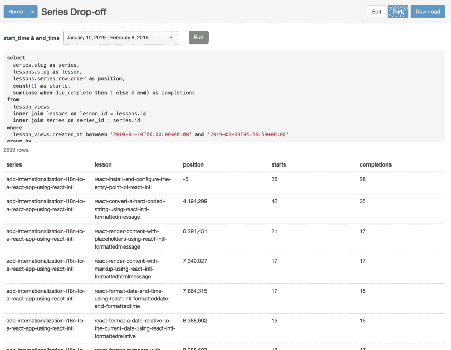

# 转换导出的 CSV 数据以在 React 图表中使用。

> 原文：<https://dev.to/jhooks/transforming-exported-csv-data-for-use-in-a-chart-4n62>

有许多方法可以为您的应用程序构建新功能。对我来说，当我需要一个新的工具、组件或功能时，我喜欢后退一步，从数据的角度来考虑它。我有什么数据，我需要什么数据，以及我将如何呈现数据并与数据交互。

在 egghead，我们不断努力改进我们的流程和我们工作的创作者正在制作的内容。为了更好地了解内容的消费方式，我们可以查看的关键性能指标(KPI)之一是掉线率。

当有人坐下来观看一门课程时，他们就开始了第一课。有时他们甚至没有完成第一课，有时他们完成了所有的课程，当然人们会在中间的不同点停下来。

在一个完美的世界里，大多数开始的人也会结束。然而，我们生活在现实中，当我们开始认真考虑我们的核心格式的各个方面时，我们也需要考虑我们将如何理解和**证明**我们的改进努力正在取得真正的成果。

否则你只是在改变。

我们跟踪课程视图。我们这样做是为了让使用这个网站的人们能够持续进步，同时也是为我们的坏蛋内容创作者支付版税系统的一部分。虽然我们计算掉线率所需的所有数据都在数据库中，但在我们的应用程序中却没有以这种格式显示。

在这一点上，我们有一些选择:

*   向我们现有的 rails 应用程序添加 api 端点、数据模型更改和 UI
*   导出一些数据并组合成一个轻量级的演示

我非常喜欢在 codesandbox.io 这样的轻量级环境中获取数据和工作

它更快，更易处理，所以我可以快速迭代和探索解决方案。没有要处理的构建。不需要通过网络加载任何内容。分享和协作很容易。

基本上很棒！

为了从我们的 Rails 应用程序中获取数据，我访问了一个名为 Blazer 的 gem。这是一个非常方便的工具。你给它一些 SQL，定义任何变量，它执行查询。您可以在浏览器中查看数据，或者将其下载为逗号分隔变量(CSV)文件。

[](https://res.cloudinary.com/practicaldev/image/fetch/s--yOE3_JRn--/c_limit%2Cf_auto%2Cfl_progressive%2Cq_auto%2Cw_880/https://thepracticaldev.s3.amazonaws.com/i/ctyofjhpfbwivggoqq5y.png)

我抓住了 CSV。

我的数据有我需要的所有方面。属于一个“系列”(课程)的每个课程视频都输出其在系列中的位置、它已经开始了多少次以及完成了多少次。

尽管这种格式很麻烦，所以我打算用一个节点脚本来转换它。

这个过程和我在这个帖子中所做的[非常相似]('https://joelhooks.com/export-drip-tags-for-convertkit')

这是完整的脚本，请检查一下，然后我将浏览每个部分并解释发生了什么:

```
const _ = require('lodash')
const fs = require('fs')
const csv = require('csv-parser')
var reduce = require('stream-reduce')

const csvFilePath = './series-drop.csv'

fs.createReadStream(csvFilePath)
  .pipe(csv())
  .pipe(
    reduce((acc, row) => {
      const series = _.find(acc, { title: row.series }) || {
        lessons: [],
        totalStarts: 0,
        totalCompletions: 0,
      }
      const filtered = _.filter(acc, series => series.title !== row.series)

      return [
        ...filtered,
        {
          title: row.series,
          totalStarts: series.totalStarts + parseInt(row.starts, 10),
          totalCompletions:
            series.totalCompletions + parseInt(row.completions, 10),
          lessons: _.sortBy(
            [
              ...series.lessons,
              {
                title: row.lesson,
                starts: row.starts,
                completions: row.completions,
                position: row.position,
              },
            ],
            'position',
          ),
        },
      ]
    }, []),
  )
  .on('data', function(dropoffData) {
    fs.writeFile(
      'series_dropoff.json',
      JSON.stringify(dropoffData),
      'utf8',
      () => {
        console.log('done')
      },
    )
  }) 
```

在上面我们有一些进口货。

*   lodash:我非常喜欢这个库，并且在每个项目中都使用它。它为处理对象和集合❤️提供了一套非常有用的工具
*   fs:这是节点标准库的一部分，用于处理文件系统。我们将加载一个 CSV 并保存一个 json 文件，因此这是必需的。
*   csv-parser:这是一个基于流的库，用于消费 csv 数据，并将其转换为 CSV 每行的 JavaScript 对象。
*   stream-reduce:这是一个流的 reduce 函数。因为我需要将数据从一种“形式”转换成另一种形式，所以 reduce 是我要使用的工具。

启动脚本的第一步是加载数据:

```
const csvFilePath = './series-drop.csv'

fs.createReadStream(csvFilePath) 
```

我们使用`fs`到`createReadStream`将数据从磁盘上的文件传输到我们的应用程序中。

```
.pipe(csv()) 
```

溪流让我们将脚步串连在一起。在下一步中，我们将数据流`pipe`转换为`csv()`，后者将二进制数据流转换为行。`csv-parser`库很强大，可以做更多有趣的事情，但幸运的是我们不需要做任何有趣的事情，所以我们只需调用`csv()`就可以得到我们需要的东西。

```
.pipe(
  reduce((acc, row) => {
    //we'll look at this part later...
  }, []), 
```

我们再次调用`pipe`，这一次我们将把上一步的*结果*转换成 JavaScript 数据对象到一个`reduce`函数中。如果你不熟悉 reduce，或者想更深入一点，我强烈推荐[米科拉·比洛克斯基关于这个话题的令人敬畏的理论家课程](https://egghead.io/courses/reduce-data-with-javascript-array-reduce)！

reduce 函数有两个参数。

1.  减速器功能。这个函数也有两个参数。*累加器*和当前项目。Reducers 通常处理集合或对象。可以迭代的东西。它类似于一个`forEach`或`map`，但累加器使减速器有趣。
2.  第二个参数是累加器的起始状态。在我们的例子中，我们希望将 CSV 文件中的所有行减少到一个 javascript 对象数组中，每个对象代表一门课程，因此第二个参数是一个`[]`

```
reduce((acc, row) => {
  const series = _.find(acc, {title: row.series}) || {
    lessons: [],
    totalStarts: 0,
    totalCompletions: 0,
  }
  const filtered = _.filter(acc, series => series.title !== row.series) 
```

在我们的 reducer 中，我们希望获取当前行并将课程数据添加到 series 对象中。我们使用`_.find(acc, {title: row.series})`来查看累加器是否已经有了这个系列的对象。如果没有，我们就创建一个对象来使用，并为它分配合理的默认值。

我们还创建了另一个数组来过滤掉现有的 series 对象，这样我们就不会以 doubles 结束。

```
return [
  ...filtered,
  {
    title: row.series,
    totalStarts: series.totalStarts + parseInt(row.starts, 10),
    totalCompletions: series.totalCompletions + parseInt(row.completions, 10),
    lessons: _.sortBy(
      [
        ...series.lessons,
        {
          title: row.lesson,
          starts: row.starts,
          completions: row.completions,
          position: row.position,
        },
      ],
      'position',
    ),
  },
] 
```

我们的 reducer 函数返回*一个新的数组*，该数组成为下一行的`acc`累加器。

我们扩展了过滤后的数组`...filtered`,使得该数组中的所有项目都在我们的新数组中。然后，我们将表示当前行序列的新对象添加到数组中。

请注意，我们没有对任何数据进行变异。我们构建了一个新的数组作为新的累加器返回。

```
{
  title: row.series,
  totalStarts: series.totalStarts + parseInt(row.starts, 10),
  totalCompletions:
    series.totalCompletions + parseInt(row.completions, 10),
  lessons: _.sortBy(
    [
      ...series.lessons,
      {
        title: row.lesson,
        starts: row.starts,
        completions: row.completions,
        position: row.position,
      },
    ],
    'position',
  ),
} 
```

这是新的(或更新的)系列对象。它设置标题，将当前行的`starts`和`completions`添加到先前的计数中(如果是新累积的系列，我们将其设置为 0)，最后我们添加课程。

```
lessons: _.sortBy(
  [
    ...series.lessons,
    {
      title: row.lesson,
      starts: row.starts,
      completions: row.completions,
      position: row.position,
    },
  ],
  'position',
) 
```

lodash 的`sortBy`增加了这些经验，它根据第二个参数对数组进行排序。在这种情况下，我们只传递字符串`'position'`，它告诉 lodash 根据数组中对象的位置属性进行排序。

在`sortBy`内部，我们使用`...series.lessons`将累积系列中的任何现有课程传播回新的系列对象。然后，我们可以将当前行中的数据作为新的课程添加到 accumulated series 对象中。

如果您不习惯使用`...` spread 操作符来简化和(重新)构建对象，这一部分会变得有点奇怪，但是它值得练习和思考，因为它是一个非常有用的工具。如果你真的想要一个很好的解释，我强烈推荐丹·阿布拉莫夫的这个聪明的视频。

为了更清楚地了解刚刚发生的事情，我们减少/转换了 csv 数据:

```
add-internationalization-i18n-to-a-react-app-using-react-intl,react-install-and-configure-the-entry-point-of-react-intl,-5,530,428
add-internationalization-i18n-to-a-react-app-using-react-intl,react-convert-a-hard-coded-string-using-react-intl-formattedmessage,4194299,498,370
add-internationalization-i18n-to-a-react-app-using-react-intl,react-render-content-with-placeholders-using-react-intl-formattedmessage,6291451,305,233
add-internationalization-i18n-to-a-react-app-using-react-intl,react-render-content-with-markup-using-react-intl-formattedhtmlmessage,7340027,259,234
add-internationalization-i18n-to-a-react-app-using-react-intl,react-format-date-and-time-using-react-intl-formatteddate-and-formattedtime,7864315,244,210
add-internationalization-i18n-to-a-react-app-using-react-intl,react-format-a-date-relative-to-the-current-date-using-react-intl-formattedrelative,8388602,201,192
add-internationalization-i18n-to-a-react-app-using-react-intl,react-format-numbers-with-separators-and-currency-symbols-using-react-intl-formattednumber,8388603,216,197
add-internationalization-i18n-to-a-react-app-using-react-intl,react-render-content-based-on-a-number-using-react-intl-formattedmessage,8388604,203,174
add-internationalization-i18n-to-a-react-app-using-react-intl,react-use-a-react-intl-higher-order-component-to-format-messages-and-get-current-locale,8388605,251,199
add-internationalization-i18n-to-a-react-app-using-react-intl,react-write-tests-for-react-intl-output-using-enzyme-and-jest,8388606,242,144
add-internationalization-i18n-to-a-react-app-using-react-intl,react-use-webpack-to-conditionally-include-an-intl-polyfill-for-older-browsers,8388607,187,154 
```

变成一个结构良好的 JS 对象，就像这样:

```
[{  "title":  "add-internationalization-i18n-to-a-react-app-using-react-intl",  "totalStarts":  3136,  "totalCompletions":  2535,  "lessons":  [  {  "title":  "react-install-and-configure-the-entry-point-of-react-intl",  "starts":  "530",  "completions":  "428",  "position":  "-5"  },  {  "title":  "react-convert-a-hard-coded-string-using-react-intl-formattedmessage",  "starts":  "498",  "completions":  "370",  "position":  "4194299"  },  {  "title":  "react-render-content-with-placeholders-using-react-intl-formattedmessage",  "starts":  "305",  "completions":  "233",  "position":  "6291451"  },  {  "title":  "react-render-content-with-markup-using-react-intl-formattedhtmlmessage",  "starts":  "259",  "completions":  "234",  "position":  "7340027"  },  {  "title":  "react-format-date-and-time-using-react-intl-formatteddate-and-formattedtime",  "starts":  "244",  "completions":  "210",  "position":  "7864315"  },  {  "title":  "react-format-a-date-relative-to-the-current-date-using-react-intl-formattedrelative",  "starts":  "201",  "completions":  "192",  "position":  "8388602"  },  {  "title":  "react-format-numbers-with-separators-and-currency-symbols-using-react-intl-formattednumber",  "starts":  "216",  "completions":  "197",  "position":  "8388603"  },  {  "title":  "react-render-content-based-on-a-number-using-react-intl-formattedmessage",  "starts":  "203",  "completions":  "174",  "position":  "8388604"  },  {  "title":  "react-use-a-react-intl-higher-order-component-to-format-messages-and-get-current-locale",  "starts":  "251",  "completions":  "199",  "position":  "8388605"  },  {  "title":  "react-write-tests-for-react-intl-output-using-enzyme-and-jest",  "starts":  "242",  "completions":  "144",  "position":  "8388606"  },  {  "title":  "react-use-webpack-to-conditionally-include-an-intl-polyfill-for-older-browsers",  "starts":  "187",  "completions":  "154",  "position":  "8388607"  }  ]  },  ...  ] 
```

剩下的就是把它写到一个文件中，这样我们就可以在其他地方使用它:

```
.on('data', function(dropoffData) {
  fs.writeFile(
    'series_dropoff.json',
    JSON.stringify(dropoffData),
    'utf8',
    () => {
      console.log('done')
    },
  )
}) 
```

流可以监听标准事件。在这种情况下，我们正在监听`data`，当它完成时由`stream-reducer`提交。然后，我们可以使用`fs.writeFile`将精简后的系列对象数组写到磁盘上！

有了格式良好的数据，打开 codesandbox 并开始使用它就容易多了。我最终选择了反应图和柱状图。

请随意探索 codesandbox，看看这些数据是如何用于创建图表的。

[https://codesandbox.io/embed/6jj1kr8lxk](https://codesandbox.io/embed/6jj1kr8lxk)

如果你想看我跌跌撞撞地走来走去，并实时解决这一切，今天是你的幸运日。我把它都录了下来，[把它发布到了这个播放列表](https://www.youtube.com/playlist?list=PL1g0o_QdVLU_PPf_tf5QPMJpXLcn_Xy5j)。🙂