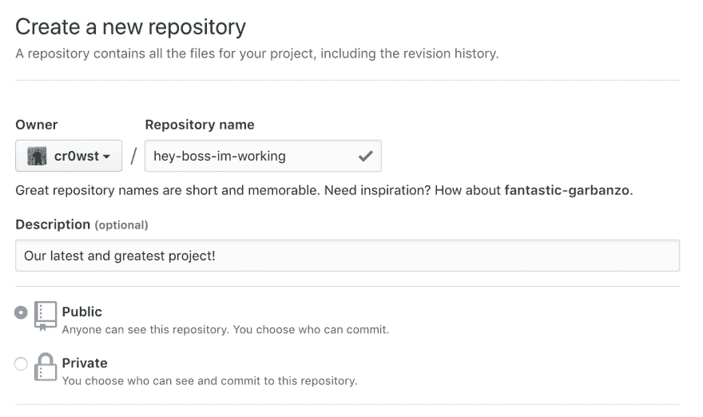
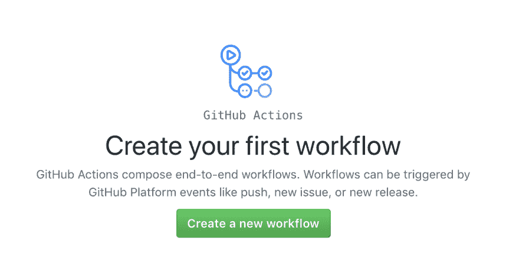
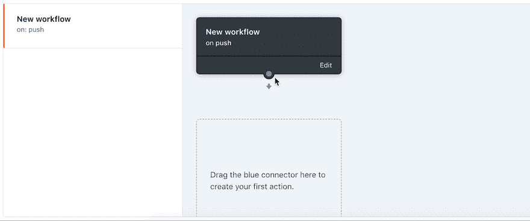
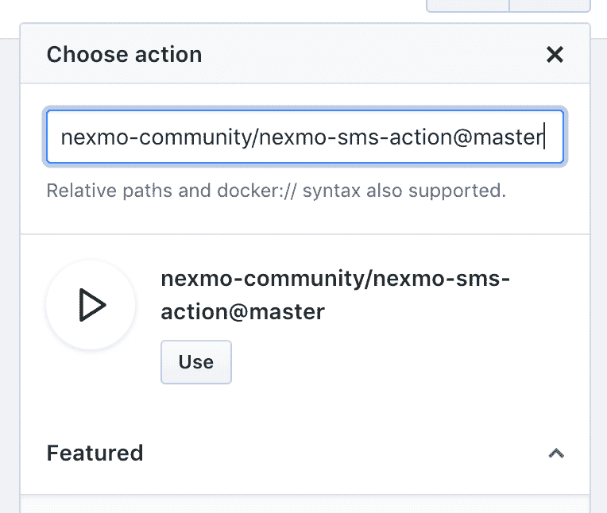
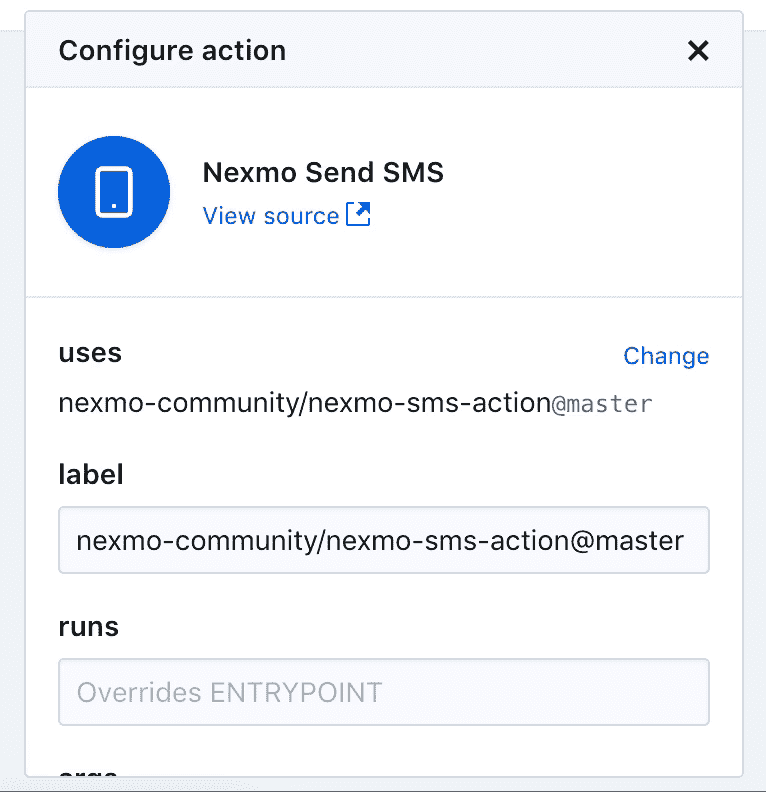
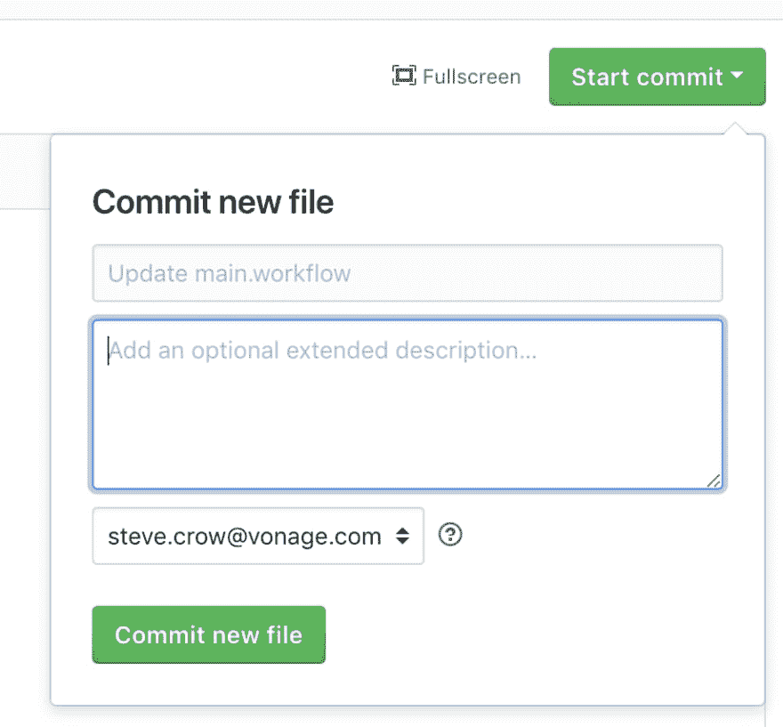
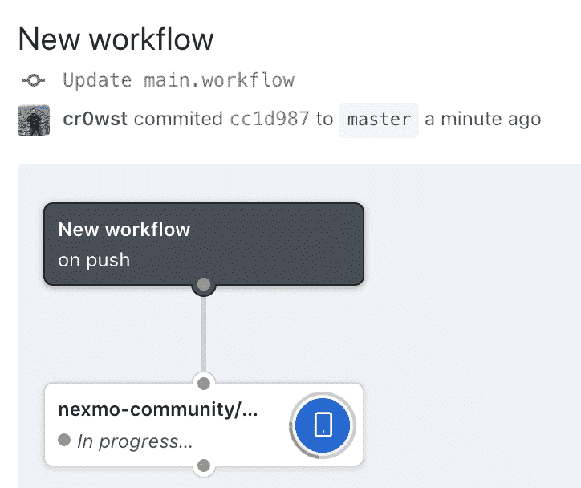
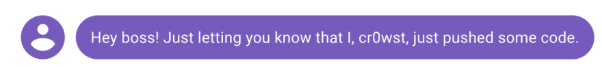

# 发送带有 GitHub 操作的短信

> 原文：<https://dev.to/vonagedev/send-sms-with-github-actions-11me>

老板有各种形状和大小。有些不干涉，让你尽最大能力工作。其他人，采取更直接的方法，仅仅通过你产生的代码来衡量你的成就。毕竟，如果你不写代码，我们为什么要付钱给你？

想向你的老板展示你工作有多努力吗？绝对的！有了 Nexmo 和 GitHub 行动的力量，你可以确保出色的年度评估和可观的加薪是有序的。

## 先决条件

要遵循本指南，您需要一个 Nexmo 帐户。[如果你还没有，现在就注册](https://dashboard.nexmo.com/sign-up)。

注册后，您将收到一个 API 密钥和密码。在后面的步骤中，您将需要这些。此外，您需要[购买一个支持短信的号码](https://www.nexmo.com/products/phone-numbers)才能发送信息。

在撰写本文时，GitHub Actions 目前处于公开测试阶段。如果你不是测试版的成员，你需要申请测试版。

## 什么是 GitHub 动作？

[GitHub Actions](https://developer.github.com/actions/) 是 GitHub 的一个新工具，在这个工具中，单个的动作被组合成一个工作流，在不同的[触发事件类型](https://developer.github.com/v3/activity/events/types/)上执行。

每个动作都是一个 Docker 容器，包含一个入口点。动作存在于一个`Dockerfile`中，其中的`LABEL`指令提供了关于动作的信息。

例如，假设您想将用户(称为 GitHub Actor)的名字打印到控制台。您将创建一个包含以下内容的`Dockerfile`的存储库:

```
FROM alpine:3.8

LABEL "com.github.actions.name"="Print GitHub Actor"
LABEL "com.github.actions.description"="Print the GITHUB_ACTOR environment variable to the console."
LABEL "com.github.actions.icon"="user"
LABEL "com.github.actions.color"="blue"

LABEL "repository"="https://github.com/cr0wst/display-github-actor-action"
LABEL "homepage"="https://smcrow.net"
LABEL "maintainer"="Steve Crow <steve.crow@nexmo.com>"

ENTRYPOINT ["sh", "-c", "echo $GITHUB_ACTOR"] 
```

整个动作运行命令`echo $GITHUB_ACTOR`，其中`$GITHUB_ACTOR`是 GitHub 提供给容器的环境变量，该容器包含触发动作的用户。

> 有关 Docker 的更多信息，请参见此 [Docker 概述](https://docs.docker.com/engine/docker-overview/)。

GitHub 动作的优势在于创建可重用的动作，其他人可以在他们的工作流中使用这些动作。

## 创建您的第一个工作流程

在本指南中，您将创建一个新的存储库，该存储库包含一个工作流，每次收到推送时，都会向您的老板发送一条短信。

### 创建一个知识库

首先，创建一个新的存储库:

[](https://www.nexmo.com/wp-content/uploads/2019/01/create-new-repo.png)

### 创建新的工作流

创建存储库后，您需要导航到“操作”选项卡，在这里您会看到一个创建新工作流的按钮:

[](https://www.nexmo.com/wp-content/uploads/2019/01/create-first-workflow.png)

工作流程可以在图形用户界面(GUI)中创建，也可以通过创建一个`workflow`文件来创建。

### 将动作触发器链接到一个动作

向下拖动蓝色连接器以创建您的第一个操作。

[](https://www.nexmo.com/wp-content/uploads/2019/01/create-action.gif)

您将引入的操作是 [Nexmo SMS 操作](https://github.com/nexmo-community/nexmo-sms-action)。该操作使用 [Nexmo CLI](https://github.com/Nexmo/nexmo-cli) 发送文本消息。

在“查找或输入操作...”中勾选`nexmo-community/nexmo-sms-action@master`并点击使用按钮。

[](https://www.nexmo.com/wp-content/uploads/2019/01/choose-nexmo-action.png)

该操作需要定义三个秘密变量:

*   `NEXMO_API_KEY`包含您的 Nexmo API 密钥。
*   包含您的 Nexmo API 秘密。
*   `NEXMO_NUMBER`包含发送消息的号码。

我建议将你老板的电话号码存储在另一个秘密变量中。

向下滚动并输入您的秘密变量。我将使用`BOSS_NUMBER`环境变量来存储接收短信的号码。

出于测试目的，可能还有生产目的，我不建议使用你老板的*实际*数字。先用你的电话号码试试。电话号码必须是国际格式，没有任何空格或特殊字符分隔号码。比如 15551239876。

[](https://www.nexmo.com/wp-content/uploads/2019/01/define-secrets.gif)

该命令的工作方式是以`RECIPIENT_NUMBER The contents of the message.`的形式接受一个参数，你可以在参数中使用像`$BOSS_NUMBER`和`$GITHUB_ACTOR`这样的变量，这些变量在动作执行时解析。

现在，在`args`框中输入以下内容:

```
$BOSS_NUMBER Hey boss! Just letting you know that I, $GITHUB_ACTOR, just pushed some code. 
```

现在，您可以点击“完成”按钮，并使用右上角的“开始提交”按钮保存您的操作:

[](https://www.nexmo.com/wp-content/uploads/2019/01/save-changes.png)

保存动作本身就是一个`push`。如果查看“操作”选项卡，您可以看到操作的状态。

[](https://www.nexmo.com/wp-content/uploads/2019/01/workflow-in-progress.png)

在保存您的操作和任何其他到存储库的推送时，您应该会收到一条文本消息。

[](https://www.nexmo.com/wp-content/uploads/2019/01/hey-boss-sms.png)

## 结论

很快你的老板就会开始意识到你给公司带来的真正价值。你的工作将是填满他们的短信收件箱，让他们进入“我的直接下属棒极了”的兴奋状态。

[](https://www.nexmo.com/wp-content/uploads/2019/01/happy-boss.png)

查看[hey-boss-im-work](https://github.com/cr0wst/hey-boss-im-working/)资源库，获取该工作流程的完整示例。您也可以在我们的 [Nexmo 扩展目录](https://developer.nexmo.com/extend/)中找到它。