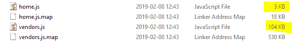

# Vue SFC 在 ASP.NET MVC 应用程序中

> 原文：<https://dev.to/keco39/vue-sfcs-in-an-aspnet-mvc-app-3e45>

[](https://res.cloudinary.com/practicaldev/image/fetch/s--5XBqIloL--/c_limit%2Cf_auto%2Cfl_progressive%2Cq_auto%2Cw_880/https://cdn-images-1.medium.com/max/768/1%2AvVQ6x4M-2gNQymyR5t5GXA.jpeg)

受[克里斯蒂·乔拉](https://medium.com/u/d3049ae2fd3a)和这篇文章的启发:[https://medium . com/corebuild-software/vue-js-and-net-MVC-b5 cede 22862](https://medium.com/corebuild-software/vue-js-and-net-mvc-b5cede228626)，我继续尝试在我们的样板解决方案中为未来的项目添加相同的功能。

从文章发表到我开始实现，webpack 从 v3 升级到了 v4，vue 引入了 vue 模板编译器(Vue 加载器的补充)。幸运的是，大部分工作保持不变…编写 SFC，并用创建的自定义标签将它们添加到您的页面。最大的挑战是迁移 webpack 配置(对我来说是做一些额外的事情),这就是我将要谈论的。

当 webpack 从 v3 升级到 v4 时，许多配置设置变得更容易了(开箱即用，就像生产模式一样，它可以缩减您的代码)，因此您将会看到一个“或多或少”精简版的配置文件，如本文所述。

```
const path = require("path");
const fs = require("fs");
const VueLoaderPlugin = require("vue-loader/lib/plugin");

const appBasePath = "./js/components/";
const jsEntries = {};

fs.readdirSync(appBasePath).forEach(name =\> {
 var indexFile = `${appBasePath}${name}/index.js`;
 if (fs.existsSync(indexFile)) {
 jsEntries[name] = indexFile;
 }
});

module.exports = {
 entry: jsEntries,
 output: {
 path: path.resolve(\_\_dirname, "../dist/js/components"),
 filename: "[name].js"
 },
 resolve: {
 alias: {
 vue$: "vue/dist/vue.esm.js"
 }
 },
 module: {
 rules: [
 {
 test: /\.vue$/,
 use: {
 loader: "vue-loader",
 options: {
 js: "babel-loader"
 }
 }
 },
 {
 test: /\.js$/,
 exclude: /node\_modules/,
 use: {
 loader: "babel-loader",
 options: {
 presets: ["[@babel/preset-env](http://twitter.com/babel/preset-env)"]
 }
 }
 },
 {
 test: /\.(css|scss)$/,
 use: ["vue-style-loader", "style-loader", "css-loader", "sass-loader"]
 }
 ]
 },
 plugins: [new VueLoaderPlugin()],
 optimization: {
 splitChunks: {
 cacheGroups: {
 commons: {
 test: /[\\/]node\_modules[\\/]/,
 name: "vendors",
 chunks: "all"
 }
 }
 }
 },
 devtool: "source-map"
}; 
```

正如您所看到的，它从创建条目的同一个循环开始(有关详细信息，请参阅提到的文章)。对于输出，我在我的“dist”文件夹中选择了一个子文件夹“components ”,因为它只用于编译 Vue 组件。之后就不要(！)忘记了‘resolve’设置为，因为我以为不会，我花了半天才想明白为什么我的编译。js 文件没有呈现我的组件。接下来的“模块”设置或多或少是相同的，除了这里或那里的一些选项(添加一个额外的包或一个简化的 Babel 7 设置)。“插件”是一个新的部分，是在最新的 vue 加载器更新中引入的。也许我最满意的部分是优化(见下面的独立部分)。

### 优化

当创建一个. js 文件时，所有包含的 SFC 和导入的节点模块被捆绑并缩小成一个大的。js 文件。因为我不需要每个页面上的每个组件，所以我使用 jsEntries 逻辑为每个页面创建了一个. js 文件。不利的一面是。js 文件将与 Vue 运行时捆绑在一起，这意味着每个文件多了+/- 100 KB。幸运的是，您可以通过创建一个额外的文件(在我的例子中是“vendors.js ”)来进行一些优化，该文件包含 Vue 组件中使用的所有公共节点模块，只构成一个(可缓存的)文件。然后可以将该文件添加到 your _Layout 页面和其他页面中。可以在每页上添加 js 文件，这样可以减少用户需要下载的 KB 数，也可以加快组件的加载速度。

[](https://res.cloudinary.com/practicaldev/image/fetch/s--vQTpmrgk--/c_limit%2Cf_auto%2Cfl_progressive%2Cq_auto%2Cw_880/https://cdn-images-1.medium.com/max/599/1%2A7XL6SNh54FaPH8-cLAoAUg.png)

### 缓存破坏

当您将 JS 文件添加到您的网页时，这些文件将被浏览器缓存，并且在新版本到达时不会更新(因为它被缓存在名称上，名称没有改变)。因为你不用内置的。NET MVC 绑定模块，这也意味着没有应用自动缓存破坏技术(用一个在你改变 JS 文件时改变的散列来改变/连接你的 JS 文件)。为此，你必须实现自己风格的缓存破坏，更多信息可以在这里找到:[https://madskristensen.net/blog/cache-busting-in-aspnet/](https://madskristensen.net/blog/cache-busting-in-aspnet/)

我更喜欢汇编版本的解决方案([https://madskristensen . net/blog/cache-busting-in-aspnet/# 546 c01e 8-b3c 7-4b 63-a863-a47de 3 DC 1507](https://madskristensen.net/blog/cache-busting-in-aspnet/#546c01e8-b3c7-4b63-a863-a47de3dc1507))，即使这意味着添加了一个 querystring，因为这不是 Google 页面速度的最佳实践。标准。NET MVC 捆绑毕竟也在做同样的事情…

如果您想将 Vue SFC 添加到您现有的 ASP.NET MVC 项目中，大概就是这样了。我之前有一篇关于 Vue 组件(非 SFC)的博客文章，但它困扰着我，因为我不能使用 SFC 的样式，所以我搜索了一下，最终找到了一个我满意的解决方案。

对于那些感兴趣的人，我在 github repo 中添加了必要的文件，所以你可以从那里复制粘贴这些东西:[https://github.com/KevinCocquyt39/mvc-vue-webpack4](https://github.com/KevinCocquyt39/mvc-vue-webpack4)

编码快乐！