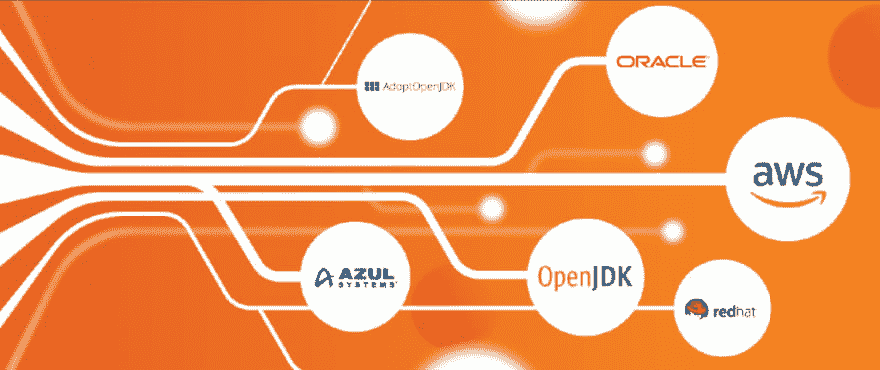

# Oracle JDK 与 OpenJDK 构建对比

> 原文：<https://dev.to/devexperts/oracle-jdk-vs-openjdk-builds-comparison-nn6>

# [T1】简介](#intro)

如果您关注 Java 社区的最新消息，您会听说 Oracle 已经改变了他们对 Java 的支持模型。

据 Oracle 网站报道，Java SE 8 正在经历遗留版本公共更新过程的尾声。这意味着甲骨文将继续为商业用户提供 Java SE 8 的免费公共更新和自动更新，直到 2019 年 1 月，为个人用户至少提供到 2020 年 12 月。

# JDK 对甲骨文的修改

过去，我们中的许多人只是简单地下载了 Oracle JDK，并在开发、测试和生产中使用它。

然后，在 2018 年，甲骨文改变了他们的 JDK 的许可。他们提供了两种不同的 JDK 版本，而不是一个可供商业用户和免费用户使用的 JDK 版本:

*   甲骨文 JDK(商业版)，可以免费用于开发和测试，但要在生产中使用则需要付费
*   Oracle 开放 JDK(开源)，可以在任何环境下免费使用

Oracle Java SE 订阅的最新价格可在[此处](http://www.oracle.com/us/corporate/pricing/price-lists/java-se-subscription-pricelist-5028356.pdf)找到。

| Java SE 平台产品 | 每月订阅价格 | 订阅指标 | 卷 |
| --- | --- | --- | --- |
| Java SE 桌面订阅 | 2,5 | 命名用户加 | 1 - 999 |
| 2,0 | 命名用户加 | 3,000 - 9,999 |
| 1,75 | 命名用户加 | 10,000 - 19,999 |
| 1,5 | 命名用户加 | 20,000 - 49,999 |
| 1,25 | 详情请联系 | 50,000+ |
| Java SE 订阅 | Two hundred and fifty thousand | 处理器 | 1999 年 1 月 1 日 |
| Two hundred and thirty-seven thousand five hundred | 处理器 | 100 - 249 |
| Two hundred and twenty-five thousand | 处理器 | 250 - 499 |
| Two hundred thousand | 处理器 | 500 - 999 |
| One hundred and seventy-five thousand | 处理器 | 1,000 - 2,999 |
| One hundred and fifty thousand | 处理器 | 3,000 - 9,999 |
| Twelve thousand five hundred | 处理器 | 10,000 - 19,999 |
| - | 详情请联系 | 20,000+ |

甲骨文许可证的变化迫使我们寻找其他 JDK 供应商。他们中的大多数都有不同的支持模型(免费的和付费的)，对提供多个 Java 版本的更新也有不同的态度。

由于甲骨文不是这场游戏中的唯一供应商，所以是时候超越他们的 JDK 了。

Devexperts 很乐意与您分享我们的研究成果。

# JDK 建造

基本上，JDK 只有一套源代码。它托管在 Mercurial 的 [OpenJDK](http://openjdk.java.net/projects/jdk/) 中。

任何人都可以获得源代码，生成一个构建，并发布它。因此，Oracle 创建了一个认证流程，用于确保构建有效。

该认证由 [Java 社区进程](https://www.jcp.org/en/home/index)运行，它提供了一个技术兼容性工具包(TCK 或 JCK 作为 Java)。如果一个组织产生了一个通过 TCK 的 OpenJDK 构建，那么这个构建可以被描述为“Java SE 兼容的”。

最流行和最著名的构建由 Red Hat、Azul 和社区主导的 Adopt OpenJDK 分发。

以下是我们研究过的 JDK 版本的完整列表:

*   甲骨文商业 JDK 公司
*   红帽打开 JDK
*   Azul 祖鲁
*   Oracle OpenJDK
*   AdoptOpenJDK
*   亚马逊闭路电视

我们使用以下标准评估了所有 JDK 版本:

*   长期支持(LTS)选项
*   TCK 合规性
*   免费/商业基础
*   支持附加功能和工具(Web-start、IntelliJ IDEA、Java FX 等)。)
*   支持的平台
*   由一家大公司支持

我们将在下文中描述主要差异，标准比较的完整列表将在本出版物末尾的表格中列出。

## 甲骨文商业 JDK

多年来，我们中的许多人一直免费使用甲骨文 JDK，所以它经常是我们的默认选项。我们已经习惯了。

对于许多公司来说，选择甲骨文商业 JDK 将是一个简单的选择。甲骨文商业 JDK 是那些不想改变什么，并准备支付的最佳选择。

### LTS 选项

Oracle 为其客户提供 Java 8 的 3 年支持计划(可延长至 5 年)和 Java 11 的 5 年支持计划(可延长至 8 年)。

| 释放；排放；发布 | 正式上市日期 | 卓越支持，直到 | 延长支持直到 | 持续支持 |
| --- | --- | --- | --- | --- |
| Java 8 | 2014 年 3 月 1 日 | 2022 年 3 月 1 日 | 2025 年 3 月 1 日 | 模糊的 |
| Java 9(非 LTS) | 2017 年 9 月 1 日 | 2018 年 3 月 1 日 | 无法使用 | 模糊的 |
| Java 10 (18.3 )(非 LTS) | 2018 年 3 月 1 日 | 2018 年 9 月 1 日 | 无法使用 | 模糊的 |
| Java 11(∞lt) | 2018 年 9 月 1 日 | 2023 年 9 月 1 日 | 2026 年 9 月 1 日 | 模糊的 |
| Java 12 (19.3^非 LTS) | 2019 年 3 月 1 日 | 2019 年 9 月 1 日 | 无法使用 | 模糊的 |

### TCK 合规

所有 JDK 版本都完全符合 TCK。

### 自由/商业基础

如果你想使用甲骨文 JDK 公司，你必须支付许可证。许可证的数量取决于注册为指定用户的个人数量以及桌面订阅或处理器的数量。

**指定用户加**是指由您授权使用安装在一台或多台服务器上的程序的个人，无论该个人在任何给定时间是否正在使用程序。

**处理器**定义为安装和/或运行 Oracle 程序的所有处理器。所需许可证的数量应通过将处理器的内核总数乘以[甲骨文
T4】处理器内核因子表](http://www.oracle.com/us/corporate/contracts/processor-core-factor-table-070634.pdf)中指定的内核处理器许可因子来确定。

根据新政策，您必须不断计算 CPU、用户、内核等的数量。生产系统会变得非常复杂..

### 支持附加功能&工具

*   在 JDK 8 中包含 JavaFX。Oracle 正在从 Java 开发工具包(JDK) 11 中删除 JavaFX，这是出于从 JDK 中抽出非核心模块并让它们退役或作为独立模块存在的总体愿望
*   在 JDK 8 和 JDK 11 中支持 AWT+Swing
*   IntelliJ IDEA 可以与所有 OpenJDK 和 AdoptOpenJDK 版本一起正常工作
*   支持 Java 飞行记录器(JFR)和 Java 任务控制(JMC)
*   支持 install4j
*   Oracle 已经从 Java 中删除了 Web Start 作为默认版本

## Red Hat JDK

red Hat Open JDK 8(Open Java Development Kit)是 Java 平台标准版(Java SE)的免费开源实现。

Red Hat 在 2018 年被 IBM 收购，这为他们提供了更大的规模、资源和能力。

### LTS 选项

RHEL 上的主要 LTS OpenJDK 版本(7、8 和 11)完全受 Red Hat 支持，Red Hat 承诺提供代码级的错误修复补丁。主要版本至少支持 6 年。例如，OpenJDK 1.8 支持到 2023 年 6 月。

|  | 添加了 RHEL 5 支持 | 添加了 RHEL 6 支持 | 添加了 RHEL 7 支持 | 结束对 OpenJDK 版本的支持 |
| --- | --- | --- | --- | --- |
| OpenJDK 6 (1.6) | Five point three | six | seven | 2016 年 12 月 1 日 |
| OpenJDK 7 (1.7) | Five point nine | Six point three | seven | 2020 年 6 月 1 日 |
| OpenJDK 8 (1.8) | 不适用的 | Six point six | Seven point one | 2023 年 6 月 1 日 |
| OpenJDK 11 | 不适用的 | 不适用的 | Seven point six | 2024 年 10 月 1 日 |

### TCK 合规

RedHat JDK 完全符合 TCK 标准。

### 自由/商业基础

OpenJDK 构建可以在 Red Hat Enterprise Linux (RHEL)中免费使用。

如果您想使用 RHEL，您应该支付许可证费用:

*   自助订阅–每台服务器每年 349 美元
*   标准订阅–每台服务器每年 799 美元
*   高级订阅–每台服务器每年 1，299 美元

### 支持附加功能&工具

*   IntelliJ IDEA 可以与所有 OpenJDK 和 AdoptOpenJDK 版本一起正常工作
*   支持 Java 飞行记录器(JFR)和 Java 任务控制(JMC)
*   支持 install4j
*   不支持 JavaFX(您需要在 RH JDK 上安装 OpenJFX)

## Azul 祖鲁

Azul 为 Java SE 的所有版本提供社区版本的 Zulu，即 Azul 认证的 OpenJDK 版本。Azul 不保证社区版 Zulu 的可用性或支持生命周期。Zulu 社区版本可以下载用于企业和嵌入式应用。

### LTS 选项

下表详细说明了 Azul 产品的每个现有和计划的 JDK 版本的支持生命周期级别。

| 释放；排放；发布 | 正式上市日期 | Oracle 公共更新结束 | Azul 祖鲁企业 | Azul 祖鲁嵌入式 |
| --- | --- | --- | --- | --- |
| Java 8 | 2014 年 3 月 1 日 | 2019 年 1 月 1 日 | 2026 年 3 月 1 日 | 2026 年 3 月 1 日 |
| Java 9(非 LTS) | 2017 年 9 月 1 日 | 2018 年 3 月 1 日 | 2020 年 3 月 1 日 | 仅限社区 |
| Java 10 (18.3 )(非 LTS) | 2018 年 3 月 1 日 | 2018 年 9 月 1 日 | 仅限社区 | 仅限社区 |
| Java 11(∞lt) | 2018 年 9 月 1 日 | 2019 年 3 月 1 日 | 2027 年 9 月 1 日 | 2027 年 9 月 1 日 |
| Java 12 (19.3^非 LTS) | 2019 年 3 月 1 日 | 2019 年 9 月 1 日 | 仅限社区 | 仅限社区 |

### TCK 合规

Azul Zulu 经过全面测试和认证。Zulu 符合 Java SE 规范，并具有与 Oracle 产品相同的性能水平，使其成为 Oracle HotSpot 的简单“替代产品”。

### 自由/商业基础

Zulu Enterprise 许可证基于运行 Java 应用程序的受支持系统(台式机和/或虚拟或物理服务器)的数量，以订阅为基础进行定价。

| 受支持系统的最大数量 | 价格/年(标准支持) | 价格/年(特优支持) |
| --- | --- | --- |
| Twenty-five | Thirteen thousand two hundred | 无法使用 |
| One hundred | Thirty-one thousand six hundred | Thirty-seven thousand nine hundred |
| One thousand | Ninety-four thousand nine hundred | One hundred and thirteen thousand nine hundred |
| 无限的 | Two hundred and eighty-four thousand six hundred | Three hundred and forty-one thousand five hundred |

### 支持附加功能&工具

*   IntelliJ IDEA 可以与所有 OpenJDK 和 AdoptOpenJDK 版本一起正常工作。
*   支持 install4j
*   Docker 完全支持的 Java

*   不支持 Java 飞行记录器(JFR)和 Java 任务控制(JMC)

*   不支持 JavaFX(需要在 Azul Zulu 上安装 OpenJFX)

## Oracle OpenJDK

由 Oracle 工程师和社区支持的普通版本 JDK。他们通常首先获得最新的功能。

### LTS 选项

不，LTS，每个版本都有 6 个月的支持周期，如果你想使用一个受支持的 Java 版本，你必须更新 JDK。由于不断更新和不稳定的 GDK，它可能会导致安全风险。

### TCK 合规

Azul Zulu 完全符合 TCK 标准。

### 自由/商业基础

Oracle OpenJDK 可在包括生产环境在内的所有环境中免费使用。

### 支持附加功能&工具

*   IntelliJ IDEA 可以与所有 OpenJDK 和 AdoptOpenJDK 版本一起正常工作
*   在 OpenJDK 11+中支持 Java 飞行记录器(JFR)和 Java 任务控制(JMC)
*   支持 install4j
*   在 JDK 8 中不支持 Java FX(Java FX 仍在 OpenJFX 中开发，open jfx 是 OpenJDK 社区旗下的一个项目)

## 亚马逊科雷托

Amazon Corretto 是开放 Java 开发工具包(OpenJDK)的免费、多平台、生产就绪发行版。

亚马逊表示，Corretto 已经准备好生产，可以从亚马逊网站下载，但目前仍处于预览模式。计划于 2019 年在 Q1 全面上市，还将包括 Ubuntu 和 Red Hat Enterprise Linux 平台。与这些平台上的开放 JDK 11 相对应的科雷托 11 版本将在 2019 年 4 月之前进行测试。

### LTS 选项

亚马逊将至少在 2023 年 6 月之前免费分发 Corretto 8 的安全更新，至少在 2024 年 8 月之前免费分发 Corretto 11 的安全更新。尽管如此，我们还是找不到任何官方和公开的 LTS 计划。

### TCK 合规

亚马逊 Corretto 完全符合 TCK 标准。它已经过认证，符合 Java SE 标准，可以作为许多 Java SE 发行版的替代产品。

### 自由/商业基础

亚马逊 Corretto 可以免费下载和使用。没有额外的付费功能或限制。

### 支持附加功能&工具

*   Corretto 包含 JavaFX，因此可用于轻松启动基于 JavaFX 的应用程序
*   IntelliJ IDEA 可以与所有 OpenJDK 和 AdoptOpenJDK 版本一起正常工作
*   支持 Java 飞行记录器(JFR)和 Java 任务控制(JMC)因为 Coretto 是基于 OpenJDK 11+的
*   没有 webstart 功能

## 采用 OpenJDK

Adopt OpenJDK 是一个受社区和赞助商支持的流行的 OpenJDK 版本。

### LTS 选项

采用 OpenJDK 将生产至少四年的 LTS 版本。

| 释放；排放；发布 | 正式上市日期 | 可用性结束 |
| --- | --- | --- |
| Java 8(lt) | 2014 年 3 月 1 日 | 至少 2023 年 9 月 |
| Java 9 | 2017 年 9 月 1 日 | 2018 年 3 月 1 日 |
| Java 10 | 2018 年 3 月 1 日 | 2018 年 9 月 1 日 |
| Java 11(lt) | 2018 年 9 月 1 日 | 至少 2022 年 9 月 |

### TCK 合规

注意，Adopt OpenJDK 是列表中唯一没有通过 TCK 的 JDK 版本。

在这个阶段，他们还不能与 Oracle 达成协议，根据 OpenJDK 社区 TCK 许可协议(OCTLA)的条款使用 Java SE 技术兼容性工具包(TCK)。

### 自由/商业基础

采用 OpenJDK 可以在包括生产在内的所有环境中免费使用。

### 支持附加功能&工具

*   IntelliJ IDEA 可以与所有 OpenJDK 和 AdoptOpenJDK 版本一起正常工作
*   不支持 Java 飞行记录器(JFR)和 Java 任务控制(JMC)

*   不支持 JavaFX

*   没有 webstart 功能

# 对照表

| 标准 | 甲骨文 JDK 公司 | Red Hat OpenJDK | Azul 祖鲁 | Oracle OpenJDK | 亚马逊合唱团 | AdoptOpenJDK |
| --- | --- | --- | --- | --- | --- | --- |
| 长期支持(LTS)选项 | + Java 8 到 2022 年 3 月(卓越支持)和 2025 年 3 月(扩展支持) | +红帽的 LTS 开放 JDK 8 到 2023 年 6 月 | + Java 8 支持到 2026 年 3 月 | -没有 LTS | + Java 8 支持到 2023 年 6 月 | + Java 8 支持到 2023 年 9 月 |
|  | + Java 11 到 2023 年 9 月(卓越支持)和 2026 年 9 月(扩展支持) | +红帽 LTS 公开赛 JDK 11 至 2024 年 10 月 | + Java 11 支持到 2027 年 9 月 | -每个版本的支持周期为 6 个月，如果您想使用受支持的 Java 版本，则必须更新 JDK | + Java 11 支持到 2024 年 8 月 | + Java 11 支持到 2022 年 9 月 |
| TCK 合规性 | +符合 | +符合 | +符合 | +符合 | +符合 | -不合规 |
| 免费/商业基础 | 需要购买许可证。 | JDK 自由了。 | 需要根据支持的系统数量购买订购包 | JDK 自由了 | JDK 自由了 | JDK 自由了 |
|  | 许可证数量基于处理器、内核和使用 Java 的用户数量。 | 需要在 RHEL 上购买每台服务器的许可证。 |  |  |  |  |
| 支持附加功能和工具(Web-start、IntelliJ IDEA、Java FX 等)。) | +在 JDK 8 中包含 JavaFX(但是 Oracle 正在从 Java 开发工具包(JDK) 11 中删除 JavaFX) | + IntelliJ IDEA 可与所有 OpenJDK 和 AdoptOpenJDK 版本一起正常工作 | + IntelliJ IDEA 可与所有 OpenJDK 和 AdoptOpenJDK 版本一起正常工作 | IntelliJ IDEA 可以与所有 OpenJDK 和 AdoptOpenJDK 版本一起正常工作 | + Corretto 包含 JavaFX，因此可用于轻松启动基于 JavaFX 的应用程序 | + IntelliJ IDEA 可与所有 OpenJDK 和 AdoptOpenJDK 版本一起正常工作 |
|  | + IntelliJ IDEA 可与所有 OpenJDK 和 AdoptOpenJDK 版本一起正常工作 | +支持 Java 飞行记录器(JFR)和 Java 任务控制(JMC) | +支持 install4j | 在 OpenJDK 11+中支持 Java 飞行记录器(JFR)和 Java 任务控制(JMC) | + IntelliJ IDEA 可与所有 OpenJDK 和 AdoptOpenJDK 版本一起正常工作 | +不支持 Java 飞行记录器(JFR)和 Java 任务控制(JMC) |
|  | +支持 Java 飞行记录器(JFR)和 Java 任务控制(JMC) | +支持 install4j | Docker 完全支持的 Java | 支持 install4j | +支持 Java 飞行记录器(JFR)和 Java 任务控制(JMC)因为 Coretto 是基于 OpenJDK 11+的 | -不支持 JavaFX |
|  | +支持 install4j | -不支持 JavaFX(您需要在 RH JDK 上安装 OpenJFX) | -不支持 Java 飞行记录器(JFR)和 Java 任务控制(JMC) | 在 JDK 8 中不支持 Java FX(Java FX 仍在 OpenJFX 中开发，open jfx 是 OpenJDK 社区旗下的一个项目) | -没有 webstart 功能 | -没有 webstart 功能 |
|  | - Oracle 已经从 Java 的默认版本中删除了 Web Start |  | -不支持 JavaFX(需要在 Azul Zulu 上安装 OpenJFX) |  |  |  |
| 支持的平台 | 支持 Windows x32 和 x64 以及 macOS x64 | 支持 Windows x32 和 x64 以及 macOS x64 | 支持 Windows x32 和 x64 以及 macOS x64 | 支持 Windows x32 和 x64 以及 macOS x64 | 支持 Windows x32 和 x64 以及 macOS x64 | 支持 Windows x32 和 x64 以及 macOS x64 |
| 由一家大公司支持 | +甲骨文 | +红帽和 IBM | +- Azul | -社区 | +亚马逊 | -社区 |

# 结论

从 2019 年 1 月起，甲骨文 JDK 8 将不再接收公开更新。现在改变你的 JDK 还为时不晚。如果你想获得 Java 8 的更新，你可能需要向甲骨文付费或者寻找另一个 JDK 版本。

*   **LTS 选项:**甲骨文已经改变了其针对 Java 8、9、10 和 11 的 LTS 政策
    *   如果您正在使用 Oracle Java 9 或 10，您应该更换您的 JDK 供应商，因为 Oracle 将不再支持这些版本，即使是商业版本
    *   其他供应商可能提供对 Java 9、Java 10 的支持以及对 Java 8 的扩展支持
*   当你使用最初的甲骨文 JDK 时，这不成问题。但是不要担心——大多数替代的 JDK 版本都是 TCK 兼容的。虽然它仍然是选择 JDK 产品的必备标准。
*   **价格:**生产中的 JDK 的甲骨文价格相当高
    *   您仍然可以在开发和测试环境中免费使用 Oracle JDK
    *   其他供应商可能会提供更低的价格和更适合您系统的计算模型
    *   其他供应商可能提供功能有限的免费订阅
*   **支持附加功能&工具:**
    *   所有 JDK 版本都有不同的支持工具和特性。检查所需功能是否包含在默认软件包中，或者是否可以通过插件安装
*   **支持的平台:**
    *   所有 JDK 版本都支持 Windows x32 和 x64 以及 macOS x64