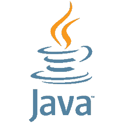
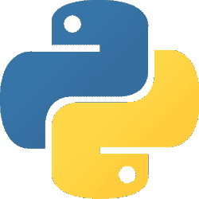
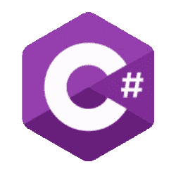

# 五种最容易学习的编程语言

> [https://dev . to/campus MVP/los-5 程序语言 CIN-ms-fciles-learning-2lff](https://dev.to/campusmvp/los-5-lenguajes-de-programacin-ms-fciles-de-aprender-2lff)

> Post 原件:https://www . campus MVP . es/resources/post/los-5-编程语言-MAS-易学. aspx

学习编程可能是一项艰巨的任务，而不是看起来那么困难。信息的获取几乎是无限的:如今，除了开发人员社区和编程专家共享知识之外，还有大量的资源，既有在线资源，也有*离线资源。*

但是，在学习编程时，选择合适的语言和学习过程一样重要。在较早的[*【post】*](https://dev.to/campusmvp/cmo-aprender-a-programar-3-lenguajes-por-los-que-empezar-ln0-temp-slug-1806261)中，我们向大家介绍了如何学习编程。本文将会发现**5 种最容易学习的编程语言**。

在继续之前，我们需要澄清一下我们所说的“T1”这个词是什么意思，因为它的含义因语言而异，也就是说，使编程语言变得“容易”学习会因语言而异。例如:某些语言具有直观的语法；另一些国家虽然在理论上可能比较复杂，但拥有一个非常活跃的社区可以弥补这一困难。此外，这是一个相当主观的问题，但我们认为，选择是有意思的，因为它涉及的语言既没有复杂的语法，也不需要事先掌握大量的知识。

## JavaScript

JavaScript 是目前使用最广泛、需求量最大的语言，并已集成到许多应用程序中。如果您想专注于 web 开发，学习 JavaScript 是必不可少的，因为它是在任何浏览器中本机运行的，所以您不需要编译它。你只需要一个记事本就可以开始了。

这是一种软弱无力的语言，使它更容易学习，但也更容易被你搞砸。其语法与其他语言(如 c、C++、Java 或 C#)类似，因此也是进一步研究更复杂编程语言的入口。

> **注意**:不要把 JavaScript 和 Java 混为一谈。我们的 JavaScript 专家导师在[这篇帖子](https://www.campusmvp.es/recursos/post/Java-y-JavaScript-son-lo-mismo.aspx)中向您阐明了这一点，这是基本但必要的。

### Usos

*   web 开发
*   Desarrollo 后端
*   IoT 应用程序
*   其他人

### 优点

*   很简单
*   多个可能的应用程序
*   多平台
*   这是一个标准
*   通往其他技术的大门

### 对比

*   弱类型
*   Más difícil 检测 tipo lógico 的 bug

## Java

Java 既可用于 web 应用程序，也可用于桌面应用程序、服务器等-我...。他的口号一直是"写一次，到处处决"，但这并不像现在那样平常。这种面向对象的基于类的编程语言，**总是在人气和就业需求排名**中名列前茅。

它的广泛流行反映在:

*   Java 有一个最大、最活跃的开发者社区，所以你永远不会感到孤独。
*   尤其是大型企业总是在寻找具备 Java 知识的人。
*   运行 Java 的设备超过了 150 亿台

学习 Java 比学习 JavaScript 更困难，因为它的包中有许多数据类型和成千上万个类。但是，Java 通过促进强大的分析编程知识基础，对于初学者来说仍然是一种很棒但稍难的编程语言。

### Usos

*   Desarrollo web 后端
*   桌面开发
*   移动开发

### 优点

*   人气与需求
*   稳定的语言
*   大型支援社群

### 对比

*   更不用说失败了。
*   还必须学习 Java 平台，该平台有成千上万个类，这可能是一个挑战
*   需要更强的分析思维能力。

## 巨蟒

**Python 是面向初学者的大型简易编程语言**。Python 用于 web 和桌面应用，近年来由于是**机器学习和人工智能中使用最广泛的语言**而大受欢迎。这种动态语言支持面向对象的编程、过程和功能编程。

此外，它是一种开源语言，与 Java 一样，它有一个虔诚的社区。

除了灵活性和通用性之外，浮游植物还是初学者的首选语言。

### Usos

*   web 应用程序
*   桌面应用程序。
*   机器学习和人工智能

### 优点

*   简单的语法
*   马上行动
*   大社区

### 对比

*   不适用于某些类型的开发，例如移动应用程序

## C

**C#是初学者不可思议的选择**。有一种很快很简单的测试方法:只要[下载 Visual Studio 社区](https://visualstudio.microsoft.com/es/vs/community/)。C #可用于多种用途，从 web 开发到控制台应用程序，使用. NET 平台几乎可以创建任何内容:桌面应用程序、服务器、云、移动-我...。

C#语法以 C++(和 Java)为基础，因此对于初学者来说，它看起来可能是一种复杂的语言。但是，Visual Studio 的自动完成选项、项目的自动创建以及整个开发环境的易用性，使该语言成为编程人员的一个不错的选择。

### Usos

*   后端 web 应用程序
*   桌面应用程序
*   移动应用程序
*   云应用程序

### 优点

*   广泛使用
*   Visual Studio 提供丰富的学习体验并减少故障
*   IDE fácil de usar

### 对比

*   . NET 平台也需要学习成千上万个课程，这可能是一个挑战
*   在某些环境中部署可能很复杂

## 红宝石轨道

Ruby on Rails 易于阅读，因为它的设计看起来像英语，对于任何没有编程经验的人来说，这是一个巨大的优势。Ruby 是一种动态面向对象的语言，在 web 开发中广泛使用。

学习 **Ruby on Rails** (Ruby 是编程语言，Rails 是一个以该语言工作的*框架*web 应用程序)非常容易，因为不需要学习成百上千节课。此外，它还可以方便地链接到数据和其他通常复杂的操作。

是很多企业从一开始就选择的语言，因为可以说“**”没有进入障碍**。

### Usos

*   web 开发

### 优点

*   准平面学习曲线
*   web 应用程序开发速度很快，您看到的结果很快

### 对比

*   近年来，随着新的选择，它已变得相当陈旧
*   社区比其他语言小

> Post 原件:https://www . campus MVP . es/resources/post/los-5-编程语言-MAS-易学. aspx