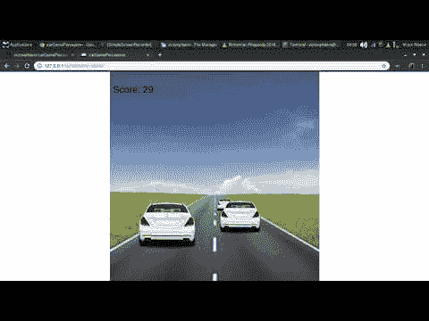

# 请问能让我的神经网络开车吗？

> 原文：<https://dev.to/victorqribeiro/excuse-me-would-you-let-my-neural-network-drive-25he>

# 请问可以让我的神经网络驱动吗？

一个涉及 JavaScript 游戏的神经网络实验:感知器能开汽车吗？

代码的实时版本托管在[这里](https://victorribeiro.com/carGamePerceptron)

# 关于

不久前，我发表了[你将会看到的最简单的感知机](https://github.com/victorqribeiro/perceptron)，这是我不久前在机器学习课上写的代码。从那以后，我一直想用它做些酷的事情。于是，浏览了一些[更多的旧代码](http://jsfiddle.net/user/victorqribeiro)我发现了一个[的小游戏](https://github.com/victorqribeiro/carGame)是我在研究假 3D 透视时做的，于是我想:我的感知器可以玩这个游戏吗？

所以我给游戏代码刷了一下，又写了一些代码来捕捉我玩它的数据(我一直玩到我得了 33 分)，并把它馈送到我的神经网络。之后，我只是玩学习率和迭代，让它自己玩游戏。

你说一个[神经进化](https://en.wikipedia.org/wiki/Neuroevolution)？是的，我想过。我有一个完全连接的多层感知器，我马上就要实现了，所以我把用遗传算法进化神经网络的想法留到那时候。

# 提问？

如果您对代码或我如何实现它有任何问题，甚至对我如何获得数据来输入神经网络(功能)有任何问题，请随时与我联系。(我在代码上留了一些注释)

你可以在这里看一下代码