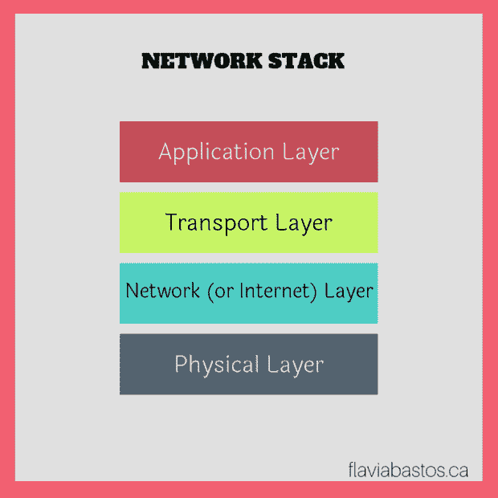

# 开发人员网络–第 2 部分:应用层和传输层

> 原文：<https://dev.to/flaviabastos/networking-for-developers--part-2-application-and-transport-layers-21dh>

> 注意:在这个帖子系列中赶上以前的帖子:
> 
> <cite>[第一部分:概述](https://wp.me/pa0b0y-2s)</cite>

网络堆栈有四层:应用层、传输层、网络层(或互联网)和物理层。这篇文章将覆盖最上面的两层:应用层和传输层，它们共同帮助目标计算机识别它通过网络接收的数据类型。

[](https://res.cloudinary.com/practicaldev/image/fetch/s--qeBm0cFB--/c_limit%2Cf_auto%2Cfl_progressive%2Cq_auto%2Cw_880/https://testfbdotblog.files.wordpress.com/2019/01/internet-stack_layers-1.png%3Fw%3D620)

应用层有网络应用程序:用户可以与之交互的客户机和服务器。网络客户端应用程序的示例有 web 浏览器、电子邮件应用程序等。网络服务器应用程序的例子有 web 服务器、电子邮件服务器、安全外壳(ssh)等。网络客户端连接到网络服务器，使事情的工作。

网络客户端使用操作系统的传输层和协议，因此两个顶层(应用层和传输层)紧密合作(TCP 和 UPD 是最常见的传输协议)。网络服务器通过与网络端口交互来监听和响应网络客户端发起的动作。

端口是与 IP 地址相关联的一个数字，有助于识别与主机中特定服务器的连接。更简单地说，打个比方:如果我说我住在主街 123 号 34 单元，主街 123 号部分就是 IP，34 号是端口——字面意思是我家的门！有很多人住在主街 123 号，但只有我住在 34 号公寓，如果你想拜访我，你必须敲 34 号门。

按照惯例，有一些端口是为特定服务保留的，网络标准文档 RFC6335 列出了这些端口(在 Linux 计算机中，也可以在 */etc/services* 下看到列表)。一些常见的有:

*   ssh 为 22
*   23 用于远程登录
*   http 为 80
*   443 https

因此，应用程序可以使用 TCP 协议来打开自己计算机上的一个本地端口与远程主机上的一个端口之间的连接，但只有当远程主机有一个进程在侦听该端口时，才能建立通信。

是操作系统中的 TCP 实现将数据流分解成数据包。数据包可能会无序到达，TCP 将负责检查和修复流。在 TCP 连接中，客户端和服务器之间有来回的通信和确认。

UDP 是一种简单得多的传输层协议:主机向远程服务器上的端口发送消息(数据包),但没有检查、没有纠正、没有数据流，只有单个消息。它通常用于视频流(如果其中一个数据包丢失，这不是什么大问题！).虽然 TCP 连接类似于对话，但 UDP 看起来更像独白。

### 应用层和传输层故障排除

尽管我们可以将网络堆栈分成整齐的层，但实际上它们是紧密相连的，因此许多诊断和故障排除工具最终会显示来自多个层的信息。

这里有一些方法可以找出主要在最上面两层发生了什么——注意，这些都是命令行工具:

#### lsof

```
lsof -n -i 
```

Enter fullscreen mode Exit fullscreen mode

列出当前使用或监听本地主机端口的程序(该命令还会跟踪打开的文件)。如果它作为根用户运行，它将显示来自多个用户的进程。查看打开了哪些端口以及是否有任何网络客户端连接会很有用。如果您只对一个特定的端口感兴趣，将该端口号添加到命令中，如下所示:

```
lsof -n -i:port\_number 
```

Enter fullscreen mode Exit fullscreen mode

#### ss

ss 是现在已经过时的(也是最著名的) *netstat* 的替代品。它显示套接字统计和类似的信息，如所有网络连接，这些信息由 *netstat* 显示。

在下面的命令中，-n 代表“数字”,将显示地址而不是主机名，而-t 将输出限制为仅 TCP 连接。本文档显示了 TCP 连接的各种状态。如果使用选项-a，它将显示监听和非监听连接(对于 TCP，这意味着所有连接都处于“已建立”状态)。

```
ss -nt 
```

Enter fullscreen mode Exit fullscreen mode

#### tcpdump

这将列出通过您网络的每个数据包及其内容，因此在运行此命令时要小心，因为您将暴露所有未加密的数据。

*tcpdump* 有许多过滤器(在这种情况下它们被称为原语)，如果你对一个特定的端口感兴趣，这就是你如何运行它:

```
tcpdump port port\_number\_goes\_here 
```

Enter fullscreen mode Exit fullscreen mode

#### nc

*nc，*也被称为 *netcat* ，可以连接到远程 TCP/UDP 端口，监听端口，扫描端口，以及一些更有用的东西。只有当连接的另一端结束连接时，它才会终止——你可以通过点击 *CTRL-C _ 来结束连接。您可以通过运行(这是一个网络客户端的例子):
来启动到特定*端口*上的 _host* 的 TCP 连接

```
nc host port 
```

Enter fullscreen mode Exit fullscreen mode

或者您可以通过运行(这是一个网络服务器的例子):
来监听(等待)特定端口上的连接

```
netcat -l -p port\_number\_goes\_here 
```

Enter fullscreen mode Exit fullscreen mode

#### nmap

nmap 将列出远程主机中所有可访问的端口，所以再次注意使用这个工具——你可能需要请求许可。要列出*主机*(名称或 ip)上所有可访问端口，运行:

```
nmap host 
```

Enter fullscreen mode Exit fullscreen mode

* * *

唷！这是很多，但是，相信我，我只是触及了表面。还有很多(很多很多！)要说这两层。也许改天吧！我将在以后的文章中介绍其他层。

> *帖子* [开发者网络-第二部分:应用层和传输层](https://wp.me/pa0b0y-2G) _ 最初发布于 _ [flaviabastos.ca](https://flaviabastos.ca/)