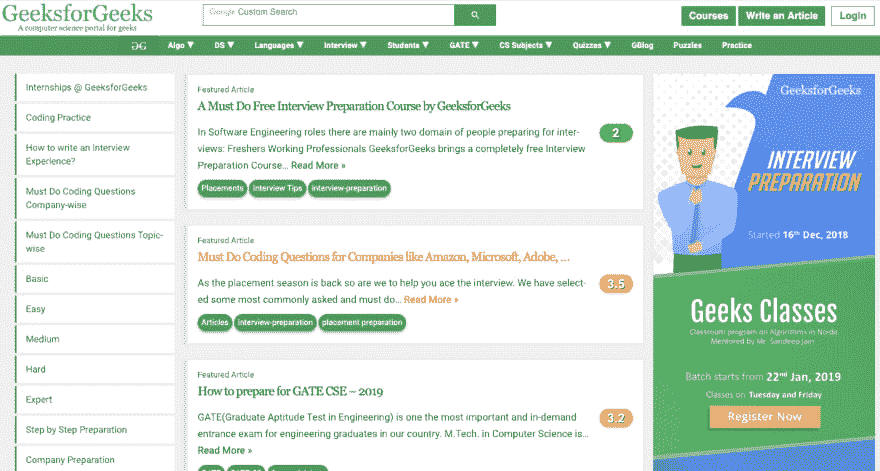

# 成为 Java 语言大师应该学习什么

> 原文：<https://dev.to/selawsky/what-you-should-learn-to-become-a-master-yoda-in-java-5c7d>

所以你决定成为一名爪哇绝地…你前面的路还很长。

道路从每天写代码，练习，学一点点理论开始。第一大步是练 Java 核心。这一步是关键，由几个层次组成(见下文)。第二步是学习每个现代软件开发人员都应该知道的不同技术。最后一步取决于特定的 Java Padavan 想要做什么。“训练自己放下你害怕失去的一切”——尤达说。

## 第一步:Java Core+

### 零级:Java 语法

这就像学习 Java 的基础知识一样。当你还是个孩子的时候，学习如何写你，你获得了对字母和单词的理解，以及如何一起使用它们。编程语言也是如此。不用担心这个水平。你在练习中逐步吸收 Java 语法。

主题:

*   什么是对象
*   什么是类
*   什么是方法
*   原始类型
*   类型字符串
*   基本运算符
*   Java if-else 语句
*   循环语句(for，while)
*   数组

### 第一级:面向对象

OOP 不是世界上最难的题目，但却极其重要。阅读和实践 OOP 原则都很重要。

类继承、接口实现、数据和行为的抽象、数据和类实现的封装、多态和虚方法都是关键主题。实践这些概念并阅读书籍(例如，凯·霍斯特曼，加里·科内尔*的《核心 Java 》,麦克劳克林的《面向对象的分析和设计》*)。

### 级别 2: Java 集合

你可以称一组单独的对象为一个单元**集合**。Java 提供了集合框架，它定义了几个类和接口来将一组对象表示为一个单元。

您将通过 Java Collections 接口(`java.util.Collection`)和 Map 接口(`java.util.Map`)学习数据结构。你可以称它们为 Java 集合类的两个主要“根”接口。

### 级别 3: Java 异常

异常(或异常事件)是在程序执行过程中出现的异常情况。这种机制极大地简化了程序中的 bug 捕获。所有异常类都是`java.lang.Exception class`的子类型，每个 Java 学生都应该非常了解它。

### 级别 4:输入/输出流

Java 通过流执行输入和输出操作。你可以把一个流想象成一个连续的数据流。这个话题对初学者来说可能会有问题。学习这个话题的一个好处是你发现了`System.out.println()`的真正含义。

### 第五级:算法和谜题

算法呢？对于学习如何编写排序或搜索算法的价值，经常会有争论。在学习集合和数据结构的过程中，你会发现排序/搜索方法。Java 和大多数语言都有实现所有已知排序和搜索算法的库。这意味着它们已经被编写好供您使用。那么，你应该(或不应该)担心学习如何编码它们吗？

我更喜欢的答案是——你应该学习它，以便知道如何更好地像软件工程师一样思考。创建你自己的算法实现，以及理解它们的复杂性是非常有用的。尤其是对于只在高中学过数学的人来说。

所有流行的排序和搜索算法都在网络上多次描述和求解。所以你不需要一个验证器来验证。选择任何课程，例如普林斯顿大学或 CS50 或 Youtube 视频，并尝试编写自己的版本。

谜题或非标准类型的 Java 任务怎么办？它们对任何程序员都非常有帮助，因为你学会了如何解决困难和模糊的问题。

### 第 6 级:Java 多线程

零级以后的每个人都可以编写一个显示“Hello World”的程序，但是如果您应该使用 Java Thread API 来完成它，以便从一个额外的线程中打印出这个著名的短语呢？如果程序应该从五个不同的线程打印五次“Hello world ”,而没有交替的字符串，那会怎么样呢？多线程对于最简单的任务来说都是困难的，这是一个高级的 Java 主题。

### 级别 7: Java 模式

在这个层次上，你会知道你可以写一点程序。他们够好吗？它们看起来像专业代码吗？要像专业人士一样写代码，必须先学习设计模式。它们代表了有经验的软件开发人员使用的最佳实践。设计模式解决了软件开发人员在开发过程中面临的许多一般性问题。这些模式是众多软件开发人员在相当长的一段时间内反复试验的结果。

### 级别 8:单元测试

对于任何编写单元测试代码的程序员来说，这是一项重要的技能。当你弄清楚如何编写测试时，你应该把它作为一种习惯应用到你所有的项目中。单元测试比使用控制台输出进行检查有用得多。单元测试也是公司通常信任新开发人员编写的第一件事。

### 第九级:兰姆达斯

Java 8 中出现了对 lambda 表达式的支持，但并不是所有的程序员都采用了它。然而，今天“Java 初级任务”的概念包括 lambda 表达式的操作，所以我建议也学习它们。

### 级别 10:JSON、RMI、HttpUrlConnection、socket 中的序列化

这些主题面向更高级和中级的 Java 开发人员。他们需要更深层次的知识，并充当他们自己的项目、实习和工作的桥梁。

### 哪里可以找到 0-10 级的实用任务？

[code gym](https://codegym.cc/)—这是一门 Java 核心课程，有 1000 多个带验证的编码任务。

w3 resource——一个非常著名的优秀网站。

GeeksForGeeks (尤其是算法和谜题)——非常好的资源，有许多任务和不同的课程。

## 第二步:附加产品

Java developer 不仅使用 Java，还使用许多不同的技术。其中一些成为了每个人的标准。然而，这并不意味着你必须像了解 Java 核心那样了解这些技术。多学一点，其中一些你会在工作或实习期间发现得更好。

**饭桶。**这是最广泛使用的版本控制系统，用于跟踪计算机文件的变化，并协调多人对这些文件的工作。所以如果你想成为一名职业程序员，理解 Git 是一个要求。几乎每个软件公司都使用它。

在这里学:在这里学:[学 Git 分支](https://learngitbranching.js.org/)或者在这里:[什么是 Git](https://www.atlassian.com/git/tutorials/what-is-git)

**JavaScript。**这种跨平台、面向对象的脚本语言可以在 ever web 浏览器中找到。JavaScript 可以连接到其环境的对象，以提供对它们的编程控制。所以 JavaScript 无处不在，即使你不想做前端开发人员,“JavaScript”这个词对你的简历来说也是一个很好的补充。

在这里学习: [w3resource](https://www.w3resource.com/javascript-exercises/) 或者在这里: [codecademy](https://www.codecademy.com/learn/introduction-to-javascript)

**SQL。**维基百科定义为“结构化查询语言(Structured Query Language)是一种用于编程的领域特定语言，设计用于管理关系数据库管理系统(RDBMS)中保存的数据，或用于关系数据流管理系统(RDSMS)中的流处理。”在初级水平上学习它是相当容易的。几乎每个程序员都在某个时候使用过 SQL。

在这里学习: [SQLBolt](https://sqlbolt.com/) 或者在这里 [w3schools](https://www.w3schools.com/sql/)

## 第三步:成为大师

大多数 Java 开发人员从事两个领域的工作，移动技术或企业项目。在前两步获得核心知识后，我们分成两个不同的分支。我们不会详细讨论它们，但是每个分支都值得一篇特别的文章。简而言之:

## 移动技术

Java 知识为你打开了 Android 开发的世界。学习 Android 编程的好地方:Google 开发者培训

## 企业技术

这由一堆自己很难学会的技术组成。最好是找课程或者实习。了解 Spring(最流行的 Java 框架)和 Hibernate(对象关系映射工具)以及其他相关技术是有益的，这些都在这个免费的 Udemy 课程中讲授。

如果你选择了 Java 开发者之路，愿力量与你同在！

首次发布于 [GitConnected](https://levelup.gitconnected.com/what-you-should-learn-to-become-a-master-yoda-in-java-59c69207df78)