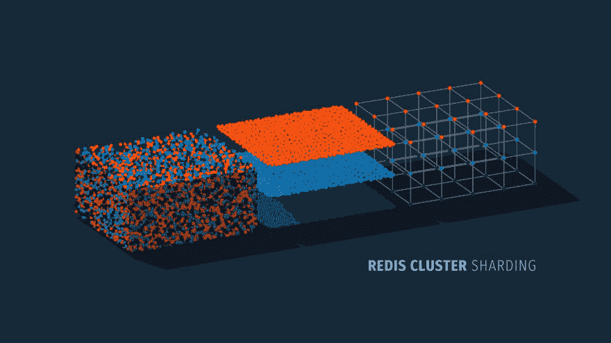
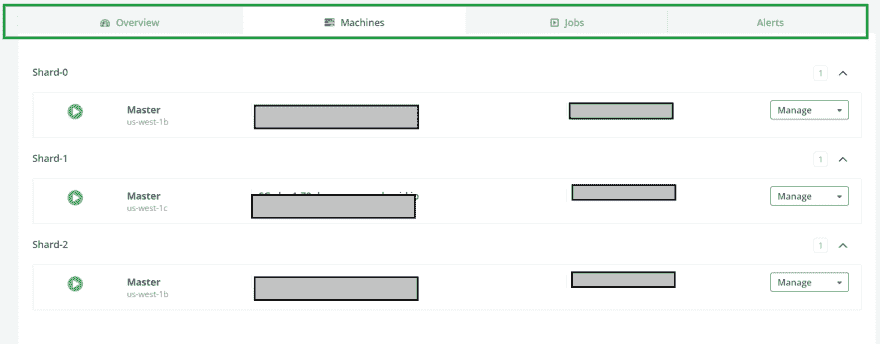

# Redis 集群分片简介——优势、限制、部署和客户端连接

> 原文：<https://dev.to/scalegrid/intro-to-redis-cluster-sharding--advantages-limitations-deploying--client-connections-5g82>

[](https://scalegrid.io/blog/intro-to-redis-cluster-sharding-advantages-limitations-deploying-and-client-connections/)

[Redis Cluster](https://scalegrid.io/blog/highly-available-redis-clusters-with-automated-sharding-launches-at-scalegrid "Highly Available Redis Clusters with Automated Sharding Launches at ScaleGrid") 是 Redis 中可用的本地分片实现，允许您在多个节点上自动分发数据，而无需依赖外部工具和实用程序。在 ScaleGrid，我们最近通过完全管理的 [Redis 托管](https://scalegrid.io/redis.html "Redis Hosting")计划，在我们的平台上增加了对 Redis 集群的支持。在本帖中，我们将向您介绍先进的 [Redis 集群分片](https://scalegrid.io/blog/intro-to-redis-cluster-sharding-advantages-limitations-deploying-and-client-connections/)机会，讨论其优势和局限性，何时应该部署，以及如何连接到您的 Redis 集群。

## 使用 Redis 集群进行分片

Redis 集群中的整个键空间被分成 16384 个槽(称为哈希槽)，这些槽被分配给多个 Redis 节点。给定的键被映射到这些槽中的一个，并且键的散列槽被计算为:

HASH_SLOT = CRC16(key) mod 16384

Redis 集群支持多键操作，只要单个命令执行中涉及的所有键都属于同一个哈希槽。这可以使用[散列标签](https://redis.io/topics/cluster-spec#keys-hash-tags)的概念来确保。

[Redis 集群规范](https://redis.io/topics/cluster-spec)是理解技术内部的权威指南，而 [Redis 集群教程](https://redis.io/topics/cluster-tutorial)提供了部署和管理指南。

## 优势

查看 Redis 集群的主要优势，了解它如何为您的部署带来好处:

*   ### 高性能

    Redis 集群保证了与独立 Redis 部署相同的性能水平。
*   ### 高可用性

    Redis 集群支持标准的 Redis 主副本配置，确保高可用性和持久性。它还实现了一个类似[筏](https://en.wikipedia.org/wiki/Raft_(computer_science))的[共识方法](https://redis.io/topics/cluster-spec#configuration-handling-propagation-and-failovers)来确保整个集群的可用性。
*   ### 水平和垂直可扩展性

    在集群中添加或删除新的 Redis 节点可以透明地进行，不会造成任何停机。这使得添加和删除碎片、退出或扩展单个节点变得容易。
*   ### 本地解决方案

    部署 Redis 集群不需要外部代理或工具，因此不需要学习或担心新的工具。它还提供了与独立 Redis 部署的几乎完全的兼容性。

## 限制

我们还要了解一些限制，以确保它适合您的部署:

*   ### 需要客户端支持

    客户端需要做出改变以支持 Redis 集群。虽然 Redis 集群已经存在很多年了，但是仍然有客户不支持它。在选择部署 Redis 集群之前，请参考 [Redis 客户端](https://redis.io/clients)文档，以确保您使用的客户端是受支持的。
*   ### 有限多键操作支持

    如前所述，只有当一次操作中的所有按键都属于同一个插槽时，才支持多键操作。这是在设计数据结构时要小心的事情。
*   ### 仅支持一个数据库

    与独立数据库不同，Redis 集群只支持一个数据库(数据库 0)，并且不允许使用 [SELECT](https://redis.io/topics/cluster-spec#implemented-subset) 命令。由于大多数人不使用多个数据库，这也不是一个主要的限制。

## 什么时候应该部署 Redis 集群？

如果您需要一个分片的 Redis 解决方案，Redis 集群解决方案可能非常适合您。Redis 集群是一个简单的本地解决方案，提供了出色的性能。

通常，当人们开始让一个独立的 Redis 节点充满写操作，并希望将写操作分散到多个节点时，他们就会开始考虑对 Redis 部署进行分片。尽管 Redis 主要是单线程的，但 I/O 通常会在 CPU 达到饱和之前成为独立的网络或内存。通过选择向独立系统添加更多内存，可以在一定程度上克服内存限制，但从成本、备份、重启、预热时间等方面来看，这开始变得令人望而却步。超过某一点。

另一方面，如果您只想将读取分散到多个节点上，那么只需将读取副本添加到独立节点上就简单多了。

与 Redis 的其他分片解决方案相比，Redis 集群中的分片再平衡对应用程序是透明的。这使得在不影响应用程序的情况下添加或删除碎片变得非常容易。

## 连接到 Redis 集群

如果您选择使用 ScaleGrid 部署 Redis 集群，您将获得一个与标准版本完全兼容的全功能 Redis 集群部署。

如果你刚刚开始，在 ScaleGrid 控制台上注册一个[30 天免费试用](https://console.scalegrid.io/users/register)，并查看这个关于[创建你的第一个 Redis 部署](https://help.scalegrid.io/docs/redis-new-cluster "Create a Redis Hosting Deployment")的文档。

以下是连接到 Redis 集群所需的内容:

*   节点名称列表
*   港口
*   认证字符串

Redis 部署详细信息页面的 Overview 选项卡包含每个 shard 的主服务器列表，以及端口号和认证信息:

[](https://scalegrid.io/blog/wp-content/uploads/2019/01/RedisClusConnString.png)

或者，群集的所有节点列表也可以在 Machines 选项卡上找到:

[](https://scalegrid.io/blog/wp-content/uploads/2019/01/RedisMachinesList.png)

您可能已经注意到，没有太多的示例向您展示如何连接到在线提供的启用身份验证的 Redis 集群，这里是一些使用一些流行客户端的示例。

### 用 Java 连接

在流行的 Redis [Java 客户端](https://redis.io/clients#java)、 [Jedis](https://github.com/xetorthio/jedis) 和[莴苣](https://github.com/lettuce-io/lettuce-core)支持 Redis 集群。我们将以 Jedis 为例。

#### 雷迪斯

Redis 集群连接由 [JedisCluster](https://github.com/xetorthio/jedis#jedis-cluster) 类抽象。使用这个类连接 Redis 集群的最好例子可以在 Jedis 测试中找到， [Jedis 源代码](https://github.com/xetorthio/jedis/blob/master/src/test/java/redis/clients/jedis/tests/JedisClusterTest.java)。不幸的是，目前在指定身份验证时，JedisCluster 构造函数并不十分清晰。下面是一个向 Redis 集群写入 100 个键的例子。请注意，由于键没有标记，它们将出现在不同节点的不同插槽中:

```
...
import java.util.HashSet;
import java.util.Set;
import redis.clients.jedis.HostAndPort;
import redis.clients.jedis.JedisCluster;
import redis.clients.jedis.JedisPoolConfig;
...

public class RedisClusterModeTest {
    public static final int    DEFAULT_TIMEOUT      = 5000;
    public static final int    DEFAULT_REDIRECTIONS = 5;

    public static void main(String[] args) {
        Set jedisClusterNodes = new HashSet();
        jedisClusterNodes.add(new HostAndPort("SG-example-1.servers.scalegrid.io, 6379));
        jedisClusterNodes.add(new HostAndPort("SG-example-2.servers.scalegrid.io", 6379));
        jedisClusterNodes.add(new HostAndPort("SG-example-3.servers.scalegrid.io", 6379));
        jedisClusterNodes.add(new HostAndPort("SG-example-4.servers.scalegrid.io", 6379));
        jedisClusterNodes.add(new HostAndPort("SG-example-5.servers.scalegrid.io", 6379));
        jedisClusterNodes.add(new HostAndPort("SG-example-6.servers.scalegrid.io", 6379));

        JedisCluster jedis = new JedisCluster(jedisClusterNodes, DEFAULT_TIMEOUT, DEFAULT_TIMEOUT, DEFAULT_REDIRECTIONS, <auth>, new JedisPoolConfig());
        for (int i = 0; i < 100; i++) {
            jedis.set("key" + i, "value" + i);
        }
        jedis.close();
    }
}

```

构造函数的参数记录在 [Jedis API 文档](https://www.javadoc.io/doc/redis.clients/jedis/3.0.1)中。我们建议您在使用 Jedis 创建集群的过程中指定集群的所有节点。

### 与 Ruby 连接

Ruby 中最受欢迎的 [Redis 客户端是](https://redis.io/clients#ruby) [redis-rb](https://github.com/redis/redis-rb) 。它还支持 Redis 集群，因此我们将在示例中使用它。

#### 理纱理纱

redis-rb 版本 [4.1.0 及以上](https://github.com/redis/redis-rb/wiki/Cluster-mode)支持 redis 集群。需要在连接初始化期间指定“cluster”选项，您可以参考这个[文档](https://www.rubydoc.info/gems/redis/Redis:initialize)以获得准确的语义。下面是与上面 Ruby 中的 Java 示例相同的程序:

```
require 'redis'
require 'pp'

NODES = ["redis://SG-example-1.servers.scalegrid.io:6379",
         "redis://SG-example-2.servers.scalegrid.io:6379",
         "redis://SG-example-3.servers.scalegrid.io:6379",
         "redis://SG-example-4.servers.scalegrid.io:6379",
         "redis://SG-example-5.servers.scalegrid.io:6379",
         "redis://SG-example-6.servers.scalegrid.io:6379"]
begin
    pp "Attempting connection..."
    redis = Redis.new(cluster: NODES, password: <auth>)
    100.times { |i| redis.set("key#{i}", "value#{i}") }
    pp "Done..."
    redis.close
rescue StandardError => e
    puts e.message
end

```

### 与 Node.js 连接

[Node_redis](https://github.com/NodeRedis/node_redis) 是 Node.js 中最受欢迎的 [Redis 客户端。然而，](https://redis.io/clients#nodejs)[还没有正式支持](https://github.com/NodeRedis/node_redis/issues/574) Redis 集群。ioredis 是另一个流行的 redis 客户端，它支持 Redis 集群，所以我们将在 Node.js 示例中使用它。

#### -伊甸园字幕组=-翻译

ioredis [文档](https://github.com/luin/ioredis/blob/master/API.md#Cluster)描述了连接 redis 集群时必须传递的附加参数的细节，在[自述文件](https://github.com/luin/ioredis#cluster)中也提供了一个基本示例。下面是一个示例程序，它提示用户输入一个键，并从 Redis 集群中读取它的值:

```
const readline = require('readline');
const Redis = require('ioredis');

var cluster = new Redis.Cluster([{
    port: 6379,
    host: 'SG-example-1.servers.scalegrid.io'
},
{
    port: 6379,
    host: 'SG-example-2.servers.scalegrid.io'
},
{
    port: 6379,
    host: 'SG-example-3.servers.scalegrid.io'
},
{
    port: 6379,
    host: 'SG-example-4.servers.scalegrid.io'
},
{
    port: 6379,
    host: 'SG-example-5.servers.scalegrid.io'
},
{
    port: 6379,
    host: 'SG-example-6.servers.scalegrid.io'
}
], { redisOptions: { password: '<auth>' } });

const rl = readline.createInterface({
    input: process.stdin,
    output: process.stdout,
    prompt: 'enter key> '
});

console.log('Welcome to the Redis Cluster reader. Enter the key which you want to read [Ctrl D to Exit]');
rl.prompt();
rl.on('line', (line) => {
    if (line.trim()) {
        cluster.get(line, function (err, result) {
            if (err) {
                console.error(err);
            } else {
                console.log("value: " + result);
            }
            rl.prompt();
        });
    } else {
        console.error("No input received");
        rl.prompt();
    }
}).on('close', () => {
    console.log('\nterminating');
    cluster.quit();
    process.exit(0);
});

```

在客户机上安装了最新版本的 Redis 驱动程序后，您应该能够执行这些示例中的任何一个。

如果您准备好将您的 Redis 部署升级到完全托管的 [Redis 主机](https://scalegrid.io/redis.html "Redis hosting")，请通过 30 天的免费试用了解 ScaleGrid 平台上的惊人功能。我们的 [Redis on AWS](https://scalegrid.io/redis/aws.html) 计划在全球 [14 个不同的数据中心](https://help.scalegrid.io/docs/redis-data-centers)可用，我们是唯一允许您在自己的云帐户内管理部署的 Redis 服务。