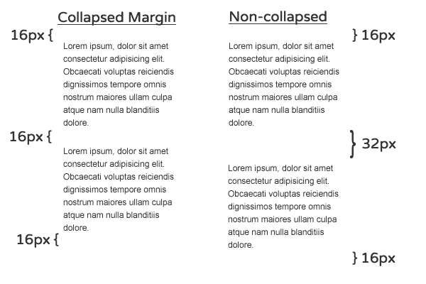
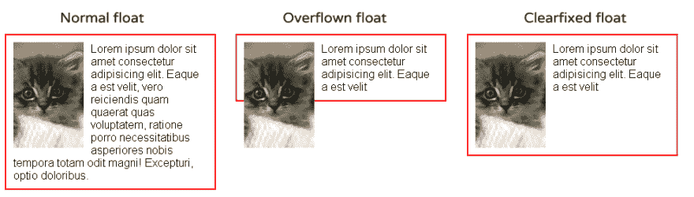
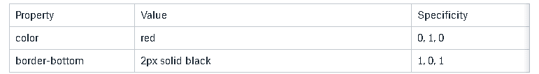
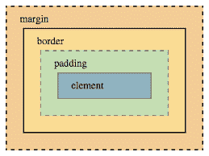
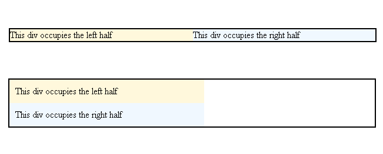

# 你的 CSS 失败的唯一原因

> 原文：<https://dev.to/bnevilleoneill/the-only-reason-your-css-fails-5hm1>

[](https://res.cloudinary.com/practicaldev/image/fetch/s--90GFBi3c--/c_limit%2Cf_auto%2Cfl_progressive%2Cq_auto%2Cw_880/https://cdn-images-1.medium.com/max/1024/1%2AtnN4RGb9fdj-zbPcQcZHvA.jpeg)

我们学习 CSS 的方式是错误的。

CSS 看起来似乎很简单。我们只需要在一些规则中声明一些东西应该是什么样子，浏览器就会发挥它的魔力。这导致许多课程和学习资源以一种实用的、易于遵循的、快速见效的方法来教授 CSS，这种方法很大程度上是基于像机器人一样记忆规则。

甚至一些最受欢迎的资源在教授 CSS 理论方面也有所欠缺:非常棒的 [freeCodeCamp 只是浏览了一下](https://learn.freecodecamp.org/)，总是值得信赖的 [W3Schools 几乎只是列出了属性和值](https://www.w3schools.com/css/default.asp)，甚至那里的高级课程也只是专注于快速构建一些东西，甚至没有提到一些核心概念。

嗯，这正是问题所在。首先，我们人类并不*擅长记忆一套庞大的(并且不断增长的)规则，但是，这也导致跳过 CSS 理论概念，这每次都会回来咬我们一口。你知道这个笑话是怎么说的:*

> 两个 CSS 属性走进酒吧。
> 
> 一个完全不同的酒吧里的高脚凳翻倒。

这也有一些好处，CSS 的声明性质使它以意想不到的方式工作，特别是对于习惯于使用命令式语言(也称为“适当的编程语言”)和定义良好的范围的开发人员来说。

但是我相信有四个核心概念，如果教得正确，可以让我们避免 99%的 CSS 问题:块格式上下文、盒子模型、堆叠上下文和级联(特别是特异性)。

我很确定块格式化上下文是不太为人所知的，所以让我们从这里开始。

[](https://logrocket.com/signup/)

### 块格式化上下文

**CSS 布局的经典方法是流程布局，也叫“正常流程”。**考虑到西方语言，块布局简单地意味着“内联”元素(如`<span>`)从左向右流动，“块”元素(如`<p>`)一个在另一个下面流动。

看起来非常简单…直到我们在图片中引入浮动和边距折叠。

**当两个块级元素堆叠在一起时，它们的垂直边距折叠在一起**。这是有意义的，例如，在段落中，我们想在顶部和底部有 16px 的边距，但它们之间肯定没有 32px 的边距。缩小兄弟姐妹之间的差距似乎是一个合理的决定，并且对于给定的用例来说，这可以为我们节省相当多的工作。但在其他情况下，尤其是在处理负利润率时，它会导致各种各样的“奇怪”行为。

[](https://res.cloudinary.com/practicaldev/image/fetch/s---KlZrR3p--/c_limit%2Cf_auto%2Cfl_progressive%2Cq_auto%2Cw_880/https://cdn-images-1.medium.com/max/600/0%2A0c7CfMyX-YBw29N1.png)

父母和子女之间的差距也在缩小，这通常不是我们所希望看到的。

雪上加霜的是，有时我们利用利润崩溃，继续我们的工作，突然*某事*使它不再崩溃…

至于花车，我们都去过；当内容小于浮动时，它将溢出我们打算用作容器的元素(或者换句话说，容器背景和边框现在达不到浮动元素)。大多数时候我们都是用 clear 属性来解决这个问题，通常添加一个额外的(伪)元素来注入一个 *clearfix* 。

[](https://res.cloudinary.com/practicaldev/image/fetch/s--cl9_7JS8--/c_limit%2Cf_auto%2Cfl_progressive%2Cq_auto%2Cw_880/https://cdn-images-1.medium.com/max/987/0%2ANkbdUIESJwkiPGuB.png)

事实证明，如果我们正确地使用了块格式上下文，我们就不会面临这些问题。

但是什么是块格式化上下文呢？

块格式上下文定义了边距折叠和浮动包含的范围。它是你布局中的一个迷你布局。它包含创建它的元素内部的所有内容。

当我们创建一个块格式上下文时，我们告诉浏览器“把它当作一个考虑浮动和边距的自主布局”。

我希望我可以说*“我们可以通过设置规则 display:flow-root on the containing element”*…来创建一个，但是这可能是一个疏忽。这是一个相对较新的规范，并且[浏览器对它的支持还远未完善](https://caniuse.com/#feat=flow-root)。

在很长一段时间里，bfc 是作为其他属性的副作用而创建的，或者在最坏的情况下，作为应用其他属性或使用一些 HTML 元素的意外副作用而创建的。

哪些属性和元素？很多人:

*   文档的根
*   表格单元格、表格标题，以及我们将显示设置为表格部分的任何元素(显示:表格、显示:表格单元格、显示:表格行等)
*   内嵌块元素
*   绝对和固定定位元素
*   多列容器(具有除 auto 之外的列计数、列跨度或列宽的元素，包括列计数:1)——技术上是一个列格式化上下文
*   网格项和 flex 项—从技术上讲，网格格式上下文和 Flex 格式上下文
*   溢出具有除 visible 之外的任何值的元素

**有很多方法(也许是偶然的)创建一个新的块格式上下文**。最流行的是使用 overflow: auto，因为它不应该导致任何其他问题，除了当特定大小的元素被添加并且内容溢出时可能会添加滚动条。

我个人最喜欢的是列计数:1，因为它几乎没有副作用。

最好的办法是使用任何你认为对给定用例更好的方法，但是**确保留下评论，说明你正在使用该规则来强制一个新的 BFC** 。否则，很有可能其他开发人员会将该规则误解为想要创建滚动条、列布局或其他任何东西，甚至可能选择删除它们(因为 column-count:1 对他们来说可能没有意义)

这里有一个快速演示，展示了当我们将 BFCs 应用于包含一个浮动的典型布局的不同元素时会发生什么:
[https://codepen.io/facundocorradini/embed/davyrw?height=600&default-tab=result&embed-version=2](https://codepen.io/facundocorradini/embed/davyrw?height=600&default-tab=result&embed-version=2)
正如您所看到的，应用 BFC 可以非常方便地防止浮动溢出容器。阻止文本环绕浮动也很棒。我见过有人使用与浮动宽度相等的侧边距来实现这一点，但是使用 BFCs 方法允许我们使用未知宽度的浮动。

了解 BFC 是如何工作的，可以让我们更好地控制浮动和边距，让我们做出更好的布局，防止我们意外破坏它们。所以要有意识的谨慎使用。为了更深入的了解，我推荐雷切尔·安德鲁的这篇文章。

### 级联和特异性

当浏览器遇到冲突声明时，它们使用一种称为 Cascade(CSS 中的 C)的算法来决定将哪些规则应用于每个元素(即多个规则为一个元素的属性分配不同的值)。

**算法中的第一个因素是源顺序。**几个月前，马克斯·斯托伊伯用一个简单的 CSS 问题打破了 Twitter web 开发社区:

> Max 斯托伊伯[@ MX stbr](https://dev.to/mxstbr)你对 CSS 了解多少？👨🏼‍🏫
> 
> 给定这些类:
> 
> 。红色{
> 颜色:红色；
> }
> 
> 。蓝色{
> 颜色:蓝色；这些碎片会是什么颜色？
> 
> < div class= "红蓝">
> < div class= "蓝红">2018 年 9 月 14:36[](https://twitter.com/intent/tweet?in_reply_to=1038073603311448064)[](https://twitter.com/intent/retweet?tweet_id=1038073603311448064)663[](https://twitter.com/intent/like?tweet_id=1038073603311448064)1456

If you answered “both blue”, congrats, that’s the right choice. But don’t feel bad if you missed it… you certainly are not alone.

这个问题的真正诀窍是**浏览器不看类在 HTML 中声明的顺序，而是在 CSS 中声明的顺序。**

如果您来自命令式编程语言背景，将每个 CSS 声明视为条件语句可能会有所帮助，所有 HTML 元素(“对象”)都将与该条件语句进行比较，以确定哪些值将应用于该对象的不同属性。

在一个快速而肮脏的伪代码中，这个

```
.red { color: red; }
.blue { color: blue; } 
```

可以认为是

```
if element matches ".red" then  element.color = red;
if element matches ".blue" then  element.color = blue; 
```

所以与两者都匹配的元素的颜色属性的最终值。红色的“和”。蓝色”将是“蓝色”。记住，**重要的是 CSS 中的顺序，而不是 HTML** 中的顺序。即使在 HTML 中重复“红色”一百万次也不会改变它的颜色。

这

```
testing
.red{color:red}
.blue{color:blue} 
```

仍然产生蓝色输出。

但是 CSS 源代码中的顺序只是级联算法中的众多因素之一…

#### 关于 CSS 特异性

确定哪些规则应该应用于一个元素的一个真正重要的部分就是所谓的**特殊性**。不同类型的 CSS 选择器具有不同的权重。按优先顺序排列:

1.  id 选择器(#什么的)
2.  类选择器(。某物)&伪类(:hover)
3.  元素(p)和伪元素(:before)

组合符(+、>和~)、通用选择器(`*`)和 the :not 伪类对特异性没有影响。

通过 ID 定义的规则总是优先于通过类定义的规则，类优先于元素选择器。

当我们使用组合选择器(如 body #login 按钮。red{})浏览器将计算 id、(伪)类和(伪)元素的数量，并为规则分配一个特异性值，以便与其他规则进行比较，并决定使用哪一个。这通常表示为三个计数器:

id、类、元素

例如，规则主体#登录按钮。红色{}具有 1 个 id (#login)，1 个类(。红色)和 2 个元素(主体+按钮)。所以规则的特异性可以表示为 1，1，2。

考虑到这一点，**给定两个冲突的规则，将应用具有更高特异性的规则**。

在

```
.btn .big { height: 40px }
.btn { height: 20px } 
```

将应用前者，因为后者具有 0，2，0 对 0，1，0 的特异性。

重要的是要记住，更具体类型的选择器总是优先。具有 1，0，0 特异性的规则(即单个 id，如#red{color: red})将被认为比另一个具有 0，20，10 (0 个 id，20 个类和 10 个元素……反正不是说您真的想编写这样一个荒谬的选择器)的规则更重要。

因此，为了覆盖用 1 个 id 定义的规则，您需要另一个至少有 1 个 id 和 1 个元素/类的规则。或者至少匹配特殊性，让源中的顺序来控制。这就是为什么一般认为避免使用 id 来设计是一个好的做法，因为它很难被覆盖。

回到算法，我们可以把它想象成每个 HTML 元素都有一个相关的样式表，在这个样式表中，元素写入每个属性、当前值和设置它的规则的特殊性。

```
<h1 id="main-title" class="red"> This is a title </h1> 
.red{ color: red; }
h1#main-title{ border-bottom: 2px solid black} 
```

这将给予 H1 以下风格

[](https://res.cloudinary.com/practicaldev/image/fetch/s--hywy41D8--/c_limit%2Cf_auto%2Cfl_progressive%2Cq_auto%2Cw_880/https://cdn-images-1.medium.com/max/771/1%2AU4H8t-lAoMnZ2-J760gz_Q.png)

如果我们的样式表有额外的、冲突的声明，Cascade 将检查为给定属性设置当前值的特异性，将其与新规则的特异性进行比较，并且仅当新规则的特异性高于或等于前一个时才更改值。

特异性不是一个缺陷，而是一个特性，如果使用得当，它会非常方便。如果不是这样，也会非常令人沮丧。为了编写可伸缩、可维护的 CSS，有很多架构可以帮助处理级联。**所以如果有一个 CSS 概念你应该*真正*掌握，这就是它**。

一些方法，如 BEM，鼓励使用平面选择器(即避免复杂的选择器，只为每件事使用一个类)来完全防止特异性战争，而其他方法，如最初的 OOCSS，让您以一种有意识的方式编写更高特异性的代码。另一方面，函数式 CSS 倾向于简单地避免冲突声明。

你的团队选择哪种架构并不重要，重要的是有一个人人都遵循的架构来避免问题。

级联算法中还有其他因素，比如内联 CSS 的优先级更高，以及使用！重要的关键词。

Benjamin Johnson[在这本刊物上发表了一篇关于 cascade 的精彩文章](https://dev.to/bnevilleoneill/how-css-works-understanding-the-cascade-3bag)，这是进一步学习这个主题的好地方。我也非常喜欢[艾玛·韦德金德最近的文章](https://dev.to/emmawedekind/css-specificity-1kca)。

### 箱子模型

HTML 中的每个元素都创建了一个矩形“框”来表示它，它将应用一组规则来确定它在浏览器中应该占据的宽度和高度，以及它的内容和间距。

唯一的例外是分别创建两个框的列表和表格，以及根本不创建框的带有 display:none 或 display: contents 的元素。

该框应用了以下度量:

[](https://res.cloudinary.com/practicaldev/image/fetch/s--QNZcWvfM--/c_limit%2Cf_auto%2Cfl_progressive%2Cq_auto%2Cw_880/https://cdn-images-1.medium.com/max/259/0%2AzhuuqAfF5L6XDmTh.png)

在现代 CSS 中，我们有两种主要的方法来定义盒子，我们可以使用属性 box-sizing 的值来切换。

传统的，因此也是默认的，叫做内容框。在 content-box 中，声明的宽度和高度被解释为内容的尺寸，填充和边框会增加元素的实际呈现尺寸，这可能会非常令人沮丧。

例如，如果我们在两个左侧浮动元素上设置 50%的宽度，它们将完美地并排排列。但是当我们向它们添加一些填充或边框时，每一个都将占据父对象的 50%以上，因此，第二个将在第一个下方换行。

[](https://res.cloudinary.com/practicaldev/image/fetch/s--9_p_DztK--/c_limit%2Cf_auto%2Cfl_progressive%2Cq_auto%2Cw_880/https://cdn-images-1.medium.com/max/651/0%2A1QUk_qq63loGygO4.png)

这通常意味着使用奇怪的计算和预处理器变量来补偿，在过去，每次我们改变边框或填充时，实际上都必须计算和调整宽度。

#### IE6 来救援了

是的，我刚说了 IE6。信不信由你，这个问题的解决方案是受旧浏览器中一个奇怪的 bug 的启发。**当 IE6 设置为 quirks 模式时，** `width`** 属性将设置元素**的总呈现宽度，而填充和边框将从内容区域中取出，保持稳定和可预测的总宽度。**这就是我们现在所知的“边界盒子”**。

现在大多数开发人员选择将所有东西重置为边框，所以很有可能你会在你的代码库中找到这个片段的某个版本

```
*, *:before, *:after {
  box-sizing: border-box;
} 
```

上面有一些变化，有些人主张继承盒子尺寸

```
html {
  box-sizing: border-box;
}

*, *:before, *:after {
  box-sizing: inherit;
} 
```

有趣的是，CSS 中最常用的尺寸可以被认为是*“还记得 IE6 中那个奇怪的 bug 吗？…真希望我们能做到"*。

为了进一步研究，CSS-tricks 上有一个关于盒子模型和盒子大小的很好的指南。

### 堆叠上下文

CSS 主要是一个 2d 样式系统，但它在处理 3d 和在 z 轴上排序方面也非常强大。根据经验，当两个或多个元素重叠时，它们将按照它们在源代码中的顺序进行堆叠:HTML 中最后出现的元素将在上面(“离用户更近”)。

定位元素(将位置设置为除默认静态之外的任何值)和使用 z-index 属性允许我们控制设计层如何相互堆叠。但是如果你有超过五分钟的经验，我敢肯定你已经遇到了它的问题。很多时候，我们把堆栈安排得井井有条，然后*某个东西*莫名其妙地*破坏了它*。

原来**几个属性创建了一个*堆栈上下文，*，这是一个应用 z-index 的元素的本地堆栈。**我们可以在每个本地堆栈内移动元素，也可以在更大的堆栈内移动元素，但是我们不能用一个堆栈中的元素插入另一个堆栈中的元素。

创建堆叠上下文的一些属性包括:

*   z 索引不是 auto 的定位元素
*   不透明度低于 1 的元素
*   非正常混合模式的元素
*   具有剪辑路径、蒙版、滤镜或无以外的变换的元素
*   [其他属性](https://developer.mozilla.org/en-US/docs/Web/CSS/CSS_Positioning/Understanding_z_index/The_stacking_context)

这里有一个帮助理解这个概念的经典挑战:给定下面的代码，尝试将红框移到绿框后面，而不改变它的 z 索引、位置或 HTML 源代码。

提示:诀窍在于包含 div。
[https://codepen.io/philipwalton/embed/ksBaI?height=600&default-tab=result&embed-version=2](https://codepen.io/philipwalton/embed/ksBaI?height=600&default-tab=result&embed-version=2)
解决方案是在包含红色跨度的 div 中创建新的堆栈上下文，因此红色跨度的 z 索引不会影响主堆栈，让源顺序接管。
[https://codepen.io/philipwalton/embed/dfCtb?height=600&default-tab=result&embed-version=2](https://codepen.io/philipwalton/embed/dfCtb?height=600&default-tab=result&embed-version=2)
注意，即使我们给红色 span 一个一百万的 z 索引，它也不会在绿色和蓝色 span 前面移动，因为它被隔离在本地堆栈中。如果我们想移动它，我们需要更改包含它的 div 的位置和 z 索引。

同样，Benjamin Johnson [在这篇文章](https://dev.to/bnevilleoneill/how-css-works-creating-layers-with-z-index-38e4)中深入讨论了堆栈环境，所以这是进一步理解其工作原理的一个很好的来源。我还推荐 [Phillip Walton 关于 z-index](https://philipwalton.com/articles/what-no-one-told-you-about-z-index/) 的文章，这是上述挑战的来源，也是对堆叠上下文如何工作的深入探讨。

### 结论

CSS 是一个非常强大的样式工具。无论您是选择预处理器和“普通”CSS，还是选择 CSS-in-JS 解决方案，这些核心概念都是您应该真正掌握的，以避免重复出现问题。

随着许多人来自强调 JS 的新兵训练营(行业本身也是如此)，以及诸如 Bootstrap 之类的预打包解决方案的激增，HTML 和 CSS 的质量已经付出了代价。

克里斯·科伊尔说这句话已经过去十年了，但这句话仍然适用:

> CSS 就像国际象棋。你可以用一天的时间学会基础，用一生的时间掌握它。

一些人确信新来者不尊重 HTML 和 CSS，认为它们“低于”他们，正是因为学习基础知识很容易。虽然我相信其中一些人是存在的，但我倾向于不同意。我相信大多数人实际上都在努力掌握它，只是他们迷失在不再相关的信息和太多的不良资源之间，这就是这种挫败感的来源。

掌握 CSS 的真正诀窍是你如何对待它。如果你可以使用一点建议，远离“快速结果”教程，远离框架，远离属性列表。获得实践经验并专注于学习理论，仔细阅读规范，深入研究你所学的每一个 CSS 知识，不管它看起来有多小，你总是会发现一些有趣的概念，使它“点击”到位。

没有预处理器，没有 CSS-in-JS，没有框架能让 CSS 有意义。

* * *

### Plug: [LogRocket](https://logrocket.com/signup/) ，一款适用于网络应用的 DVR

[](https://logrocket.com/signup/)

<figcaption>[https://logrocket.com/signup/](https://logrocket.com/signup/)</figcaption>

LogRocket 是一个前端日志工具，可以让你回放问题，就像它们发生在你自己的浏览器中一样。LogRocket 不需要猜测错误发生的原因，也不需要向用户询问截图和日志转储，而是让您重放会话以快速了解哪里出错了。它可以与任何应用程序完美配合，不管是什么框架，并且有插件可以记录来自 Redux、Vuex 和@ngrx/store 的额外上下文。

除了记录 Redux 操作和状态，LogRocket 还记录控制台日志、JavaScript 错误、堆栈跟踪、带有头+正文的网络请求/响应、浏览器元数据和自定义日志。它还使用 DOM 来记录页面上的 HTML 和 CSS，甚至为最复杂的单页面应用程序重新创建像素级完美视频。

免费试用。

* * *

帖子【你的 CSS 失败的唯一原因】([https://Blog . log rocket . com/The-only-reason-your-CSS-fails-8e 4388d 562 af/](https://blog.logrocket.com/the-only-reason-your-css-fails-8e4388d562af/)最先出现在 [LogRocket 博客](https://blog.logrocket.com)。