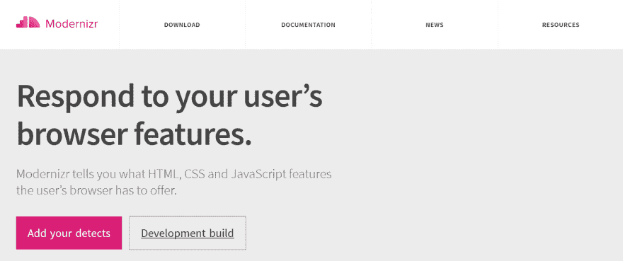
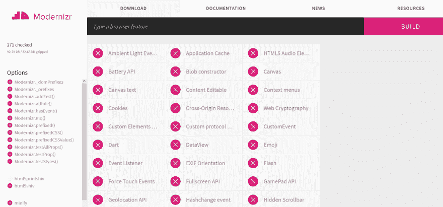

# 支持跨浏览器兼容性的 Modernizr 功能检测

> 原文：<https://dev.to/lambdatest/feature-detection-with-modernizr-for-cross-browser-compatibility-387n>

Modernizr 是一个开源的紧凑的 JavaScript 库，允许开发者根据 T2 的跨浏览器兼容性为用户打造不同层次的体验。Modernizr 帮助开发人员执行[跨浏览器测试](https://www.lambdatest.com/)，以检查新一代 [HTML5 和 CSS3](https://www.lambdatest.com/blog/complete-guide-on-creating-browser-compatible-html-and-css/) 功能是否被访问者的浏览器原生支持，并为因功能支持差而臭名昭著的旧浏览器提供专用的回退。Modernizr 结合[渐进式增强的原则](https://www.lambdatest.com/blog/progressive-enhancement-and-cross-browser-compatibility/)有助于利用强大的现代网络技术一层又一层地设计尖端网站，而不会丢弃仍在使用 IE 等旧浏览器的用户。

## Modernizr 是如何工作的？

Modernizr 由 Faruk Ateş于 2009 年 7 月推出，以统一的标准化方式解决跨浏览器兼容性问题。今天，Modernizr as feature detection library 是世界上最著名的 JavaScript 库，提供超过 270 种测试，并在全球 8.76%的网站中使用(仅在美国就有 50 万个网站)。Modernizr 不依赖于使用“用户代理”嗅探的高度不可信的浏览器检测方法，而是基于特征检测。而浏览器检测集中在“访问者使用的是什么浏览器？”，特征检测围绕着“访问者的浏览器支持哪些特征”这个问题。Modernizr 在用户浏览器中运行一系列基于 javascript 的功能检测测试，通过允许您分别针对每个浏览器功能来检查 HTML 和 CSS 的跨浏览器兼容性。

用于特征检测的 Modernizr 执行 3 个基本功能:

*   添加指示功能支持的类，这些功能支持可用于有条件地将 CSS 样式规则应用于不同的元素。
*   创建一个 javascript 对象来检查或验证浏览器对任何 HTML 或 CSS 功能的支持。
*   允许有条件地提供自定义 JS 脚本或聚合填充来模拟缺少的功能。

重要的是要记住，Modernizr 的特性检测只能检测哪些特性是受支持的。它不能为旧版浏览器中不支持的功能提供功能。这是通过“多填充”实现的，我们将在本博客后面讨论。

我还写了另一篇博客，描述了使用 [@support](https://dev.to/support) 特性查询来执行 [CSS 特性检测以实现跨浏览器兼容性](https://www.lambdatest.com/blog/css-with-feature-detection-for-cross-browser-compatibility/)。

## 为特征检测设置 Modernizr

为了使用 Modernizr 执行特性检测，您需要添加 Modernizr。js 文件添加到项目中。这可以通过 2 种方式完成:
a .从网站下载:访问官网构建并下载 JavaScript 文件。点击“添加您的检测”来根据您的项目需求选择您想要的特性，或者点击“开发构建”来重定向到构建页面，其中所有的测试/检测选项都是预先选定的。单击 build 按钮下载文件。
[](https://res.cloudinary.com/practicaldev/image/fetch/s--xETaK9IG--/c_limit%2Cf_auto%2Cfl_progressive%2Cq_auto%2Cw_880/https://cdn.shortpixel.ai/client/q_glossy%2Cret_img%2Cw_800%2Ch_180/https://www.lambdatest.com/blog/wp-content/uploads/2019/01/image1-8-1.png)
[T8】](https://res.cloudinary.com/practicaldev/image/fetch/s--0AdX0wa8--/c_limit%2Cf_auto%2Cfl_progressive%2Cq_auto%2Cw_880/https://cdn.shortpixel.ai/client/q_glossy%2Cret_img%2Cw_800%2Ch_180/https://www.lambdatest.com/blog/wp-content/uploads/2019/01/image2-4-1.png)

b.**使用 npm 和命令行** : Modernizr 也可以安装节点包管理器或 NPM。你可以在这里安装 NPM。安装 npm 后，打开命令行，输入:
`npm install -g modernizr`

现在将下载的 Modernizr 文件包含在页面的部分中。
`<script src="modernizr-custom.js"></script>`

将“no-js”类添加到标签中。

```
<!DOCTYPE html>
<html class="no-js">
<head>
<script src="modernizr-custom.js"></script>
</head>

```

如果用户在其浏览器中禁用了 javascript，或者浏览器本身不支持 JavaScript，那么这个“no-js”类是一个必要的后备。一旦页面加载完毕，如果浏览器支持 javascript，Modernizr 会自动将“no-js”类替换为“js”类，以进行特性检测。

1.  Modernizr 在根元素上添加了几个 CSS 类。这些类是根据浏览器的功能(功能/无功能)添加的–为受支持的功能添加类，为不受支持的功能添加带有“否”前缀的类。

例如，如果浏览器支持 flexbox，那么“Flexbox”类将被添加到标签中。如果不支持，则添加“非 flexbox”类。

```
<html class="js no-flexbox canvas canvastext no-webgl no-touch geolocation postmessage no-websqldatabase no-indexeddb hashchange no-history draganddrop no-websockets rgba hsla multiplebgs backgroundsize no-borderimage borderradius boxshadow no-textshadow opacity no-cssanimations no-csscolumns no-cssgradients no-cssreflections csstransforms no-csstransforms3d no-csstransitions fontface generatedcontent video audio localstorage sessionstorage no-webworkers no-applicationcache svg inlinesvg smil svgclippaths">

```

## 用 Modernizr 进行 CSS 特征检测

Modernizr 将这些类添加到标签中，用于基于给定浏览器是否支持某个特性来检测 CSS 样式属性。带有“no-”前缀的类将自动应用于不支持那些相应特性的浏览器中。

例如，如果浏览器支持 box-shadow 属性，则将“box shadow”Modernizr 类添加到标签中。如果不支持，那么就添加“无框阴影”Modernizr 类。我们可以只使用这两个 CSS 类来有效地针对所有浏览器，而不管它们是否支持这一特定功能。".对于所有支持的浏览器和，可以使用 boxshadow "类来设置一个 div 周围的框阴影样式，水平偏移和垂直偏移为 10px，模糊为 8px，扩展为 15px。no_boxshadow "类可用于编码具有较粗边框宽度的回退，以补偿所有不支持的浏览器的任何阴影缺失。

```
.boxshadow #box {
    border: 2px solid black;
    -webkit-box-shadow: 10px 10px 8px 10px #888888;
    -moz-box-shadow: 10px 10px 8px 10px #888888;
}

.no-boxshadow #box {
    border: 5px solid black;
}

```

因此，Modernizr 的特性检测将任务简化为只编写两个代码块——一个用于兼容的浏览器，另一个用于不兼容的浏览器，而不是使用用户代理字符串为目标浏览器编写大量代码。

CSS 线性渐变的另一个例子:

```
.no-cssgradients .header {
  background: url("https://unsplash.it/640/425?image=44");
}

.cssgradients .header {
background-image: url("https://unsplash.it/640/425?image=44"), linear-gradient(red, blue);
}

```

*   **避免类名冲突**
    由 Modernizr 创建的类很可能会与已经添加到样式表中的 CSS 类发生冲突。为了避免这种情况，建议为所有 Modernizr 类添加一个“classPrefix ”,使它们完全唯一。例如，您可能已经使用了一个名为“boxshadow”的类，它将与 Modernizr 创建的同名检测类发生冲突。您可以利用类前缀轻松解决这个问题。在您的配置中进行以下更改-

    ```
    {
    "classPrefix": "foo-",
    "feature-detects": ["dom/boxshadow"]
    }

    ```

    现在，modernizr 将添加而不是

*   **阻止 Modernizr 添加类到 HTML 标签**
    如果你想 Modernizr 不添加任何类到你的 HTML 标签，在你的配置文件中设置“enableClasses”为 false。这仍然不包括 no-js 类。为了防止这种情况，也要将“enableJSClass”设置为 false。

## 用 Modernizr 进行 JavaScript 特性检测

如前所述，Modernizr 并不试图使用不可靠的、现已失效的用户代理字符串来检测用户的浏览器，而是依赖于特征检测。Modernizr 在页面加载期间在后台运行一系列基于 javascript 的检查或测试，以检测浏览器是否支持这些特性。这些测试返回一个布尔值——如果某个特性受支持，则为“真”,否则为“假”。使用这些布尔结果，它创建了一个名为“Modernizr”的 javascript 对象。我们可以使用“Modernizr.featureName”访问该对象“Modernizr”的各种属性进行特征检测。例如，如果浏览器支持视频元素，Modernizr.video 将返回“true ”,如果浏览器不支持，则返回 false。

下面是 Modernizr 使用 JavaScript 进行特征检测时使用的语法:

```
if (Modernizr.feature) {
   /* Rules for browsers that support this feature*/
}
else{
   /* fallback for browsers that do not support this feature*/
}

```

Modernizr 对象有助于验证对 CSS 和 HTML 特性的支持。这就是 Modernizr 与使用@supports 特性查询的原生 CSS 特性检测相比的明显优势。我们可以使用 Modernizr 的这一功能为重要的 HTML5 元素(如画布、视频、音频和语义元素，如文章、导航、页眉、页脚等)编写必要的后备代码。

以下示例显示了如何使用 javascript 测试 CSS 线性渐变，并为支持线性渐变的浏览器添加线性渐变类。

```
$(document).ready(function () {

    if (Modernizr.cssgradients) {
        alert("This browser supports CSS Gradients");
        $('#box').addClass('cssgradients');
    }

    if (Modernizr.cssgradients) {
        alert("This browser doesn't support CSS Gradients");
        $('#box').addClass('no-cssgradients');
    }

});

```

除了使用 javascript 测试浏览器是否支持特定 web 技术的功能检测之外，Modernizr 还可以用于加载 polyfill/shim 来模拟浏览器缺少或不支持的功能。

## 什么是聚合填充？

Polyfill 是一种 javascript 代码，它作为一种备用代码来模仿早期浏览器中的现代功能，而早期浏览器本身并不支持这些功能。例如，如果你想在你的网站上嵌入一个视频，你可以使用 HTML5 <video>标签。这与所有现代浏览器都兼容。然而，像 Internet Explorer 8 及其早期版本这样的旧版本浏览器不支持<video>功能。为了确保仍然使用这些浏览器的任何用户都不会被排除在查看此类内容之外，我们使用了一个流行的 polyfill，称为 mwEmbed Video Player。对于 Canvas，最流行的 polyfill 是 FlashCanvas，对于 SVGs–SVG web，对于 audio–sound js 等等。</video></video>

## 使用 JavaScript 加载聚合填充

如前所述，除了为浏览器支持执行 javascript 测试之外，Modernizr 还可以用于有条件地加载 polyfill/shim 脚本，以便在浏览器缺乏特性支持时提供功能。这是通过使用 Modernizr.load()方法实现的。

modernizr . load
modernizr . load 方法是一个基于非常流行的 yesnope.js 库的条件加载器，它根据特性检测测试的结果加载 JavaScript 文件。例如，我们可以使用 modernizr.load 方法来测试是否支持 flexbox，如果浏览器不支持，则加载 polyfill。

如果浏览器支持 flexbox，flexlayout。否则将加载 css 文件。在缺乏支持的情况下，将加载 matchHeight.js polyfill，它模仿旧浏览器中的 flexbox 功能。

```
Modernizr.load({
    test: Modernizr.flexbox,
    yep : 'flexlayout.css',
    nope: 'matchHeight.js' });

```

Modernizr.load()将定义特性的属性作为参数，并执行测试来检查它的支持。如果该属性受支持并且测试成功，则加载“yep”案例脚本。如果该属性不受支持并且测试失败，则加载“nope”案例脚本。如果不管测试是否失败都要加载脚本——“两者”情况。例如:

```
Modernizr.load({
    test: Modernizr.canvas,
    yep:  'Canvasavailable.js',
    nope: 'FlashCanvas.js',
    both: 'CustomScript.js'
});

```

Modernizr.load()还可以用于在无法访问 Google 或 Microsoft CDN 网络的情况下创建后备，这可能会破坏整个网页。在没有 CDN 的情况下，如果您使用 CDN 链接包含 jquery 或 bootstrap 脚本，它们将不会加载。下面的示例展示了如何在 CDN 失败时创建用于加载 jquery 的备份。它将首先尝试从 Google CDN 下载 jQuery，然后使用对应于“完成”案例的函数来检查 jQuery 是否存在。如果 jquery 因为无法从 Google CDN 下载而不存在，那么“load”case 将从您的本地存储中加载备份 jQuery。

```
Modernizr.load([
    {
        load: '//ajax.googleapis.com/ajax/libs/jquery/3.3.1/jquery.min.js',
        complete: function () {
            if (!window.jQuery) {
                Modernizr.load('js/libs/jquery/3.3.1/jquery.min.js');
            }
        }
    },
    {
        // execute this if jquery couldn’t be loaded.
        load: 'backup-jquery.js'
    }
]);

```

**Modernize.load 和 yesnope.js 已弃用**
**注意** : Modernizr.load 和 yesnope.js 现已弃用，当前版本 modern izr(3.5 版)不再支持。你仍然可以在 v2.8 中使用它。你可以在这里阅读更多关于 modernizr 的创建者 Alex Sexton 的弃用通知。

现在一个可行的替代方法是使用 jquery getScript()方法。以下示例展示了如果浏览器不支持特征检测，如何加载聚合填充脚本。

```
if (Modernizr.geolocation){
  //feature is supported by the browser
  console.log('geolocation supported');
} else {
  // feature not supported - load polyfill
  $.getScript('path/script.js')
  .done(function() {
    console.log('script loaded');
  })
  .fail(function() {
    console.log('script failed to load');
  });
}

```

**结论**
自 2009 年推出 Modernizr 至今已近十年，但时至今日，它仍未失去其相关性和目的。对于每个喜欢用先进的现代 HTML5 和 CSS3 特性构建网站和 web 应用程序的开发人员来说，Modernizr 是不可或缺的资产。它不仅有助于避免[跨浏览器测试](https://www.lambdatest.com/)所需的大量代码，还有助于提供一种替代不可靠用户代理检测的方法。就像功能查询一样，Modernizr 具有针对[跨浏览器兼容性](https://www.lambdatest.com/feature)的功能检测，有助于为不受支持的功能和特性提供所有必要的回退，从而保证无论用户使用哪种浏览器，都能获得完美的用户体验。尽管原生 CSS @supports 特性查询在开发人员中的广泛流行和接受方面正在迅速赶上，但它在 IE(包括 IE11)中缺乏支持意味着具有特性检测机制的 Modernizr 仍然是实现跨浏览器兼容性的首选工具。

原文出处:[lambdatest.com](https://www.lambdatest.com/blog/feature-detection-with-modernizr-for-cross-browser-compatibility/)

相关帖子:

1.  [创建浏览器兼容 HTML 和 CSS 的完整指南](https://www.lambdatest.com/blog/complete-guide-on-creating-browser-compatible-html-and-css/)
2.  [开发网站的 21 大 JavaScript 和 CSS 库](https://www.lambdatest.com/blog/top-21-javascript-and-css-libraries/)
3.  [具有跨浏览器兼容性特征检测的 CSS](https://www.lambdatest.com/blog/css-with-feature-detection-for-cross-browser-compatibility/)