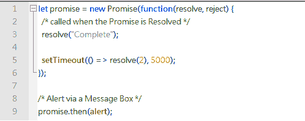
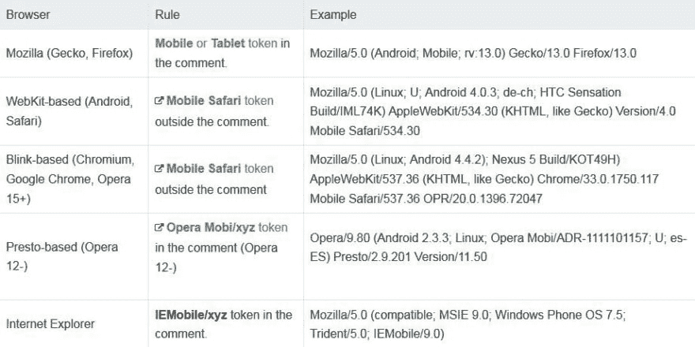
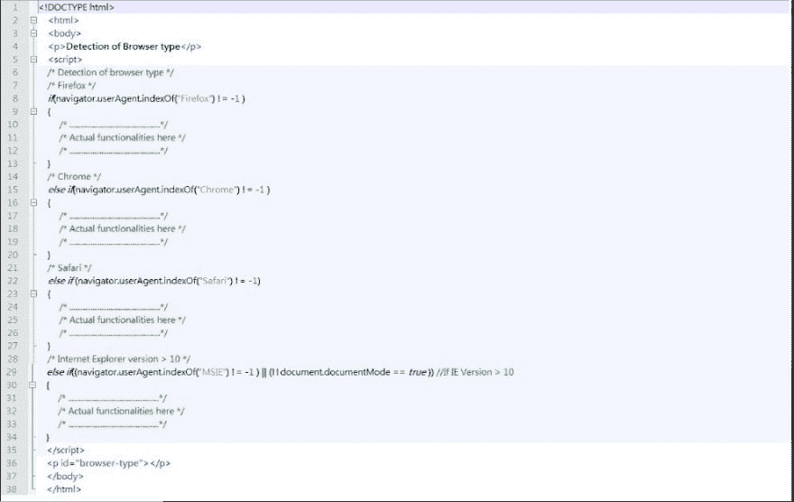
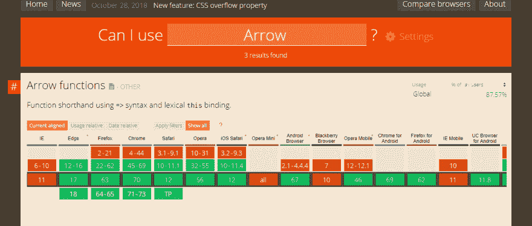
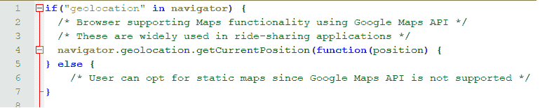
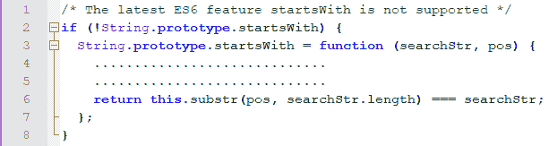
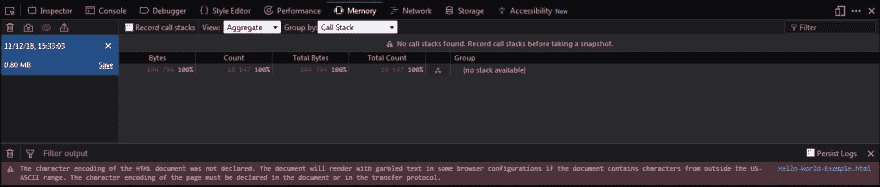
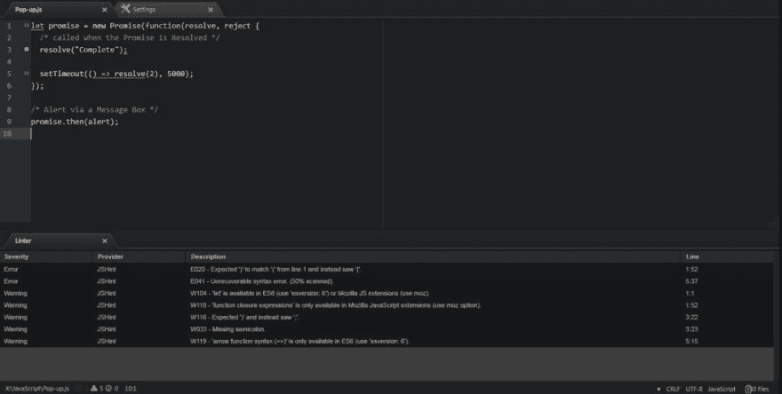
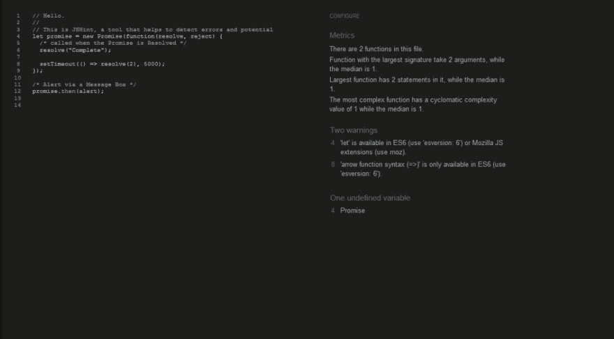

# 修复 Javascript 跨浏览器兼容性问题

> 原文：<https://dev.to/lambdatest/fixing-javascript-cross-browser-compatibility-issues-51pl>

在所有主要的 web 技术中，没有其他技术像 JavaScript 一样因跨浏览器兼容性而受到诋毁。但是，即使在纯 HTML 和 CSS 方面取得了长足的进步，没有它，你也不能轻松地构建 web 应用程序或网站。

在我们上周的上一篇文章中，我们深入研究了 HTML 和 CSS 面临的跨浏览器兼容性问题。到目前为止，我们已经了解了浏览器兼容性的基础知识，以及如何确保您的网站/web 应用程序是跨浏览器兼容的。

延续上周的同一篇文章，在本文中，我们研究 web 开发人员在使用 JavaScript 时面临的常见跨浏览器兼容性问题。我们还将研究解决这些问题的方法。

但是在我们开始讨论真正的主题之前，我们先了解一下 JavaScript 的基础和发展是很重要的。

到目前为止，我们已经了解了跨浏览器兼容性的基础知识，以及如何确保您的网站/web 应用程序是跨浏览器兼容的。我们还研究了一些修复 CSS 和 HTML 交叉兼容性问题的机制。

在本文中，我们将研究 JavaScript 的跨浏览器兼容性问题以及解决这些问题的方法。在我们开始讨论真正的主题之前，我们先了解一下 JavaScript 的基础和发展是很重要的。

## 深度潜入 JavaScript

自过去十年以来，随着不同类型的设备(桌面、手机、平板电脑等)的出现，web 开发发生了快速的变化。用于网上冲浪的网络浏览器的数量也有所增加。这给设计者和开发者带来了不同的挑战，因为不同的浏览器会以不同的方式解释 CSS 和 HTML 代码。背后的原因是每个浏览器都有一个独特的渲染引擎，负责以不同于其他浏览器的方式呈现 web 元素。CSS HTML 和 JavaScript 是 3 层渐进增强。渐进式增强是一种创建跨浏览器兼容的 web 设计的技术，其中开发时的最高优先级是保持核心网页内容，而其他复杂的附加组件和功能则保持次要地位。当 JavaScript 在 20 世纪 90 年代推出时，存在重大的跨浏览器兼容性问题，因为每个浏览器开发公司都有自己的脚本实现方式，这主要是为了获得市场主导地位。尽管这样的问题现在不会发生，但是用 JavaScript 处理跨浏览器兼容性问题仍然会给开发人员带来噩梦。

JavaScript 代码的问题主要发生在开发人员带来的网页特性不支持旧的浏览器、使用不正确的文档类型或者浏览器嗅探代码实现不完整/不正确的时候。除非实现处理 JavaScript(或其他脚本语言)的标准机制，否则 JavaScript 的跨浏览器兼容问题将继续存在。让我们看看 JavaScript 的这些跨浏览器兼容性问题，并了解一些修复它们的机制。

***你知道吗？一个[信用卡号码生成器](https://www.lambdatest.com/free-online-tools/credit-card-number-generator?utm_source=devto&utm_medium=organic&utm_campaign=jul21_rd&utm_term=rd&utm_content=free_tools)是一个可以让你方便地生成随机 IP 地址的工具。它生成有效的信用卡号和所有必需的细节，如姓名、地址、有效期、CVV 代码和安全代码(PIN)。***

## 常见 JavaScript 问题

在我们研究 JavaScript 的跨浏览器兼容性问题之前，我们先看看一些常见的 JavaScript 问题是很重要的。假设您已经了解 JavaScript，并且以前有过 JavaScript 的实现经验。

*   [内存泄漏](https://www.lambdatest.com/blog/debugging-memory-leaks-in-javascript/?utm_source=devto&utm_medium=organic&utm_campaign=jul21_rd&utm_term=rd&utm_content=blog)是开发者面临的常见问题之一。内存泄漏仅仅意味着应用程序以前使用的内存不再被使用。但是，由于某些原因(例如，全局变量的不正确处理，超出 DOM 引用等。);分配的内存不会返回到“空闲”内存池。内存泄漏的一些常见原因是对全局变量的不正确处理和超出 DOM 范围的引用。“Chrome 剖析工具”可用于内存剖析以及识别内存泄漏。下面是 Chrome 内存分析的一个示例快照。

[](https://res.cloudinary.com/practicaldev/image/fetch/s--4pb5Ebgi--/c_limit%2Cf_auto%2Cfl_progressive%2Cq_auto%2Cw_880/https://cdn-images-1.medium.com/max/2726/0%2ADmvIs2FqqkgJHyUu.jpg)

*   JavaScript 按照代码在文档中出现的顺序执行代码。因此，只有当代码被加载时，**引用代码才变得重要。如果在加载代码之前引用代码，代码会导致错误。**

*   与其他语言不同，在 JavaScript 中将**‘参数个数不正确’**传递给函数时，不会抛出错误。如果这些参数是可选的，那么您的代码将毫无问题地执行。当在函数中使用这些参数时，可能会导致问题，不使用这些参数可能会改变功能。建议使用统一的命名约定，以便识别此类问题变得容易。

*   相等运算符在 JavaScript 中是基本的，但必须精确使用。“赋值/等于运算符”(==)和“严格等于运算符”(==)是有区别的。这些主要用于条件语句中，意外使用(==)而不是(===)会导致功能问题。为了调查这种愚蠢的、代价高昂的错误，需要进行彻底的代码演练。

*   **变量**根据其作用域(局部和全局)使用。确保对不同类型的变量使用一致的命名约定，以便更容易维护代码。
    确保你的源代码没有任何**语法问题**。

*   **在 JavaScript 中添加 DOM 元素**被认为是一个开销很大的操作。使用它的主要原因是因为 JavaScript 使得实现 DOM 变得容易。在某些情况下，您需要连续添加 DOM 元素，但是这样做并不是一个好的做法。在这种情况下，您可以使用文档片段，因为它具有更高的效率和性能。

*   JavaScript 数组中的起始索引是 0 而不是 1。如果您打算创建一个包含 10 个元素的数组，您应该声明一个索引为 9 的数组(数组元素 0..9)而不是 10(数组元素 0..10).引用越界数组元素会导致错误。

*   在**同步操作**中执行耗时的任务可能会降低你的网页/web 应用程序的性能。确保您将该逻辑移动到一个**异步操作**，这样它就不会占用 CPU。由于操作本质上是异步的，所以在使用该操作中使用的变量时必须小心，因为它们可能不会反映最新的值(因为异步操作可能仍在执行中)。建议开发人员使用返回异步操作完成状态(成功/失败)的**承诺对象**。下面显示了一个带有 Promise 的示例代码

[](https://res.cloudinary.com/practicaldev/image/fetch/s---R8Dn51q--/c_limit%2Cf_auto%2Cfl_progressive%2Cq_auto%2Cw_880/https://cdn-images-1.medium.com/max/2000/0%2A5g9ehjQEBRWD3nun.png)

*   不正确地使用“循环内部的函数”,从而导致功能中断。

## 常见的跨浏览器 JavaScript 问题

到目前为止，我们已经研究了一些基本的 JavaScript 问题；让我们来看看解决这些问题的一些机制:

***你知道吗？一个 [CRC32B 哈希生成器](https://www.lambdatest.com/free-online-tools/crc32b-hash-calculator?utm_source=devto&utm_medium=organic&utm_campaign=jul21_rd&utm_term=rd&utm_content=free_tools)让您可以从给定的字符串快速生成 CRC32B 校验和哈希。此外，您可以通过 web 浏览器生成 CRC32B 哈希。***

## 库用法

与我们之前讨论的 jQuery 库类似，有许多库(本地和第三方)可能在许多版本的浏览器上不受支持。在使用该库之前，建议您对该库进行彻底的分析(在浏览器支持、功能支持等方面。).你还应该检查库的“开发历史”,因为它不应该发生库的更新很少，一旦你使用了库，就没有更新了！

## 使用用户代理和浏览器嗅探

每个浏览器都有一个用户代理字符串，用于标识用户用来访问您的网站/web 应用程序的浏览器。开发者使用**浏览器嗅探代码**来根据用户使用的浏览器调整 UI/UX/功能。下面提到了一些常见的用户代理字符串。

[](https://res.cloudinary.com/practicaldev/image/fetch/s--wv68VPC8--/c_limit%2Cf_auto%2Cfl_progressive%2Cq_auto%2Cw_880/https://cdn-images-1.medium.com/max/2000/0%2Afb8xrHyQ1FScJFDW.jpg)

开发人员可以使用 navigator . user agent . index of(' user-agent ')，其中 user-agent 是用户代理字符串(如上表所述)。下面是一个代码的快照，开发者可以根据浏览器的类型来开发功能。

[](https://res.cloudinary.com/practicaldev/image/fetch/s--YLyDS8MU--/c_limit%2Cf_auto%2Cfl_progressive%2Cq_auto%2Cw_880/https://cdn-images-1.medium.com/max/2000/0%2AmlzRfswtsnBUou4i.jpg)

## 针对现代 JavaScript 特性的特性检测

在处理错误和无法识别的特性时，JavaScript 不像 HTML 和 CSS 那样宽容。当 JavaScript 遇到错误使用的语法/缺少大括号/分号/其他问题时，它肯定会发出错误信号。

ECMAScript 6(ES6)/ECMAScript Next 标准实现了许多新功能，而许多旧浏览器不支持这些功能。例如，我们之前讨论的“承诺对象”不能在旧版本的浏览器上工作。“类型化数组”是另一个例子。“箭头函数”是 ES6 中引入的一个非常有用的特性，它为用 JavaScript 编写函数提供了一种简洁的方式。它没有绑定到自己的 this 对象，即 Arrow 函数中的上下文是静态定义的。现代 JavaScript 开发人员大量使用该功能，但它在旧浏览器/旧版本的浏览器如 IE、Firefox、Chrome 等上也不受支持。Safari 浏览器不支持“箭头功能”。

那么，如何避免 JavaScript 功能在旧浏览器上也是无缝的呢？解决方案是验证旧浏览器是否支持正在使用的功能。您可以使用 caniuse 等在线资源进行验证；只需输入特性名称，它就会显示支持该特性的浏览器版本。例如，下面是“箭头函数”的情况。红色条目表示不支持'功能。

[](https://res.cloudinary.com/practicaldev/image/fetch/s--nGjp5waP--/c_limit%2Cf_auto%2Cfl_progressive%2Cq_auto%2Cw_880/https://cdn-images-1.medium.com/max/2690/0%2A6gZoncIyfA_ELLif.png)

根据目标受众，您应该为所有最新的浏览器和一些旧版本的浏览器提供支持(取决于您最初的市场研究)。你可以看看这些网络分析工具，它们可以帮助你更好地了解你的客户。你也可以选择“条件执行”,这样在用户使用旧浏览器的情况下总会有一个“后备机制”。有很多老版本的浏览器不支持 WebRTC(视频会议)、Maps API 等。在下面的例子中，我们使用地理定位 APINavigator 对象的 geolocation 属性用于此目的。如果浏览器不支持 Maps API，用户可以选择使用静态地图(作为后备选项)。

[](https://res.cloudinary.com/practicaldev/image/fetch/s--gX7UUOUt--/c_limit%2Cf_auto%2Cfl_progressive%2Cq_auto%2Cw_880/https://cdn-images-1.medium.com/max/2000/0%2AvOHSaw0sdJYYDOqf.png)

为了简单地使用它的功能，开发人员必须导入许多 JavaScript 库。这种用法的好处是开发人员不再需要从头开始编写代码，因为库已经支持这些功能。

## JavaScript trans filing

如果你想支持旧的浏览器，但不想使用浏览器嗅探，功能检测等。；一个方便的选项叫做“传输文件”。简单地说，Transpiling 有助于将可能使用最新 ES6/ECMAScript 特性的 JavaScript 代码转换为可以在旧浏览器上工作的 JavaScript 代码。

你可以使用一个流行的 JavaScript Transpiling 工具，比如 Babel，你只需在左边输入最新的 JavaScript 代码，它就会在右边输出代码。

***你知道吗？一个 [Lorem lpsum 生成器](https://www.lambdatest.com/free-online-tools/lorem-ipsum-generator?utm_source=devto&utm_medium=organic&utm_campaign=jul21_rd&utm_term=rd&utm_content=free_tools)是一个允许你方便地生成随机 IP 地址的工具。它是一种占位符文本，通常用于图形和网页设计。***

## 聚合填充

与增强功能和减少开发时间的第三方库类似，Polyfills 也包含可在项目中使用的第三方 JavaScript 文件。但是，聚合填充与库的不同之处在于聚合填充能够提供根本不存在的功能。例如，您可以使用聚合填充来支持 WebRTC/Promise/其他基于 ES6 的功能，只需对该功能使用等效的聚合填充即可。

你可以看一下[这个列表](https://github.com/Modernizr/Modernizr/wiki/HTML5-Cross-Browser-Polyfills)，它有关于 JavaScript 特性的 Polyfill 等价物的细节。让我们看一个例子。下面显示了一个代码片段，其中我们使用了 Polyfill 来支持 ES6 中引入的 startsWith 特性。

[](https://res.cloudinary.com/practicaldev/image/fetch/s--1sEA9BH3--/c_limit%2Cf_auto%2Cfl_progressive%2Cq_auto%2Cw_880/https://cdn-images-1.medium.com/max/2000/0%2AxKIJfFpET-njYr7k.png)

## 解决常见 JavaScript 问题

## JavaScript 调试器

断点通常用于调试目的，当“断点”被命中时，执行被停止，开发人员可以查看各种细节，如调用堆栈、监视变量、内存信息等。JavaScript 有一个名为“调试器”的关键字，当遇到该关键字时；JavaScript 代码的执行被停止。这类似于在代码中插入断点。

```
var x = 6 * 5;
debugger;
/* Logic here */ 
```

Enter fullscreen mode Exit fullscreen mode

或者，你也可以使用传统的调试方法，在 Chrome 中使用“JavaScript 控制台”来调试代码。JavaScript 控制台可以使用工具->JavaScript 控制台选项加载。

## 浏览器开发者工具

浏览器开发工具可用于删除 JavaScript 代码中的警告和错误。它对于调试代码也很有用，因为开发人员可以在代码中的特定位置插入断点。

如果您使用的是 Chrome 或 Firefox，只需在“加载代码”后右击窗口，然后点击**“检查元素”**。浏览器开发者工具还有**‘调试器标签’**，开发者可以在这里插入断点、检查调用栈、添加变量到观察窗口等。

下面是火狐浏览器开发者工具的截图。

[](https://res.cloudinary.com/practicaldev/image/fetch/s--Pz6B-8Yg--/c_limit%2Cf_auto%2Cfl_progressive%2Cq_auto%2Cw_880/https://cdn-images-1.medium.com/max/2732/0%2AQqAWKSGPBelIOvHm.jpg)

开发人员还可以在开发阶段使用控制台 API 来打印日志。建议将不同种类的控制台日志用于不同的目的。例如，console.log()可用于调试，console.assert()可用于发布断言，console.error()可用于错误场景。

## 代码编辑器插件

许多编辑器都有内置的以及可下载的 linter 插件，可以用来纠正 JavaScript 代码中的警告和错误。Atom 是一个流行的开源 IDE，拥有林挺代码插件。开发人员可以在 lint 源代码中安装 lint、jslint 和 linter-jshint 插件。它们在开发窗口底部的一个单独的面板中发出代码中存在的警告和错误。下面是 Atom IDE 的快照，其中显示了源代码中的警告。

[](https://res.cloudinary.com/practicaldev/image/fetch/s--J4sd0fXv--/c_limit%2Cf_auto%2Cfl_progressive%2Cq_auto%2Cw_880/https://cdn-images-1.medium.com/max/2456/0%2AFd8rDGZ7Ch__pITx.jpg)

## 棉绒

Linters 用于确保代码质量更好，对齐正确，并且代码中没有错误。就像用于 HTML 和 CSS 代码的 Linters 一样，用于 JavaScript 的 Linters 也有助于保持代码质量，而不管 JavaScript 代码的大小。Linters 可以定制为不同级别的错误/警告报告。一些广泛使用的 JavaScript linter 是 JSHint 和 ESLint。

[](https://res.cloudinary.com/practicaldev/image/fetch/s--QS1LIYhy--/c_limit%2Cf_auto%2Cfl_progressive%2Cq_auto%2Cw_880/https://cdn-images-1.medium.com/max/2258/0%2AORTUltWSxlFP1wup.jpg)

## 解决一般的 JavaScript 问题

除了我们到目前为止讨论的 JavaScript 问题，还有许多开发人员需要解决的一般性问题。一些常见的一般性问题是:

*   **变量、函数名**等使用了不正确的大小写/拼写。许多有经验的开发人员不小心使用了错误大小写/拼写的内置函数。例如，您可以使用 getElementByClassName()而不是 getElementsByClassName()。

*   在执行代码审查时，审查者应该确保在 return 语句之后没有**代码，因为该代码是冗余的(或不可达的)。**

*   **对象符号**不同于普通赋值，你需要检查对象的成员名是否用逗号(，)分隔&成员名与其值之间用冒号(:)分隔。

*   虽然这是一个非常基本的做法，但是检查**分号(；)被用在了正确的地方**。

## JavaScript 的最佳实践

JavaScript 的一些最佳实践如下:

*   总是在顶部有声明。

*   遵循变量、函数等的正确命名惯例。

*   在整个代码中一致地使用“注释”。

*   使用 var 关键字声明局部变量。

*   始终初始化变量。

*   不要声明字符串、数字或布尔对象。

*   开关中始终有“默认情况”..案例陈述。

*   仔细看看==和===运算符的用法。确保它们被用在正确的地方。

*   将脚本放在页面底部。

## 克服跨浏览器兼容性问题的 Javascript 框架

众所周知，无论应用程序/网站的大小或复杂程度如何，您的 web 应用程序或网站都会存在跨浏览器兼容性问题。从上面提到的几点我们可以看出，当使用 JavaScript 时，跨浏览器的兼容性问题会变得更加严重。但是这并不意味着您可以避免使用 JavaScript！

存在多个 JS 框架来促进跨浏览器兼容网站的开发。其中最著名的有:

1.  反应 JS

2.  角度 JS

3.  [检视 JS](https://www.lambdatest.com/blog/making-cross-browser-compatible-vue-js-apps-and-the-challenges-involved/)

4.  离子的

5.  烬 JS

这些框架有助于解决 JavaScript 的跨浏览器兼容性问题。他们还帮助开发人员创建一个兼容不同浏览器(Google Chrome、Mozilla Firefox、Safari 等)的单页面应用程序。).