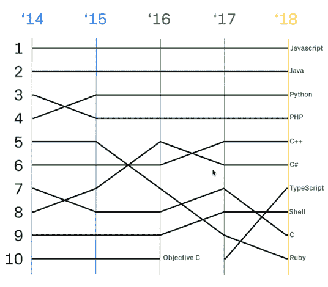

# 对打字稿的新看法

> 原文：<https://dev.to/bradymholt/a-fresh-look-at-typescript-38if>

如今越来越多的人和项目在使用 TypeScript！这很有意思，因为在 JavaScript 的世界里，一个项目的使用在发布(2012)后的*年才开始并不常见。*

在 [2018 GitHub Octoverse 报告](https://octoverse.github.com/)中，TypeScript 在“去年首次进入前 10 名后，在平台上使用的顶级语言中排名第 7”。它也是 GitHub 上增长最快的第三种语言。

[](https://res.cloudinary.com/practicaldev/image/fetch/s--7OIFHCZ---/c_limit%2Cf_auto%2Cfl_progressive%2Cq_auto%2Cw_880/https://www.geekytidbits.com/media/github-typescript.png)

在[Stack Overflow Developer Survey Results 2017](https://insights.stackoverflow.com/survey/2017)中，TypeScript 跻身最受欢迎的十大编程语言榜单。2018 年，这个类别结合了“编程、脚本和标记语言”，所以如果你排除 CSS、HTML 和 Bash 等东西，它仍然在 2018 年进入前 10 名。😏

[](https://res.cloudinary.com/practicaldev/image/fetch/s--cak8zddB--/c_limit%2Cf_auto%2Cfl_progressive%2Cq_auto%2Cw_880/https://www.geekytidbits.com/media/stackoverflow-typescript.png)

## 鸟瞰

从本质上讲，TypeScript 是 JavaScript 的超集，由安德斯·海尔斯伯格 T2 设计，最初于 2012 年发布。它由一个**语言服务**和一个**型检查翻译程序**组成。transpiler 使用命令`tsc`运行，获取 TypeScript 并将其转换为 JavaScript。语言服务是一个基于 JavaScript 的接口，开发工具(如编辑器和 CLI 命令)可以利用它为智能感知、重构工具和符号搜索等提供开发时支持。这些部分中的每一个单独使用都非常有用，但是结合起来会更加强大。

## 显著的特征

*   不可空类型检查
*   隐式类型检查
*   传输异步/等待到 ES5/ES3
*   隐式类型(可用于普通 JS)
*   ESNext (arrow、async/await、decorators 等。)
*   JSX 支持

## 一些例子

下面，我将举例说明如何使用 TypeScript 中的类型系统。这当然不是一个详尽的特性列表，但我认为这些特性展示了这种语言的强大和有用性，而不会变得太高级。

### 基本类型

TypeScript 最容易理解的部分是它对基本类型的类型检查。在 TypeScript 中，使用*类型注释*来描述参数的类型。在下面的例子中，请注意`person: string`参数。那个`: string`后缀是类型注释。您告诉 TypeScript，只有字符串可以作为`greeter`函数的`person`参数。

```
function greeter(person: string) {
  return "Hello, " + person;
}

var user = [0, 1, 2];
greeter(user); // ERROR: Argument of type 'number[]' is not assignable to parameter of type 'string'. 
```

当使用数字数组调用`greeter(user);`时，将会出现 TypeScript 错误，因为 TypeScript 知道`person`应该只是一个字符串。

### 功能类型

JavaScript 中的函数是[一级](https://developer.mozilla.org/en-US/docs/Glossary/First-class_Function)对象，TypeScript 对它们的类型检查有一级支持。当指定函数类型时，您可以指定它所具有的参数类型以及预期的返回类型。这是强大的。在下面的例子中，我们告诉 TypeScript】函数接受一个`getUserId`函数参数，该参数必须接受一个字符串参数并且必须返回一个数字。

```
function save(entity,
  getUserId: (username: string) => number
) {
    let userId = getUserId(username);
}

save(entity, (username)=>{ // This anonymous function must match the type struture!
  return 123;
}); 
```

### 字符串值枚举

枚举对于 JavaScript 世界来说有点陌生，但这是一个遗憾，因为它们使代码可读，并提供静态好处。TypeScript 把它们带到了 JavaScript，所以你可以这样做:

```
enum Color {
 Red = '#ff0000',
 Green = '#00ff00',
 Blue = '#0000ff'
}
const myFavoriteColor = Color.Green;
let chosenColor = Color.Red; 
```

### 字符串文字类型

TypeScript 最近增加了一个叫做字符串文字类型的东西。在下面的例子中，`move`的`direction`参数需要一个字符串，但不是任何字符串。它*必须*是“北”、“东”、“南”或“西”。传递任何其他字符串都会导致编译错误！

```
type CardinalDirection =
    "North" | "East" | "South"| "West";

function move(distance: number, direction: CardinalDirection) {
    // ...
}

move(2, "North");
move(3, "Northwest") // ERROR: Argument of type '"Northwest"' is not assignable to parameter of type 'CardinalDirection'. 
```

### 界面

接口在提供一种描述对象形状的方式方面非常有用。您甚至可以通过在属性名的末尾添加一个`?`来指定属性是可选的。

```
interface Person {
    firstName: string;
    lastName: string;
    age: number;
    dob?: string; // Optional
}

let newPerson: Person = {
  firstName: "Sue", 
  age: 24
}; // ERROR: Type '{ firstName: string; age: number; }' is not assignable to type 'Person'. 
```

### 仿制药

泛型是关于可重用性的。使用它们，您可以设计能够使用由调用方指定的类型而不是硬编码的类型的函数。

```
class Queue<T> {
  private data = [];
  push = (item: T) => this.data.push(item);
  pop = (): T => this.data.shift();
}

const queue = new Queue<number>();
queue.push(0);
queue.push("1"); // ERROR: cannot push a string. Only numbers allowed. 
```

### 严格的空检查

如果你试图引用一个属性，而这个属性由于没有给它赋值而使得*可能为空，那么 TypeScript 将会出错。在构建时知道这一点非常重要！* 

```
interface Member {
  name: string,
  age?: number
}

getMember()
  .then(member: Member => {
    const ageString = member.age.toString() // ERROR: Object is possibly 'undefined'
  }) 
```

### 装修工

根据 [TC39 提案](https://github.com/wycats/javascript-decorators#summary):

> 装饰器使得在设计时注释和修改类和属性成为可能。

你可以把它们想象成给你能力来增加或包装其他功能的功能。装饰器在 JavaScript 本身中变得标准化了，但在 TypeScript 中得到支持已经有一段时间了。

在下面的例子中，我们有一个用`@protected`修饰的`fetch`方法。这允许先运行`protected`功能，然后运行`fetch`功能。

```
class PeopleController {

  @protected
  fetch(id){
  }
}

function protected() {
  user = this.getCurrentUser();
  if (!user.isAuthenticated()){
    response.status = 403;
  }
} 
```