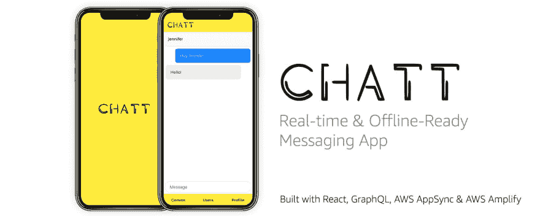

# 一个实时的多用户聊天应用程序

> 原文：<https://dev.to/dabit3/building-chatt---a-real-time-multi-user-graphql-chat-app-3jik>

> 此回购和项目现已存档

[](https://res.cloudinary.com/practicaldev/image/fetch/s--3JZJOZqh--/c_limit%2Cf_auto%2Cfl_progressive%2Cq_auto%2Cw_880/https://thepracticaldev.s3.amazonaws.com/i/usmt9qnxvxmj52ldx3ta.jpg)

GraphQL 订阅最流行的用例之一是构建支持实时通信的应用程序(即消息应用程序)。

更困难的事情之一是让这种实时功能与多个用户和多个通道一起工作，因为数据模型开始变得有些复杂&当您有大量连接的客户端时，可伸缩性问题开始发挥作用。

我最近开发并发布了一个开源应用程序， [**Chatt**](https://github.com/aws-samples/aws-appsync-chat) ，它实现了多用户的实时功能&能够根据你是否在对话中来订阅单独的频道(聊天)。

当构建这样的东西时，有两个主要部分需要设置:

1.  用户管理
2.  API

通常，至少可以说，从头开始构建这两者是一项艰巨的任务，将它们构建为可伸缩且安全可能需要几个月的时间。

令人欣慰的是，今天我们有了 Auth0、Firebase、Okta 和 AppSync 等服务，让我们能够提升托管服务来处理这些类型的工作负载。

我的应用程序使用 AWS app sync for graph QL API & AWS Amplify 来创建用户管理服务。该应用程序是为这些服务而构建的，但它们可以很容易地被另一个后端或认证提供商所取代。

> 要自己部署这个应用和后端，请查看自述文件中的说明

## 代码

让我们快速看一下其中的一些代码。我们首先要看的是基础模式:

```
type  User  {  id:  ID!  username:  String!  conversations(filter:  ModelConvoLinkFilterInput,  sortDirection:  ModelSortDirection,  limit:  Int,  nextToken:  String):  ModelConvoLinkConnection  messages(filter:  ModelMessageFilterInput,  sortDirection:  ModelSortDirection,  limit:  Int,  nextToken:  String):  ModelMessageConnection  createdAt:  String  updatedAt:  String  }  type  Conversation  {  id:  ID!  messages(filter:  ModelMessageFilterInput,  sortDirection:  ModelSortDirection,  limit:  Int,  nextToken:  String):  ModelMessageConnection  associated(filter:  ModelConvoLinkFilterInput,  sortDirection:  ModelSortDirection,  limit:  Int,  nextToken:  String):  ModelConvoLinkConnection  name:  String!  members:  [String!]!  createdAt:  String  updatedAt:  String  }  type  Message  {  id:  ID!  author:  User  authorId:  String  content:  String!  conversation:  Conversation!  messageConversationId:  ID!  createdAt:  String  updatedAt:  String  }  type  ConvoLink  {  id:  ID!  user:  User!  convoLinkUserId:  ID  conversation:  Conversation!  convoLinkConversationId:  ID!  createdAt:  String  updatedAt:  String  } 
```

Enter fullscreen mode Exit fullscreen mode

基本 GraphQL 类型主要有三种:**用户**、**对话**、&、**消息**。还有一个 **ConvoLink** 类型，它提供对话&与用户之间的关联。

此处可查看这些类型的操作和解析器的更多详情[。](https://github.com/aws-samples/aws-appsync-chat/tree/master/amplify/backend/api/allamplifychatt/build)

接下来我们要看的是我们将在客户端使用的 GraphQL 操作(查询、订阅和变异)，因为它们很好地展示了应用程序如何与 API 交互。

### 突变

```
// This creates a new user, storing their username.
// Even though the authentication service will be handling the user management, we will also need some association with the user in the database.
const createUser = `
  mutation($username: String!) {
    createUser(input: {
      username: $username
    }) {
      id username createdAt
    }
  }
`

// This creates a new message.
// The association between the message & the conversation is made with the __messageConversationId__.
const createMessage = `mutation CreateMessage(
    $createdAt: String, $id: ID, $authorId: String, $content: String!, $messageConversationId: ID!
  ) {
  createMessage(input: {
    createdAt: $createdAt, id: $id, content: $content, messageConversationId: $messageConversationId, authorId: $authorId
  }) {
    id
    content
    authorId
    messageConversationId
    createdAt
  }
}
`;

// This creates a new conversation.
// We store the members that are involved with the conversation in the members array.
const createConvo = `mutation CreateConvo($name: String!, $members: [String!]!) {
  createConvo(input: {
    name: $name, members: $members
  }) {
    id
    name
    members
  }
}
`;

// This makes the association between the conversations & the users.
const createConvoLink = `mutation CreateConvoLink(
    $convoLinkConversationId: ID!, $convoLinkUserId: ID
  ) {
  createConvoLink(input: {
    convoLinkConversationId: $convoLinkConversationId, convoLinkUserId: $convoLinkUserId
  }) {
    id
    convoLinkUserId
    convoLinkConversationId
    conversation {
      id
      name
    }
  }
}
`; 
```

Enter fullscreen mode Exit fullscreen mode

使用这四个操作，我们可以有效地创建我们的应用程序运行所需的所有数据。在我们创建了数据之后，如何查询它呢？让我们看一看。

### 查询

```
// Fetches a single user.
const getUser = `
  query getUser($id: ID!) {
    getUser(id: $id) {
      id
      username
    }
  }
`

// Fetches a single user as well as all of their conversations
const getUserAndConversations = `
  query getUserAndConversations($id:ID!) {
    getUser(id:$id) {
      id
      username
      conversations(limit: 100) {
        items {
          id
          conversation {
            id
            name
          }
        }
      }
    }
  }
`

// gets a single conversation based on ID
const getConvo = `
  query getConvo($id: ID!) {
    getConvo(id:$id) {
      id
      name
      members
      messages(limit: 100) {
        items {
          id
          content
          authorId
          messageConversationId
          createdAt
        }
      }
      createdAt
      updatedAt
    }
  }
`

// lists all of the users in the app
const listUsers = `
  query listUsers {
    listUsers {
      items {
        id
        username
        createdAt
      }
    }
  }
` 
```

Enter fullscreen mode Exit fullscreen mode

对于实时部分，我们有 2 个订阅。

### 订阅

```
// When a new message is created, send an update to the client with the id, content, authorId, createdAt & messageConversationId fields
const onCreateMessage = `
  subscription onCreateMessage($messageConversationId: ID!) {
    onCreateMessage(messageConversationId: $messageConversationId) {
      id
      content
      authorId
      messageConversationId
      createdAt
    }
  }
`

// When a new user is created, send an update to the client with the id, username, & createdAt fields
const onCreateUser = `subscription OnCreateUser {
  onCreateUser {
    id
    username
    createdAt
  }
}
`; 
```

Enter fullscreen mode Exit fullscreen mode

## 状态管理

除了 Apollo / AppSync SDK 之外，没有多少实际的状态管理。除此之外，我实现的唯一一件事是通过将用户数据存储在 MobX 中，以同步方式访问用户数据。在未来，我想用上下文来代替它，甚至可能与阿波罗合并。

## 离线

就离线功能而言，由于我们大部分时间都在使用 [AWS AppSync JS SDK](https://github.com/awslabs/aws-mobile-appsync-sdk-js) ,所以除了提供正确的乐观更新之外，我们没有其他事情要做。

AppSync JS SDK 利用现有的 Apollo 缓存来处理离线场景&将离线发生的任何操作排队。当用户重新联机时，更新会按照创建的顺序发送到服务器。

## 结论

在构建这个应用程序时，我学到了很多关于使用订阅的知识，并将添加额外的功能，如前面提到的完全由 AppSync SDK 处理的状态管理等。

要了解更多关于利用托管服务和 API 构建健壮应用程序的哲学，请查看我的帖子[无服务器计算时代的全栈开发](https://medium.com/@dabit3/full-stack-development-in-the-era-of-serverless-computing-c1e49bba8580)。

> 我的名字是纳德·达比特。我是 AWS Mobile 的开发人员，负责 AWS AppSync 和 AWS Amplify 等项目。我还专门从事跨平台应用程序开发。