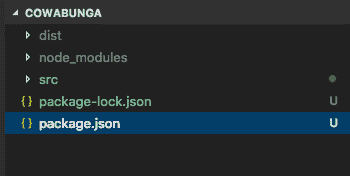

# NPM 链接和取消链接

> 原文：<https://dev.to/erinbush/npm-linking-and-unlinking-2h1g>

在工作中，我们有自己管理和维护的 npm 包。作为开发过程的一部分，在一个更大的项目环境中测试这个包是至关重要的，以确保它按预期运行，并满足我们所有的标准。我一直使用的一个方便的技巧是使用`npm link`链接本地 npm 包。

然而，由于在任何一天都有多项任务在进行，我不断让自己陷入权限问题的尴尬境地，我将不再有可用的包，这让 TBH 很恼火。这是不断切换分支的结果，并且在切换之前没有清理我的本地环境。

以下是链接和解除链接的具体步骤，这样你就可以避免我经历的#挣扎。

假设我们有一个正在本地开发的`npm`包，姑且称之为`cowabunga`。我们的项目结构如下所示:

它的`package.json`文件看起来是这样的: