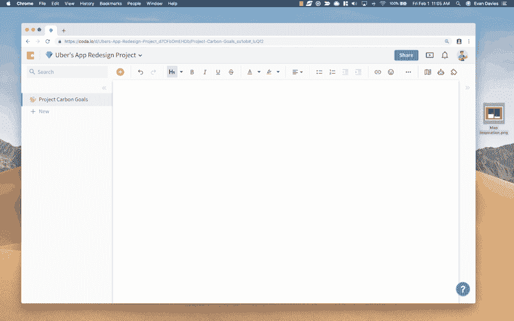
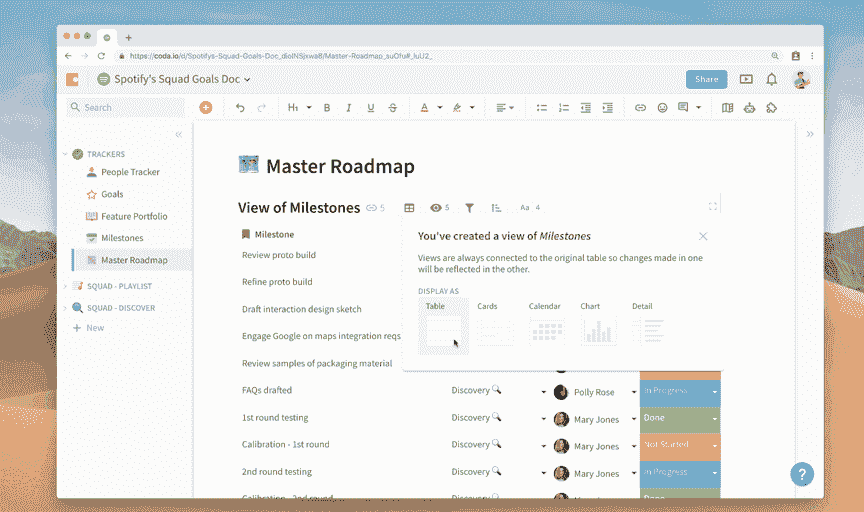
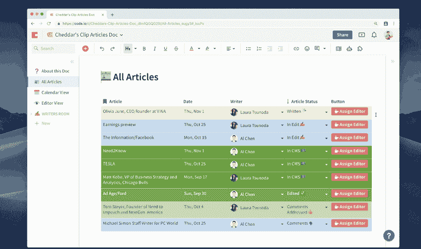
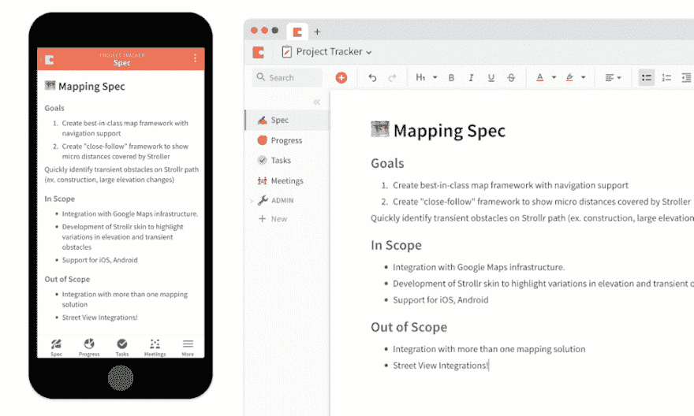
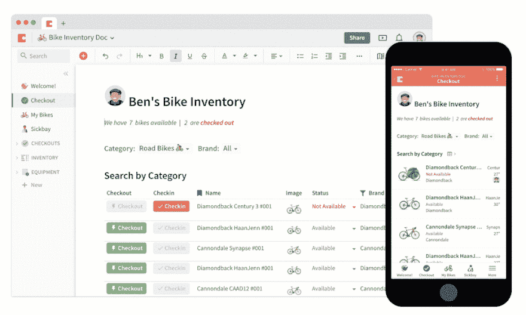

# Coda 1.0 公开发布

> 原文：<https://dev.to/coda/coda-10-publicly-available-kb5>

经过 4.5 年的开发/测试，Coda 1.0 昨天向公众推出。以下是首席执行官的创始博客:

*这最初出现在[尾波博客](https://blog.coda.io/introducing-coda-1-0-88a484851ea9)T3 上*

Coda 始于我们问自己:在一个充满应用程序的世界里，为什么文档和电子表格仍然运行一切？为什么他们 40 多年来都没有改变？如果我们从零开始，我们会建立什么？

[https://www.youtube.com/embed/M2tNj1CYp_A](https://www.youtube.com/embed/M2tNj1CYp_A)

## 介绍 Coda 1.0

大约一年前，我们发布了 Coda betaーa 文档，它将文字处理器的灵活性、电子表格的结构和应用程序的功能融合到一个新的画布上。我们承诺这会让你的文档像应用程序一样强大。

最初是一小群测试人员，很快发展到数万人，他们来自世界各地，代表着不同的职位、背景和用例。我们举办了聚会，并建立了一个活跃的在线社区，这样他们就可以交流技巧，排除故障，并讨论使用 Coda 的新方法。

我们看到 Coda 在数千家公司中传播。优步的一个团队建立了一个文档来跟踪公司历史上最大的重新设计之一。Spotify 的一位产品经理为他们的特殊“小队”模型创建了一个工具。一家小企业建立了新的系统来扩大格兰诺拉麦片的生产规模。在所有这些案例中，人们从空白画布上的几个句子开始，然后变成了定制的解决方案。

非常感谢那些在我们声称已经重新发明了这份文件的时候暂停怀疑的人。以及所有说服同事尝试 Coda 的人。多亏了你的反馈，产品才得以问世。

## 迎接尾波 1.0

当我们承诺让“文档像应用一样强大”时，有些人马上就明白了——你可以使用 Coda 来构建独特的工作流，就像应用一样。但是大多数人不明白。他们会拿出手机说“你是说这样的应用程序？”我会回答，“嗯。还没有。”

对于今天的发布，我的回答是，“是的，就像你手机上的一个应用程序。”

我喜欢用三个步骤来描述 Coda 1.0:新文档、新表格和新应用。每一个都是有用的，但是当结合在一起时，你会发现 Coda 文档真的和应用程序一样强大。

## 新单据:统一工作区。

我们觉得结尾以闪烁的光标和空白画布开始非常重要:这是创作的邀请，也是可能性的象征。博士是一个熟悉的起点。对于简单的情况，比如记下想法，这是容易做到的。但是，与其他文件不同，Coda 文件可以成长为强大和雄心勃勃的东西。它有分区和文件夹，所以每个人都有空间。而且它很灵活，所以你可以嵌入任何东西(甚至是公式)，并且随着你的需求不可避免地增长而调整它。

<figure>

<figcaption>For Uber’s ambitious re-design, one doc kept hundreds of people on track, with sections and views for each team.</figcaption>

</figure>

## 一个新的表格:一个可以跟踪任何事情的灵活的数据库。

当你的想法开始需要结构时，你添加一个表格。Coda 表格可以是带有自动颜色编码的简单列表，也可以是软件中的复杂模型。这些表格看起来像电子表格，但更像数据库。这是你存储和构建你的文档的 dataーthe 基础的地方，它将很快像一个应用程序一样强大。

有了视图，团队中的每个人都可以随心所欲地查看数据，同时还能处理单一的事实来源。还记得上次你打开一个电子表格，却发现别人修改了你精心配置的排序、过滤和颜色编码吗？视图让你有自己的呼吸空间，同时保持它们与总体规划的联系。视图是一个表格，过滤掉了干扰。你只需要看到与你相关的信息。您还可以对其进行格式化，使其符合您自己的视觉偏好——如甘特图、日历、看板等。

<figure>

<figcaption>A team at Spotify used Coda tables to align day-to-day operations with company-wide goals.</figcaption>

</figure>

## 一款新的 app:由你制作，为你的独特需求。

最后，我们将应用程序的精华部分转化为文档的构建模块。我们添加了复选框、选择列表和按钮，因此您可以开始形成简单的用户体验。我们还增加了自动化功能，让你的任务自动运行，比如移交和每周状态更新邮件。然后是最新的构建模块 Packs，它允许开发者将他们的文档与他们日常使用的工具联系起来。你可以让你的医生用 Twilio 发送一个松弛信息或文本。或者通过一个按钮更新 GitHub pull 请求。

<figure>

<figcaption>The Cheddar team built a workflow to route articles through the newsroom — with a pack that sent a Slack message to the next person on-deck.</figcaption>

</figure>

所有这些构件都是用一种新的公式语言拼接在一起的，这种语言为任何电子表格用户所熟悉，但扩展了通常为开发人员保留的一组功能。一旦你掌握了窍门，几乎任何事情都是可能的。

## 移动:完成从文档到应用的旅程

作为 Coda 1.0 的一部分，我们推出了一种新的移动体验，包括移动网页刷新和新的 iOS 应用程序，使您的文档不仅像一个应用程序，而且感觉像一个应用程序。我们认为这是模块化设计的真实证明:当你在手机上调出 Coda 文档时，构建模块会自动转换，感觉像一个原生应用程序。文档中的部分成为底部选项卡。表格和按钮可以调整以适合您的屏幕。您在文档中设置的通知会推送至您的手机。这就像让一个移动设计师团队根据你最喜欢的文档构建一个定制的应用程序。

<figure>

<figcaption>Example of how a doc automatically re-adjusts to fit desktop and mobile.</figcaption>

</figure>

## 一张单据给制单人。

我们为所有人设计了 Coda，尽管他们购买了应用程序，但他们每天都在文档和电子表格中度过。他们是组织者，工具制造者，问题解决者。人们不会等待市场给他们一个解决方案，而是为他们自己构建解决方案。我称他们为创客一代。

李志希就是一个完美的例子。Ben 是亚特兰大的一名山地自行车教练，他在 Coda 中创建了这个设备库存文档，以帮助他的团队出租自行车。无需为手机做任何特殊定制，以下是他的 doc 在手机上的样子。

<figure>

<figcaption>Ben tracks his mountain bike inventory using buttons. On mobile, they become swipe actions.</figcaption>

</figure>

Ben 没有责任为他的团队开发软件。为了让一名工程师开发这个应用程序，他的公司可能已经支付了数十万美元。但他找到了 Coda，并利用他的专业知识创造了完美的应用程序。

我们已经看到像本这样的人出现在许多行业。制作者在 YouTube 上传他们的视频。他们在 Etsy 上卖他们的工艺品。他们在 Airbnb 上，开放自己的床位和早餐。我认为你也可以把堡垒之夜和《我的世界》归为这一趋势:即使在游戏中，人们也在设计自己的体验。我认为创客一代下一步将是软件。我认为他们会在一份文件中这样做。

在这个世界里，他们会为小观众而不是大观众设计。不会有所谓的边缘案例。所有以前服务不足的团队和个人将获得一个完美的解决方案，而不需要乞求工程师。

我希望 Coda 将提供平台和构建模块来支持下一代的创客。

要开始让文档像应用一样强大，请访问 coda.io，从 App Store 下载 iPhone 上的 coda 应用。想从你的伙伴那里获得一些灵感吗？浏览模板库。

等不及要看你的结尾了。