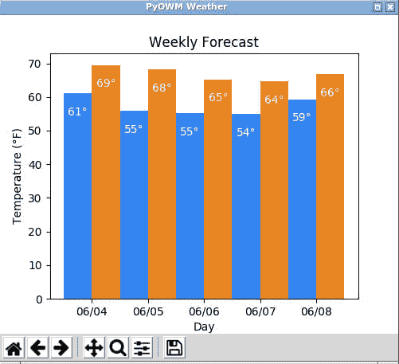

# 如何在 Python 中使用 OpenWeatherMap API

> 原文：<https://dev.to/nexttech/how-to-use-the-openweathermap-api-with-python-5dkg>

在本文中，我们将探索强大的 OpenWeatherMap API，它允许您在程序中访问和使用天气数据。它可用于显示当前天气和预测天气的温度、风和湿度等信息。

我们将使用 Python 编程语言和一个名为 Python OpenWeatherMap (PyOWM)的强大库，以便更容易地在 Python 中使用 OpenWeatherMap API。

这篇文章基于我在 Next XYZ 上发布的一个互动课程。本课程预装了 Python 和 PyOWM 库，您可以在浏览器中直接使用这两个库。如果你想进一步了解 PyOWM，你可以[查看课程](https://c.next.tech/2DgPvC0)并免费开始！

## 设置您的环境

要运行本文中的代码片段，您需要安装 Python 和`pyowm`库(关于`pyowm`的安装说明可以在[这里](https://github.com/csparpa/pyowm)找到)。

一旦你安装了这个，你就可以从命令行打开一个 Python shell(通常使用`python`或`python3`，这取决于你使用的 Python 版本)并使用它运行下面的命令。

## 获取 OpenWeatherMap API 密钥

一旦你有了你的环境设置，下一步就是从 [OpenWeatherMap 网站](https://openweathermap.org/)获得你的免费 API 密匙。

在 OpenWeatherMap 网站上注册后，您将在页面顶部看到以下内容:

[](https://res.cloudinary.com/practicaldev/image/fetch/s--Y0humrQl--/c_limit%2Cf_auto%2Cfl_progressive%2Cq_auto%2Cw_880/https://thepracticaldev.s3.amazonaws.com/i/dm8wxso85450ohm6o1co.png)

点击“API 密匙”，你会看到 API 密匙。

当你使用下面的例子时，你需要用这个 API 键替换`<api_key>`。

## 天气状况

现在您已经有了 API 密匙，让我们来看看天气吧！首先，我们将开始检查洛杉矶的五天天气预报中是否有云。下面是这样做的代码:

```
import pyowm
owm = pyowm.OWM('<api_key>') # TODO: Replace <api_key> with your API key la = owm.three_hours_forecast('Los Angeles, US')
print(la.will_have_clouds()) 
```

我们来分析一下。我们首先导入`pyowm`库，然后使用 API 密钥进行认证。经过认证的 API 连接存储在`owm`变量中。

接下来，我们使用`three_hours_forecast()`方法获得指定位置(在本例中是洛杉矶)的天气预报，并将其存储在 la 变量中。注意，`three_hours_forecast()`方法返回五天的天气预报，每三个小时采样一次天气数据。

现在我们有了天气对象，我们可以在它上面调用`will_have_clouds()`方法来检查是否会有云！在`pyowm`库中，这将每三个小时检查一次天气，如果任何天气样本表明将有云，该方法将返回 true，否则将返回 false。

我们还可以使用 PyOWM 来查看是否会下雨，有雾，或者检查其他常见的天气情况。OpenWeatherMap 也有来自世界各地的数据。比如，我们来看看伦敦的天气:

```
import pyowm
owm = pyowm.OWM('<api_key>') # TODO: Replace <api_key> with your API key london = owm.three_hours_forecast('London, GB')
print(london.will_have_rain())
print(london.will_have_fog()) 
```

厉害！只需几行代码，你就可以在你的程序中获得并显示一些惊人的信息。

## 当前温度

现在我们来看看如何获得当前温度:

```
import pyowm
owm = pyowm.OWM('<api_key>') # TODO: Replace <api_key> with your API key sf = owm.weather_at_place('San Francisco, US')
weather = sf.get_weather()
print(weather.get_temperature('fahrenheit')['temp']) 
```

正如您可能从上面代码中使用的`'fahrenheit'`猜到的，您也可以通过将`'celsius'`传递给`get_temperature()`方法来请求以摄氏度为单位的数据。

## 日出日落时分

用 PyOWM 可以做的另一件很酷的事情是请求并显示日出和日落时间。可以调用`get_sunrise_time()`和`get_sunset_time()`方法来获取这些信息。但是使用这些方法时有一个问题——它们默认返回 unix 时间(例如， **1542800608** )。传递`timeformat='iso'`参数会将时间转换为更易于阅读的格式(例如**2018–11–21 21:16:54+00**)。此外，时间是 GMT 时区(在下一个 XYZ 课程中，我们将介绍如何将时间转换为特定时区)。

这里有一个获取日出和日落时间的例子:

```
 import pyowm
owm = pyowm.OWM('<api_key>') # TODO: Replace <api_key> with your API key boston = owm.weather_at_place('Boston, US')
weather = boston.get_weather()
print(weather.get_sunrise_time(timeformat='iso')) # Prints time in GMT timezone print(weather.get_sunset_time(timeformat='iso')) # Prints time in GMT timezone 
```

## 包装完毕

如果你喜欢这篇文章，并想了解更多关于使用 Python OpenWeatherMap 访问天气数据的信息，请查看下一期 XYZ 的[课程，该课程更深入地介绍了如何使用 PyOWM。它还包括互动任务和测验，这将有助于你掌握课程中的材料。完成后，你将创建一个如下图所示的天气图形用户界面！](https://c.next.tech/2DgPvC0)

[](https://res.cloudinary.com/practicaldev/image/fetch/s--NOQAoiGX--/c_limit%2Cf_auto%2Cfl_progressive%2Cq_auto%2Cw_880/https://thepracticaldev.s3.amazonaws.com/i/rik1pcv59j43lv010dy4.png)

有任何问题或意见吗？就在下面留言吧！

感谢您的阅读，祝您编码愉快！