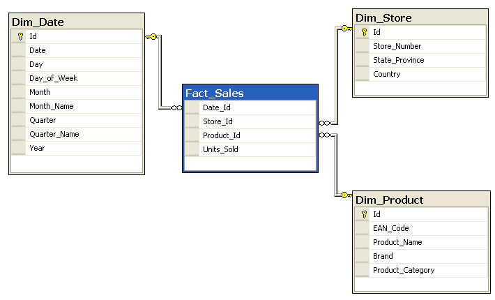
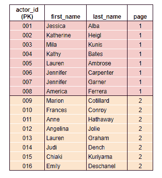
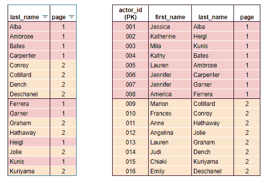
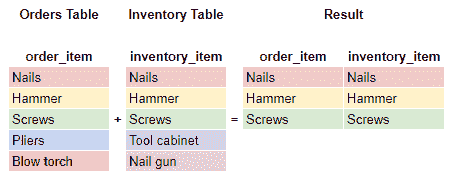
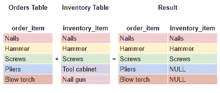
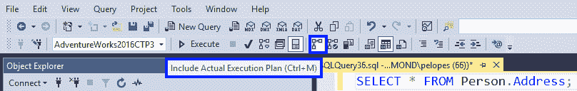
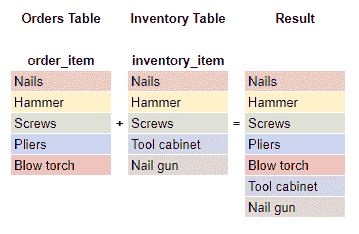
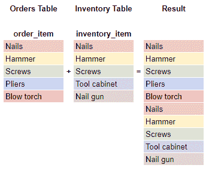

# 从头到尾的 SQL 概念

> 原文：<https://dev.to/helenanders26/sql-series-from-a-to-z-2pk9>

是时候打破行话了。

我很大一部分的职责是为初级数据分析师提供支持。他们中的许多人刚刚开始使用 SQL，来自 Excel 分析领域，并自学了 SQL 基础知识。

如果您需要复习，或者您的生活中有一位初级分析师需要一些参考资料，这里有一些在培训过程中出现的术语和概念。

* * *

> [别名](#chapter-1)
> [开始事务](#chapter-2)
> [CTEs v 子查询](#chapter-3)
> [设计](#chapter-4)
> [ETL](#chapter-5)
> [功能](#chapter-6)
> [分组由](#chapter-7)
> [堆存](#chapter-8)
> [完整性](#chapter-9)
> [联接](#chapter-10)
> [键](#chapter-11)
> [锁](#chapter-12)
> [系统表](#chapter-19)
> [截断 v 降](#chapter-20)
> [联合](#chapter-21)
> [查看](#chapter-22)
> [窗口功能](#chapter-23)
> [XML](#chapter-24)
> [年份](#chapter-25)
> [零点](#chapter-26)

* * *

## 别名

当连接表时，我们需要[声明我们想要匹配哪个表中的哪个列](https://docs.microsoft.com/en-us/sql/relational-databases/performance/joins?view=sql-server-ver15)，以及我们想要在结果中返回哪个列。如果有同名的列，我们需要明确我们要返回哪一列。

```
select
  orders.item, 
  inventory.item,
  inventory.unitprice
from 
  orders 
inner join 
  inventory 
on orders.order_item = inventory.inventory_item 
```

Enter fullscreen mode Exit fullscreen mode

为了使打字更快，我们可以用更短的东西作为两个表的别名。

```
select
  o.item, 
  i.item,
  i.unitprice
from 
  orders o
inner join 
  inventory i 
on o.order_item = i.inventory_item 
```

Enter fullscreen mode Exit fullscreen mode

我们可以用字母“o”代表订单，用“I”代表库存，而不是每次添加新列时都必须键入整个表名。

在这篇初学者友好的文章中阅读更多关于连接和别名的内容:

[](/helenanders26) [## 没有文氏图的 SQL 连接

### 海伦·安德森 4 月 29 日 203 分钟阅读

#sql #beginners #data #database](/helenanders26/sql-joins-without-the-venn-diagrams-2o8d)

* * *

## 开始交易

[SQL 事务](https://docs.microsoft.com/en-us/sql/relational-databases/sql-server-transaction-locking-and-row-versioning-guide?view=sql-server-ver15)用于在对表进行更改时捕获错误。在 UPDATE 或 DELETE 语句中，更改是自动提交的。

通过将语句包装在一个事务中，当我们确定它应该被执行时，或者如果满足了一个条件，我们就有机会“回滚”或“提交”。

以下事务将在块中运行，如果成功，将提交。

```
begin transaction

update orders
set status = 'sent'
where order_id = '12345'

update orders
set status = 'sent'
where order_id = '54321'

commit transaction 
```

Enter fullscreen mode Exit fullscreen mode

阅读更多关于这些如何工作的信息:

[](/johndougherty68) [## 数据库事务，就像你五岁时一样

### 约翰多尔蒂 9 月 9 日 187 分钟阅读

#database #explainlikeimfive](/johndougherty68/database-transactions-like-youre-five-50i4)

* * *

## CTEs v 子查询

cte(公共表表达式)是一个临时的、命名的结果集，我们可以在单个 SELECT、INSERT、UPDATE、DELETE 或 MERGE 语句的范围内返回。

我在处理大型表格时使用它们。例如:从“emailsent”表中获取我需要的所有列，然后从“emailunsubscribe”表中获取我需要的所有列。然后在最后一步将它们连接在一起。

```
; -- start the CTE with a semicolon to terminate anything above

with sent as -- here is where you name the dataset

(select 
  emailaddress,
  emailid, 
  senddate
from
  marketing.emailsent
where
  senddate between '2018-01-01' and '2018-01-31'
),  -- add a comma if you need to add a subsequent CTE

unsubs as

(select 
  emailaddress,
  emailid, 
  senddate
from
  marketing.emailunsubscribe
where
  senddate between '2018-01-01' and '2018-01-31'
) -- no comma for the last CTE

select
  'January' as [monthdelivered],
  c.country, 
  count(distinct sent.emailaddress) as [countofdelivered], 
  count(distinct unsubs.emailaddress) as [countofunsubd]
from sent
left join 
  marketing.customers c on sent.email = unsubs.emailaddress
left join  
  unsubs on sent.email = unsubs.email 
  and sent.emailid = unsubs.emailid 
```

Enter fullscreen mode Exit fullscreen mode

Chidiebere 已经写了一个关于 cte 及其与子查询的比较的优秀系列文章。

[](/chidioguejiofor) [## CTE 怎么了

### chidiebere Ogujeiofor 1919 年 12 月 13 日 9 分钟阅读

#postgres #database #sql](/chidioguejiofor/whats-with-cte-53ao)

* * *

## 设计

数据集市表有两种组织形式。由两种类型的表组成的“星形”模式和“雪花形”模式。

*   事实——计算某事发生的次数。
*   描述属性的尺寸(或暗)。

在星型模型中，我们可以在中心放置一个销售表作为我们的事实。商店、产品和位置的维度表像星星一样围绕着事实。

[](https://res.cloudinary.com/practicaldev/image/fetch/s--Ue0J4VG2--/c_limit%2Cf_auto%2Cfl_progressive%2Cq_auto%2Cw_880/https://dev-to-uploads.s3.amazonaws.com/i/in90kvm3zj8rm9sbuafw.png)

<center>*Attribution: SqlPac at English Wikipedia*</center>

雪花是相似的，但是在维度上更进了一步。我们可能有一个城市、国家甚至邮政编码表，而不仅仅是一个位置表。所有的维度都变成了雪花上的点。

[](https://res.cloudinary.com/practicaldev/image/fetch/s--tLvBWeFe--/c_limit%2Cf_auto%2Cfl_progressive%2Cq_auto%2Cw_880/https://dev-to-uploads.s3.amazonaws.com/i/pqjymxanga0jkl2qlt62.png)

<center>*Attribution: SqlPac at English Wikipedia*</center>

阅读更多关于两者优缺点的信息:

[](/pedrojmfidalgopt) [## 星型模式与雪花型模式，以及为什么要关注它们

### pedrojmfidalgopt 12 月 19 日 177 分钟读取

#database #data](/pedrojmfidalgopt/star-schema-vs-snowflake-schema-and-why-you-should-care-40fh)

* * *

## ETL

ETL 和 ELT 是将数据从源系统移动到目标系统的步骤。

*   **提取** -在提取步骤中，原始数据从源移动到临时或暂存区域。

*   **Transform** -转换步骤转换数据，以便与目标表匹配。

*   **Load**-Load 步骤将数据移动到其最终目的地，以便可以在分析或报告中使用。

ETL 是传统上执行这些步骤的顺序。ETL 非常适合将数据转换成正确的格式，去掉不必要的列，并屏蔽与 GDPR 法规相关的字段。

然而，当与数据湖体系结构结合使用时，ELT 已经成为一种更受欢迎的方法。数据很快到达，因为它不需要以任何方式改变。然后，数据科学家可以只使用他们需要的数据，快速获得结果，而不必在转换步骤失败时处理延迟。

需要考虑原始数据的可靠性。每个数据科学家或最终用户在进行分析时都需要应用相同的逻辑和业务规则，以保持结果的一致性。

关于 ETL、ELT 和数据管道的更多信息，请查看 SeattleDataGuy 的这篇文章，他写了很多关于数据的精彩文章。

[](/seattledataguy) [## 数据工程 101:从批处理到流

### SeattleDataGuy Mar 4 ' 207 分钟读取

#database #beginners #aws](/seattledataguy/data-engineering-101-from-batch-processing-to-streaming-g91)

* * *

## 功能

在 PostgreSQL 中，我们可以按计划执行被称为函数的代码块。它们可以像我们在数据库中特别运行的语句一样编写，也可以被解析为变量以使其动态化。

阅读有关如何编写和执行函数的更多信息:

[](/samuyi) [## POSTGRESQL 存储函数(PL/pgSQL)入门

### 苏梅岛

#postgres #linux #sql #database](/samuyi/a-primer-on-postgresql-stored-functions-plpgsql-1594)

* * *

## 分组依据

[集合函数](https://docs.microsoft.com/en-us/sql/t-sql/functions/aggregate-functions-transact-sql?view=sql-server-ver15)允许我们对字段进行计算。最常见的有求和、计数、最小值、最大值、平均值。

例如，要查看 orders 表中每一项的总到期金额，我们可以使用 amount_due 列和 GROUP BY
的总和

```
select 
  order_item, 
  sum(amount_due) 
from orders
group by order_item; 
```

Enter fullscreen mode Exit fullscreen mode

阅读有关聚合函数的更多信息:

[](/griffinator76) [## SQL:像老板一样汇总

### 内森格里菲斯 9 月 15 日 196 分钟阅读

#sql #database #cube #dataanalysis](/griffinator76/rollup-like-a-boss-3dkl)

* * *

## 堆存

堆积存储是一个术语，指数据库中没有聚集索引的表。数据的存储没有特定的顺序，新数据只是在它进来的时候被添加。

索引是一种告诉数据库对数据进行排序的方式，或者告诉数据库在哪里可以找到您经常查询的数据。

*   **聚集索引**就像一本书的目录页。应用这种索引就是告诉数据应该如何排序，就像书中的页面一样。

[](https://res.cloudinary.com/practicaldev/image/fetch/s--SzOdC3Hp--/c_limit%2Cf_auto%2Cfl_progressive%2Cq_auto%2Cw_880/https://thepracticaldev.s3.amazonaws.com/i/y7yo2tivweq1dsu763ie.PNG)

*   **非聚集索引**就像一本书的索引，页面没有按照物理方式排列，但是你现在可以通过查找来更快地找到你需要的内容。

[](https://res.cloudinary.com/practicaldev/image/fetch/s--lBIoytMy--/c_limit%2Cf_auto%2Cfl_progressive%2Cq_auto%2Cw_880/https://thepracticaldev.s3.amazonaws.com/i/cn0p49zsmec3x1zenlf5.PNG)

阅读这篇初学者友好的文章:

[](/mdgale) [## 我们不都是 DBA:开发人员的索引

### 马修·盖尔 10 月 24 日 195 分钟阅读

#sql #index #backend #performance](/mdgale/we-re-not-all-dbas-indexes-for-developers-557f)

* * *

## 正直

这指的是数据质量和确保数据可追踪、可搜索和可恢复的规则。

*   实体完整性——每个表必须有一个唯一的主键
*   参照完整性——每个表上的外键引用另一个表上的主键，或者为空
*   域完整性——每一列都有特定的数据类型和长度。

阅读有关完整性和数据库设计的更多信息:

[](/adammc331) [## 有效的数据库设计:第 1 部分

### Adam McNeilly 12 月 3 日 183 分钟阅读

#database](/adammc331/how-to-properly-design-a-database-part-1-2h6f)

* * *

## 加入

因为我们的数据库包含了被标准化的表格，你可能无法在一个表格中找到你需要的所有数据。为了以对我们最有意义的方式将数据放回一起，我们使用联接。这将多个表中的列添加到一个数据集中。

当您想要查找两个表之间的匹配时，请使用内部联接，简称为“联接”。您需要在连接的两个表上都有一个列，这就是匹配发生的地方。任何不匹配的结果都将被丢弃。

[](https://res.cloudinary.com/practicaldev/image/fetch/s--RJnMgyP0--/c_limit%2Cf_auto%2Cfl_progressive%2Cq_auto%2Cw_880/https://thepracticaldev.s3.amazonaws.com/i/4awenpvfcedaz8t7ldx8.PNG)

当您希望在两个表之间查找匹配项时，可以使用左连接，但是如果右表中没有匹配项，则显示 NULL。右连接做同样的事情，但方向相反。

像内部连接一样，您需要一个列来连接。与内部连接不同，NULL 用于表示两个表之间不匹配。

[](https://res.cloudinary.com/practicaldev/image/fetch/s--qjtkFpj0--/c_limit%2Cf_auto%2Cfl_progressive%2Cq_auto%2Cw_880/https://thepracticaldev.s3.amazonaws.com/i/rnhge20cokfe29jol171.PNG)

Katie 写了一篇关于“你需要的每一个连接”的很棒的文章，重点是 Oracle 语法。

[](/katiekodes) [## 您需要的每一个 SQL 连接

### 凯蒂 11 月 8 日 1820 分钟阅读

#database #sql #tutorial #beginners](/katiekodes/every-sql-join-youll-ever-need-2hbd)

* * *

## 键

主键是最好地标识一个唯一行的列，并且将每个记录标识为唯一的，就像 ID 一样

*   它确保没有重复
*   它不能是未知的(空)
*   每个表只能有一个主键

外键是与另一个表中的主键相匹配的列，并在两者之间实施完整性。

若要在 SQL Server 中创建主键，请在所选列的数据类型后添加保留字“primary key”。

```
create table students (
  id int not null primary key,
  firstname varchar(255) not null,
  lastname varchar(255) not null,
); 
```

Enter fullscreen mode Exit fullscreen mode

Lenique 通过这篇关于关系模型设计的文章将这一点付诸实践。

[](/leniquenoralez) [## 面向应用开发的数据库管理系统:关系模型和关系数据库

### 本字幕仅供学习交流，严禁用于商业用途

#database #sql #datamodel](/leniquenoralez/dbms-for-application-development-relational-model-relational-database-3nl8)

* * *

## 锁定

当两个用户试图同时查询或更新同一个表时，可能会导致锁。就像两个拥有相同银行账户的 ATM 卡的人试图从相同的银行账户提取相同的 100 美元一样，当第一笔交易完成时，其中一个将被锁定。

Rhymes 很好地解释了它在数据库中的工作原理:

> "...数据库锁用于保护对共享资源(表、行、数据)的访问。

在一个系统中，如果没有数百个连接，也有数十个连接对同一个数据集进行操作，那么必须有一个系统来避免两个连接使彼此的操作无效(或者在其他情况下导致死锁)...

锁是做到这一点的一种方式。一个操作来到数据库，声明他们需要一个资源，完成自己的修改，然后释放这样的资源，这样下一个操作就可以做同样的事情。如果他们没有锁定他们的资源，两个操作可能会覆盖彼此的数据，从而导致灾难。

[](/techelevator) [## SQL Server 锁定

### matt Eland for Tech Elevator 2019 年 9 月 10 日 3 分钟阅读

#sql #sqlserver #performance #database](/techelevator/sql-server-locking-4beo)

* * *

## 海量并行处理

在大规模并行处理数据库中，如 Redshift，数据跨多个计算节点进行分区，每个节点都有内存来本地处理数据。

Redshift 将表中的行分布到节点，以便可以并行处理数据。通过为每个表选择适当的分布键，可以平衡工作负载。

阅读关于红移的更多内容，ronsoak 写了一本红移的完整指南:

## 文章不再可用

* * *

## 标准化

数据库规范化增加了数据完整性，并允许在不改变底层结构的情况下添加新数据。

*   **消除或最大限度地减少重复** -在多个表中重复一个值意味着表会占用比所需更多的空间，从而增加存储成本。与在订单表的每一行上重复地址详细信息相比，将客户地址详细信息存储在一个表中并使用链接到其订单的键，将占用更少的空间。

*   **简化数据更新** -通过在一个表中保存一个值，并用一个键指向另一个表，我们可以最大限度地降低更新时出错的风险。如果客户的电子邮件存储在两个地方，而只有一个地方得到更新，那么人们会混淆哪个地方是正确的。

*   **简化查询** -如果没有重复的表，搜索和排序会变得更容易。

阅读有关标准化的更多信息:

[](/gladuz) [## ELI5:什么是数据库规范化？

### jamshid Tursunboyev 12 月 6 日 171 分钟阅读

#explainlikeimfive #discuss](/gladuz/what-is-a-database-normalization-bbn)

* * *

## OLTP 诉 OLAP

OLTP 和 OLAP 指的是执行不同功能的不同类型的数据库和工具。

*   OLTP——在线事务处理——用于快速数据处理并立即响应查询。
*   OLAP -在线分析处理-用于存储历史数据和数据挖掘。

阅读有关 OLTP 的更多信息:

[](/vikastwittes) [## 借助内存 OLTP 系统革新 SQL Server 的性能

### vikas Arora 5 月 7 日 184 分钟阅读

#oltpsystem #sql](/vikastwittes/revolutionize-the-performance-in-sql-server-with-in-memory-oltp-system-41nn)

* * *

## 特权

如果您打算与能够访问您的模式的同事共享一个表，您需要显式地授予他们访问权限。这使得数据只锁定给那些需要查看的人。

```
GRANT ALL ON <schemaname.tablename> TO <username>  
-- if you would like them to SELECT, UPDATE and DELETE

GRANT SELECT ON <schemaname.tablename> TO <username> 
-- if you would like them to be able to only SELECT 
```

Enter fullscreen mode Exit fullscreen mode

阅读关于权限的更多信息以及您需要了解的关于数据库的其他信息:

[](/lmolivera) [## 关于(关系)数据库您需要知道的一切

### 卢卡斯·奥利弗

#beginners #database #sql](/lmolivera/everything-you-need-to-know-about-relational-databases-3ejl)

* * *

## 查询计划

当我们运行一个查询时，SQL 引擎会考虑很多事情——连接、索引、它是否会扫描整个表或面临表锁定。

在 SQL Server 中，我们可以使用[执行计划](https://docs.microsoft.com/en-us/sql/relational-databases/performance/display-an-actual-execution-plan?view=sql-server-ver15)来可视化运行时信息和任何警告。

[](https://res.cloudinary.com/practicaldev/image/fetch/s--keCL0AKJ--/c_limit%2Cf_auto%2Cfl_progressive%2Cq_auto%2Cw_880/https://dev-to-uploads.s3.amazonaws.com/i/22mek5y6qjzfp75qbo77.png)

<center>*From the SQL Server documentation*</center>

在 PostgreSQL 中，我们可以使用 EXPLAIN 命令检查查询计划:

```
EXPLAIN -- show the execution plan of a statement
EXPLAIN ANALYZE -- causes the query to be executed as well explain 
```

Enter fullscreen mode Exit fullscreen mode

阅读有关每个查询的外观以及如何解释结果的更多信息:

[](/calebhearth) [## 阅读 Postgres 解释分析查询计划

### Caleb Hearth 2 月 22 日 185 分钟阅读

#database #postgres #performance](/calebhearth/reading-a-postgres-explain-analyze-query-plan-3gb8)

* * *

## 恢复

数据库领域的灾难恢复与备份、日志和复制实例有关，它们在一切正常的情况下得到维护。当出现问题时，比如硬件故障、自然灾害甚至是人为错误，这些可以被打开、转换和分析。

*   **故障转移** -设置了多个集群，因此如果一个集群出现故障，另一个集群可以接管。

*   **镜像**——在不同的位置维护同一个数据库的两个副本。一个处于离线模式，这样当我们需要使用它时，我们就知道东西在哪里。

*   **复制** -辅助数据库在线，可以查询。这不仅有利于灾难恢复，而且如果您将一个实例用于报告，一个实例用于实时查询，这也很有用。如果你使用的是 AWS，只需要点击几下就可以设置好了。

[](/thamaraiselvam) [## 对数据库复制的需求

### thamaraiselvam 2 月 1 日 203 分钟读取

#database #distributedsystems #tutorial #devops](/thamaraiselvam/the-need-for-database-replication-2ncm)

* * *

## 系统表

在 SQL Server 中，这些通常被称为系统表和视图。它们可以在主数据库中找到，主数据库保存关于数据库的数据。并在每个数据库的系统视图中显示每个数据库的具体信息。

在 PostgreSQL 中，可以在 information_schema 和 PostgreSQL 目录中找到类似的表集合。

系统视图的示例

*   sys.objects -显示每个对象及其类型和创建日期
*   sys.indexes -显示每个索引和类型
*   information _ schema . columns——显示每一列及其位置和数据类型

目录对象的示例

*   information_schema.tables -显示每个对象及其类型和创建日期
*   pg_index -显示每个索引和类型
*   information _ schema . columns——显示每一列及其位置和数据类型

[](/yugabyte) [## SQL 提示和技巧:计算行数

### 吉米格雷罗为 YugabyteDB 8 月 27 日 205 分钟阅读

#postgres #yugabyte #sql #distributedsystems](/yugabyte/sql-tips-tricks-counting-rows-4dgn)

* * *

## 截断 v 降

这两个命令都将从表中删除数据，但方式不同。

*   TRUNCATE 是一个 DDL 命令，它删除表的内容，而保留结构

```
truncate table marketing.emailcampaign 
```

Enter fullscreen mode Exit fullscreen mode

*   DELETE 是一个 DML 命令，它删除给定 WHERE 子句的行

```
delete from 
  marketing.emailcampaign
where
  month = 'January' 
```

Enter fullscreen mode Exit fullscreen mode

关于哪些命令属于 DDL，哪些是 DML 命令的分类，请看这篇文章。

[](/l0l0l0l) [## SQL-概述和命令类型

### l0l0l0l 5 月 23 日 193 分钟阅读

#sql #tutorial #computerscience #todayilearned](/l0l0l0l/sql-overview-and-types-of-commands-3pd7)

* * *

## 工会

联接在水平方向上组合多行多列，而联合在垂直方向上组合结果。使用 UNION 将两个查询的结果合并到一列中，并删除重复项。如果您的查询有多个列，它们需要以相同的顺序完成联合。

[](https://res.cloudinary.com/practicaldev/image/fetch/s--eEMklGVI--/c_limit%2Cf_auto%2Cfl_progressive%2Cq_auto%2Cw_880/https://thepracticaldev.s3.amazonaws.com/i/76x161yx9qx01nw5wihc.PNG)T3】

```
select *
from
  orders
union
select *
from
  inventory 
```

Enter fullscreen mode Exit fullscreen mode

UNION ALL 将两个查询的结果组合为一个 UNION，但保留结果中的重复项。

[](https://res.cloudinary.com/practicaldev/image/fetch/s--ewN3fWwl--/c_limit%2Cf_auto%2Cfl_progressive%2Cq_auto%2Cw_880/https://thepracticaldev.s3.amazonaws.com/i/eypfji1dzlvquhhaccn0.PNG)T3】

```
select *
from
  orders
union all
select *
from
  inventory 
```

Enter fullscreen mode Exit fullscreen mode[](/wendisha) [## SQL: Union 运算符

### 温迪·卡尔德龙 1912 年 12 月 2 日 2 分钟阅读

#sql #postgres #programming](/wendisha/sql-union-operator-2pmc)

* * *

## 视图

视图不是表，它们是动态执行的查询，是从基表创建抽象层的一种方式。

乔在他的文章中总结得很好

> 视图是存储的查询。当您创建数据库视图时，数据库会存储您提供给它的 SQL。然后，当您来查询该视图时，数据库获取存储的视图查询，添加针对该视图的额外查询，并执行它。就是这样！

[](/thatjoemoore) [## 数据库视图实际上并不存在

### 约瑟夫摩尔 8 月 9 日 185 分钟阅读

#database](/thatjoemoore/database-views-dont-exist-4ho7)

* * *

## 窗口功能

窗口函数之所以得名，是因为与聚合函数不同，它保持每一行不变，并添加一个行号或运行总数。

下面是一个使用 orders 表的示例，该表使用 order_value 返回排名。

```
select
  order_id,
  order_name
  order_date,
  rank() over(order by amount_due desc) as rank
from 
  dbo.orders 
```

Enter fullscreen mode Exit fullscreen mode[](/kaysauter) [## SQL Server 上的窗口函数介绍

### 凯索特 3 月 7 日 204 分钟阅读

#sql #tutorial](/kaysauter/introduction-into-window-functions-on-sql-server-1k6o)

* * *

## XML

我们可以使用[导入/导出向导](https://docs.microsoft.com/en-us/sql/relational-databases/import-export/import-flat-file-wizard?view=sql-server-ver15)将文件导入表格。但是它们不一定只是 csv 或 txt 文件。通过使用几行代码，我们也可以[导入 XML](https://docs.microsoft.com/en-us/sql/relational-databases/import-export/examples-of-bulk-import-and-export-of-xml-documents-sql-server?view=sql-server-ver15) 。

阅读更多说明:

[](/booyaa) [## SQL Developer 的新格式提示

### mark Sta Ana Aug 26 ' 181min read

#oracle #sqldeveloper](/booyaa/sql-developers-new-format-hints-5c6g)

* * *

## 年份

根据您的 SQL 风格，您将能够计算两个日期之间的差异，并将一个日期与当前日期进行比较。在数据库之间移动会增加复杂性，所以在下次迁移时要记住这一点。

[](/retool) [## SQL 中日期的格式化和处理

### Justin gage for Retool 3 月 4 日 20 时 11 分读取

#sql #dates #formatting](/retool/formatting-and-dealing-with-dates-in-sql-5hmh)

* * *

## 零

NULL 表示值未知，不为零且不为空。这使得在比较空值和空值时很难比较值。

因为 NULL 不是一个值，所以不可能使用比较运算符。相反，我们需要使用 IS 和 IS NOT 运算符:

```
select * 
from 
  inventory
where 
  unitprice is not null 
```

Enter fullscreen mode Exit fullscreen mode

默认情况下，空值将显示为最大值，这使得排序变得很烦人，甚至会产生误导。为了解决这个问题，我们可以使用 COALESCE 将空值视为 0。

```
select 
  itemname, 
  coalesce(unitprice, 0)
from 
  inventory
order by 2 
```

Enter fullscreen mode Exit fullscreen mode[](/yuyabu) [## SQL:如何在没有“IS NULL”运算符的情况下与 NULL 比较

### yuya bu 11 月 11 日 182 分钟阅读

#sql #null #rdbms #database](/yuyabu/sqlhow-to-compare-with-null-without-is-null-operator-14d5)

* * *

现在，我们有了一个针对 SQL 和数据库新手的关键术语、概念和行话的快速介绍。

这篇文章最初出现在[helenanderson.co.nz](https://www.helenanderson.co.nz/sql-concepts-from-a-to-z/)