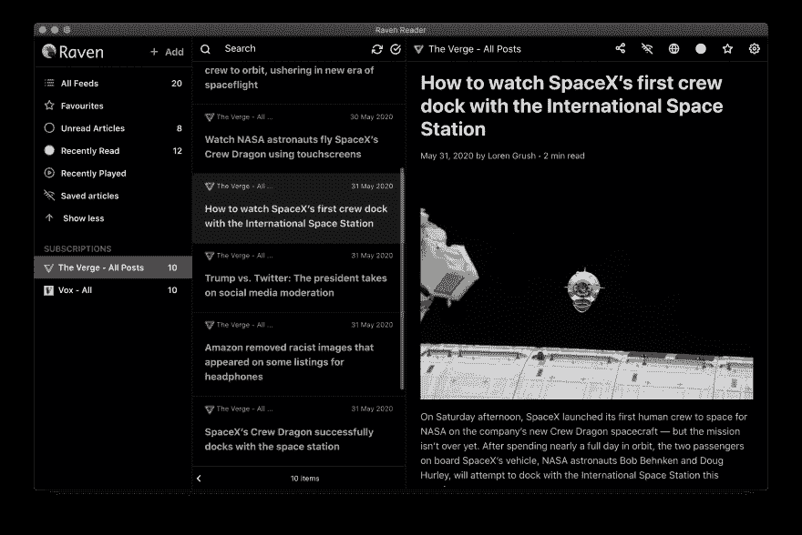

# 渡鸦阅读器 RSS 阅读器应用

> 原文：<https://dev.to/mrgodhani/raven-reader-rss-reader-app-3ha1>

嘿德夫斯，

我开发了一个简单的桌面 RSS 阅读器。这是一个简单的阅读器，有极简的用户界面，没有像社交媒体分享或推荐引擎那样的额外干扰。只需订阅您喜欢阅读的订阅源，并直接在您的桌面上保持最新状态。不需要用户帐户。它还支持离线阅读，也就是说，如果没有互联网连接，你可以离线保存文章。

**Github 回购**

## /[渡鸦阅读器](https://github.com/hello-efficiency-inc/raven-reader)

### 📖你所有的文章都在一个地方。太美了。

<article class="markdown-body entry-content container-lg" itemprop="text">

[](https://github.com/mrgodhani/rss-reader)

将您的所有文章放在一个地方。太美了。

[](https://camo.githubusercontent.com/7161aa0546b6cb9653f8ceee233321bd0311a85e/68747470733a2f2f696d672e736869656c64732e696f2f6769746875622f7061636b6167652d6a736f6e2f762f68656c6c6f2d656666696369656e63792d696e632f726176656e2d726561646572)[](https://travis-ci.org/mrgodhani/raven-reader)[](https://david-dm.org/hello-efficiency-inc/raven-reader "dependencies status")[](https://david-dm.org/hello-efficiency-inc/raven-reader?type=dev "devDependencies status")[](https://madewithvuejs.com/p/rss-reader-v2-0/shield-link "MadeWithVueJs.com Shield")

## [计] 下载

下载请访问 [https://ravenreader.app](https://ravenreader.app) 。

## 通过自制软件安装(macOS)

要使用自制酒桶，你只需要安装[自制酒](https://brew.sh/)。

```
brew cask install raven-reader
```

[](https://raw.githubusercontent.com/hello-efficiency-inc/raven-reader/master//darkscreenshot.png)

## 特征

*   全文阅读
*   订阅新闻源
*   标记为已读/未读
*   标记为收藏
*   黑暗模式
*   用于馈送刷新间隔的可配置 cron 作业
*   将应用程序最小化到托盘并在后台运行
*   在外部浏览器中打开文章链接
*   应答的
*   以 OPML 格式导出提要
*   导入订阅源
*   Windows 支持
*   Linux 支持
*   离线阅读
*   快捷键
*   侧栏计数
*   文本大小配置
*   文本字体样式配置(目前有 Playfair Display、Muli、Open Sans 和 Roboto Slab)
*   支持提要的分类。
*   macOS touchbar 快捷键
*   与 read it later 应用程序集成:Pocket、Instapaper
*   播客支持。订阅播客 rss 源，在应用程序中收听。

请随时提出更多改进此应用程序的想法。

## 开发者笔记

#### 构建设置

```
# copy config.example.js
```

…</article>

[View on GitHub](https://github.com/hello-efficiency-inc/raven-reader)

**技术堆栈**

*   Vuejs
*   电子
*   基于本地文件的数据库
*   引导程序
*   Mercury 解析器 API(全文阅读)

**支持的平台**

*   苹果个人计算机
*   Windows 操作系统
*   Linux 操作系统

如果有任何反馈，请告诉我！