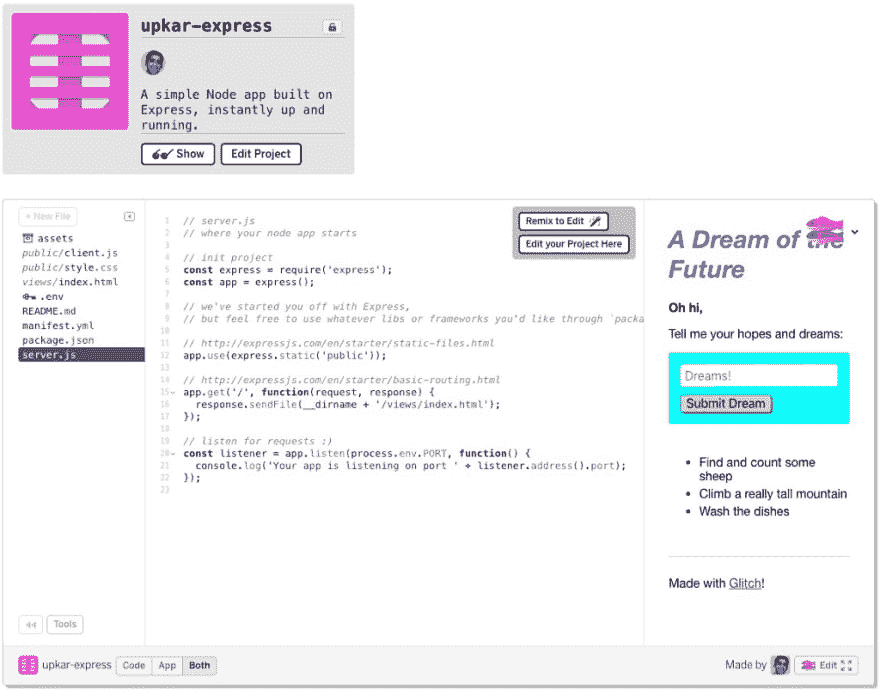
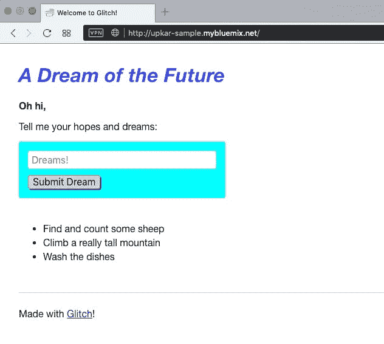

# 将 Glitch 应用部署到 IBM Cloud

> 原文：<https://dev.to/lidderupk/deploying-a-glitch-app-to-ibm-cloud-3937>

[](https://res.cloudinary.com/practicaldev/image/fetch/s--lVNBg7qq--/c_limit%2Cf_auto%2Cfl_progressive%2Cq_auto%2Cw_880/https://cdn-images-1.medium.com/max/928/1%2AcpKtX6JxC-7MS0JNsIb2Gw.png) 

<figcaption>[小故障](https://medium.com/u/c41c9661ddbd)， [IBM 开发者](https://medium.com/u/262975298e3a)&cloud foundry</figcaption>

我有没有告诉过你我是 [Glitch](https://medium.com/u/c41c9661ddbd) 的超级粉丝！如果你不知道那是什么，[在这里阅读。](https://dev.to/lidderupk_10/my-favorite-web-app-in-the-whole-world-wide-web-world-9gd)我在聚会和研讨会上使用过这个平台，非常快速地构建和部署 web 应用程序。我的很多工作都是在 IBM Cloud(托管的 CloudFoundry)上完成的，在 IBM 平台上部署 Glitch 应用相当容易。我在 Glitch 上有一个简单的 ExpressJS 应用程序。事实上，这是默认的快速模板。

[](https://res.cloudinary.com/practicaldev/image/fetch/s--NNbuAQk4--/c_limit%2Cf_auto%2Cfl_progressive%2Cq_auto%2Cw_880/https://cdn-images-1.medium.com/max/1024/1%2A3n-Mnwm4jMwofsQjY4XBAQ.png)

#### 将 Glitch 应用部署到 IBM Cloud 或 Cloud Foundry 的步骤

1.  将 manifest.yml 文件添加到 Glitch 应用程序根文件夹中。
2.  下载代码。
3.  推到 Cloud Foundry 或者 IBM Cloud！

等等，就这样！ ***是的*** ，您需要的只是一个清单文件，告诉 CloudFoundry 如何部署应用程序。你可以阅读更多关于 [CloudFoundry 文档](https://docs.cloudfoundry.org/devguide/deploy-apps/manifest.html#find-app)。有很多属性可以使用，但是对于我们的例子，我们只需要如下设置名称和内存:

```
applications:

- name: upkar-sample
 memory: 128M 
```

第一行以 yaml 列表格式列出了所有应用程序。我们只有一个。我们需要给它一个名字，用来创建 URL，另外，我们需要设置内存。这是一个可选属性，但默认为 1GB，如果您使用的是目前仅允许 256MB 的空闲层，这会导致 IBM Cloud 失败。

一旦清单文件就绪，就可以使用 cli 登录 ibmcloud，并简单地部署到云。点击了解更多关于如何[安装和使用 IBM Cloud 的信息。](https://console.bluemix.net/docs/cli/index.html)

这是整个操作过程。

[https://www.youtube.com/embed/cdLDpzLNKi0](https://www.youtube.com/embed/cdLDpzLNKi0)

该应用程序现在可以在 IBM Cloud CLI 提供的 URL 上使用

[](https://res.cloudinary.com/practicaldev/image/fetch/s--jPIJPek---/c_limit%2Cf_auto%2Cfl_progressive%2Cq_auto%2Cw_880/https://cdn-images-1.medium.com/max/632/1%2AwvWJ9iw3Hztu3gkaGof0fA.png)

***那都是乡亲们！*T3】**