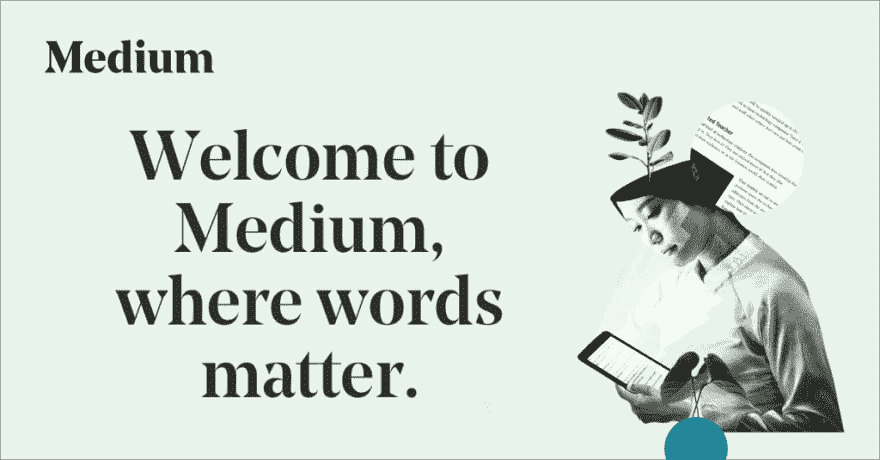
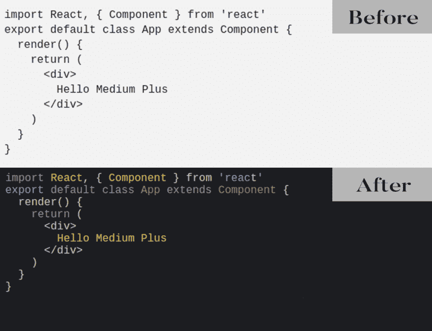
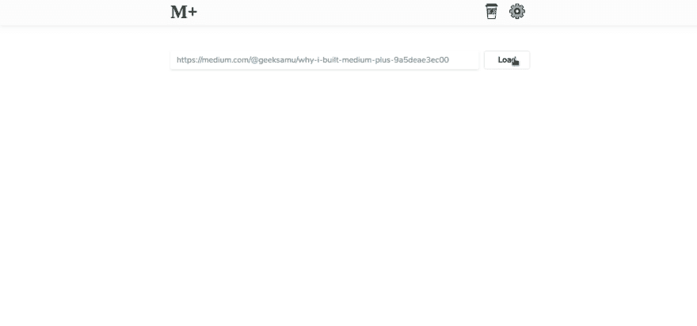

# 我为什么要建立 Medium Plus

> 原文：<https://dev.to/geeksamu/why-i-built-medium-plus-47n9>

<figure>[](https://res.cloudinary.com/practicaldev/image/fetch/s--BmdIhkik--/c_limit%2Cf_auto%2Cfl_progressive%2Cq_auto%2Cw_880/https://cdn-images-1.medium.com/max/1024/1%2AmQW5TgzGYF7-w7Y-gpA8LQ.png) 

<figcaption>[来源](https://medium.com)</figcaption>

</figure>

大家好，

我是 Ahmed Abdelsalam，一名自由网络开发者、博客作者和 TEDx 演讲者。

我在 2018 年底改变了[我的博客](https://blog.wb.gy)的主题，建立了一个更简单的主题，具有更好的排版，多个主题和其他功能。完成这个主题后，我对自己说，为什么我们不为像 **Medium** 这样的伟大网站提供类似的功能。

功能包括:

*   黑暗主题。
*   可定制的字体系列。
*   可定制的字体大小。
*   线下文章。
*   突出显示的代码。
*   听文章而不是读书。

所有这些功能都会让我的媒介体验更好。此外，多写文章，随时听他们讲话。

一开始，我想过创建一个 chrome 扩展来将所有这些选项添加到 Medium 中，但我花了一些时间才意识到我不能在手机上使用这个扩展。我更喜欢在我的手机上阅读，所以我决定创建一个工具，从 Medium 获取文章，并用上述所有功能增强它。

我知道它并不完美，但我真的尽了最大努力来构建这个工具的每一部分。

我们来说说每个特性。

### 黑暗主题

我建立了第二个黑暗主题，因为我更喜欢黑暗主题。它不会停留在当前的光明和黑暗主题上。我计划建立更多适合每个人的主题。意思是，如果你想用 [**中加**](https://mplus.wb.gy) ，想用自己的**色彩模式，**只需[联系我](https://wb.gy)。

这里有一个例子

### 不同的字体系列

Medium 使用了一个很好的字体系列，但我更喜欢使用其他字体，并在任何时候选择我想要的字体。这就是我创建这个功能的原因。

### (很快)控制字号

我计划很快添加一个字体大小控件，这样你可以选择你喜欢的字体大小。

### 离线文章

你在 [**Medium Plus**](https://mplus.wb.gy/) 中加载的每篇文章都保存在你的浏览器缓存中，这样你就可以随时访问它们，即使没有互联网连接。你所需要的只是加载一次文章。

### 高亮显示代码

这是最难构建的特性之一，我试图让代码语法高亮体验比在 Medium 上更好。我只是想在这里更好地阅读代码，而不是在 GitHub Gist 上托管代码。接下来我贴点代码给大家看看中等和 [**中等加**](https://mplus.wb.gy/)
的区别

```
import React, { Component } from 'react'
export default class App extends Component {
 render() {
 return (
 \<div\>
 Hello Medium Plus
 \</div\>
 )
 }
} 
```

我花了一些时间才能够在 [**中加上**](https://mplus.wb.gy/) 中使用 highlight.js，并使用其代码高亮显示的惊人特性。

[](https://res.cloudinary.com/practicaldev/image/fetch/s--1Y6UK7j5--/c_limit%2Cf_auto%2Cfl_progressive%2Cq_auto%2Cw_880/https://cdn-images-1.medium.com/max/1001/1%2AJRVw-6vs9DCofB7WbNyjzQ.png)

### 文章到音频

Medium 有很多令人惊叹的内容，我真的很想越读越多，但我没有时间读完所有这些文章列表。可以选择听你的文章而不是读它们，这会节省你很多时间。我使用了一个名为 [WebsiteVoice](https://goo.gl/W1Yg9h) 的服务将这个功能添加到 [**Medium Plus**](https://mplus.wb.gy/) 中。

<figure>[](https://res.cloudinary.com/practicaldev/image/fetch/s--gAs3cDbF--/c_limit%2Cf_auto%2Cfl_progressive%2Cq_66%2Cw_880/https://cdn-images-1.medium.com/max/1024/1%2AUdS3iB47YMSF6_KnTipwmg.gif) 

<figcaption>中等加图像</figcaption>

</figure>

### 我的计划

我计划尽快让这个工具开源，增加更多的功能，我真的很乐意加入你们的任何建议，所以不要犹豫给我留下评论或电子邮件。

### 缺点中等加

我现在对 Medium Plus 唯一的问题是嵌入式代码，例如:(IFrames)像 Github Gists。Medium 在他们的介质上托管这些东西，并阻止从外部域(CORS)访问它们，这就是我不能使用它们的原因。目前我正在研究这个问题。

自己试试 [**中加**](https://mplus.wb.gy/) **。**