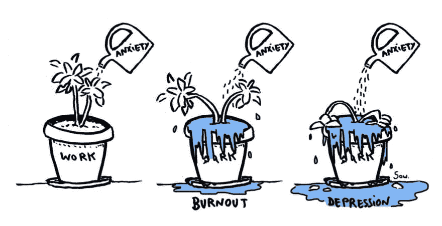

# 什么是倦怠？

> 原文：<https://dev.to/nkuik/what-actually-is-burnout-14d2>

浏览我们的手机或电脑，基本上不可能不看到一堆关于倦怠的负面影响的文章，包括最近的一系列文章，由 Buzzfeed 的文章开始，讨论了一代人的经历[倦怠的经历](https://workplaceinsight.net/overwork-and-burn-out-affects-all-the-generations-in-the-workplace/)。对我来说，这种增长触及了一个共同的神经；不管我们的时代标签是什么，我们中的许多人都知道打个盹是什么感觉，感觉我们不可能拖着自己再去工作一天。然而，很少有资源比“倦怠是不好的，你不应该让它发生”更深入。这就是为什么我决定做一个关于倦怠的系列，包括四个部分:

*   什么是倦怠，为什么要在意？(本文)
*   关于倦怠，我们个人可以做些什么？(第二部分)
*   可能导致倦怠的系统性环境是什么？(第三部分)
*   如何才能让我们做出的行为改变坚持下去？(第四部分)

> 如果你正在寻找更深层次的倦怠，以及我们实际上能够做些什么，这个系列是为你准备的。

## 倦怠究竟是什么？

在过去的几年里，职业倦怠作为一个问题越来越受到关注。作为一名临床社会工作者，这让我很高兴。是时候我们摒弃倦怠的常态了，这种试错法，“我年轻的时候就这样做了，所以你也应该这样”的态度在许多职业中司空见惯——包括软件开发。倦怠是一种需要改变而不是享受的东西。

<figcaption>Comic by Sow</figcaption>

尽管有自己的调查问卷——MAS lach 倦怠问卷——和越来越多的媒体报道，倦怠并不像重度抑郁症(MDD)或广泛性焦虑症(GAD)那样是一种可诊断的精神健康状况。

> 不幸的是，倦怠不是一种可诊断的心理健康状况，对于倦怠也没有普遍认同的定义【T2 1】。

事实上，倦怠不是一种可诊断的精神健康状况，这使得它的治疗很难，因为医疗保险报销治疗和工作场所休假政策取决于这种诊断——至少在美国是这样。因此，如果一个人筋疲力尽，工作有困难，他们必须被诊断为不同的疾病(如 MDD 或广泛性焦虑症)，或者他们必须找到其他一些“有效”的解释，使他们的痛苦得到医学验证，并使他们的治疗得到保险或工作场所政策的覆盖。这种差距给正确诊断、支持和治疗一个经历倦怠的人带来了挑战——这些挑战我将在本系列的第三部分中讨论。

也就是说，[文献](https://www.annualreviews.org/doi/abs/10.1146/annurev.psych.52.1.397)提出了一组在慢性压力下通常会出现的三个特征:

1.  情绪衰竭
2.  职业效能感低
3.  针对工作的人格解体或愤世嫉俗

此外，许多症状或行为(不包括在 Maslach 倦怠量表中)已被确定为伴随三个主要特征的，例如:

*   证明自己的冲动
*   几乎没有时间从事与工作无关的活动
*   无意义和/或缺乏兴趣的感觉
*   感觉自己工作的精力没有上限
*   忽视个人需求
*   没有时间关注与工作无关的爱好/责任
*   增加对问题的否认，减少思想和行为的灵活性
*   内心空虚、焦虑和/或成瘾行为的感觉
*   无意义和/或缺乏兴趣的感觉
*   精疲力竭

这些症状通常以类似于抑郁症的方式表现出来，关于将倦怠归类为一种独立的障碍，还有[争论](https://www.frontiersin.org/articles/10.3389/fpubh.2015.00158/full)。在这场辩论中加入一种观点是没有用的，所以让我们一致认为抑郁、倦怠和它们潜在的重叠是不好的，应该少发生。

根据个人心理和环境的不同，你可能会从人际关系(“我个人不适合这份工作”)和外部关系(“我糟糕的经理阻止我正确完成工作”)两个方面找出倦怠的来源。这种主观性需要我们的自省和支持性的外界意见(朋友、重要的另一半、治疗师等)来帮助识别倦怠的潜在来源。

一个重要的注意事项:虽然我以前是一名治疗师，这篇文章应该被用作一个信息指南——它绝不是一个诊断工具。如果事情感觉有点太沉重，我劝你考虑找你自己的治疗师。考虑到健康保险覆盖的网络(或缺乏它)，找到一个合适的治疗师，等等，这可能是一个挑战。然而，有[向导](https://www.thecut.com/2017/12/a-beginners-guide-to-finding-the-right-therapist.html)来简化这个过程，即使只是一点点。

## 费用

精疲力竭的代价是人们对它的认识不断提高的一个原因。《柳叶刀精神病学杂志》的一篇文章指出，焦虑和抑郁等疾病影响着全球约 7 亿人，造成 1 万亿美元的生产力损失，并导致约 120 亿天的工作损失。正如我提到的，倦怠不是一种可诊断的状况，因此很难量化其成本。但我们可以假设，这些成本在精神健康状况的总成本之内，因为它的症状通常被诊断为抑郁症。

## 我是 Burntout 吗？

虽然列出症状可能很有见地，但直接提问可能更有帮助。问自己以下问题:

*   我一直都觉得累吗？
*   一天工作下来，还有精力去做我喜欢的事情吗？
*   我觉得自己真的想让 T1 做工作以外的事情吗？
*   我是不是在利用自己超级忙碌、非常重要的工作狂的外表，作为多工作的借口？
*   对于我正在做的工作，我有什么样的负面能量(如果有的话)？
*   我是否觉得自己没能在工作中有所作为？
*   我不工作的时候会有负罪感吗？
*   我的工作场所是否感觉像某种斯德哥尔摩综合症——我觉得我的需求在工作场所没有得到考虑，但我也很难在合理的时间下班？
*   我是不是觉得很难和人感同身受？

如果这些问题在某种程度上对你来说是真实的，那么你的生活中可能会出现某种程度的倦怠。

## 我们能做些什么呢？

我在这里不只是列出症状，抛出成本统计，或提供油嘴滑舌的建议，如“改善你的工作生活平衡”，“找一份新工作”，或“交更多的朋友”。虽然这些事情可能会起作用，但它们也承担了我们可能没有的控制水平，或者包括对我们个人具有挑战性的事情。

从职业倦怠的三个定义特征来看，很明显，环境(居住的国家、个人生活、公司、经理等等。)、“主义”(种族主义、性别歧视、能力主义等)的经历。)，和/或[微小变化](https://www.google.com/search?q=microagressions&rlz=1C5CHFA_enDK675DK675&oq=microagressions&aqs=chrome..69i57.2136j0j7&sourceid=chrome&ie=UTF-8)会导致倦怠。这些情况对倦怠的感觉有巨大的影响。但是，虽然它们可能有最大的影响，但它们可能是我们最没有能力改变的事情。

> 导致倦怠的系统性因素是真实存在的，它们永远不应该被忽视或最小化。我们永远不要忘记，必须进行更大的系统变革，以降低潜在的倦怠。

尽管可能会有无能为力的感觉，但有些事情仍然在我们的控制范围之内。因此，我将在这个系列的第二部分写一些我们在生活中可以做的事情来对抗倦怠。在第三部分，我将回到可能导致倦怠的环境因素，以及我们如何应对它们。最后，在第四部分，我将处理维持我们决定做出的改变的困难任务。

希望在那里见到你:)

## 资源

如果你正经历任何强烈的负面心理状态，请获得你需要的帮助- [OSMI 的资源](https://osmihelp.org/resources)是一个很好的起点。另外，美国自杀热线的号码是:  。

我已经用这篇文章的主要概念开始了一个回购，除了提供一些其他资源来帮助那些在他们的旅程中流动得更多的人。回购可以在这里找到-任何补充，建议或批评都很感谢，并以公关的形式。最后，本文补充了我与 [OSMI](https://osmihelp.org) 合作为欧洲世界语言营(WordCamp Europe)举办的 [2018 研讨会](https://2018.europe.wordcamp.org/session/going-with-the-flow-increasing-mindfulness-and-flow-experiences-to-fight-burnout-and-depression/)，你应该去看看科技领域的一切心理健康。

国际疾病分类(ICD) 11 的确在一章中包括了影响健康的因素，但是[并没有将其指定为一种可诊断的状况](https://www.medscape.com/viewarticle/914077)。

值得一提的是，一些国家(例如丹麦和瑞典)确实有涵盖员工倦怠的政策(这被称为“带着压力走下去”)。