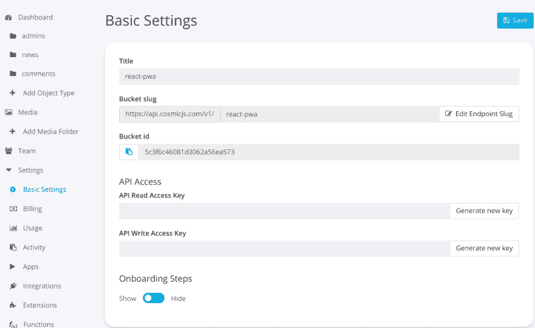

# 如何在 React.js 和 Cosmic JS 中构建 PWA

> 原文：<https://dev.to/a9kitkumar/how-to-build-a-pwa-in-reactjs-and-cosmic-js-25k9>

在本教程中，我将向你展示如何使用 React.js 和 [Cosmic JS](https://cosmicjs.com/) 构建一个渐进式 web 应用程序。当您离线时，我们的 PWA 将以状态 200 进行响应。该应用程序将获得数据的最后状态，并在您离线时向您显示。我们将从基础开始，完成应用程序的全部细节。完成后，我们将它部署到宇宙 JS 应用服务器，所以让我们开始吧。

## TL；速度三角形定位法(dead reckoning)

[结帐演示](https://cosmicjs.com/apps/react-pwa-with-authentication)
管理员凭证:
邮箱:[admin@abc.com](mailto:admin@abc.com)
密码:Admin

[下载代码库](https://github.com/cosmicjs/react-pwa)

## 我们在建造什么？

正如标题所解释的，我们正在构建一个渐进式网络应用程序(PWA ),它将显示由管理员发布的新闻。让我们先用简单的词语解释一下 PWA 是什么:

PWA 是一个普通的网站，有一些额外的和独特的功能，使它与众不同。以下是这些功能:

-->你可以在离线时使用这些应用程序，这意味着这些应用程序在互联网断开时会给出一个响应代码 200
->第二个最重要的功能是你可以在你的设备上安装它(桌面或移动)
- >这些应用程序在本质上是完全响应的
我们将使用 React.js 和 Cosmic JS 的力量来实现这个应用程序。我们开始吧。

另请阅读:[未经许可的最佳手机追踪应用](https://mytechmarvel.com/best-phone-tracker-app-without-permission/)

## 要求

必须在您的系统上安装 Node.js 才能运行 npm 命令，在它的帮助下，我们将安装 react app。更多信息可以参考 [React 文档](https://reactjs.org/docs/getting-started.html)。

## 入门

现在我们的系统已经配置了所需的模块和工具，我们将使用 Cosmic JS 在 React.js 中创建一个渐进式 web 应用程序项目。转到您想要放置项目的任何特定文件夹，打开控制台(终端)并键入以下命令:

*npx 创建-反应-应用反应-pwa*

这里 react-pwa 是您的应用程序的名称，然后转到创建的文件夹 react-pwa 并运行命令:

*npm 开始*

它将编译您的基本 React.js 应用程序，并自动在默认浏览器中打开。默认情况下，它运行在端口号 3000:[http://localhost:3000/](http://localhost:3000/)

## 用 Cosmic JS 配置 React App

到目前为止，我们刚刚实现了 PWA 的前端部分，现在是时候配置服务器，即宇宙 JS 服务器和数据库。它提供了二合一设施。

首先，[免费在 Cosmic JS](https://cosmicjs.com/signup) 上注册，创建你的第一个桶。现在创建一个对象类型，在我们的例子中是 Admin。类似地，再创建两个名为 1)新闻和 2)评论的对象类型。这三种对象类型有不同的用途:admin 将保存 admin 的凭证，News 将保存 Admin 发布的新闻，Comments 将保存用户发布的评论。

现在进入*设置>基本设置*生成 read_key 和 write_key，并将该页面的所有信息保存在您系统的一个单独文件中。现在把所有这些信息放在你的项目的文件夹中，路径是:*src>config>config . js*