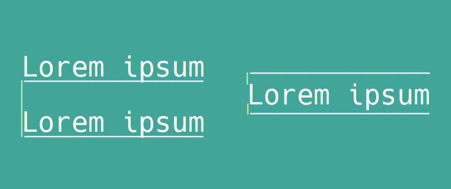

# 行高 CSS CSS 行高的工作原理和最佳实践

> 原文：<https://dev.to/lampewebdev/css-line-height-jjp>

CSS 属性定义了两个行内元素之间的间距。典型的用法是，分隔文本。你可以看到人们把它比作“leading ”, leading 是印刷术中使用的一个术语，指的是两行文本基线之间的空间。`line-height`作用不同。它增加了文本上下的空间。

[](https://res.cloudinary.com/practicaldev/image/fetch/s--H1HE9pmw--/c_limit%2Cf_auto%2Cfl_progressive%2Cq_auto%2Cw_880/https://thepracticaldev.s3.amazonaws.com/i/lsrnzx1hin6mkqg6fagw.png) 

<figure>

<figcaption>左:行距，右:行高</figcaption>

</figure>

## 用法

您可以将`line-height`与不同的值一起使用，如下所示:

```
body {
    line-height: normal; /* default */
    line-height: 2;
    line-height: 1em;
    line-height: 1rem;
    line-height: 200%;
    line-height: 20px;
} 
```

Enter fullscreen mode Exit fullscreen mode

哦，男孩😧！那太多了。让我们一个一个地看完它们👍。

### 默认值和无单位值

如果您没有将它设置为不同的值，则“normal”是默认值。通常，这意味着它被设置为`1.2`，这取决于浏览器供应商。那么没有任何单位的数字值意味着什么呢？它实际上是一个乘数。它获取`font-size`值并将其乘以`1.2`。让我们用下面的例子来计算一条线的高度。

```
body {
    font-size: 16px;
    line-height: 1.5;
} 
```

Enter fullscreen mode Exit fullscreen mode

我们只要做如下计算:16 * 1.5 = 24px。所以我们现在知道我们的文本的最小高度是 24px。因此，它将在文本下方和上方添加 4 个像素。冷静点😎！

### em 和 rem

下一个是`em`和`rem`。`rem`相对于根元素的`font-size`，而`em`相对于当前元素的字体大小。下面是一个例子

```
html {
    font-size: 12px;
}

.remExample {
    font-size: 16px;
    line-height: 1.5rem; /* line-height will be 12 * 1.5 = 18px */
}

.emExample {
    font-size: 16px;
    line-height: 1.5em; /* line-height will be 16 * 1.5 = 24px */
} 
```

Enter fullscreen mode Exit fullscreen mode

### 百分比

读取`%`值有点棘手。100%意味着乘以 1。再举一个例子来说明。

```
body {
    font-size: 12px;
}

.percentage {
    font-size: 16px;
    line-height: 150%; /* line-height will be 16 * 1.5 = 24px */
} 
```

Enter fullscreen mode Exit fullscreen mode

### 像素(px)

对我来说，最简单也最令人困惑的是`px`值。将其设置为任何像素值都会将其精确设置为该值。因此，如果你的`font-size`是 16px，你设置`line-height`为 12px，你的字体将会比包裹它的容器更大。一般来说，你应该尽量避免在 line-height 中使用`px`值！

```
body {
    font-size: 16px;
}

.pixel {
    line-height: 12px;
} 
```

Enter fullscreen mode Exit fullscreen mode

### 一些最佳实践

一般来说，我会先将`body`元素中的`font-size`和`line-height`设置为以下值。

```
body {
    font-size: 16px;
    line-height: 1.5;
} 
```

Enter fullscreen mode Exit fullscreen mode

由此，你可以建立你所有的其他风格。除了没有单位的数字，我会尽量避免使用其他任何东西。此外，尝试使用一个容易划分的值，比如 16 或 12。这将有助于你在设计中保持平衡。你也可以在`margin` s 和`padding` s 使用这个。在头脑中计算 16 * 1.5 比计算 13 * 1.5 更容易。这样你就会知道实际值是多少。

```
body {
    font-size: 16px;
    line-height: 1.5;
}

h1, h2, h3, h4, ul, ol {
    margin-bottom: 15rem;
}

button {
    display: inline-block;
    padding: 0.75rem 1.5rem;
} 
```

Enter fullscreen mode Exit fullscreen mode

当然，你可以尝试这样做，这些规则会有例外，但我总是这样开始。

## 资源

*   [http://www.indesignskills.com/tutorials/leading-typography/](http://www.indesignskills.com/tutorials/leading-typography/)
*   [https://developer . Mozilla . org/en-US/docs/Web/CSS/line-height](https://developer.mozilla.org/en-US/docs/Web/CSS/line-height)
*   [https://www.w3schools.com/cssref/pr_dim_line-height.asp](https://www.w3schools.com/cssref/pr_dim_line-height.asp)
*   [https://css-tricks.com/almanac/properties/l/line-height/](https://css-tricks.com/almanac/properties/l/line-height/)
*   [https://UX . stack exchange . com/questions/35270/is-there-a-optimal-font-size-line-height-ratio](https://ux.stackexchange.com/questions/35270/is-there-an-optimal-font-size-line-height-ratio)

**感谢阅读！**

说你好！[insta gram](https://www.instagram.com/lampewebdev/)|[Twitter](https://twitter.com/lampewebdev)|[LinkedIn](https://www.linkedin.com/in/michael-lazarski-25725a87)|[Medium](https://medium.com/@lampewebdevelopment)