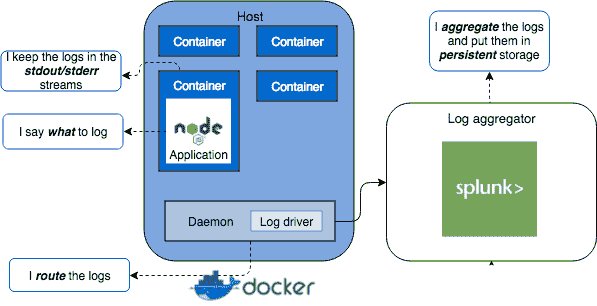

# 为什么 Node.js 应用程序不应该处理日志路由？

> 原文：<https://dev.to/ccleary00/why-should-your-nodejs-application-not-handle-log-routing-4d7o>

***原载于 [coreycleary.me](https://www.coreycleary.me/why-should-your-node-js-application-not-handle-log-routing/)** 。这是我的内容博客的交叉帖子。我每一两周发布一次新内容，如果你想直接在收件箱里收到我的文章，你可以[注册我的时事通讯](https://www.coreycleary.me/about/)！我也定期发送备忘单和其他赠品。*

> 应用程序不负责路由日志。

> [12 Factor](https://12factor.net/logs) 表示日志应该输出到 STDOUT。瓦特？为什么？

> 我刚刚配置了我的整个应用程序代码，将日志写入自定义日志文件。这有什么不好？

对于开发人员来说，日志记录有时是一个黑匣子。也许您有一个专门的 DevOps 人员为您负责日志基础设施，或者也许这是您第一次从事这方面的工作。

当你忙于写代码时，它可能是你留到最后才处理的事情之一。许多人确实这样做了，这使得围绕日志记录的“最佳实践”看起来像是你可以忽略的东西，如果你一开始就理解它们的话...

我们将看一看解密从应用程序中分离日志记录的最佳实践背后的*原因*，以及您应该实际登录到哪里。出于本文的目的，“日志路由”——正如标题中所提到的——指的是获取日志并将其推送到预期的日志记录目标，而不是您的应用程序或应用程序进程。

### 最佳实践说明

您可能以前听说过 12 因素应用程序，它被认为是创建现代、可扩展应用程序的规范“最佳实践”文档。

来自“ [12 个因素应用程序关于日志的最佳实践](https://12factor.net/logs)”:

> 一个十二因素的应用程序从不关心它的输出流的路由或存储。它不应试图写入或管理日志文件。相反，每个正在运行的进程都将其无缓冲的事件流写入 stdout....在试运行或生产部署中，每个流程的流将被执行环境捕获，与应用程序中的所有其他流一起整理，并发送到一个或多个最终目的地，以供查看和长期存档。这些归档目的地对应用程序不可见或不可配置，而是完全由执行环境管理。

要破译的东西太多了，所以我们来分解一下。

> "一个十二因素的应用程序从不关心它的输出流的路由或存储."

您不希望您的应用程序代码自己处理日志路由的第一个主要原因是由于关注点的分离。我们经常从服务之间和服务本身之间的代码片段的角度来考虑这种分离，但这也适用于更“基础设施”的组件。您的应用程序代码不应该处理应该由基础结构处理的事情。

下面的代码是高度耦合的应用程序代码的一个例子。

```
const { createLogger, transports, winston } = require('winston');
const winston-mongodb = require('winston-mongodb');

// log to two different files
const logger = createLogger({
  transports: [
    new transports.File({ filename: 'combined.log' }),

  ],
  exceptionHandlers: [
    new transports.File({ filename: 'exceptions.log' })
  ]
});

// log to MongoDB
winston.add(winston.transports.MongoDB, options); 
```

Enter fullscreen mode Exit fullscreen mode

让我们暂时把部署环境的问题放在一边，我们将在后面讨论它，而是关注应用程序本身。

仅仅通过让应用程序处理日志，它现在就承担了另一个“关注”。通过定义日志输出，应用程序现在可以处理应用程序/业务逻辑和日志逻辑。

如果您以后需要更改登录位置，该怎么办？这是另一个代码变更和部署(如果您有一个繁重的 QA/变更控制/部署过程，还会更多)。如果您弄错了日志文件名称，该怎么办？再次，另一个代码更改和部署。

这并不是说你的应用程序应该对日志采取极端的态度，并且避免日志语句——毕竟你必须记录一些东西——而是说，如果你想分离你的代码的组件并保持你的应用程序代码干净，那么 log *routing* 增加了另一个不属于应用程序的层。

接下来，

> 它不应试图写入或管理日志文件。相反，每个正在运行的进程都将其事件流无缓冲地写入标准输出。(*附注:虽然它特别提到了“标准输出”,但我认为它指的是“标准输出”**和**“标准错误”,粗略的谷歌搜索似乎证实了这一点。*)

我已经在上面讨论了为什么从关注点分离的角度来看，记录文件和数据库这样的输出不是一个好的实践。但这是环境问题开始得到解决的地方。

在 Node.js 应用程序中，您仍然登录到*的某个东西*，那就是控制台(通常使用`console.log()`或`console.error()`)。

引擎盖下的控制台将`console.log()`打印到`stdout`，将`console.error()`打印到`stderr`，所以简单地使用这个模块，看起来我们通过了这个测试。

这个测试的存在是有原因的:如果您以前使用过物理甚至虚拟(但不是容器/云)服务器，那么您可能只有少数几个，或者至少有足够可管理的大小来手动配置日志文件、它们的位置和任何其他设置。

现在想象一下，你的应用程序取得了巨大的成功，每天都有数百名新用户加入。您的团队已经开始迁移到基于云的环境，您必须规划您的应用程序按需从 1 个实例扩展到 50 个实例。您不知道这些实例在哪里运行，所以您无法控制日志文件被写入的确切位置。

拥有`stream | target`比拥有`target -> (your routing solution) -> target`更有用。流让我们能够在任何地方使用管道，组成强大的管道。如果你曾经使用过 Linux/Unix，你可以简单地通过管道把流连接在一起来建立强大的操作，比如在一个文件中搜索文本:`cat example.txt | grep sometext`。`stdout/stderr`赋予你这种力量。例如，如果您愿意，您可以通过管道从`stdout`连接到一个日志文件。

此外，云应用是短暂的。它们可以加速旋转、减速旋转、崩溃等等。这意味着日志也是短暂的。

因此，当我们开始研究为什么应用程序不应该处理将日志路由到文件/数据库/其他持久存储目标时，这带来了一个问题:是否可以将日志记录到这些目标？

接下来，

> “在试运行或生产部署中，每个流程的流都将被执行环境捕获，与应用程序中的所有其他流一起整理，并发送到一个或多个最终目的地进行查看和长期归档。这些归档目的地对应用程序不可见或不可配置，而是完全由执行环境管理。"

这有助于回答这个问题。如果*执行环境*从 stdout/stderr 日志路由日志，那么将日志路由到持久存储是可以的(事实上，您绝对应该这样做)。

这也再次确认了之前所涉及的关注点的分离。我们不能确定日志文件的最终位置。如果一个容器崩溃了——日志文件没有被日志路由器从一开始就选中——你就完了。祝您顺利调试您的应用程序崩溃的原因。

*酷，但是接下来如何在生产中管理日志呢？有没有一个工具可以拾取发送到`stdout/stderr`的任何东西？*

这实际上是日志*路由*的用武之地，这篇文章试图劝阻你不要在应用程序代码中处理这一切。

为了简单起见，假设您使用 [Docker](https://www.docker.com/) 作为您的云环境的一部分。在你的 Docker 主机上运行的 Docker 守护进程——而不是你的容器——默认情况下会从你的容器中获取`stdout/stderr` *的日志。*

您将 Docker 守护进程配置为使用日志记录驱动程序，该驱动程序执行实际的日志路由工作，即拾取它们并将其路由到给定的存储目标，如下所示:

在`daemon.json`文件中，

```
{
  "log-driver": "splunk", // just using Splunk as an example, it could be another storage type
  "log-opts": {
    "splunk-token": "",
    "splunk-url": "",
    ...
  }
} 
```

Enter fullscreen mode Exit fullscreen mode

您可以查看 Docker [这里](https://docs.docker.com/config/containers/logging/configure/#supported-logging-drivers)所支持的日志驱动程序列表——同样，这些驱动程序完成了获取日志并路由它们的工作。该列表包括 Greylog、Splunk、syslog 和您可能熟悉的其他日志聚合器。

将日志*路由到某个地方*是很重要的，这样，万一您的应用程序崩溃，随着扩展而启动，随着缩减而关闭，您就有一个持久的存储位置来查看它们。

但是，由于上面讨论的原因，这必须在*基础设施*级别完成。

基于此处讨论的内容，完整的日志记录图如下所示:

[](https://res.cloudinary.com/practicaldev/image/fetch/s--Qk5neF4L--/c_limit%2Cf_auto%2Cfl_progressive%2Cq_auto%2Cw_880/https://www.coreycleary.me/wp-content/uploads/2018/06/logging-stdout.png)

### 包扎

总结一下你不想处理从应用程序到`stdout/stderr`之外的东西的路由的原因:

*   将日志路由责任置于应用程序代码之外:
    *   保持代码的整洁
    *   使日志路由位置更容易更改，无需部署
*   扩展应用程序/容器意味着更难控制日志文件
*   扩展应用程序也意味着它们更加短暂，这意味着根据容器的状态，日志文件可能不在那里
*   通过`stdout/stderr`写入文件或数据库会将您束缚在这些日志目标上，使您无法灵活地将`stdout/stderr`的输出传输到您想要的任何目标，并且可以动态地更改它

To address one last question you might be having: *what if you're not using a cloud environment or containers?*

我对此的想法如下。我在这里提出的方法仍然有用，因为:

*   有一天，您可能会从物理或虚拟服务器迁移到云/容器方法，让您自己或将要从事这项工作的团队的迁移之路变得更加容易
*   你仍然保持关注点的分离
*   您总是可以通过管道将“stdout”发送到日志文件或其他持久存储目标，并获得 Docker 守护程序提供的相同优势

当你正在实现日志记录或审查你当前的日志记录代码时——如果你正在决定是使用日志记录框架还是使用`console.log()`和`console.error()`，我写了一篇关于[的文章，可以帮助你在这里做出决定](https://www.coreycleary.me/should-you-use-a-logging-framework-or-console-log-in-node/)。只要确保记住这篇文章，并从日志框架中给`stdout/stderr`写信，除非你绝对有理由写别的东西。

我正在编写许多新内容，以帮助 Node 和 JavaScript 更容易理解。更容易，因为我觉得不需要像有时候那么复杂。如果你喜欢这篇文章，并发现它很有帮助[这里是再次链接](https://www.coreycleary.me/about/)订阅我的时事通讯！