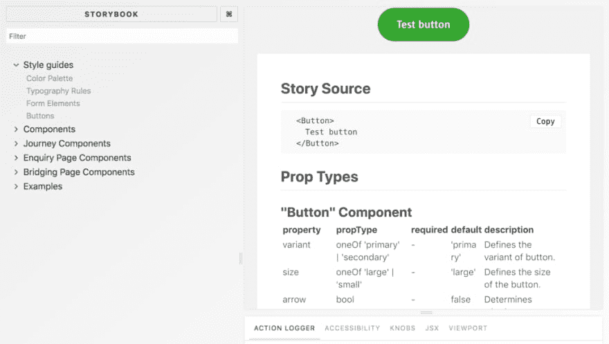
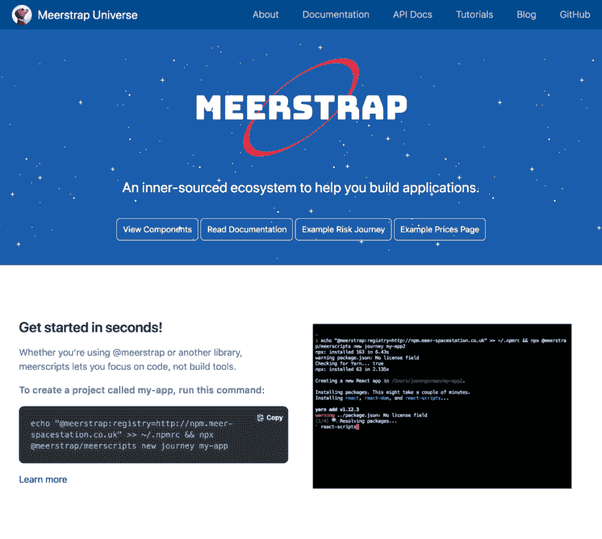
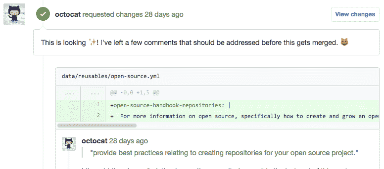
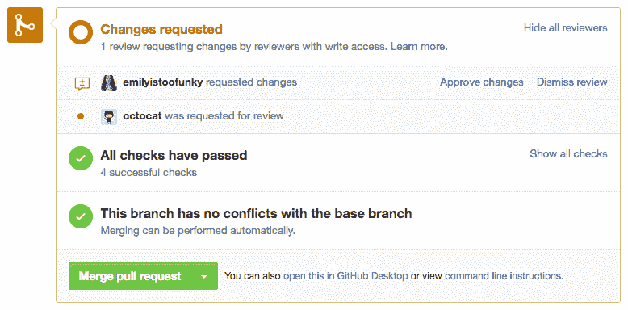
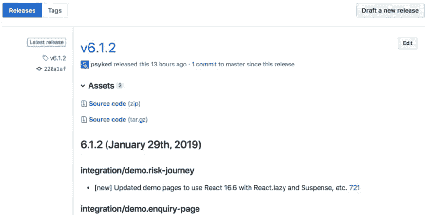
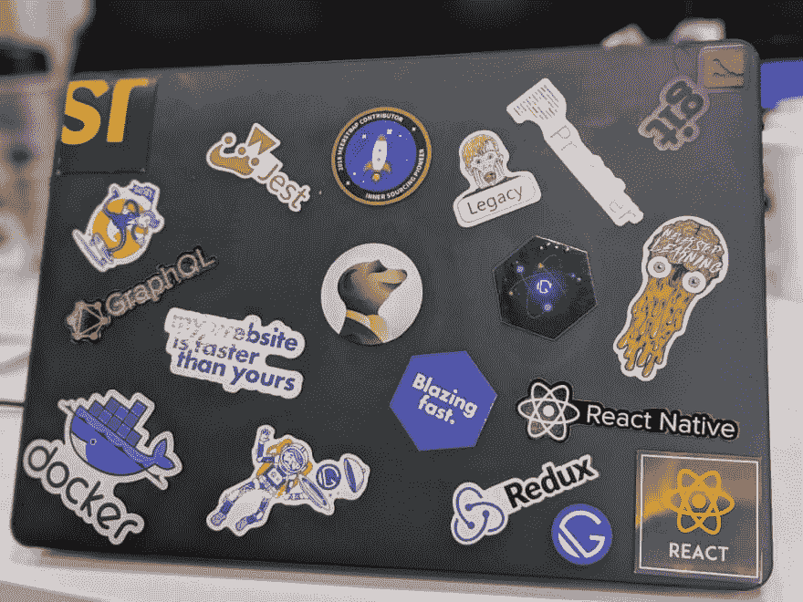

# 受开源启发。

> 原文：<https://dev.to/psyked/inspired-by-open-source-2p96>

#### 比较市场外包。

开源社区对我们 ComparetheMarket 来说是一个鼓舞——它如何运作，他们的产品质量以及他们管理和参与社区的方式——所有这一切都提高了我们的期望和标准，我很喜欢这一点。😍

### 简介

#### 内部采购？

我们不太可能真的能够将我们的内部代码开源，但受开源社区的启发，特别是受 Paypal 内部资源计划的启发，我们创建了自己的“内部资源”计划，将我们的内部协作提升到“下一个层次”

[内部资源共同性](https://paypal.github.io/InnerSourceCommons/)

<figure> 

<figcaption>下一关，我们来了……</figcaption>

</figure>

#### 拥抱 GitHub

作为一家企业，我们传统上使用 JIRA 来跟踪项目，但 GitHub UI 感觉更适合开源风格(协作)的项目。我们很早就决定采用 GitHub，并尽可能坚持只使用单一平台。我们通过 GitHub 逐渐采用了越来越多的可用功能，尽管其他平台也可用，但我们总是试图与现有的平台一起工作，而不是引入任何新的东西。

事不宜迟，这里是我们团队采用的一些东西，灵感来自开源…

### 文档

是的，每个人都有文件。但是，文件是以什么格式、什么种类、什么质量以及为哪些受众制作的呢？像 [React](https://reactjs.org/) 这样的项目在这里设立了黄金标准，广泛覆盖了为不同受众定制的不同类型的文档:从介绍性概念、教程开始，一直到非常详细的技术规范。

<figure> 

<figcaption>我们现有的基于故事书的组件文档</figcaption>

</figure>

我们已经有了[故事书](https://storybook.js.org/)来记录我们的项目，但是现在我们引入了我们自己的手写的基于网络的文档页面，它是在 [Docusaurus 的帮助下构建的。](https://docusaurus.io/)

[Docusaurus 易于维护的开源文档网站](https://docusaurus.io/)

<figure> 

<figcaption>我们的 Docusaurus — powered 文档页面。</figcaption>

</figure>

当然，驱动系统的技术并不重要，最重要的是内容和如何编写。我们将我们所有的贡献者都集中到一个网站上来获取我们的文档，对于我们制作的所有内容，我们都尽量包括:

*   高层次的概念性概述，
*   投稿指南，
*   手动创作的文档，
*   自动生成的 API 文档，
*   “快速启动”说明，
*   详细的一步一步的教程和更多。

最棒的是 Docusaurus 自己通过 GitHub Pull 请求编辑页面的集成，这使得读者可以很容易地对文档做出自己的贡献，并在工作时扩展或修改内容。

### 语义版本化

采用语义版本控制几乎是显而易见的。几乎每个开源库都使用它，所以它已经是开发人员意识中被接受的一部分，并且它对团队来说是一个有用的框架，因为它确实让我们反思当我们发布新版本的代码时所做的更改的重要性和严重性。

[语义版本 2.0.0](https://semver.org/)

我们花了一点时间来正确理解如何将语义版本化应用到我们的库中，并且我们在开始时犯了一些错误，但是我们现在不会没有它。我们从 [React](https://reactjs.org/) 团队获得了许多关于版本控制的想法和态度，并将它们嵌入到我们的工作流中，并建立了我们自己的一套脚本，在我们发布之前为我们提供自动化元素和一套工作区预发布检查，以避免在发布版本时重复任何常见错误。

### 单反

当我们开始规划我们的新库时，我们从多个项目开始，每个项目都有自己独立的 GitHub 库，但这很快开始变得难以管理和乏味。

不久，我们就遇到了这样一种情况:功能请求、问题报告和拉请求是针对多个存储库或错误的存储库提出的，或者会对其他存储库产生连锁反应，保持所有内容兼容和最新的管理开销变得难以承受。我们需要的是建立一个“单一的真相来源”,并找到一种整理反馈和传播更新的方法。

幸运的是其他人喜欢巴别塔🐠我们已经遇到了这一挑战，并在 mono repos——具有多个输出包的单个存储库——的帮助下解决了这一挑战，因此我们探索在自己的项目中采用相同的方法是非常有意义的。我们通过一个叫做 [Lerna 的项目做到了这一点。](https://lernajs.io/)

一个用多个包管理 JavaScript 项目的工具。

### 拉取请求

拉请求是我们为代码库做贡献的策略，从内部和外部的人到核心开发团队。它们是我们讨论代码和变革动机的纽带，使我们的工作尽可能透明。

<figure> 

<figcaption>拉请求评论图片，来自 GitHub docs</figcaption>

</figure>

核心团队仍然是唯一能够将代码合并到主分支并发布版本的团队(稍后会详细介绍)，但是拉式请求允许公司中的任何人在任何时候提出代码变更，而无需经过其他正式的流程。

此外，我们在一个受到严格监管的行业中工作，因此我们做的大多数事情都有法律和合规性方面的考虑，拉式请求使我们能够在采用技术更改之前轻松地进行同行评审和“签署”,并允许在将任何内容合并到主开发分支之前进行评审和改进。

在实践方面，我们使用分支级别的权限、必需的状态检查、自动化测试和提交挤压来保持事情的可管理性。我们尽可能多地保持这些检查的自动化，它们来自 GitHub Marketplace(稍后会有更多的介绍)。)分支级别的权限和所需的状态检查为我们提供了灵活性的平衡——例如，限制任何人在没有他人批准的情况下向主分支推送的能力。

[关于所需的状态检查-用户文档](https://help.github.com/articles/about-required-status-checks/)

### (GitHub) Webhooks

手动审查代码是一回事，但是我们还有一系列来自拉请求和提交的自动检查和触发。

为了使我们的审查更容易，我们尽可能地自动化，因此我们采用了 GitHub webhook 与 GoCD、Jenkins 等系统和我们自己的自制工具的集成。

我们使用这些工具来运行自动化单元测试、代码林挺检查、避免提交正在进行的工作代码、确保变更日志文件得到更新并与我们的 JIRA 系统集成。

<figure> 

<figcaption>所需状态检查图片，来自 GitHub docs</figcaption>

</figure>

对于未来，我们已经将目光放在了添加自动化视觉回归和可访问性测试、跨浏览器和集成测试、代码风格和林挺等方面，只是为了让保持我们的高标准变得更容易一些。

目前，我们正在使用[变更日志、](https://github.com/apps/probot-changelog) [WIP](https://github.com/marketplace/wip) 和[自动评论、](https://probot.github.io/apps/auto-comment/)以及我们自己的 GoCD 服务器集成和 [Github-JIRA 集成](https://github.com/psyked/github-jira-integration)插件:

*   [一起打造更好的软件](https://github.com/apps/probot-changelog)
*   [正在进行的工作](https://probot.github.io/apps/wip/)
*   [自动评论](https://probot.github.io/apps/auto-comment/)
*   [psy ked/github-jira-integration](https://github.com/psyked/github-jira-integration)

在未来，我们很乐意参与类似 CodeCov 和/或 GitHub 的活动。正如尤达曾经说过的，*“永远在运动，未来是…”*

*   [代码覆盖率完成正确| Codecov](https://codecov.io/)
*   [GitHub 动作](https://developer.github.com/actions/)

### 发布(在 GitHub 上)

紧随语义版本之后的是 GitHub 版本。可以说，这似乎是一件小事，但让我告诉你为什么它有重大影响…

当我们构建代码库时，我们会定期发布版本。我们使用语义版本化，我们将版本发布到内部的 NPM 注册中心，然后我们将它传达给相关的项目团队。所以我们有我们的变更日志，我们的文档，我们的语义版本。除此之外，还有我们内部的 NPM 注册表和 Slack 频道，我们在那里发布我们的产品。所有这些频道也有很多其他的事情发生，所以如果你只想发现最新的发布，有很多噪音要过滤。

通过一点发布后的脚本，我们已经将 GitHub 发布界面与我们的实际发布过程捆绑在一起。现在，每当我们发布到 NPM，我们都会自动更新 GitHub 上的版本和发布说明，这成为了一个很好的版本长期记录，比单独使用 changelog 稍微容易一些。

<figure> 

<figcaption>截图来自 GitHub 发布界面</figcaption>

</figure>

最后…

### 贡献者的战利品

所有最好的项目都有贴纸和贡献者奖品作为激励和奖励，每个人都喜欢通过笔记本电脑贴纸来显示他们的忠诚。

<figure> 

<figcaption>图为:一台酷派笔记本电脑。</figcaption>

</figure>

在我们的内部采购战略中，我们希望鼓励尽可能多的人做出贡献，但有时仅仅说“谢谢”似乎还不够。因此，为了给我们的贡献者一个额外的惊喜，我们安排了一些限量版的贡献者礼品，并分发给为我们的项目做出贡献的每个人😄

* * *